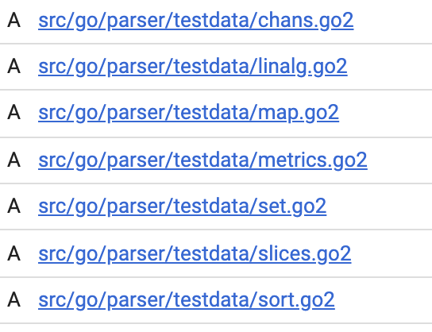

# Go语言爱好者周刊：第 1 期

这里记录每周值得分享的 Go 语言相关内容，周日发布。

欢迎投稿，推荐或自荐文章/软件/资源等，请[提交 issue](https://github.com/polaris1119/golangweekly/issues) 。


（题图：来自 GopherCon）

## 资讯

1、[GopherCon 2019 开发者大会在加利福尼亚举行](https://www.gophercon.com/)

大会从 2019 年 7 月 24 日至 27 日，为期 4 天。GopherCon 大会自 2014 年成功举办以来，已经 5 年了，这是第 6 次大会。

这次大会第 1 天是时长 8 小时的培训。这似乎成为了惯例？国内 GopherChina 大会第 1 天搞培训。而 William Kennedy（Go In Action 作者之一）是这次培训的第一场，他也来 GopherChina 培训过。这次培训的主题是：Advanced Ultimate Go。另外一位知名的培训老师是 David Cheney，他也来 GopherChina 培训过。这次培训的主题是：High Performance Go。

其他培训主题分别是：

- An Introduction to Containers for Go Programmers
- Go & Kubernetes Sitting in a Tree
- Go Beginners' Training
- Machine Learning & AI with Go
- Observability in Go
- Practical Guide to Testing in Go
- Serverless Go

从第 2 天起，就是演讲。这里把演讲主题分享给大家，后续 GCTT 会考虑把其中的一些进行翻译。

1. Russ Cox：On the Road to Go 2 
2. Elena Morozova：How Uber "Go"es
3. Elias Naur：Portable, Immediate Mode GUI Programs for Mobile and Desktop in 100% Go
4. Rebecca Stambler：Go, pls stop breaking my editor
5. Patrick Hawley：Controlling the go runtime
6. Johan Brandhorst：Get Going with WebAssembly
7. Marwan Sulaiman：Handling Go Errors
8. Michael McLoughlin：Better x86 Assembly Generation from Go
9. Katie Hockman：Go Module Proxy: Life of a Query
10. Yusuke Miyake：Optimization for Number of goroutines Using Feedback Control
11. Carolyn Van Slyck：Design Command-Line Tools People Love
12. Eric Chiang：PKI for Gophers
13. Kris Brandow：The Gopher's Manual of Style
14. Oliver Stenbom：Contributing to the os Package: How Deep Do You Go?
15. Aaron Schlesinger：The Athens Project - A Proxy Server for Go Modules
16. Ian Lance Taylor：Generics in Go
17. Jessica Lucci：You Can't Go Your Own Way: The Standardization of Go at GitHub
18. Ron Evans：Small is Going Big: Go on Microcontrollers
19. Chris Hines：Death By Three Thousand Timers: Streaming Video-on-Demand for Cable TV
20. Daniel Martí：Optimizing Go Code Without a Blindfold
21. Gabbi Fisher：Socket to Me: Where do Sockets Live in Go?
22. Jonathan Amsterdam：Detecting Incompatible API Changes
23. Jason Keene：Dynamically Instrumenting Go Programs
24. Denis Isaev：Go Linters: Myths and Best Practices
25. Mat Ryer：How I Write HTTP Web Services After Eight Years
26. Mike Seplowitz：Tracking Inter-process Dependencies Using Static Analysis
27. David Cheney：Two Go Programs, Three Different Profiling Techniques, in 50 Minutes
28. Johnny Boursiquot：What Got Us Here, Won't Get Us There

Gopher 大会还有长达 3 个小时的欢迎 Party，很嗨~


值得一提的是，无论是培训讲师还是演讲老师，都有女工程师（好几个呢），而国内就不常见了~

2、[Docker CE 19.03 正式发布，无需 root 权限](https://www.oschina.net/news/108481/docker-ce-19-03-0-released)

19.03 主要内容包括无需 root 权限、支持 GPU 的增强功能和 CLI 插件更新等等，19.03 现在是允许非 root 用户运行守护程序，启用 Rootless 模式可以防止攻击者夺取主机的 root 权限，即使 Docker 存在漏洞或设置错误。官方[发布日志 ](https://github.com/docker/docker-ce/releases)。

3、[InfluxDB 2.0.0 Alpha 16 发布，开源时序数据库](https://www.oschina.net/news/108540/influxdb-2-0-alpha-16)

InfluxDB 是一个开源分布式时序、事件和指标数据库。使用 Go 语言编写，无需外部依赖。其设计目标是实现分布式和水平伸缩扩展。InfluxDB 包括用于存储和查询数据，在后台处理ETL或监视和警报目的，用户仪表板以及可视化和探索数据等的API。

该版本更新了所有提供的模板，以使用最新的 Flux 更新。 要获取更新，您需要从更新的模板中删除并重新创建仪表板。

4、GOPROXY 能大幅提升模块的下载速度

因为 https://proxy.golang.org 在国内没法使用，这里推荐几个国内可以使用的 proxy。

1）使用 https://goproxy.io

```shell
time GOPATH=/tmp/throw GO111MODULE=on GOPROXY=https://goproxy.io go get github.com/go-sql-driver/mysql
...
real	0m0.934s
user	0m0.188s
sys	0m0.093s
```

2）使用 https://athens.azurefd.net

```shell
time GOPATH=/tmp/throw GO111MODULE=on GOPROXY=https://athens.azurefd.net go get github.com/go-sql-driver/mysql
...
real	0m5.941s
user	0m0.183s
sys	0m0.079s
```

3）使用 https://goproxy.cn

```shell
time GOPATH=/tmp/throw GO111MODULE=on GOPROXY=https://goproxy.cn go get github.com/go-sql-driver/mysql
...
real	0m1.130s
user	0m0.198s
sys	0m0.094s
```

4）使用 https://gocenter.io

```shell
time GOPATH=/tmp/throw GO111MODULE=on GOPROXY=https://gocenter.io go get github.com/go-sql-driver/mysql
...
real	0m3.173s
user	0m0.213s
sys	0m0.085s
```

5）使用 https://mirrors.aliyun.com/goproxy/

```shell
time GOPATH=/tmp/throw GO111MODULE=on GOPROXY=https://mirrors.aliyun.com/goproxy/ go get github.com/go-sql-driver/mysql
...
real	0m0.453s
user	0m0.174s
sys	0m0.093s
```

6）不使用 proxy

```
time GOPATH=/tmp/throw GO111MODULE=on GOPROXY=direct go get github.com/go-sql-driver/mysql
...
real	0m12.333s
user	0m0.300s
sys	0m0.290s
```

很明显，使用 proxy 下载更快，而且有些包还可能因为 golang.org/x 之类的下载不下来。

对于大型的项目，依赖多时，加速会更明显。所以，推荐大家配置 proxy。因为以上是一次测试的结果，并不代表某一个 proxy 一定就比另一个慢，所以，以上选哪一个，大家随意。如果发现某一个出问题了，可以换另外一个。

5、[Go 语言泛型草案已发布](https://github.com/golang/proposal/blob/4a54a00950b56dd0096482d0edae46969d7432a6/design/go2draft-contracts.md)

该设计草案由 Ian Lance Taylor 和 Robert Griesemer 主导。

- Ian Lance Taylor 从 1990 年起参与 GCC 工作，现就职于 Google，Go 语言 GCC 前端的作者
- Robert Griesemer，Java HotSpot 编译器作者之一，Chrome 浏览器 JavaScript V8 引擎作者之一

在刚刚举行的 GopherCon 2019 大会上，Ian Lance Taylor 做了 《Generics in Go》的主题演讲，这里是演讲的 LiveBlog：https://about.sourcegraph.com/go/gophercon-2019-generics-in-go。Reddit 上关于该草案的讨论：https://www.reddit.com/r/golang/comments/cifdwf/the_updated_and_simplified_draft_design_for_go_2/ 。

在 Robert Griesemer 提交的代码中 [go/*: GopherCon 2019 snapshot of go/* packages supporting contracts](https://go-review.googlesource.com/c/go/+/187317/)，相关文件后缀采用了 go2。注意，这并不是说将来后缀要变为 `.go2` 了，这只是为了区分，同时避免 gofmt 处理它，将来实现时，还是会继续使用 `.go` 后缀。



看到关键字：Contract，让我想起了 Swift 中的 Contract。

## 文章

1、[Go 语言十年而立，Go2 蓄势待发](https://mp.weixin.qq.com/s/wE_z7MxDJjIVDN16578tDw)

回顾从 2009 年 Go 开源到 2019 年，Go 走过的十年。涉及到的 Go 语言变化、国内 Go 的发展、社区的壮大，以及 Go2 的蓄势待发。


2、[GCTT 出品 | 接口和反射的关系](https://mp.weixin.qq.com/s/VNWKWorM8nedNwwYUUVggA)

接口是 Go 中用于抽象的基本工具之一。接口在值进行分配的时候存储类型信息。反射则是在运行时检查类型和值的方法。

Go 通过 `reflect` 包实现了反射。该包提供了一些类型和方法用于检查接口结构部分，不仅如此，它还可以在运行时进行值的修改。

在这篇文章中，我希望能说明接口结构的各部分和反射 API 之间的关系，并最终使得反射包变得更加容易理解。

3、[Go并发设计模式之 Half-Sync/Half-Async](https://colobu.com/2019/07/21/concurrency-design-patterns-half-sync-half-async/)

半同步/半异步的模式动机(Intent)就是从异步IO操作中解耦出同步IO操作，以便简化并发编程的效果，又不降低并发编程的效率。

半同步/半异步（half-sync/half-async）的模式集成了同步IO模式和异步IO模型，既简化了并发系统的开发，又兼顾了效率。在这个并发设计模式的实现中，高级的任务使用同步IO模型，使开发者可以无太多的心智负担在并发编程中，底层的任务使用异步IO模型，这就提高了并发的效率。这个设计模式广泛的应用在操作系统的实现中，如UNIX、Mach，Windows等。

4、[也许是最简洁版本，一篇文章上手Go语言](https://mp.weixin.qq.com/s/BZZYyPMcVayyPyt5ysVSbw)，英文：[Learning Golang — from zero to hero](https://milapneupane.com.np/2019/07/06/learning-golang-from-zero-to-hero/)

文章较长。如果你是新手，看看这一篇能否上手 Go 语言。

5、[写给新手的 Go 开发指南](https://liujiacai.net/blog/2019/07/17/hello-golang/)

如果上一篇文章入不了门，看看蚂蚁金服的哥们写的能否入门。

6、[Go 编程：tcpserver & graceful shutdown](https://www.gitdig.com/go-tcpserver-graceful-shutdown/)

介绍什么是框架，通过一个 100 行左右有效代码实现一个 tcpserver 框架，同时解释 graceful 的实现思路。

7、[Go 中如何进行 XML 流处理](https://eli.thegreenplace.net/2019/faster-xml-stream-processing-in-go/)（英文）

介绍 Go 中进行 XML 流处理，对比标准库和 Python 的实现，并介绍如何让 Go 处理的更快。

8、[[译] Go 代码诊断工具集合-官方文档](https://cyningsun.github.io//07-21-2019/go-diagnostics-cn.html)

Go生态系统提供了大量API和工具来诊断Go程序中的逻辑和性能问题。 此页面总结了可用的工具，并帮助Go用户针对他们的特定问题选择正确的工具。

## 开源项目

1、[tinygo](https://github.com/tinygo-org/tinygo)

一个基于 LLVM 的、用于一些特定小场景的 Go 编译器，比如 WebAssembly、Microcontrollers 和 命令行工具等。

2、[pan-light](https://github.com/peterq/pan-light)

百度网盘不限速客户端，golang + qt5，跨平台图形界面。


看界面挺棒的，想要使用 Go 做 GUI 的，可以学习学习。

3、[BaiduPCS-Go](https://github.com/iikira/BaiduPCS-Go)

仿 Linux shell 文件处理命令的百度网盘命令行客户端。喜欢命令行方式操作的可以尝试下。

4、[iris](https://github.com/kataras/iris)

一个社区驱动的 Go 语言 Web 框架。很有意思的是，项目上明显的写着：我爱中国人民。这是为了拉中国程序员 star 吗？

5、[unipdf](https://github.com/unidoc/unipdf)

创建和处理 PDF 文件的库，纯 Go 语言实现。

6、[sftpgo](https://github.com/drakkan/sftpgo)

一个全功能的、高度可配置的 SFTP 服务器软件。

7、[ferret](https://github.com/MontFerret/ferret)

一个声明式的 Web 爬虫系统，既可以单独使用，也可以嵌入其他 Go 项目使用。

8、[task](https://github.com/go-task/task)

一个任务运行/构建工具，旨在比 GNU Make 更简单，更易于使用。

9、[mpb](https://github.com/vbauerster/mpb)

在终端为 Go 命令行应用程序显示进度条。


10、[Yaegi](https://github.com/containous/yaegi)

另外一个优雅的 Go 解释器。

```shell
$ yaegi
> 1 + 2
3
> import "fmt"
> fmt.Println("Hello World")
Hello World
>
```

## 资源

1、[Go Web 开发方法的讨论](https://changelog.com/gotime/92)（英文）

Go Time，国外一个多元化的小组和特邀嘉宾一起讨论云基础设施，分布式系统，微服务，Kubernetes，Docker 以及 Go。嗯，因为这些都和 Go 语言密切相关。上面提供 mp3 格式音频下载，英文好的可以下载听听。

本期讨论的是如何使用 Go 进行 Web开发。

2、[go training](https://github.com/ardanlabs/gotraining)

上文提到的 William Kennedy 主导的 Go 培训资料。

3、 [13 Talks from GopherCon Europe 2019](https://www.youtube.com/playlist?list=PLtoVuM73AmsKzmYldmSvMlGQ8gF4knX0F#gopherconeurope) 

这是今年 5 月 30 日到 6 月 1 日，欧洲 GopherCon 的 演讲主题 PPT 和视频。https://www.gophercon.es/ 这是它们的网站。

4、GopherCon 演讲 Live Blog 汇总


- [GopherCon 2019 - Generics in Go](https://about.sourcegraph.com/go/gophercon-2019-generics-in-go)
- [GopherCon 2019 - Contributing to the os Package: How deep do you Go?](https://about.sourcegraph.com/go/gophercon-2019-contributing-to-the-os-package-how-deep-do-you-go)
- [GopherCon 2019 - Dynamically instrumenting Go programs](https://about.sourcegraph.com/go/gophercon-2019-dynamically-instrumenting-go-programs)
- [GopherCon 2019 - The Athens project: A proxy server for Go modules](https://about.sourcegraph.com/go/gophercon-2019-the-athens-project-a-proxy-server-for-go-modules)
- [GopherCon 2019 - Go Module Proxy: Life of a query](https://about.sourcegraph.com/go/gophercon-2019-go-module-proxy-life-of-a-query/)
- [GopherCon 2019 - How Uber 'Go'es](https://about.sourcegraph.com/go/gophercon-2019-how-uber-go-es)
- [GopherCon 2019 - Get Going with WebAssembly](https://about.sourcegraph.com/go/gophercon-2019-get-going-with-webassembly/)
- [GopherCon 2019 - Design Command-Line Tools People Love](https://about.sourcegraph.com/go/gophercon-2019-design-command-line-tools-people-love)
- [GopherCon 2019 - On the road to Go 2](https://about.sourcegraph.com/go/gophercon-2019-on-the-road-to-go-2/)
- [GopherCon 2019 - Go, pls stop breaking my editor](https://about.sourcegraph.com/go/gophercon-2019-go-pls-stop-breaking-my-editor)
- [GopherCon 2019 - Simple, Portable and Efficient Graphical Interfaces in Go](https://about.sourcegraph.com/go/gophercon-2019-simple-portable-efficient-graphical-interfaces-in-go)
- [GopherCon 2019 - The Gopher's manual of style](https://about.sourcegraph.com/go/gophercon-2019-the-gopher-s-manual-of-style)

## 订阅

这个周刊每周日发布，同步更新在[Go语言中文网](https://studygolang.com/weekly)、[微信公众号](https://weixin.sogou.com/weixin?query=Go%E8%AF%AD%E8%A8%80%E4%B8%AD%E6%96%87%E7%BD%91) 和 [今日头条](https://www.toutiao.com/c/user/59903081459/#mid=1586087918877709)。

微信搜索”Go语言中文网"或者扫描二维码，即可订阅。


