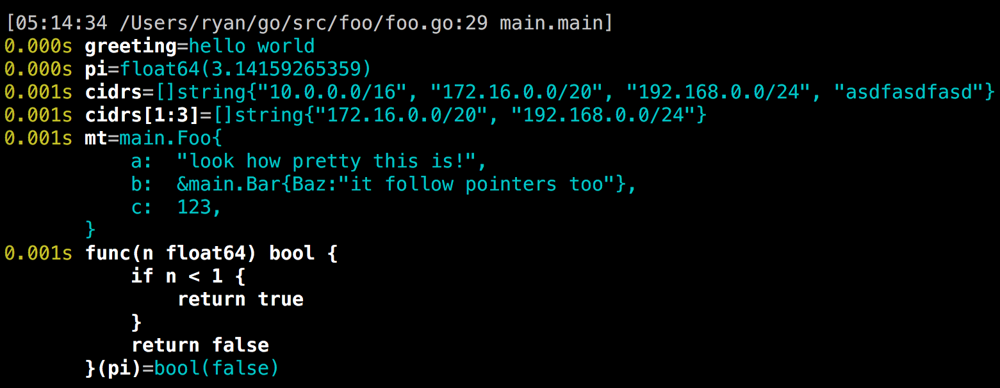
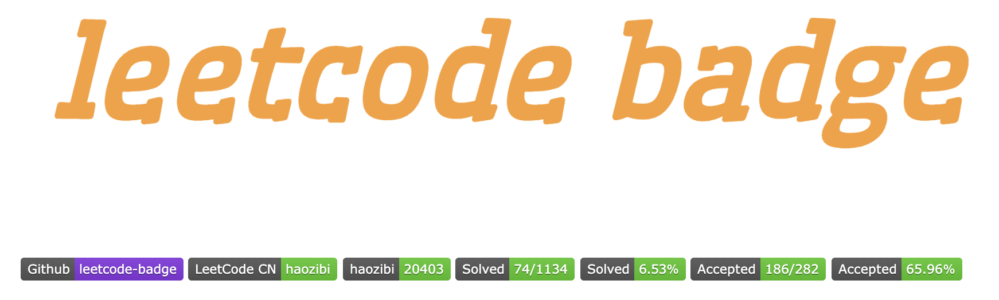

# Go语言爱好者周刊：第 2 期

这里记录每周值得分享的 Go 语言相关内容，周日发布。

欢迎投稿，推荐或自荐文章/软件/资源等，请[提交 issue](https://github.com/polaris1119/golangweekly/issues) 。

鉴于大部分人可能没法坚持把英文文章看完，因此，周刊中会尽可能推荐优质的中文文章。优秀的英文文章，我们的 GCTT 组织会进行翻译。

（题图来自 Unsplash）

虽然现在不是换工作高峰期，但我们应该时刻准备着，时刻提升自己。本期周刊提供了一系列和面试相关的资源。对于应届生和工作年限不长的人来说，如果想要进入大厂，算法相关的技能必须得练。可能也正因为如此，目前 LeetCode 很受欢迎，各种语言版本的 LeetCode 刷题都出现了。Go 语言中文网也组织一帮爱好者一起使用 Go 语言刷 LeetCode，如果你有兴趣，可以加入进来，https://github.com/studygolang/leetcode 。要加入群，可以加微信：274768166，备注：leetcode。

## 资讯

1、[Gitea 1.9.0 is released](https://blog.gitea.io/2019/07/gitea-1.9.0-is-released/) （英文）

Gitea 是一个开源社区驱动的轻量级代码托管解决方案，后端采用 [Go](https://golang.org/) 编写，采用 [MIT](https://github.com/go-gitea/gitea/blob/master/LICENSE) 许可证。如果你公司需要自建 Git 服务，可以考虑适用它，或者使用 Gitea 提供的云服务：https://gitea.com ，支持无限制的私有项目。

2、[Go2试验、简化探索之路 (By Russ Cox)](https://blog.golang.org/experiment)（英文）

Reddit 上对此相关的讨论：https://www.reddit.com/r/golang/comments/ckqoxd/experiment_simplify_ship_the_go_blog_by_russ_cox/

3、[WebAssembly San Francisco Meetup](https://www.meetup.com/wasmsf/events/263656826/) （英文）

8 月 20 日有一个 WebAssembly + Go 的主题演讲。

4、[用免费饮料换 GitHub 上的 star，你换吗？](https://news.cnblogs.com/n/629095/)

5、[5 种编程语言可能注定失败！](https://blog.csdn.net/csdnnews/article/details/97990640)

这 5 种：Ruby、Haskell、Objective-C、R、Perl ，你认可吗？

## 文章

1、[Go：为何带来泛型 — Go blog](https://blog.golang.org/why-generics)，由 llgoer 翻译的[中文版](https://github.com/llgoer/go-generics)

上周举行的 GopherCon 大会上，Ian Lance Taylor 做了关于 泛型 的演讲，该文基于演讲和泛型草案讨论为什么要泛型、带来什么样的泛型、好处和成本，以及草案的设计。Go 支持泛型，真的不远了。

2、[Go 微服务框架 go-micro 深度学习笔记](https://github.com/lpxxn/gomicrorpc)

Go 中比较有名的两个微服务框架：[go-micro](https://github.com/micro/go-micro) 和 [kit](https://github.com/go-kit/kit)。这几篇笔记介绍了 go-micro 的一些知识。另外，Go语言中文网 公众号本周也发布了几篇关于 go-micro 的文章，正在学习或想学习 go-micro 的小伙伴可以关注阅读。

3、[fasthttp 中运用了哪些 Go 优化技巧](https://mp.weixin.qq.com/s/7zNw3nEWozArJLFVmTjn0A)

号称比 net/http 快 10 倍的 fasthttp 到底快在哪里，做了哪些优化？这些优化技巧，也许在你日常开发中能用到。总结下来主要有：

- 减少 []byte 的分配，尽量去复用它们，如使用 sync.Pool 或 slice = slice[:0] 方式复用

- 方法参数尽量用 []byte，纯写场景可避免用 bytes.Buffer

- 不放过能复用内存的地方

- 避免 string 与 []byte 转换开销

4、[httprouter 简介](https://cch123.github.io/httprouter/)

Xargin 分享的关于路由和 httprouter 的相关知识，对研究 Go 的 Web 框架有借鉴作用。

5、[当你在浏览器中输入 google.com 并且按下回车之后发生了什么？](https://github.com/alex/what-happens-when) 

中文翻译：https://github.com/skyline75489/what-happens-when-zh_CN

这是一个古老的面试题，我也跟新人讲过很多次。这篇文章讲解很详细。值得一读。

6、[通过 profiling 定位 golang 性能问题 - 内存篇](https://mp.weixin.qq.com/s/B8lJI_2BfMcz-Rd1bNjkyg)

线上性能问题的定位和优化是程序员进阶的必经之路，定位问题的方式有多种多样，常见的有观察线程栈、排查日志和做性能分析。性能分析（profile）作为定位性能问题的大杀器，它可以收集程序执行过程中的具体事件，并且对程序进行抽样统计，从而能更精准的定位问题。本文会以 go 语言的 pprof 工具为例，分享两个线上性能故障排查过程，希望能通过本文使大家对性能分析有更深入的理解。

7、[Golang：数据库ORM框架GoMybatis详解](https://studygolang.com/topics/9755)

从名字就知晓，这是模仿的 Java 中 iBatis。

在 Go 中，操作数据库的框架不少，比较知名的有 https://github.com/jinzhu/gorm、https://github.com/go-xorm/xorm，这又来了一个。还有 https://github.com/gohouse/gorose ，非 ORM 的库 https://github.com/jmoiron/sqlx 等等。这些选择，你喜欢哪个？

## 开源项目

1、[q: 为“疲倦”的 Go 程序员提供的快速和更好的调试输出](https://github.com/y0ssar1an/q)

提供更好的方式调试输出，如图：

2、[leetcode badge](https://github.com/haozibi/leetcode-badge)

有人做了个 leetcode badge，喜欢刷 LeetCode 的，可以试用一下 https://lc.coding.gs/ ，看看自己刷 LeetCode 的情况，间接了解自己的算法水平。

3、[ff: 一个 “Flags 优先”的读取配置包](https://github.com/peterbourgon/ff)

该库对 flag.FlagSet 进行了扩展，支持按照命令行、配置文件、环境变量的顺序进行读取。这次的更新，支持从 yaml 配置格式读取配置。

4、[gbt: 用 Go 编写的高度可配置的 Bash 和 ZSH 快速构建器](https://github.com/jtyr/gbt)

Go Bullet Train（GBT）：为你的命令行提供漂亮的外衣。Vagrant、Docker、MySQL 有一致的外观。

5、[fastrand: 比 crypto/rand 快 10 倍的安全随机数生成器](https://github.com/awnumar/fastrand)

安全的内存分配和性能提升，如果你有使用 crypto/rand 的场景，可以考虑使用 fastrand。另外，对随机数感兴趣的，可以看看该文：[《两个随机数函数的故事》](https://studygolang.com/articles/12122)

在发现这个后，我又看到了另外一个，号称速度比 fastrand 还要快 10 倍。这就是 frand：https://github.com/lukechampine/frand ，真是没有最快，只有更快！

6、[go-pretty: 在终端输出漂亮的表格、列表和文本](https://github.com/jedib0t/go-pretty)

通过图片感受下效果：

7、[Rate Limiter: 一个 '泄露桶' 速率限制算法的 Go 实现](https://github.com/uber-go/ratelimit)

该实现基于请求之间经过的时间来重新填充桶，而不是要求间隔时钟离散地填充桶。Uber 出品。

8、[go-git: 一个高度可扩展的纯 Go 语言实现的 Git](https://github.com/src-d/go-git)

当你想使用惯用的 Go API 处理 git 仓库时，可以考虑使用该库。

9、[Liftbridge: 轻量级，容错的消息流](https://github.com/liftbridge-io/liftbridge)

为 [NATS](https://nats.io/) 实现持久、多副本的消息日志的服务器。

10、[micro: 一个微服务开发运行时](https://github.com/micro/micro)

该项目的主要特性有：

- API Gateway
- Interactive CLI
- Service Proxy
- Template Generation
- Slack Bot
- Web Dashboard
- Go Framework

想试验微服务的童鞋，可以学习试用下。

11、[gojsonq: 一个查询 JSON/YAML/XML/CSV 数据的 Go 语言包](https://github.com/thedevsaddam/gojsonq)

该包提供了简单、优雅、快速的 API 访问 JSON 等文档。支持很多类似 SQL 中的语法，如果你有此需求，不妨一试。

12、[sampler: 用于 shell 命令执行、可视化和警报的工具](https://github.com/sqshq/sampler)

是不是很酷炫！

## 资源

1、[Golang 常见面试题目解析](https://github.com/lifei6671/interview-go)

目录如下，有一些还没有内容。

- [交替打印数字和字母](https://github.com/lifei6671/interview-go/blob/master/question/q001.md)
- [判断字符串中字符是否全都不同](https://github.com/lifei6671/interview-go/blob/master/question/q002.md)
- [翻转字符串](https://github.com/lifei6671/interview-go/blob/master/question/q003.md)
- [判断两个给定的字符串排序后是否一致](https://github.com/lifei6671/interview-go/blob/master/question/q004.md)
- [字符串替换问题](https://github.com/lifei6671/interview-go/blob/master/question/q005.md)
- [机器人坐标计算](https://github.com/lifei6671/interview-go/blob/master/question/q006.md)
- [语法题目一](https://github.com/lifei6671/interview-go/blob/master/question/q007.md)
- [语法题目二](https://github.com/lifei6671/interview-go/blob/master/question/q008.md)
- [goroutine和channel使用一](https://github.com/lifei6671/interview-go/blob/master/question/q009.md)
- [实现阻塞读的并发安全Map](https://github.com/lifei6671/interview-go/blob/master/question/q010.md)
- [高并发下的锁与map读写问题](https://github.com/lifei6671/interview-go/blob/master/question/q011.md)
- [定时与 panic 恢复](https://github.com/lifei6671/interview-go/blob/master/question/q012.md)
- [为 sync.WaitGroup 中Wait函数支持 WaitTimeout 功能.](https://github.com/lifei6671/interview-go/blob/master/question/q013.md)
- [七道语法找错题目](https://github.com/lifei6671/interview-go/blob/master/question/q014.md)
- [golang 并发题目测试](https://github.com/lifei6671/interview-go/blob/master/question/q015.md)

2、[Go排序算法和面试相关主题](https://github.com/KeKe-Li/golang-interview-questions)

算法和程序结构一直是在面试过程中不断被问的问题，但是很多的时候，我们很多都是只是在应用，而没有深入的去研究这些，所以自己也在不断的思考和探索，然后分析，学习，总结自己学习的过程，希望可以和大家一起学习和交流下算法！

3、[2020年的算法实习岗位信息表](https://github.com/HarleysZhang/2019_algorithm_intern_information)

一份整理了各大公司的算法实习岗位信息集合，大部分岗位都是面向 2020 年毕业的学生。该资料还含有常见深度学习算法岗面试题及答案，暑期计算机视觉实习面经和总结，分享给有需要的同学。

4、[命令行的艺术](https://github.com/jlevy/the-art-of-command-line/blob/master/README-zh.md)

6w+ star，主要总结一些命令行使用的技巧，内容覆盖面广包括基础、日常使用、文件及数据处理等等，且还给出了具体最常用的例子，无论你是新手还是具有经验的人都值得学习下。

- [前言](https://github.com/jlevy/the-art-of-command-line/blob/master/README-zh.md#前言)
- [基础](https://github.com/jlevy/the-art-of-command-line/blob/master/README-zh.md#基础)
- [日常使用](https://github.com/jlevy/the-art-of-command-line/blob/master/README-zh.md#日常使用)
- [文件及数据处理](https://github.com/jlevy/the-art-of-command-line/blob/master/README-zh.md#文件及数据处理)
- [系统调试](https://github.com/jlevy/the-art-of-command-line/blob/master/README-zh.md#系统调试)
- [单行脚本](https://github.com/jlevy/the-art-of-command-line/blob/master/README-zh.md#单行脚本)
- [冷门但有用](https://github.com/jlevy/the-art-of-command-line/blob/master/README-zh.md#冷门但有用)
- [仅限 OS X 系统](https://github.com/jlevy/the-art-of-command-line/blob/master/README-zh.md#仅限-os-x-系统)
- [仅限 Windows 系统](https://github.com/jlevy/the-art-of-command-line/blob/master/README-zh.md#仅限-windows-系统)
- [更多资源](https://github.com/jlevy/the-art-of-command-line/blob/master/README-zh.md#更多资源)
- [免责声明](https://github.com/jlevy/the-art-of-command-line/blob/master/README-zh.md#免责声明)

5、[针对初学者快速入门开发和使用 Go 的教程](https://github.com/KeKe-Li/For-learning-Go-Tutorial)

可以选择性阅读自己感兴趣的内容。

6、[Docker LNMP (Nginx, PHP7/PHP5, MySQL, Redis) ](https://github.com/yeszao/dnmp)

一款全功能的 **LNMP 一键安装程序**。可以作为学习 Docker 的资源。

7、[一套完整的学习手册帮助自己准备 Google 的面试](https://github.com/jwasham/coding-interview-university/blob/master/translations/README-cn.md)

这个项目 8w+ star！

这一长列表是从 **Google 的指导笔记** 中萃取出来并进行扩展。因此，有些事情你必须去了解一下。我在列表的底部添加了一些额外项，用于解决面试中可能会出现的问题。这些额外项大部分是来自于 Steve Yegge 的“[得到在 Google 工作的机会](http://steve-yegge.blogspot.com/2008/03/get-that-job-at-google.html)”。而在 Google 指导笔记的逐字间，它们有时也会被反映出来。

致力于去谷歌工作的大学生可以好好学习学习！

8、[Go 安全编码实践指南](https://github.com/OWASP/Go-SCP)（英文）

## 订阅

这个周刊每周日发布，同步更新在[Go语言中文网](https://studygolang.com/go/weekly)、[微信公众号](https://weixin.sogou.com/weixin?query=Go%E8%AF%AD%E8%A8%80%E4%B8%AD%E6%96%87%E7%BD%91) 和 [今日头条](https://www.toutiao.com/c/user/59903081459/#mid=1586087918877709)。

微信搜索”Go语言中文网"或者扫描二维码，即可订阅。

