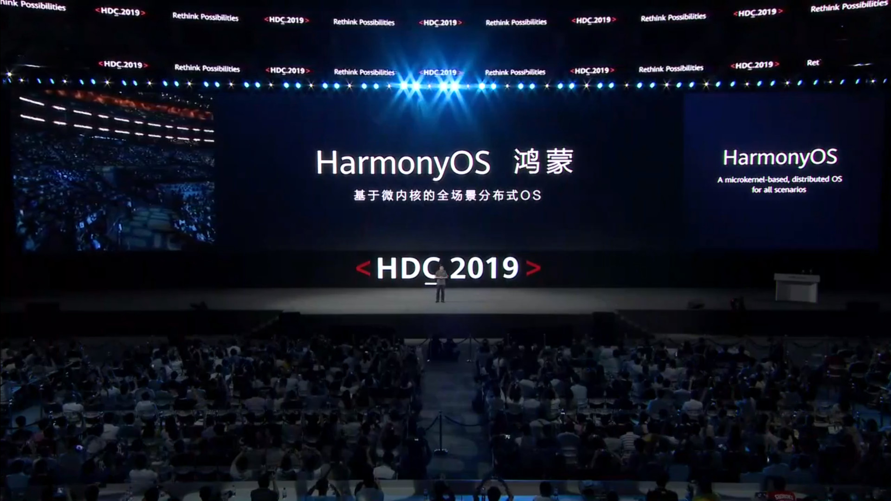

# Go语言爱好者周刊：第 3 期

这里记录每周值得分享的 Go 语言相关内容，周日发布。

欢迎投稿，推荐或自荐文章/软件/资源等，请[提交 issue](https://github.com/polaris1119/golangweekly/issues) 。

鉴于大部分人可能没法坚持把英文文章看完，因此，周刊中会尽可能推荐优质的中文文章。优秀的英文文章，我们的 GCTT 组织会进行翻译。



（题图：华为鸿蒙 HDC 2019 大会）

华为消费者业务 CEO 余承东在 2019-08-09 举行的华为开发者大会上介绍，HarmonyOS 是“**第一个适用于所有场景的基于微内核的分布式操作系统**”，它可以运行在智能手机、智能扬声器、计算机、智能手表、无线耳塞、汽车与平板电脑上，其支持的 RAM 大小从千字节到千兆字节不等。

余承东还指出，新系统最终将支持一系列应用，兼容 Linux 与 Android 应用，同时该系统应用程序开发中使用的方舟编译器（ArkCompiler）也将支持 Kotlin、Java、JavaScript、C 与 C++。至于生态，华为表示，之后将向全球开发者开源鸿蒙操作系统，并推动成立开源基金会。

此外，华为表示鸿蒙微内核已经投入商用，用于支付、人脸识别与指纹识别等高安全级别场景，未来华为设备整体都将使用鸿蒙。

据称首个搭载鸿蒙操作系统的设备是即将于明天发布的荣耀智慧屏，届时可以一睹该操作系统的风采。

和 Go 无关，但这是国人的骄傲，必须作为卷首语！

## 资讯

1、[Istio 1.2.3 发布，大型微服务系统管理平台](https://www.oschina.net/news/108877/istio-1-2-3-released)

Istio 是一个由谷歌、IBM 与 Lyft 共同开发的开源项目，旨在提供一种统一化的微服务连接、安全保障、管理与监控方式。

2、[对 Go 的提案流程的思考](https://research.swtch.com/proposals)（英文）

Go 核心开发人员Russ Cox发布的一系列文章，讨论 Go 语言提案应该有哪些内容以及如何审核此类提案的过程。

3、[Go1.11.13 和 Go1.12.8 将在 8 月 13 日发布](https://groups.google.com/forum/#!topic/golang-nuts/-Ba7cHufTKc) （英文）

按节奏这个时候该发布 Go1.13 了。然而，Go1.13 还有一些问题没解决，具体可以查看该连接：https://github.com/golang/go/labels/release-blocker 。

而这两个小版本主要解决几个安全问题。在官网专门放置了一个关于安全政策的文档：[Go Security Policy](https://golang.org/security)。建议大家届时升级到相应的版本，避免一些安全问题。

4、[go-arg：Go 中基于 struct 的的参数解析](https://github.com/alexflint/go-arg)

从本周发布的 v1.1 开始，它也支持子命令（例如 git checkout 之类的结构）。

```go
var args struct {
	Input    string   `arg:"positional"`
	Output   []string `arg:"positional"`
	Verbose  bool     `arg:"-v" help:"verbosity level"`
	Dataset  string   `help:"dataset to use"`
	Optimize int      `arg:"-O" help:"optimization level"`
}
arg.MustParse(&args)
```

输出

```
$ ./example -h
Usage: [--verbose] [--dataset DATASET] [--optimize OPTIMIZE] [--help] INPUT [OUTPUT [OUTPUT ...]] 

Positional arguments:
  INPUT 
  OUTPUT

Options:
  --verbose, -v            verbosity level
  --dataset DATASET        dataset to use
  --optimize OPTIMIZE, -O OPTIMIZE
                           optimization level
  --help, -h               print this help message
```

## 问答

1、[什么实例的 Kind 为 interface？](https://studygolang.com/topics/9767)

确实不常见，但也不是没有，比如：

```go
package main

import (
    "fmt"
    "io"
    "os"
    "reflect"
)

func main() {
    var r io.Reader = os.Stdout
    rv := reflect.ValueOf(&r).Elem()
    fmt.Println(rv, rv.Type(), rv.Type().Kind())
}
```

2、[为什么 go 语言的 slice 内部函数那么少？](https://segmentfault.com/q/1010000019341665)

1）作为一个新手，我认知的go的slice函数只有append以及切片，比如查找等方法并没有，为什么不去设计更多的内部函数呢？
2）有没有实现了实现slice更多方法的package?

可以着重看「波罗学」的回答。

3、[gorilla/websocket 包中的 Upgrade 第三个参数怎么用的？](https://studygolang.com/topics/9649)

这个包比官方的 WebSocket 包还受欢迎，写 WebSocket 功能必备！

4、[如何去掉 float 小数点后多余的 0？](https://studygolang.com/topics/9806)

可能会是这样的场景：商品展示给用户的价格希望是类似这样的 9.8、9，而不是 9.80、9.00，这应该是这个问题的目的。

## 文章

1、[GCTT 出品 | 深度剖析 Go 中的 Go 协程 (goroutines) -- Go 的并发](https://mp.weixin.qq.com/s/mYQUoWy9bZBbivFMKLqN8g)

Go 协程 (goroutine) 是指在后台中运行的轻量级执行线程，go 协程是 Go 中实现并发的关键组成部分。由于 `Go` 协程相对于传统操作系统中的线程 (`thread`) 是非常轻量级的，因此对于一个典型的 `Go` 应用来说，有数以千计的 `Go` 协程并发运行的情形是十分常见的。并发可以显著地提升应用的运行速度，并且可以帮助我们编写关注点分离（`Separation of concerns，Soc`）的代码。

2、[Go 爬虫之 Colly 从入门到不放弃指南](https://zhuanlan.zhihu.com/p/76629605)

Colly 是 Go 实现的比较有名的一款爬虫框架（GitHub 上 star 8k+），而且 Go 在高并发和分布式场景的优势也正是爬虫技术所需要的。它的主要特点是轻量、快速，设计非常优雅，并且分布式的支持也非常简单，非常易于扩展。

本文结合官方文档，一步步走进 Colly 的大门。

3、[请问 sync.Pool 有什么缺点？](https://zhuanlan.zhihu.com/p/76812714)

标准库 sync.Pool 有三个问题：

- 每次GC都回收所有对象，如果缓存对象数量太大，会导致STW1阶段的耗时增加。
- 每次GC都回收所有对象，导致缓存对象命中率下降，New方法的执行造成额外的内存分配消耗。
- Pool.Get方法底层有锁，极端情况下，要尝试最多P次抢锁，也获取不到缓存对象，最后得执行New方法返回对象。

这些问题就对 sync.Pool 的使用提出了要求，不满足时，性能并不会有大幅提升：

- 最好是高并发场景。（对应问题 3）
- 最好两次GC之间的间隔足够长。（对应问题1、2）

Go 1.13 版本已经解决了这些问题，期待 Go1.13 正式版本的到来！

4、[Go 小知识之 Go 中如何使用 set](https://studygolang.com/articles/20832)

本文介绍 Go 中两种 set 的实现原理，并在此基础介绍了对应于它们的两个包简单使用。作者认为，通过这篇文章，Go 中 set 的使用，基本都可以搞定了。

5、[面向对象编程的兴衰](https://media.weibo.cn/article?id=2309404402222191476809)

- 面向对象编程（OOP）并没有消亡。但与过去相比，它确实没有那么普及了。
- 事物之间的区别很大程度上是人类的偏见。
- 因为面向对象的继承是将事物组织成类，所以它不能很好地模拟现实世界；它只能很好地模拟人类思考现实世界的方式。
- 组合优于继承

作者的结论：面向对象是一个很好的工具，值得学习，但今非昔比，我们应该结合实际情况来使用，不适合一味追求。

6、[Go2：Experiment, Simplify, Ship](https://github.com/llgoer/go-generics/blob/master/experiment-en.md) （英文） 中文翻译：https://studygolang.com/topics/9815 ，译质量自己判断

我们都正在一起走向Go 2的路上，但是，我们都不知道这条路确切位置在哪里，有时甚至不知道这条路的方向。这篇文章讨论了我们如何实际找到并遵循Go2的道路。

7、[你确定你会写 Dockerfile 吗？](https://mp.weixin.qq.com/s/wNCfYERWU3GOBHI2juTpmg)

如今 GitHub 仓库中已经包含了成千上万的 Dockerfile，但并不是所有的 Dockerfile 都是高效的。本文将从五个方面来介绍 Dockerfile 的最佳实践，以此来帮助大家编写更优雅的 Dockerfile。如果你是 Docker 的初学者，恭喜你，这篇文章就是为你准备的。

8、[从源码讲解 golang 内存分配](https://studygolang.com/articles/22652)

本文对整体流程进行梳理和阐述，对关键源码进行注释和解释，希望能给对golang感兴趣的伙伴给予一定帮助，如需更具体的了解，可以根据这个大流程进行源码学习。本人也是基于1.12.6版本源码一点点梳理出来的，可能在一些细节上会存在出入，也希望golang大佬们对不足的地方给予指正。

## 开源项目

1、[LinDB: 开源分布式时序数据库](https://github.com/lindb/lindb)（国人开源）

LinDB 是一款开源分布式时序数据库，具有高性能、高可用性和水平扩展性等特性。

提供海量时序数据存储的同时支持跨多数据中心的能力，目前 LinDB 已经支撑起「饿了么」所有监控数据的存储。这是 饿了么团队开源的。


到目前为止，用 Go 语言实现的时序数据库还真不少。

2、[gomodifytags: 一个帮助修改 Go 语言 struct 字段 tags 的工具](https://github.com/fatih/gomodifytags)

你应该经常干这样的事情：model 中，为每个字段加 tag，比如：`json:"id"`，一个个加挺繁琐的。这个工具就是用来解决 struct tag 的添加、编辑或更新的问题，它可以使生活更轻松。该工具支持在终端生成，也可以与 Vim，Atom，Emacs和 VS Code 等集成。

3、[go-sundheit: 为 Go 服务提供健康检查的库](https://github.com/AppsFlyer/go-sundheit/)


一个为 golang 服务健康状况提供支持的库。它允许您为依赖项和服务本身注册异步运行状况检查，提供公开其状态的运行状况端点（endpoint）以及运行状况指标。

作者专门写了篇文章介绍它：https://medium.com/appsflyer/health-checks-like-a-pro-3fa362942883

4、[lego: 一个 Let's Encrypt 客户端 和 ACME 库](https://github.com/go-acme/lego)

这是方便免费试用 HTTPS 证书。虽然现在很多框架都集成了相关的功能，可能你有时候还是需要它。

5、[Compress: 优化的压缩包](https://github.com/klauspost/compress)

包含 gzip，zlib，zip 和 flate 等压缩包，可以作为标准库的替代品。

6、[一种监控 git 仓库并自动 pull 和 push 变动的工具](https://github.com/muesli/gitomatic)

你有这样的需求吗？

## 资源

1、[通过 300 行 Go 代码实现一个简单的 RPC  框架来解释、学习 RPC](https://github.com/ankur-anand/simple-go-rpc)

通过从头开始在 Golang 中构建一个简单的RPC框架来学习 RPC 基本构建。

2、[Gio 在 Go 中实现了可移植的即时模式 GUI 程序](https://gioui.org)

Gio 程序支持在所有主要平台上运行：iOS / tvOS，Android，Linux（Wayland），macOS，Windows和浏览器（Webassembly / WebGL）。

对 GUI 感兴趣的，可以研究研究，看看 API https://godoc.org/gioui.org/ui 、https://godoc.org/gioui.org/ui/app 等。

3、[贪吃蛇 golang 实现(270 行代码)](https://studygolang.com/topics/9822)

完整代码：https://github.com/mikellxy/little_pineapple ，对此有兴趣的可以研究一下。

4、[Go 语言 & 后端相关技术的资源](https://github.com/g-airport/tech-stack)

国人整理的，持续整理更新中~

5、[关于面试/谈Offer/程序员职场生涯等资料合集](https://github.com/lietoumai/Awesome-offer)

内容挺全的，值得收藏，按需阅读。

6、[书籍：Go 语言源码学习（未完成）](https://github.com/changkun/go-under-the-hood)


本书内容涵盖整个 Go 语言的核心源码，这包括但不限于用户端能直接接触的 Go 运行时 `runtime`、与关键语言特性相关的编译器 `cmd/compile`、 诸多重要的标准库 `sync`/`reflect`/`errors` 等等。 在极少数情况下，本书会讨论不同平台下的实现差异，主要以 Linux/Darwin amd64，以及 Go 1.11 中引入的 WebAssembly 为主。

本书共分为四个部分，第一部分简要回顾了与 Go 运行时及编译器相关的基础理论，并在其最后一章中简要讨论了 Go 程序的生命周期。 第二部分着重关注 Go 的运行时机制，这包括调度器、内存分配器、垃圾回收期、调试机制以及程序的 ABI 等。 第三部分则着眼于 Go 的编译器机制，包括 Go 编译器对关键字的翻译行为，对 cgo 程序的翻译过程，以及链接器等。 最后一个部分则讨论了一些依赖运行时和编译器的标准库，本书只介绍这些标准库与运行时和编译器之间的配合，并不会完整的整个包的源码进行分析。

7、[当···时发生了什么？](https://github.com/skyline75489/what-happens-when-zh_CN)

这个仓库试图回答一个古老的面试问题：当你在浏览器中输入 google.com 并且按下回车之后发生了什么？

不过我们不再局限于平常的回答，而是想办法回答地尽可能具体，不遗漏任何细节。

8、[免费的计算机编程类中文书籍](https://github.com/justjavac/free-programming-books-zh_CN)

免费的编程中文书籍索引，欢迎投稿。

- 国外程序员在 [stackoverflow](http://stackoverflow.com/questions/1711/what-is-the-single-most-influential-book-every-programmer-should-read/1713%231713) 推荐的程序员必读书籍，[中文版](http://justjavac.com/other/2012/05/15/qualified-programmer-should-read-what-books.html)。
- [stackoverflow](http://stackoverflow.com/questions/38210/what-non-programming-books-should-programmers-read) 上的程序员应该阅读的非编程类书籍有哪些？ [中文版](https://github.com/justjavac/free-programming-books-zh_CN/blob/master/what-non-programming-books-should-programmers-read.md)
- [github](https://github.com/vhf/free-programming-books) 上的一个流行的编程书籍索引 [中文版](https://github.com/vhf/free-programming-books/blob/master/free-programming-books-zh.md)

## 订阅

这个周刊每周日发布，同步更新在[Go语言中文网](https://studygolang.com/go/weekly)、[微信公众号](https://weixin.sogou.com/weixin?query=Go%E8%AF%AD%E8%A8%80%E4%B8%AD%E6%96%87%E7%BD%91) 和 [今日头条](https://www.toutiao.com/c/user/59903081459/#mid=1586087918877709)。

微信搜索”Go语言中文网"或者扫描二维码，即可订阅。


