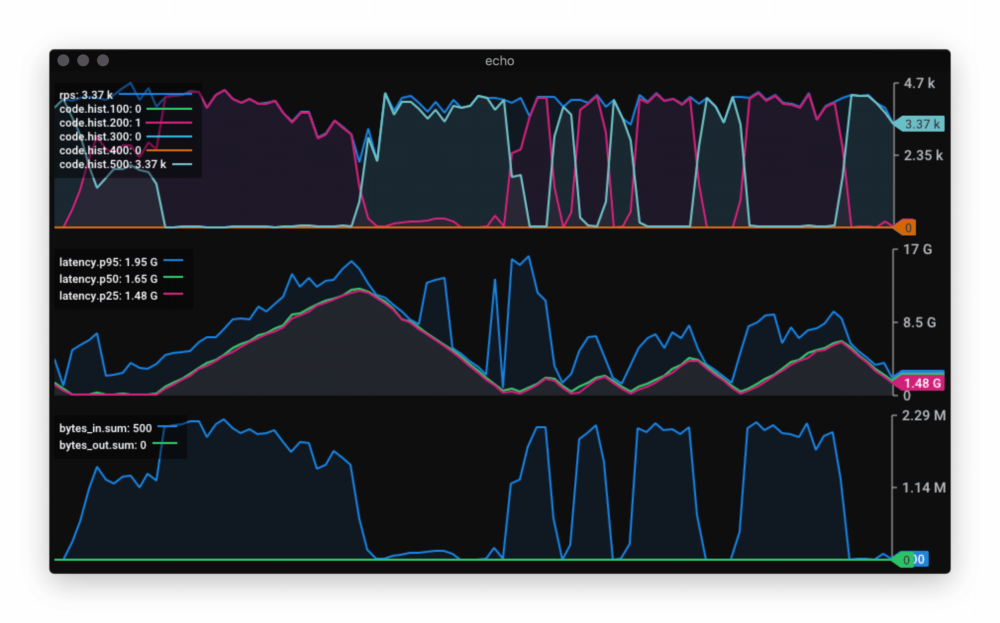
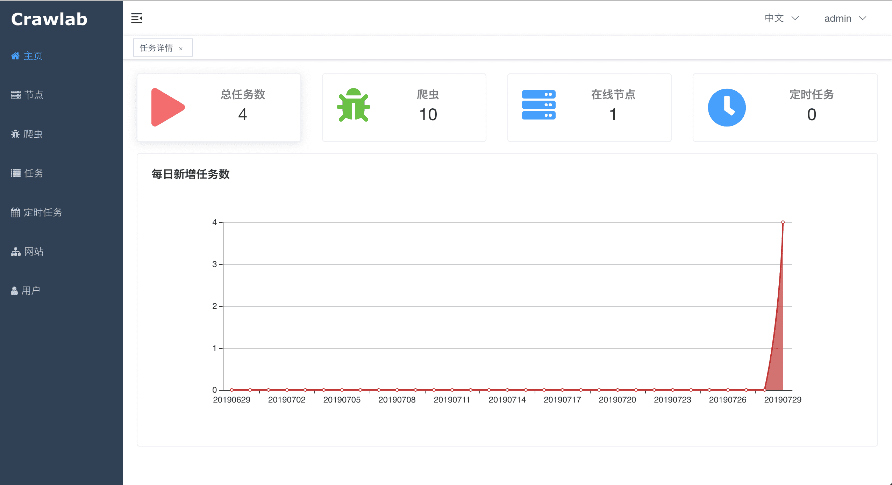
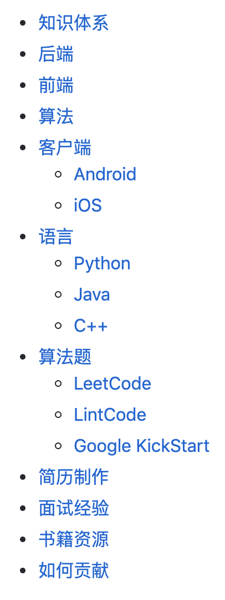

# Go语言爱好者周刊：第 4 期

这里记录每周值得分享的 Go 语言相关内容，周日发布。

欢迎投稿，推荐或自荐文章/软件/资源等，请[提交 issue](https://github.com/polaris1119/golangweekly/issues) 。

鉴于大部分人可能没法坚持把英文文章看完，因此，周刊中会尽可能推荐优质的中文文章。优秀的英文文章，我们的 GCTT 组织会进行翻译。

（题图：北京 望京 SOHO）

Go 语言中文网希望给大家分享更多优质内容。无论是官网，还是其他渠道，包括 2017 年底成立的 GCTT。现在我们又开通了 技术头条 团队号，如果你是 Go 语言爱好者，愿意分享更多 Go 相关技术，欢迎加入我们的团队号，一起分享 Go 语言的精彩给更多人。以下是我们团队号的信息：

## 资讯

1、[Go 1.12.8 和 Go 1.11.13 发布：解决安全问题](https://studygolang.com/topics/9861)

这次小版本升级主要解决安全问题，令人尴尬的是，几天时间，又发布了 Go 1.12.9，解决 linker、os 和 math/big 包的问题。

2、[Caddy 默认自动支持 HTTPS，使用的 Let's Encrypt 发布中文版了](https://studygolang.com/topics/9880)

Let’s Encrypt 对 HTTPS 的推动贡献当真不小。

3、[MongoDB Go Driver 1.1: MongoDB 的 Go 语言官方驱动发布 1.1 版本](https://github.com/mongodb/mongo-go-driver/releases/tag/v1.1.0)

很长一段时间，MongoDB 的 Go 语言驱动一直使用的 [mgo](https://github.com/go-mgo/mgo) 这个，但由于作者工作中不再使用 MongoDB，出于精力等方面的考虑，该项目不再维护。而且我们有了官方出品的驱动，自然应该使用它了。

1.1 版本的驱动，支持本周刚发布的 MongoDB 4.2！

4、[Hugo 0.57.0 发布](https://github.com/gohugoio/hugo/releases/tag/v0.57.0)

Go 语言实现的快速静态站点生成器。Hugo 0.57 带来级联前端，字母排序，资源加载资产和通配符等特性。

5、[Gitea 1.9.1 发布](https://github.com/go-gitea/gitea/releases/tag/v1.9.1)

一些 Bug 的修复。

6、[Caddy 1.0.3 发布](https://github.com/caddyserver/caddy/releases/tag/v1.0.3)

快速的、跨平台 HTTP/2 Web 服务器。

7、[grpc-go 1.23.0 发布](https://github.com/grpc/grpc-go/releases/tag/v1.23.0)

这是 gRPC 的 Go 语言实现。

8、[Gophercon UK 2019 将于 8 月 22 日 - 23 日在伦敦举行](https://www.linkedin.com/pulse/supporting-diversity-inclusion-gophercon-uk-amo-chohan/)

Go 的大会全球各个国家轮流举行~

## 问答

1、[小白从java转go，c语言掌握不深，有没有大佬可以给一些建议怎么样学习go](https://studygolang.com/topics/9827)

该问答的回复值得一读。

2、[golang中如何将redis取出的map[string]string数据解析到目标struct中？](https://www.zhihu.com/question/332744634/answer/736204517)

波罗学的回答。其实本期刚好推荐了一个库：mapstructure，用于处理类似这样的问题。

3、[golang 怎么优雅的实现错误码？](https://segmentfault.com/q/1010000019676525)

你觉得怎么样比较优雅？

4、[golang什么时候该返回error，什么时候panic？](https://segmentfault.com/q/1010000020000806/a-1020000020006211)

你是怎么处理这个问题的？

## 文章

1、[头条面经-PHP/Golang](https://studygolang.com/articles/22663)

文中列出了几轮面试的题目，大家可以带着题目学习。

2、[源码剖析golang中sync.Mutex](https://studygolang.com/articles/22665)

Go 语言以并发作为其特性之一，并发必然会带来对于资源的竞争，这时候我们就需要使用 Go 提供的`sync.Mutex`这把互斥锁来保证临界资源的访问互斥。既然经常会用这把锁，那么了解一下其内部实现，就能了解这把锁适用什么场景，特性如何了。

3、[译文：Go 开发中的十大常见陷阱](https://studygolang.com/topics/9877)

作者记录了在 Go 开发中遇到的十大常见错误。*顺序无关紧要。*

4、Golang 源码探索 [编译和调试源码](https://studygolang.com/articles/22839)、[协程的实现原理](https://studygolang.com/articles/22840)、[GC的实现原理](https://studygolang.com/articles/22841)

Go 可以说是近几年最热门的新兴语言之一了，一般人看到**分布式**和**大数据**就会想到Go，这个系列的文章会通过研究 Go 的源代码来分析内部的实现原理，golang的源代码已经被很多人研究过了，我将会着重研究他们未提到过的部分。

5、[深入理解Go-垃圾回收机制](https://segmentfault.com/a/1190000020086769)

Go 的 GC 自打出生的时候就开始被人诟病，但是在引入v1.5的三色标记和v1.8的混合写屏障后，正常的GC已经缩短到10us左右，已经变得非常优秀，了不起了。

 [Go GC 算法真的比 Java 领先吗？](https://mp.weixin.qq.com/s/eDd212DhjIRGpytBkgfzAg)这篇文章可以一起读读。

6、[Go Http包解析：为什么需要response.Body.Close()](https://segmentfault.com/a/1190000020086816)

最近线上的一个项目遇到了内存泄露的问题，查了heap之后，发现 http包的 dialConn函数竟然占了内存使用的大头，这个有点懵逼了，后面在网上查询资料的时候无意间发现一句话：

> 10次内存泄露，有9次是goroutine泄露。

结果发现，正是我认为的不可能的goroutine泄露导致了这次的内存泄露，而goroutine泄露的原因就是 没有调用 `response.Body.Close()`。

7、[谁占了该CPU核的30% - 一个较意外的Go性能问题](https://zhuanlan.zhihu.com/p/45959147)

本文一步步分析问题，希望对将来遇到问题时能有较好地启发作用。[记一次golang程序CPU高的排查过程](https://juejin.im/post/5d5189446fb9a06b1a567e93) 记录了最终的采取的解决办法。

8、[借Go语言database/sql包谈数据库驱动和连接池设计](https://mp.weixin.qq.com/s/vSZpF55u4O343B4e0_TOvw)

连接池是很见的。本文通过 database/sql 包来讲解连接池的设计。

9、[Goroutine和Channel的的使用和一些坑以及案例分析](https://studygolang.com/articles/22681)

简单聊一下并发模型，下一篇会单独全篇聊聊多种并发模型，以及其演进过程。

10、[GCTT 出品 | 仔细研究 Go(golang) 类型系统](https://mp.weixin.qq.com/s/2Q6dN5mvW4y0drkZ8ptCJQ)

本文通过示例详解 Go 的类型系统。

## 开源项目

1、[BFE：百度开源的 7 层负载均衡器，Go语言实现](https://github.com/baidu/bfe)

BFE 是百度开源的，很低调。支持多种协议，包括HTTP，HTTPS，SPDY，HTTP2，WebSocket，TLS 等。

2、[fresh：保存/创建/删除源文件后自动构建和启动 Web 应用程序](https://github.com/gravityblast/fresh)（star：2200+）

在用 Go 进行 Web 开发时，修改完后，每次都要手动编译、运行，一定程度上不方便，fresh 用于解决这个问题。

3、[Vegeta：HTTP 负载测试工具和库](https://github.com/tsenart/vegeta)

Vegeta 是一个多功能的 HTTP 负载测试工具，会以恒定的请求率来测试 HTTP 服务。它既可以用作命令行实用程序，也可以用作库。

可以通过它得到一些漂亮的图表：

4、[Geiger：一个内存分配计数器](https://github.com/lukechampine/geiger)

挺有意思的东西，分配内存时会发出声音。

5、[Cordless：Go 语言实现的强大的 Discord 终端客户端](https://github.com/Bios-Marcel/cordless) 

一个非常整洁的自定义 Discord 聊天客户端，面向高级用户，或者说 Geek 用户。它会占用更少的计算机资源。

6、[errorx：Go 的综合错误处理库](https://github.com/joomcode/errorx)

错误处理一直是 Go 社区争论最多的特性之一，这个错误处理库有兴趣可以了解了解，同时另外一个 star 更多的错误处理库：[errors](https://github.com/pkg/errors)，可以对比学习下。

7、[Pigo：纯 Go 语言实现人脸识别库](https://github.com/esimov/pigo)

Pigo 是基于像素强度比较的物体检测纸张的纯 Go 脸部检测库，对人脸识别有兴趣的可以研究下。

8、[Crawlab：基于 Golang 的分布式爬虫管理平台](https://github.com/tikazyq/crawlab)

支持 Python、NodeJS、Go、Java、PHP 等多种编程语言以及多种爬虫框架。

9、[GoFPDF document generator](https://github.com/jung-kurt/gofpdf)

包gofpdf实现了一个PDF文档生成器，它具有对文本，绘图和图像的高级支持。

10、[mapstructure：通用的将 map 解析到 Go 结构的库](https://github.com/mitchellh/mapstructure)

## 资源&&工具

1、[在 IDE 中满足刷 LeetCode 的需求，支持 leetcode.com与leetcode-cn.com](https://github.com/shuzijun/leetcode-editor/blob/master/README_ZH.md)

喜欢刷 LeetCode 的，可以考虑试试，对刷题应该挺有帮助！

2、[玩游戏的方式学习 Git：Learning Git Branching](https://learngitbranching.js.org/)

Git 是目前最流行的版本控制系统， “Learning Git Branching” 可以说是目前为止最好的教程了，在沙盒里你能执行相应的命令，还能看到每个命令的执行情况； 通过一系列刺激的关卡挑战，逐步深入的学习 Git 的强大功能，在这个过程中你可能还会发现一些有意思的事情。

这里有一篇介绍的文章：https://studygolang.com/topics/9860

3、[各大技术领域面试资料列表（Awesome-Interview）](https://github.com/Awesome-Interview/Awesome-interview)

包含前端、客户端、算法、语言和面试经验等各方面。

4、[CI 中让 go.mod 更整洁](https://blog.urth.org/2019/08/13/testing-go-mod-tidiness-in-ci/)

方便的去掉 go.mod 中不再使用的包（依赖）。

5、[UPX：the Ultimate Packer for eXecutables，减小程序的大小](https://upx.github.io/)

总有人嫌弃 Go 语言写的程序“大”，如果你这么认为，可以试试 UPX 这个工具，它虽然不是为 Go 程序写的，但可以很好的支持 Go 语言程序（UPX 本身是 C/C++ 实现的）。

6、[免费的 Go 语言图书：Learning Go](https://miek.nl/go/)（英文）

这里有中译本：https://mikespook.com/learning-go/ ，这本书属于最早期的 Go 语言图书之一了，但示例代码一直保持着更新。

7、[Gophercises - Go 语言编码练习网站](https://gophercises.com/)

这个免费的课程将帮助您锻炼您的 Go 技能，同时构建一些很酷的应用程序、工具和包。

8、[Go 终极学习指导手册](https://github.com/hoanhan101/ultimate-go)

终极 Go 学习指南，包含大量文档化的代码和程序分析。

## 订阅

这个周刊每周日发布，同步更新在[Go语言中文网](https://studygolang.com/go/weekly)、[微信公众号](https://weixin.sogou.com/weixin?query=Go%E8%AF%AD%E8%A8%80%E4%B8%AD%E6%96%87%E7%BD%91) 和 [今日头条](https://www.toutiao.com/c/user/59903081459/#mid=1586087918877709)。

微信搜索”Go语言中文网"或者扫描二维码，即可订阅。

