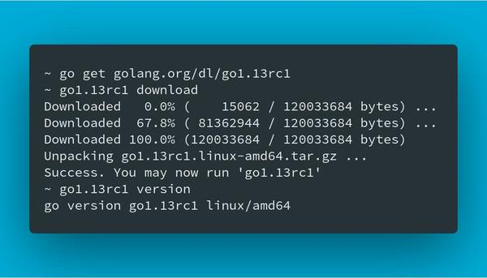
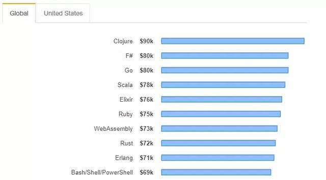
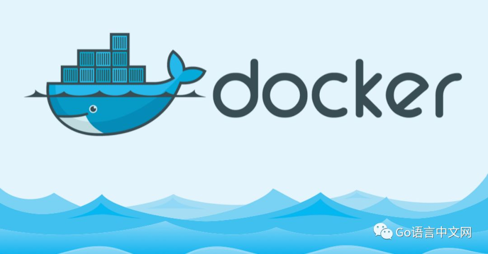
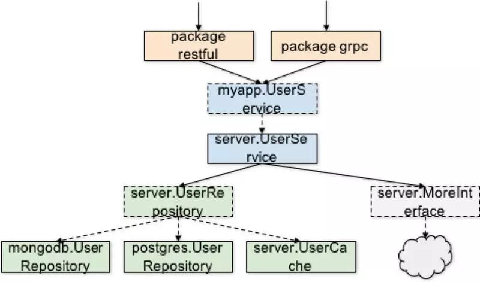
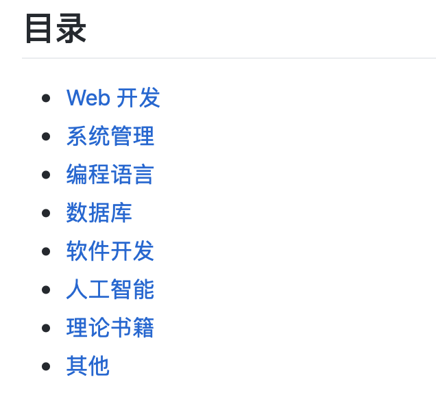

# Go语言爱好者周刊：第 5 期

这里记录每周值得分享的 Go 语言相关内容，周日发布。

欢迎投稿，推荐或自荐文章/软件/资源等，请[提交 issue](https://github.com/polaris1119/golangweekly/issues) 。

鉴于大部分人可能没法坚持把英文文章看完，因此，周刊中会尽可能推荐优质的中文文章。优秀的英文文章，我们的 GCTT 组织会进行翻译。


（题图：蚂蚁金服 蚂上创业营）

不论是创业、工作还是生活，难免会遇到各种挫折、困难，面对这些，我们需要有一个好的心态。有时候，我们会选择“阵痛”的方式，为的是更好的崛起。看到蚂上创业营的这句标语，加上现在遇到的一些事情，想起了《雄霸天下》中，无名在废掉武功后，反而练成了绝世神功：万剑归宗。

所以大家遇到问题时，摆正心态，蹲下，并做好一跃而起的姿势，努力跳的更高~

## 资讯

1、[Go 1.13 RC1 发布](https://groups.google.com/forum/#!topic/golang-nuts/sWmvkEDjkrk)

8月22日，Go1.13 发布了 RC1 版本，过些天预计会发布正式版本。如果要试验可以在 https://studygolang.com/dl 下载 RC1 版本。关于 Go1.13 的变动，可以查看：https://tip.golang.org/doc/go1.13 。



2、[提议：在 Go2 中加入三元操作符](https://github.com/golang/go/issues/33171)）（英文）

我们都知道，大部分语言有的 `?:` 操作符，Go 中没有。相应的代码，Go 中一般这么写：

```go
if expr {
    n = trueVal
} else {
    n = falseVal
}
```

虽然官方在 [FAQ](http://docs.studygolang.com/doc/faq#Does_Go_have_a_ternary_form) 中对没有三元操作符进行了解释，但似乎大家不满意。该提议建议在 Go2 中加入 `?:` 三元操作符。你支持吗？

3、[GopherCon UK 2019](https://www.gophercon.co.uk/)

8月21、22、23日，在英国伦敦举行了 GopherCon UK 2019 大会。相关演讲主题查看这里：https://www.gophercon.co.uk/schedule/ 。另外，这里总结了大会上的2天：[2 Days at GopherCon UK 2019](https://medium.com/@teivah/2-days-at-gophercon-uk-2019-d10758642041)（英文）。


4、[2019全球编程语言高薪排行榜：Scala、Go轻松达百万年薪](https://www.toutiao.com/i6726348910589116941/)

近日，Stack Overflows 发布了 2019 年的最新调查结果，总结了不同编程语言在行业中可能获得的薪水。当然，在这个过程中也需要关注一些其他因素，比如：语言对使用者是否友好，这有助于更快地学习语言；是否与现在的科技趋势相关。



## 问答

1、[go语言里的select监听到底是怎么工作的?](https://www.zhihu.com/question/340342212/answer/795661248)

问题中的测试示例，有一个严重的问题，这个之前我在知识星球中「每日一学」讲解过此问题，是一个比较容易遇到的坑。GCTT 也翻译过一篇类似的文章。[Golang <-time.After（）在计时器过期前不会被垃圾回收](https://studygolang.com/articles/22617)。

2、[Golang time如何实现的？](https://www.zhihu.com/question/320347209/answer/736754990)

问题标题看着挺大，其实题主关心是几个核心常量之间的转化关系。主要是三个时间，分别 unix 时间、wall 时间和 absolute 时间。这里面有个相对重要的转化公式，在需要考虑平润年的时候稍微有点复杂。

3、[golang 中时候用指针什么时候用普通对象？](https://segmentfault.com/q/1010000019708895/a-1020000019911459)

其实就两点，一是如果数据结构比较大，建议采用指针，不会发生值拷贝。二是如果需要修改结构的话，必须用指针。当然如果是引用类型，比如 chan、slice、 map，就不用考虑这个问题了。

4、[Golang中的make(T, args)为什么返回T而不是*T?](https://www.zhihu.com/question/312356800/answer/739572672)

make 针对的是 Go 的引用类型，即 chan、slice 和 map，而 new 针对的指针。引用类型为什么 make 不是返回指针呢？这样一说好像和上个问题有点类似了，当然因为引用并不存在值类型的那些问题。

5、[Go到底适合干什么？](https://studygolang.com/topics/2744)

你在用 Go 干什么呢？

6、[go源码中，只定义func名称和参数，没有主体。但是我自己写这样的东西编译会报错。](https://studygolang.com/topics/9820)

如果关注过 《Go语言中文网》公众号，应该知道答案吧。[为什么 Go 标准库中有些函数只有签名，没有函数体？](https://mp.weixin.qq.com/s/XPRj87YT3U6hJvyY11y8jA)

## 文章

1、[深入理解Go之generate](https://studygolang.com/articles/23025)

工具集是 Go 的一大特色，可谓十分强大。generate 也是其中的一个工具，如果你没有用过，可以通过本文感受一下。

2、[GCTT出品 | Go Modules 的使用方法](https://mp.weixin.qq.com/s/TvTlz3uKIBqgg1FjlAItPQ)

Go 的依赖管理一直是讨论较多的话题之一，社区出现了很多解决方案。Go1.11 开始，官方提供了解决方案，这就是 Module。本文是官方博文的 GCTT 译文。这是一个系列，第2篇前几天刚出来，GCTT 已经翻译完成，目前校对中。可以关注我们网站或公众号第一时间学习。


3、[高性能go服务之高效内存分配](https://studygolang.com/articles/23010)

这篇文章，我们将介绍导致低效率和与内存分配相关的生产意外的常见模式，以及消除这些问题的实用方法。我们会专注于分配器的核心机制，为广大开发人员提供一种处理内存使用的方法。

4、[GCTT 出品 | Go 语言中的组合](https://mp.weixin.qq.com/s/vf5z3is37FXMYrmHuij_JQ)

组合超越了嵌入式 结构。这是我们可以用来设计更好的 APIs 并通过较小的模块构建更大的程序的范式。这一切都是从单一目类型的声明和实现开始。程序在架构时考虑到组合能更好的扩展和适应不断变化的需求。它们能更容易阅读和推理。

5、[用 GODEBUG 看调度跟踪](https://github.com/EDDYCJY/blog/blob/master/tools/godebug-sched.md)

让 Go 更强大的原因之一莫过于它的 GODEBUG 工具，GODEBUG 的设置可以让 Go 程序在运行时输出调试信息，可以根据你的要求很直观的看到你想要的调度器或垃圾回收等详细信息，并且还不需要加装其它的插件，非常方便，今天我们将先讲解 GODEBUG 的调度器相关内容，希望对你有所帮助。

6、[深入理解Go之==](https://studygolang.com/articles/23024)

`==` 该操作符很常用，但你真的理解它吗？

7、[Go - http.Client源码分析](https://studygolang.com/articles/23009)

发送 HTTP 请求时，我们通常会使用标准库的 http 包中的 Client，你了解它的实现吗？不妨跟着本文，接着源码学习下。

8、[GCTT | 通过 Docker 和 Go 实现 https 访问](https://mp.weixin.qq.com/s/yqXbK_K-mdLRPQVKeWEliw)

我希望这篇文章可以帮助您在设置下一个 `Web` 服务时减少一些时间和困惑，或者至少让您有兴趣再写一些 `Go`。



9、[Golang中使用断路器](http://yangxikun.com/golang/2019/08/10/golang-circuit.html)

这是微服务必须有的、保证服务稳定的功能。


10、[聊聊Golang中的range关键字](https://my.oschina.net/u/2612999/blog/908114)

你常用的 range 关键字，你真的理解它吗？

- 环变量在每一次迭代中都被赋值并会复用。
- 可以在迭代过程中移除一个 map 里的元素或者向 map 里添加元素。添加的元素并不一定会在后续迭代中被遍历到。

11、[基于go pprof 内存分析及优化的实践](https://juejin.im/post/5d5be347f265da03b94ff66b)

这是[上期周刊](https://studygolang.com/topics/9883)推荐过的 [Crawlab](https://github.com/crawlab-team/crawlab) 的内存分析和优化实践。

12、[Go 编程实战：如何组织代码、编写测试](https://www.infoq.cn/article/4TAWp8YNYcVD4t046EGd)

如何组织代码，怎么编写测试？这两个问题可能困扰过很多新手。其实我在知识星球[《Go项目实战》](https://t.zsxq.com/aYF6aqv)的实际项目中，专门花了时间调研、分析、总结了代码组织的问题，也推荐了一套代码组织的方案。

本文尝试着分析、解决这两个问题，其中的建议，你是否认可呢？



13、[Go Context的踩坑经历](https://zhuanlan.zhihu.com/p/34417106)

`context`是Go中广泛使用的程序包，由Google官方开发，在1.7版本引入。它用来简化在多个go routine传递上下文数据、(手动/超时)中止routine树等操作，比如，官方http包使用context传递请求的上下文数据，gRpc使用context来终止某个请求产生的routine树。由于它使用简单，现在基本成了编写go基础库的通用规范。笔者在使用context上有一些经验，遂分享下。

14、[Go性能调优](https://www.liwenzhou.com/posts/Go/performance_optimisation/)

在计算机性能调试领域里，profiling 是指对应用程序的画像，画像就是应用程序使用 CPU 和内存的情况。 Go语言是一个对性能特别看重的语言，因此语言中自带了 profiling 的库，这篇文章就要讲解怎么在 golang 中做 profiling。

## 开源项目

1、[pdfcpu: 用 Go 编写的 PDF 处理器](https://pdfcpu.io/)

pdfcpu 是一个用 Go 编写的简单 PDF 处理库，支持加密。它提供 API 和 CLI，支持的功能很丰富。支持的最高版本为 PDF 1.7（ISO-32000）。这里有一个演示视频：[](https://asciinema.org/a/P5jaAo9kgZXKj2iSA1OqIdLAU)

2、[trivy: 容器安全性检测工具](https://github.com/knqyf263/trivy)

用于容器的，简单而全面的漏洞扫描程序，适用于 CI（如 Travis CI, CircleCI, Jenkins 等）。


3、[为 iOS 编写 Go 程序](https://github.com/mtojek/go-build-for-ios)

愿意折腾的可以试试。

4、[Tigo: 一款 Go 开发的 Web 应用框架](https://github.com/karldoenitz/Tigo)

腾讯、小米在使用？

5、[为 Go 程序自动支持 HTTPS](https://github.com/mholt/certmagic)

Caddy 自动 HTTPS 使用的就是这个库。


6、[redeo: 用于构建与redis协议兼容的TCP服务器/服务的高性能框架](https://github.com/bsm/redeo)

7、[Cinema: Go的轻量级视频‘编辑器’](https://github.com/jtguibas/cinema)

在这里不要期望 iMovie，但如果你想从 Go 裁剪、修剪或以其他方式执行基本的视频操作，该库将有所帮助。这取决于ffmpeg。

8、[gapid: 图形 API 调试器](https://github.com/google/gapid)

谷歌出品！

9、[Gos: 武装 Golang](https://github.com/storyicon/gos)

为 go module，goproxy，交叉编译等提供解决方案。不过貌似没有特别吸引人的点。

## 资源&&工具

1、[阮一峰整理：互联网上的免费书籍](https://github.com/ruanyf/free-books)

范围涉及到方方面面。



2、[在Go中编写Web服务的入门代码](https://github.com/ardanlabs/service)

Ardan Studios 这个组织特别是它的创始人 William Kennedy，产出过很多高质量的文章，他也是 《Go In Action》 的作者之一。这个资源就是出自他之手。

3、[annie：Go 语言实现的简单、快速、干净的视频下载器](https://github.com/iawia002/annie)

支持的网站

Site | URL | 🎬 Videos | 🌁 Images | 📚 Playlist | 🍪 VIP adaptation
--- | --- | ---------| -------- | -------- | --------------
抖音 | <https://www.douyin.com> | ✓ | | | |
哔哩哔哩 | <https://www.bilibili.com> | ✓ | | ✓ | ✓ |
半次元 | <https://bcy.net> | | ✓ | | |
pixivision | <https://www.pixivision.net> | | ✓ | | |
优酷 | <https://www.youku.com> | ✓ | | | ✓ |
YouTube | <https://www.youtube.com> | ✓ | | ✓ | |
爱奇艺 | <https://www.iqiyi.com> | ✓ | | | |
芒果TV | <https://www.mgtv.com> | ✓ | | | |
Tumblr | <https://www.tumblr.com> | ✓ | ✓ | | |
Vimeo | <https://vimeo.com> | ✓ | | | |
Facebook | <https://facebook.com> | ✓ | | | |
斗鱼视频 | <https://v.douyu.com> | ✓ | | | |
秒拍 | <https://www.miaopai.com> | ✓ | | | |
微博 | <https://weibo.com> | ✓ | | | |
Instagram | <https://www.instagram.com> | ✓ | ✓ | | |
Twitter | <https://twitter.com> | ✓ | | | |
腾讯视频 | <https://v.qq.com> | ✓ | | | |
网易云音乐 | <https://music.163.com> | ✓ | | | |
音悦台 | <https://yinyuetai.com> | ✓ | | | |
极客时间 | <https://time.geekbang.org> | ✓ | | | |
Pornhub | <https://pornhub.com> | ✓ | | | |

使用示例：

```console
$ annie -i ep198381 av21877586

 Site:      哔哩哔哩 bilibili.com
 Title:     狐妖小红娘：第79话 南国公主的吃货本色
 Type:      video
 Streams:   # All available quality
     [default]  -------------------
     Quality:         高清 1080P
     Size:            485.23 MiB (508798478 Bytes)
     # download with: annie -f default "URL"


 Site:      哔哩哔哩 bilibili.com
 Title:     【莓机会了】甜到虐哭的13集单集MAD「我现在什么都不想干,更不想看14集」
 Type:      video
 Streams:   # All available quality
     [default]  -------------------
     Quality:         高清 1080P
     Size:            51.88 MiB (54403767 Bytes)
     # download with: annie -f default "URL"
```

4、[torrent: 功能齐全的BitTorrent客户端软件包和实用程序](https://github.com/anacrolix/torrent)

这是一个命令行程序，使用 Go 语言实现的。

5、[Ultimate Go: 终极学习指南，包含大量文档化的代码和程序分析](https://github.com/hoanhan101/ultimate-go)

这个仓库包含作者关于学习Go和计算机系统的笔记。

不同的人有不同的学习方式。 对作者来说，通过练习和例子实践，学得最好。 因此，作者正在尝试仔细记录并直接评论源代码，而不是编写 Markdown 文件。 这样，可以在阅读时理解每一行代码，同时也注意场景背后的理论。

如果你也喜欢这种学习方式，这个项目可能对你会很有帮助。


6、[前端面试每日 **3+1**（每日三问）](https://github.com/haizlin/fe-interview)

以面试题来驱动学习，提倡每日学习与思考，每天进步一点！每天早上5点纯手工发布面试题（死磕自己，愉悦大家）。

虽然这是前端的，但是值得关注。

7、[正确的方式记录并分享你的终端](https://asciinema.org/)

录制的视频分享很方便！上文 pdfcpu 中视频就是这个录制的。

[](https://asciinema.org/a/123683)

## 订阅

这个周刊每周日发布，同步更新在[Go语言中文网](https://studygolang.com/go/weekly)、[微信公众号](https://weixin.sogou.com/weixin?query=Go%E8%AF%AD%E8%A8%80%E4%B8%AD%E6%96%87%E7%BD%91) 和 [今日头条](https://www.toutiao.com/c/user/59903081459/#mid=1586087918877709)。

微信搜索"Go语言中文网"或者扫描二维码，即可订阅。


