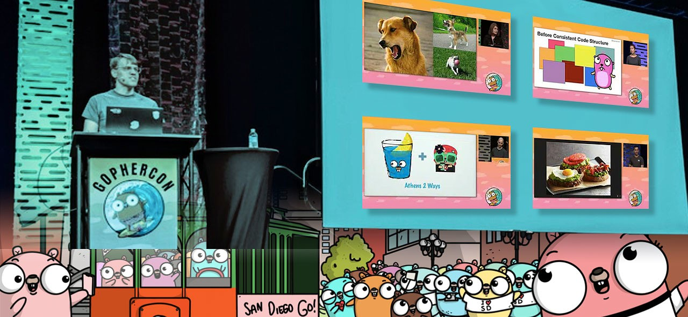
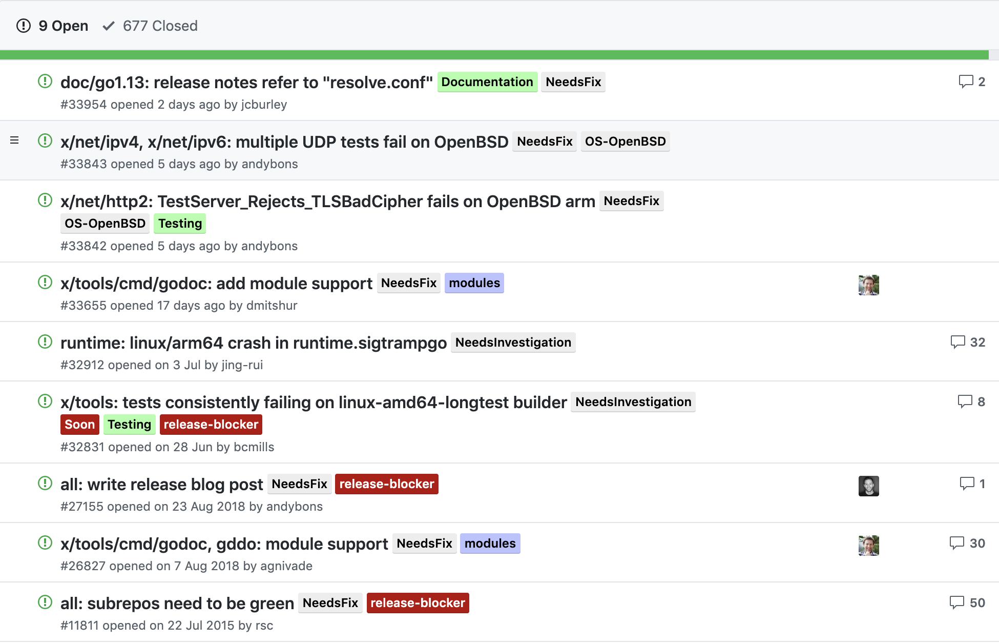
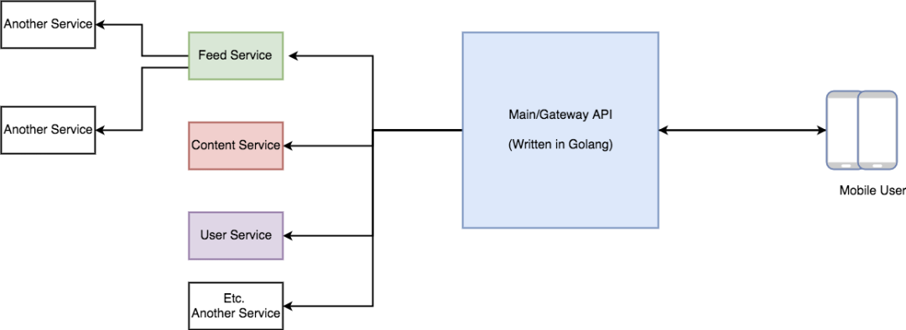
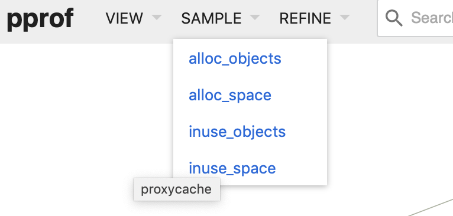
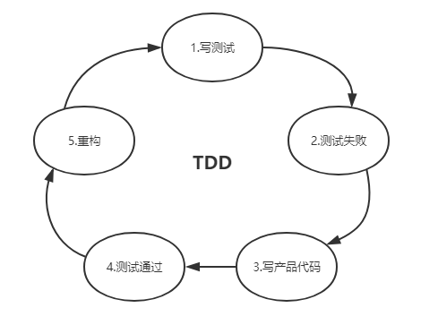
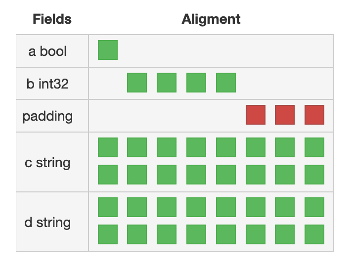
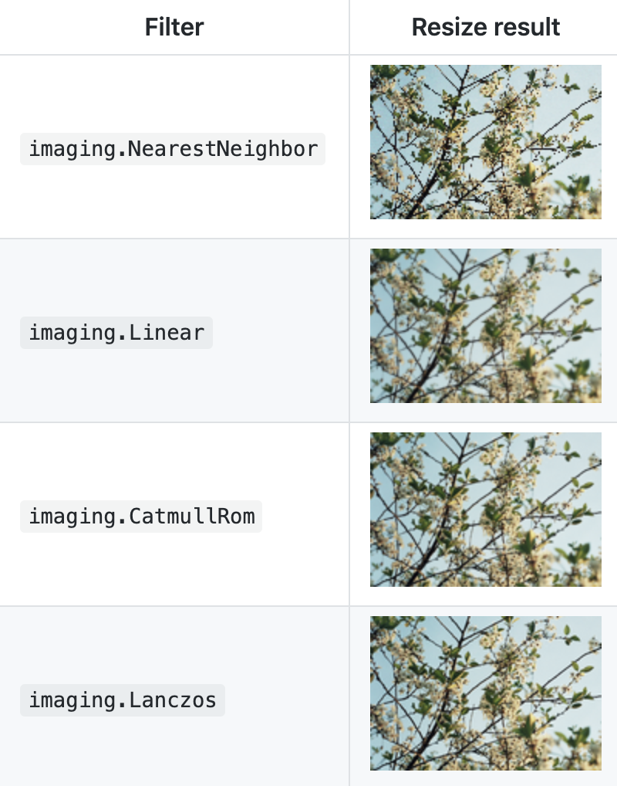

# Go语言爱好者周刊：第 6 期

这里记录每周值得分享的 Go 语言相关内容，周日发布。

欢迎投稿，推荐或自荐文章/软件/资源等，请[提交 issue](https://github.com/polaris1119/golangweekly/issues) 。

鉴于大部分人可能没法坚持把英文文章看完，因此，周刊中会尽可能推荐优质的中文文章。优秀的英文文章，我们的 GCTT 组织会进行翻译。

题图：GopcherCon 2019 合成

## 刊首语

Go 1.13 在 8 月份还是没有发布，Delay 了。坚持了 10 年的按时发布，这次没有按时，大家觉得跟 Brad 的老婆生二胎休假有很大关系，少了核心开发者。Go 1.13 在 Module 上花的精力也很大。

目前 1.13 的 issue 列表：https://github.com/golang/go/milestone/83

Go 1.13 毕竟没有带来泛型，所以，大部分人对它的期待其实没有多少。当然，也有人很期待，主要在 Module 方面的改进和完善。

说实话，坚持了这么多年按时发布，这个时候不能按时发布，内心还是有一点遗憾，当然无伤大雅！

## 资讯

1、[Go 语言调试器 Delve 发布 1.3.0](https://studygolang.com/topics/9989)

Go 语言实现的 Go 语言调试器，发布 1.3.0，支持 Go 1.13。

2、[GoLand 2019.2.1 发布，JetBrains 打造的 Go 语言 IDE](https://www.oschina.net/news/109407/goland-2019-2-1-released)

这是对 GoLand 2019.2 的 bug-fix 更新版本。更新内容包括对 UI 的修复、对自动补全代码功能的改进、对导入功能的优化、改进 SQL 注入功能以及改进代码格式化工具等。

另外，GoLand 公布了 [2019.3 Roadmap](https://www.oschina.net/news/109439/goland-2019-3-roadmap)，有望引入远程开发功能。

3、[GKTemplate v0.0.4，采用 Go 开发的 DedeCMS 模板解析器](https://www.oschina.net/news/109395/gktemplate-0-0-4-released)

GKTemplate 是一个 Go 语言开发的模板引擎，由于 Go 语言内置的模板引擎自由度过高，导致开发使用相对比较困难，对界面模板制作要求会比较高，GKTemplate 是一款基于标签、属性机制的模板引擎，在牺牲部分自由度、性能的前提下，优化模板语义机制，使得开发、制作模板变得更为轻松简单。

4、[go-fastdfs v1.3.2 发布，修正跨域 options 方法](https://www.oschina.net/news/109466/go-fastdfs-1-3-2-released)

go-fastdfs是一个基于http协议的分布式文件系统，它基于大道至简的设计理念，一切从简设计，使得它的运维及扩展变得更加简单，它具有高性能、高可靠、无中心、免维护等优点。

项目 GitHub 地址：https://github.com/sjqzhang/go-fastdfs

5、[Consul 1.6 GA 发布](https://www.oschina.net/news/109463/consul-1-6-general-availability)

Consul 是 HashiCorp 公司推出的开源工具，也是主流的用于实现分布式系统服务发现与配置的方案。HashiCorp 对 Consul 的介绍是一个多云服务网络平台，用于在跨任何运行时平台和公共云或私有云的场景连接和保护服务。

本次更新主要集中在 Consul Connect（为其增加了一些主要新特性）和 Consul 的服务网格解决方案方面，此外还有一些改进和错误修复。

6、[Go 语言开发工具 LiteIDE X36.1 发布](https://www.oschina.net/news/109448/liteide-x36-1-released)

在目录管理窗口中加入了文件复制/粘贴功能，修复了以 _ 开始符号查找错误，更新了 gotools & gocode。

7、[Gorilla WebSocket: Go 语言的 WebSocket 实现，发布 1.4.1 版本](https://github.com/gorilla/websocket/releases/tag/v1.4.1)

这次版本主要修复 **DoS** 的问题，建议升级。

## 问答

1、[如何阅读Golang的源码？](https://studygolang.com/articles/23154)

学习go语言的过程中，觉得源码写的很棒，但是有点晦涩，该怎么阅读？本文给出建议。

2、[在循环中 append map 到 map slice，map slice 中的数据全部为最后一次 append 的数据](https://segmentfault.com/q/1010000019881129/a-1020000019949131)

map 是引用类型，即使 slice 通过 append 赋值了多份 map 变量，但是其内部指向是同一个地址。

3、[golang 等值比较是不是直接比较地址呢？](https://segmentfault.com/q/1010000019940462/a-1020000019941598)

首先要说 Go 的等值比较的是值，而不是地址。Go 中变量的可比较类型是内置的，所有基本类型都可以进行比较，另外 interface 和 struct 也可以比较。两个变量可比较的提前必须是相同类型。但有一点需要说明的是，interface 是不确定的类型，所有它不但会比较值，还会比较具体的类型。

4、[golang 中如何禁止一个导出类型直接构造，必须通过new函数来构造？](https://www.zhihu.com/question/333771024/answer/741498087)

其他的 oo 语言实现题主要求是非常简单的，只要定义相应的私有成员属性并通过构造函数控制输入的参数即可。

那么 Go 该如何实现呢？其实也很简单，思路与 oo 是类似的。只是我们把 oo 语言中的构造函数换成了 Go 中的工厂方法，私有变量变成了 Go 包级别的私有成员属性。我们只需要通过定义指定的可导出的工厂方法创建实例即可。

5、[Golang中 fmt.Println 和直接 println 有什么区别？](https://www.zhihu.com/question/335186436/answer/750846252)

println 主要是 Go 自己使用，比如源码、标准库等，而 fmt 才是给 Go 开发人员使用的。而且要提的是 println 不能保证兼容性，可能在未来的某一天就不存在了，但 fmt 中的函数就不存在着这样的问题。

当然，两者的使用和效果上也是有区别的，如 println 输出是到标准错误的，而非标准输出。

此外，Go 语言中文网微信群有人提出了一个诡异的问题，我为知识星球用户做了详细的分析解答：[由群里讨论的关于 println 和 fmt.Println “诡异”问题的思考总结](https://studygolang.com/topics/9992)。

## 文章

1、[使用 Go Modules（模块）进行依赖项迁移](https://studygolang.com/articles/23133)

本篇文章是 Go Modules 系列官方博客文章的第 2 部分。第 1 部分请参阅：[Go Modules 的使用方法（中文翻译版）](https://studygolang.com/articles/19334)。

2、[GCTT 出品 | Go 的调度器追踪](https://mp.weixin.qq.com/s/377ixSlRNrRezY5IUH-h0A)

我喜欢 Go 语言的一个原因就是因为它可以生成分析和调试信息。当程序在执行的时候 Go 有一个特殊的环境变量 GODEBUG，它在运行阶段可以生成调试信息。你可以获取程序回收器和调度器的概要信息以及详细的信息。更主要的是你不需要添加任何的额外工作重新编译就可以完成调试

在这篇文章里，我将通过一个简单的 Go 程序演示如果使用调度跟踪信息。如果你对调度器有一定的了解那么它对你是用的。

3、[使用 GitHub Actions 自动化构建 Golang 应用](https://www.qikqiak.com/post/use-github-actions-build-go-app/)

`GitHub Actions` 是前段时间推出的自家的自动化构建工具。允许构建一个完整的 CI/CD Pipeline，与 GitHub 生态系统深度集成。目前还未开放，开通过 https://github.com/features/actions/signup 申请。本文介绍用该功能构建 Go 应用。

对 GitHub Actions 感兴趣的进一步看看此文：[使用Github Actions教程](https://tech.mojotv.cn/go/golang-github-actions)。这里还有一篇英文文章：[使用 GitHub Actions 对Go项目持续集成](https://onepage.nopub.io/p/Using-GitHub-Actions-with-Go-2ca9744b531f4f21bdae9976d1ccbb58)。

4、[如何在 Golang API 中避免内存泄漏？](https://studygolang.com/articles/23172)

建议你在将 Golang API 投入生成之前阅读此文，此文是基于真实的线上问题修复经历，如有巧合，纯属踩雷！

5、[go 学习笔记之万万没想到宠物店竟然催生出面向接口编程?](https://studygolang.com/articles/23169)

讲故事的方式讲解面向接口编程。

6、[Hi, 使用多年的 go pprof 检查内存泄漏的方法居然是错的?!](https://colobu.com/2019/08/20/use-pprof-to-compare-go-memory-usage/)

本文介绍一下 Go pprof 工具查找内存泄漏的一个不太常用的方法。

7、[明白了，原来 Go web 框架中的中间件都是这样实现的](https://colobu.com/2019/08/21/decorator-pattern-pipeline-pattern-and-go-web-middlewares/)

这篇文章想谈谈 Go 的装饰器模式、pipeline(filter)模式以及常见 web 框架中的中间件的实现方式。

8、[Golang实现单机百万长连接服务 - 美图的三年优化经验](https://mp.weixin.qq.com/s/xavjsa4NzRiVRxyMhifCDg)

美图长连接服务历时三年，在内存优化上积累比较丰富的实践经验，本文将会介绍我们团队这些年在内存优化道路上做的一些尝试。

9、[Go 语言测试驱动开发](https://juejin.im/post/5d653d90f265da039d32dda9)

Go 语言对测试的原生支持以及完善的测试类库框架使得 TDD 的实施成本相对较低，这相当于放大了 TDD 的收益。在此向广大 gopher 们安利一波，说不定你也会爱上它。本篇将从实际业务视角触发，通过一个示例来演示如何运用TDD来构建我们的Go程序。

10、[Go 组件学习——database/sql 数据库连接池你用对了吗](https://juejin.im/post/5d624abde51d45621655352c)

通过实际 case 讲解连接池的一些概念和使用。

11、[Go 内存泄漏？不是那么简单!](https://colobu.com/2019/08/28/go-memory-leak-i-dont-think-so/)

最近遇到一个Go内存不释放的问题，记录一下测试和调研的情况。我到不把它归为Go内存泄漏的问题，因为它和一般的内存泄漏的方式不同。

12、[golang goroutine 和 线程](https://www.jianshu.com/p/588c6dceb5cf)

本文由进程、线程进而引出 goroutine。这些操作系统相关的概念，我们都是需要掌握的。

13、[Go进阶：如何开发多彩动感的终端 UI 应用](https://tech.mojotv.cn/tutorial/golang-term-tty-pty-vt100)

终端(Terminal)是计算机系统的输入输出设备，由于历史的原因终端这个概念非常混乱，终端的发展经历了**字符终端**、**图形终端** 和 **网络终端** 三个阶段。如果你酷炫的终端 UI 有要求，此文很适合你。

14、[Go语言学习——如何实现一个过滤器](https://www.cnblogs.com/bigdataZJ/p/go-filter.html)

基于 Go 语言造轮子实现一个过滤器的雏形，通过实现一个相对优雅可扩展的过滤器熟悉了 type 的用法，Context.WithValue 的作用。

15、[通过布局属性来减少结构体尺寸（英文）](https://preslav.me/2019/08/27/reduce-struct-size-by-laying-out-attributes-accordingly/)

关于在定义结构时内存如何工作的快速但有用的提示。

## 开源项目

1、[Lute: 一款结构化的 Markdown 引擎，为未来而构建](https://github.com/b3log/lute)

完整实现了最新的 [GFM](https://github.github.com/gfm/)/[CommonMark](https://commonmark.org/) 规范，对中文语境支持更好。Go 语言中文网计划将网站改为使用它。

2、[script: 在 Go 中轻松编写类似 shell 的脚本](https://github.com/bitfield/script)

如果不喜欢 shell 脚本，不妨试试这个。

3、[migrator: 数据库迁移工具](https://github.com/lopezator/migrator)

特色：

- 轻量级实现，支持 database/sql。Migrator 不需要任何 ORM 或其他重型库作为依赖项。它只是由少于 200 行代码的单个文件组成；
- 轻松嵌入您的应用程序，无需安装/使用单独的二进制文件；
- 支持 Go 迁移，无论是事务还是非事务；
- 使用灵活；

4、[ale: Go 实现的 Lisp 环境](https://github.com/kode4food/ale)

爱好 Go 的有会 Lisp 的吗？

5、[go-prompt: 在 Go 中构建强大的交互式提示，受 python-prompt-toolkit 的启发](https://github.com/c-bata/go-prompt)

一个用于构建强大的交互式提示的库，受到 python-prompt-toolkit 的启发，可以更轻松地使用 Go 构建跨平台的命令行工具。

是不是很酷炫？！

6、[chroma: 纯 Go 语言实现的通用语法高亮库](https://github.com/alecthomas/chroma)

Chroma 采用源代码和其他结构化文本，并将其转换为语法高亮 HTML，ANSI 色文本等。Chroma主要基于 Pygments，包括 Pygments 词法分析器和样式的翻译器。可见，chroma 不仅可以用于 HTML 页面语法的高亮，还支持终端的高亮。支持的语言还是很全的。

7、[godocc: 带有颜色的 godoc 工具](https://github.com/inancgumus/godocc)

接受 doc 使用的所有参数和标志。Godocc 只是 go doc 工具的简单包装器。界面很美观！

8、[imaging: 基本图像处理功能库](https://github.com/disintegration/imaging)

有图像？想要在 Go 中调整大小、旋转或裁剪它们吗？试试这个库。

原图：

各种处理结果：

更多其他效果，看看该库的首页。

9、[busgo/forest: 分布式任务调度平台](https://studygolang.com/p/busgo)

by @busgo 推荐。[#issue2](https://github.com/polaris1119/golangweekly/issues/2)

## 资源&&工具

1、[GopherCon 2019 大会演讲视频全集](https://www.youtube.com/playlist?list=PL2ntRZ1ySWBdDyspRTNBIKES1Y-P__59_)

视频在 youtube 上。lightning talk视频在这里：https://www.youtube.com/playlist?list=PL2ntRZ1ySWBedT1MDWF4xAD39vAad0DBT 。有人搬到国内 B 站了，可以在 B 站观看 https://www.bilibili.com/video/av65679861。这里还有英文文字版：https://about.sourcegraph.com/go/

2、[Go 微服务框架 go-micro 系列教程](https://www.jianshu.com/p/41005492033f)

微服务很火，微服务的本质是让专业的人做专业的事情，做出更好的东西。这个系列讲解 go-micro 构建微服务。目前更新到 2.3 章节。

- [golang微服务框架go-micro 入门笔记1.搭建 go-micro环境](https://www.jianshu.com/p/41005492033f)
- [golang微服务框架go-micro 入门笔记2.1 micro工具之micro api](https://www.jianshu.com/p/5c9e876ac467)
- [golang微服务框架go-micro 入门笔记2.2 micro工具之微应用利器micro web](https://www.jianshu.com/p/7821d240b109)
- [golang微服务框架go-micro 入门笔记2.3 micro工具之消息订阅和发布](https://www.jianshu.com/p/cd2e80de45e7)

3、[gostringsr2: Python 实现的用于 Go 的逆向工程](https://github.com/CarveSystems/gostringsr2)

极客可以了解下。这里有一篇介绍的英文文章：https://carvesystems.com/news/reverse-engineering-go-binaries-using-radare-2-and-python/ 。

4、[yeetgif: Go 语言实现的 GIF 效果的 CLI](https://github.com/sgreben/yeetgif)

可组合 GIF 效果的 CLI，具有合理的默认值。专为 Slack/Discord 定制 emoji 表情。很有趣的一个工具。

5、[Go 面试每天一篇（第 9 天）](https://mp.weixin.qq.com/s/8SW6bG0SOD2nhVY0SfyUrA)

连续坚持是一件很难的事情，期待作者能坚持更新，作者的公众号也可以关注一波。面试题是大家永恒关注的话题，因此，Go 语言中文网开启了一个项目，专门用来收集、解答各种 Go 语言相关的笔试、面试题，欢迎你提 issue。项目地址：[Go-Interview-QA](https://github.com/studygolang/Go-Interview-QA)。

6、[go-web-app: 用于设置 Go WebAssembly 前端应用程序的 CLI](https://github.com/talentlessguy/go-web-app)

## 订阅

这个周刊每周日发布，同步更新在[Go语言中文网](https://studygolang.com/go/weekly)、[微信公众号](https://weixin.sogou.com/weixin?query=Go%E8%AF%AD%E8%A8%80%E4%B8%AD%E6%96%87%E7%BD%91) 和 [今日头条](https://www.toutiao.com/c/user/59903081459/#mid=1586087918877709)。

微信搜索"Go语言中文网"或者扫描二维码，即可订阅。

