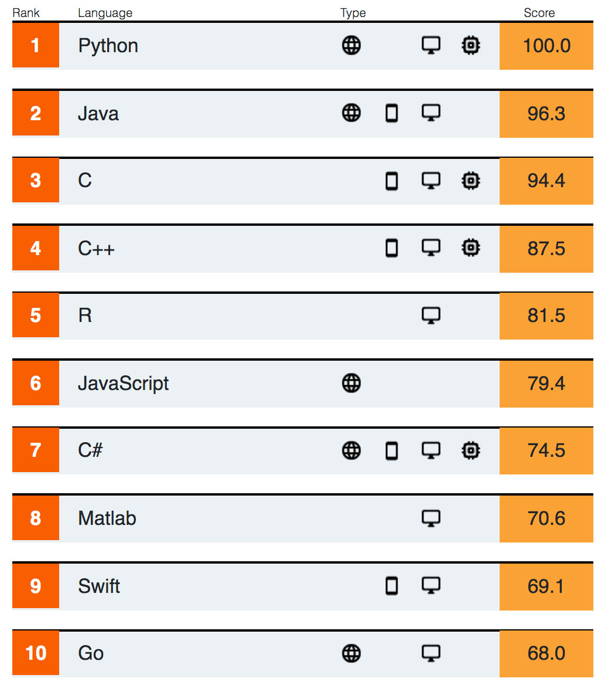
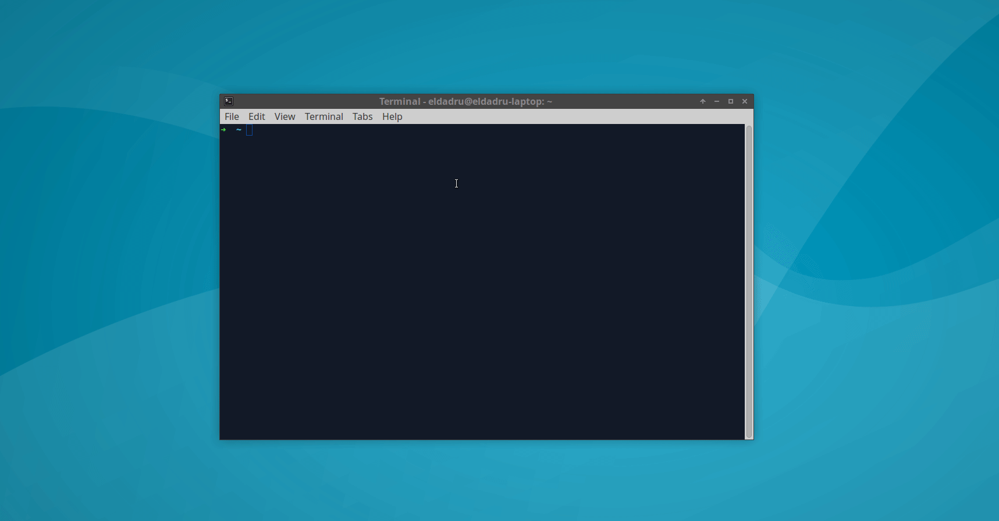
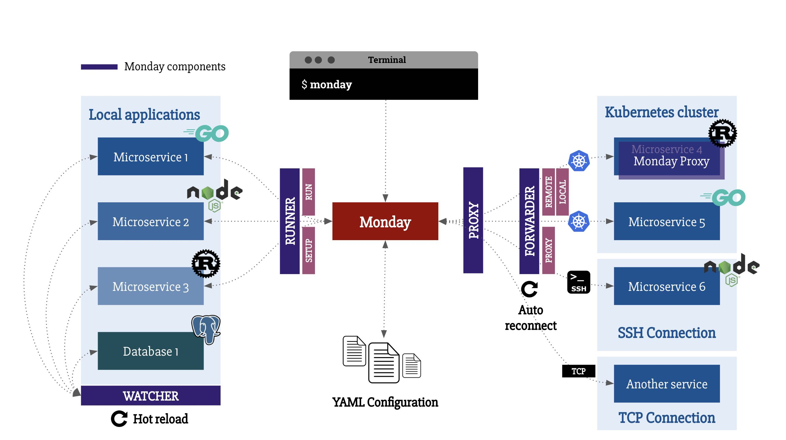

# Go语言爱好者周刊：第 8 期

这里记录每周值得分享的 Go 语言相关内容，周日发布。

本周刊开源（GitHub：[polaris1119/golangweekly](https://github.com/polaris1119/golangweekly)），欢迎投稿，推荐或自荐文章/软件/资源等，请[提交 issue](https://github.com/polaris1119/golangweekly/issues) 。

鉴于大部分人可能没法坚持把英文文章看完，因此，周刊中会尽可能推荐优质的中文文章。优秀的英文文章，我们的 GCTT 组织会进行翻译。

（题图：IEEE 2019 年度编程语言排行榜）

## 刊首语

Go 语言这几年发展势头还是不错的，在国内的发展更是迅猛，这有很多原因，但其中一个原因，就是离不开很多大牛的布道。国内有很多专注于推广、分享 Go 知识的技术博主、大牛。作为致力于打造国内 Go 语言中文优秀社区的 studygolang，我创立了一个项目：https://github.com/studygolang/gophers ，收集Go语言相关的公众号、博客，国内Go开源项目 以及这些布道者们，并创建了微信群。如果你也是布道者或 Go 技术博主，欢迎联系我。我们会定期帮宣传。

## 资讯

1、[Go team 计划对 Go 链接器进行深度优化](http://golang.org/s/better-linker)（英文，科学上网阅读）

Go 的链接器将 Go 编译器的输出合并到您运行的最终可执行文件中，但其（缺乏）效率导致 Go 开发出现一些问题。 Google 的 Austin Clements 解释了这个问题，并着眼于如何为 Go 构建更好的链接器。

为了方便大家查阅，我这里准备了一份 PDF 格式的。 [Building a better Go linker.pdf](res/Building-a-better-Go-linker.pdf) 

2、[Go 语言获得 IEEE Spectrum 2019 年度编程语言 Top 10](https://studygolang.com/topics/10062)

一年发布一次，去年 Go 排名第 9，今年调整了算法。具体排名看题图。

3、[TiDB 2.1.17 发布，分布式 NewSQL 数据库](https://www.oschina.net/news/109821/tidb-2-1-17-released)

TiDB 是国内 PingCAP 团队开发的一个分布式 SQL 数据库。其灵感来自于 Google 的 [F1](http://research.google.com/pubs/pub41344.html) 和 Google spanner, TiDB 支持包括传统 RDBMS 和 NoSQL 的特性。

4、[GoLand 2019.3 早期预览版开放下载](https://studygolang.com/topics/10064)

GoLand 2019.3 的第一个早期预览（EAP）版本已准备好供您试用。您可以通过[工具箱应用程序](https://www.jetbrains.com/toolbox/app/) 或从[网站](https://www.jetbrains.com/go/nextversion/) 下载，或使用快照包（对于Ubuntu）。 或者在 GoLand 中，选择*自动检查更新*：Preferences / Settings | Appearance & Behavior | System Settings | Updates。

5、[著名 service mesh 框架 istio 发布1.3版本](https://istio.io/blog/2019/announcing-1.3/)

Istio 是一个由谷歌、IBM 与 Lyft 共同开发的开源项目，旨在提供一种统一化的微服务连接、安全保障、管理与监控方式。具体来说，Istio 是一个开源服务网格平台，它确保微服务在处理故障时以指定的方式相互连接。1.3 已经发布，该版本提高可用性。

## 问答

1、[为什么Golang没有像Python中in一样的功能？](https://www.zhihu.com/question/328393303/answer/711287362)

Go 中没有 in，为什么会这样呢？其实还是因为它比较简单，实现起来也不是很复杂。回答中介绍了三种关于在 Go 中实现 in 的方式。

回答者 波罗学 在其公众号「码神路漫漫」中发布了一篇文章：[《Go 中 slice 的 In 功能实现探索》](https://mp.weixin.qq.com/s/xE9GT21YLTRsZd6CYk16MA)。波罗学在网上大量回答各种 Go 语言相关问题，大家有兴趣可以关注一波他的公众号。

2、[golang中byte转int涉及到大小端问题吗？](https://www.zhihu.com/question/327537211/answer/703010418)

关于 Go 中大小端的问题，其实有专门的包处理这个问题，encoding/binary。回答中介绍了如何在 Go 中检查机器的大小端。还有，如何将 []byte 分别按大小端转化为 int 类型。

3、[golang中单向channel有啥用处](https://segmentfault.com/q/1010000020372819)

我们知道单向channel是怕渠道滥用, 只能读的渠道出现写的情况, 但是具体的用法呢？

4、[goland中使用go mod 会重复下载包？](https://segmentfault.com/q/1010000020289960)

如果重复下载，那也太 low 了。多半是使用姿势的问题。

5、[golang切片扩容时底层内存地址是连续的么,会不会出现不连续的情况？](https://www.zhihu.com/question/325494056/answer/696616716)

主要介绍了切片的底层结构，数组是连续的，因而切片肯定也是连续的。回答通过具体的代码测试了下 slice 是如何扩容的。

6、[Golang如何把json中的unicode编码转换成中文字符？](https://www.zhihu.com/question/330544039/answer/724325798)

在调试接口的时候，经常遇到 \uxxxx 之类的字符串，为什么需要这样做呢？回答中说了一点个人的理解，\uxxxx 本质是 ascii 码，可以不用在意客户端的编码。但是这种方式，在我理解，也存在缺点，回答有所介绍。

7、[Go读取大量数据，开启多协程,将读取的文件内容导入数据库，出现丢失数据现象](https://studygolang.com/articles/23371)

写了一个数据库导入工具，从本地文件读取，处理完数据格式后，导入DbFileReadWriteChanel的数据是正确无缺少的，就在开启100协程写入数据，执行完毕后，发现导入后的数据表中缺少了100多条。

## 文章

1、[GCTT出品|调试 Go 的代码生成](https://mp.weixin.qq.com/s/mlkpqz5TRCiGrRs35WUNRQ)

关于使用工具链中可用工具来进行代码生成的检查。

2、[GCTT 出品 | 什么是协程（goroutine），它们是怎样工作的呢？](https://mp.weixin.qq.com/s/PqN9uZ9FJxe5oBtTUy9cYg)

Go 语言能获得如此难以置信的流行度的一个主要原因，是 Go 能通过轻量级的 Goroutines 和 channel 更加简便地处理并发问题。

3、[GitHub 很早就提供 GraphQL API 了，还不学习它就 Out 了](https://mp.weixin.qq.com/s/mHH43ku98qKZGO99Mx6T9w)

在本教程中，我们将探索如何使用 Go 和 GraphQL 服务进行交互。在本教程完结之时，我们希望你可以了解到以下内容：

- GraphQL 的基础知识
- 使用 Go 构建一个简易的 GraphQL 服务
- 基于 GraphQL 执行一些基本的查询

该文之后还有一篇：[GraphQL API 该如何实现合适的数据源？该文给你答案](https://mp.weixin.qq.com/s/OUwfxBTj1YxnlHpisLKeKA)。

4、[go 学习笔记之无心插柳柳成荫的接口和无为而治的空接口](https://studygolang.com/articles/23380)

作者似乎对道家很感兴趣，文章较长，别样的方式讲解接口。

5、[弄懂goroutine调度原理](https://studygolang.com/articles/23418)

Go 语言作者Rob Pike说，“Goroutine是一个与其他goroutines 并发运行在同一地址空间的Go函数或方法。一个运行的程序由一个或更多个goroutine组成。它与线程、协程、进程等不同。它是一个goroutine”。

6、[Go内存分配那些事，就这么简单！](http://lessisbetter.site/2019/07/06/go-memory-allocation/)

这篇文章**主要介绍Go内存分配和Go内存管理**，会轻微涉及内存申请和释放，以及Go垃圾回收。

7、[Compilers 101 in Go](https://milad.dev/posts/compilers-in-go/)（英文）

什么是编译器？ 首先从通用的角度进行讲解，然后专门针对 Go 语言进行分析，对编译器实现感兴趣的可以认真阅读下。

8、[Go是如何实现protobuf的编解码的](http://lessisbetter.site/2019/08/26/protobuf-in-go/)

浅析一下Go是如何实现protobuf编解码，一共两篇：原理和源码。

9、[聊一聊Go的那些处理命令行参数和配置文件的库](https://segmentfault.com/a/1190000020377098)

虽然Go原生的flag库比起其他语言，在处理命令行参数上已经做的很易用了，Go的社区也有很多好用的库。这篇文章主要介绍一下自己这段时间接触使用过库，为有同样需求的朋友也提供一些参考。

10、[理解 Golang 中 slice 的底层设计](https://juejin.im/post/5d79eddbe51d4561e53539df)

slice 是 golang 中利用指针指向某个连续片段的数组，所以本质上它算是引用类型。 一个 `slice`在 golang 中占用24个 bytes。本文探索它的底层设计。

11、[goroutine的分时调度解析](https://juejin.im/post/5d65d84751882550f321d22c)

goruntine是内建于golang的协程技术，被誉为轻量级线程。操作系统的内核线程是一般都支持分时调度功能，而这里通过源码分析goruntine的分时调度机制。

12、[深入理解Go-runtime.SetFinalizer原理剖析](https://segmentfault.com/a/1190000020323654)

finalizer是与对象关联的一个函数，通过`runtime.SetFinalizer` 来设置，它在对象被GC的时候，这个finalizer会被调用，以完成对象生命中最后一程。由于finalizer的存在，导致了对象在三色标记中，不可能被标为白色对象，也就是垃圾，所以，这个对象的生命也会得以延续一个GC周期。正如defer一样，我们也可以通过 Finalizer 完成一些类似于资源释放的操作。

## 开源项目

1、[GoVector：Go的向量时钟算法库](https://github.com/DistributedClocks/GoVector)

[向量时钟算法](https://en.wikipedia.org/wiki/Vector_clock)用于在没有集中时钟的情况下对分布式系统中的事件进行排序。 GoVector 实现了向量时钟算法，并提供了功能丰富的日志记录和编码基础设施。

2、[Cadence：Uber 出品的Go语言构建的分布式编排引擎](https://github.com/uber/cadence)

该系统由 Uber 构建，简化了复杂的有状态分布式应用程序的开发。 这是服务器库，但也有 Java 和 Go 客户端库。

3、[quic-go：纯 Go 实现的 QUIC](https://github.com/lucas-clemente/quic-go)

QUIC 是最初在 Google 开发的传输层网络协议，它构成了 HTTP/3 的基础。 这个库可能不是许多人直接感兴趣的，但它可以构成其他项目中 HTTP/3 实现的基础，例如 [Caddy](https://github.com/caddyserver/caddy/pull/2727)。

4、[app：一个WebAssembly框架，使用 Go、HTML 和 CSS 构建 GUI](https://github.com/maxence-charriere/app)

主要特性：

- [PWA 支持](https://developers.google.com/web/progressive-web-apps/)
- [构建工具](https://github.com/maxence-charriere/app/tree/master/cmd/goapp/main.go)，移除包装 wasm 应用程序的麻烦
- [React](https://reactjs.org/) 式 API

5、[scipipe：通过 Go 和命令行构建强大、灵活和资源有效的管道](https://github.com/scipipe/scipipe)

最新发布的 0.9.6 版本修复一些子组件的 bug。

6、[dive: 一个探索 docker image 镜像每一层内容的工具](https://github.com/wagoodman/dive)

用于探索 docker 镜像，图层内容以及发现缩小 Docker 大小的方法的工具。

7、[ksniff: kubernetes上的抓包工具](https://github.com/eldadru/ksniff)

Kubectl插件使用tcpdump和wireshark轻松嗅探kubernetes pods。

8、[Kuma: kong团队开源的service mesh通用控制平面](https://github.com/Kong/kuma)

kuma基于envoy，不仅支持k8s环境，还支持vm环境。

9、[monday：一个开发工具，供微服务开发人员运行本地应用程序和/或从/向Kubernetes SSH或TCP转发其他应用程序](https://github.com/eko/monday)

您的新微服务开发环境的朋友。 此CLI工具允许您定义配置以使用本地应用程序（Go，NodeJS，Rust或其他），并在Kubernetes上转发其他一些应用程序，以防您不想在本地运行它们。

## 资源&&工具

1、[Understanding Real-World Concurrency Bugs in Go](https://songlh.github.io/paper/go-study.pdf)（英文）

这是国外大学教授写的一篇论文，但基本是中国人，不过是英文的，主要谈实际中 Go 语言的并发 Bug。除了这篇论文，响应的还有一份演讲的 PPT，[这里可以查看](https://songlh.github.io/talks/go-study.pdf)。同时还有一篇文章对此进行分析：[Go: Concurrency Bugs in Go](https://medium.com/a-journey-with-go/go-concurrency-bugs-in-go-7d3677a1f2a2)，目前 GCTT 正在对该文进行翻译。

2、[各种编程语言的 0.3](https://0.30000000000000004.com/)

在编程语言中，计算 0.1 + 0.2 结果一定是 0.3 吗？实际上，计算机表示的浮点数没有 0.3。关于浮点数，可以读读该文：[Go之父说：不懂浮点数不配当码农…](https://mp.weixin.qq.com/s/0lCte3UD5qYcaBnebwnYrQ)。

3、[Go Time: Generics in Go](https://changelog.com/gotime/98)（英文）

Mat，Johnny，Jon 和特邀嘉宾 Ian Lance Taylor 讨论 Go 中的泛型。 什么是泛型，为什么它们有用？ 为什么 interface 不够？ 如果将泛型添加到 Go，标准库将如何更改？ 社区如何为泛型做贡献？ 如果添加了泛型，是否会对语言产生负面影响？mp3 可以在线听（54 分钟），也可以下载下来听：https://cdn.changelog.com/uploads/gotime/98/go-time-98.mp3 。

4、[Go 中有效的将 GitHub Actions 作为 CI](https://github.com/mvdan/github-actions-golang)

GitHub Actions 的出现，相信大家慢慢都会尝试，对其他的 CI 会有冲击。这个项目介绍了 Go 项目中使用 GitHub Action。

5、[外国朋友整理的 2019 年最好的 Go 语言教程、资料和图书](https://reactdom.com/go)（英文）

国内用户仅供参考。

6、[免费电子书 Kubernetes up and running 2nd](https://azure.microsoft.com/en-us/resources/kubernetes-up-and-running/)（英文）

为了方便下载，这里提供了 GitHub 直接下载：[Kubernetes up and running 2nd](res/Kubernetes-up-and-running-2nd.pdf)。

7、[微软在 GitHub 上开‌源了一‌份 AI 教学资源，主‌要服务于国‌内学‌生、教师以及 IT 从‌业人员](https://github.com/microsoft/ai-edu)

本社区是微软亚洲研究院（Microsoft Research Asia，简称 MSRA）人工智能教育团队创立的人工智能教育与学习共建社区。

8、[Go 语言刷 LeetCode，100% 测试覆盖](https://github.com/halfrost/LeetCode-Go)

来自饿了么的 [halfrost](https://github.com/halfrost) 算法大牛。一个人刷这么多真是厉害！

## 订阅

这个周刊每周日发布，同步更新在[Go语言中文网](https://studygolang.com/go/weekly)、[微信公众号](https://weixin.sogou.com/weixin?query=Go%E8%AF%AD%E8%A8%80%E4%B8%AD%E6%96%87%E7%BD%91) 和 [今日头条](https://www.toutiao.com/c/user/59903081459/#mid=1586087918877709)。

微信搜索"Go语言中文网"或者扫描二维码，即可订阅。

