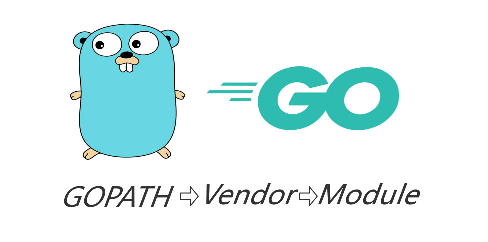

# Go语言爱好者周刊：第 9 期

这里记录每周值得分享的 Go 语言相关内容，周日发布。

本周刊开源（GitHub：[polaris1119/golangweekly](https://github.com/polaris1119/golangweekly)），欢迎投稿，推荐或自荐文章/软件/资源等，请[提交 issue](https://github.com/polaris1119/golangweekly/issues) 。

鉴于大部分人可能没法坚持把英文文章看完，因此，周刊中会尽可能推荐优质的中文文章。优秀的英文文章，我们的 GCTT 组织会进行翻译。

（题图：来自网络）

## 刊首语

周刊每次整理花费很多时间，但可能依然有很多好内容没有列出来，所以如果您有好内容记得给我们投稿。另外，Go语言中文网微信公众号也支持投稿，如果你有公众号，欢迎给我们开白名单，也可以联系我们，微信：polaris_6196 。

## 资讯

1、[Kubernetes 1.16.0 发布，新版本四大主题](https://www.oschina.net/news/109996/kubernetes-1-16-0-released)

该版本由 31 个增强功能组成：8 个进入稳定，8 个进入 Beta，15 个进入 Alpha。完整内容：https://kubernetes.io/blog/2019/09/18/kubernetes-1-16-release-announcement/ 。

[Kubernetes 1.16 发布，一文读懂其重磅新特性](http://toutiao.com/item/6739110374945063438/)

2、[TinyGo 0.8 发布](https://github.com/tinygo-org/tinygo/releases/tag/v0.8.0)

这是一个基于 LLVM 的、用于一些特定小场景的 Go 编译器，比如 WebAssembly、Microcontrollers 和 命令行工具等。在周刊的第 1 期推荐过。这次版本主要提升了反射性能、扩展和提升调度器性能等。

3、[GoLab: 意大利 Go 大会 (10 月 20 - 22 日)](https://golab.io/)

GoLab 将在佛罗伦萨的 Mediterraneo 大酒店举行。

4、[FastHTTP 1.5 发布](https://github.com/valyala/fasthttp)

Go 快速的 HTTP 包。为高性能而调优。 热路径中的零内存分配。 比 net/http 快 10 倍。有兴趣可以研究为什么能做到快这么多。

5、[Traefik 2.0：强大的云原生边缘路由器](https://blog.containo.us/traefik-2-0-6531ec5196c2)

一个开放源代码的反向代理和负载平衡器，用于基于 HTTP 和 TCP 的应用程序，它简单，动态，自动，快速，功能齐全，经过生产验证，提供指标并与每种主要的集群技术集成……难怪如此流行！官网：https://traefik.io/ ，项目地址：https://github.com/containous/traefik

6、[vim-go 1.21 发布](https://github.com/fatih/vim-go/releases/tag/v1.21)

感觉 vim-go、gopls 和 coc.nvim 组合应该是目前使用 vim 编写 go 代码的最佳组合了。开发效率高，并且也没感觉占用太多资源。当然，vim 要掌握还是不容易的。

7、[Caddy 2.0 beta 2 发布](https://github.com/caddyserver/caddy/releases/tag/v2.0.0-beta2)

Caddy 2.0 beta 2 是 Caddy 2 开发周期中的下一个预发布版本。

## 问答

1、[为什么 go 的 map 数据竞争是 fatal 错误, 而不是 panic？](https://www.zhihu.com/question/305845656)

1）首先为什么要fatal?

2）为什么是fatal而不是panic?

请从源码层面的原因是什么或者从源码解释，每一个回答都忠诚感谢！

2、[Go 的接口继承如何正确的应用？](https://www.zhihu.com/question/328762850/answer/712332485)

遇到了一个关于go接口继承问题，希望可以得到大家的解答。

3、[os.open竟然在文件不存在时返回err==nil，亏我那么信任它](https://studygolang.com/topics/10068)

撞到了 「Windows中不能用con等作为文件名」这个坑。

4、[golang与C语言相比最重要的改进是什么？](https://www.zhihu.com/question/325945059/answer/695652418)

你认为是哪些？

5、[golang第三方库fasthttp为什么要使用slice而不是map来存储header？](https://www.zhihu.com/question/327580797/answer/705124669)

fasthttp的作者在一个gopher会上的ppt，作者提到在fasthttp中使用了slice而不是map来存储header，query参数和cookie。不太理解为什么这样就可以re-use memory，是因为如果返回是string的话需要内存的拷贝吗？还有这个Add方法与直接append有什么区别呢？

6、[context包的withTimeout, withCancel之类的具体实用价值是啥](https://segmentfault.com/q/1010000020382614)

可能也有其他人有此困惑。

7、[golang有没有类似py的netifaces包来获取某个网卡的网关，MAC，子网掩码等信息的第三方库？](https://segmentfault.com/q/1010000013840078)

golang的net可以获取ip，掩码，貌似也可以获取mac。那怎么获取网关地址，或者有没有别的类似的第三方库？
现在目的就是想要根据网卡名字比如eth1，获取该网卡的ip地址，子网掩码，物理地址，网关，DNS。

8、[How to scan an interface into a struct?](https://www.reddit.com/r/golang/comments/d6fd4x/how_to_scan_an_interface_into_a_struct/)（英文）

使用非 ORM 会常遇到。

## 文章

1、[使用 Goland 进行调试](https://mp.weixin.qq.com/s/9jZUtIplHC956PspCcXGdA)

GCTT 翻译的三篇 Goland 进行调试的文章，[起步](https://mp.weixin.qq.com/s/9jZUtIplHC956PspCcXGdA)、[要点](https://mp.weixin.qq.com/s/sO7xsqkrEhzDY3HYfLDupQ)、[动态调试](https://mp.weixin.qq.com/s/RAy_5ebLfp_0Jp3Jb2R5_w)。

2、[「校招季」这几个开源项目助力你拿到好 Offer](https://mp.weixin.qq.com/s/d4aazSTpbYNaYSWqM60mkA)

一年有两个重要的招聘时间：金三银四和金九银十。而金九银十主要针对校招（秋招）。另一方面，AI 真是火的一塌糊涂，如果你对此感兴趣，希望将来从事这方面的工作，本文列出的项目值得收藏学习。

3、[我是如何学习 Go 语言的](https://mp.weixin.qq.com/s/_gpQyh0Ce5Ky9gvuDjMvaw)

本文是前滴滴、现阿里云技术专家总结的如何学习 Go 语言。另附一篇[我的 Go 语言学习之路](https://mp.weixin.qq.com/s/nq1oBZ2osfP_ZE-TdgtFzQ)。

4、[Go 语言包管理简史](https://tonybai.com/2019/09/21/brief-history-of-go-package-management/)

包管理是 Go 一直被诟病做得不好的功能之一。Go team 近几年在这方面投入了巨大精力，实现了从 vendor 机制到完善的Go module。本文简短介绍一下 Go 包管理的发展史。

5、[看看这篇拯救发际线的干货吧--警惕 Go 编程陷阱](https://mp.weixin.qq.com/s/0bJOzNxoQhdVjFOunhmVKQ)

主要给大家分享我这几年以来所积累的一些让我非常难受地方以及感到崩溃的一些 BUG，我希望我的这些痛苦可以让大家快乐，当然我也希望我积累的这些经验以及案例可以拯救大家一些睡眠的时间，让我们有更多的时间去浪，去玩耍。

6、[go 学习笔记之学习函数式编程前不要忘了函数基础](https://mp.weixin.qq.com/s/dprkCOvPZHr6fi_qC91dVw)

在编程世界中向来就没有一家独大的**编程风格，**至少目前还是**百家争鸣**的春秋战国，除了众所周知的**面向对象编程**还有日渐流行的**函数式编程**。本文开始介绍函数式编程之函数基础。

7、[译：Google 官方文章——如何去做code review](https://juejin.im/post/5d80c27cf265da03e61b45c7)

Google 前几天公开了一篇谷歌的工程实践文档。而且文档的内容都是跟 code review 相关的内容，里面包含了 Google 工程师如何进行 code review 的内容，以及 code review 指南。 

8、[golang 优雅的错误处理](https://segmentfault.com/a/1190000020420692)

golang的错误处理一直深受大家诟病，项目里面一半的代码在做错误处理。

自己在做golang开发一段时间后，也深有同感，觉得很有必要优化一下，一方面让代码更优雅一些，另一方面也为了形成系统的错误处理方式，而不是随心所欲的来个errors.new()，或者一直return err。

在查阅一些资料之后，发现自己对golang错误处理的认识，还停留在一个低阶的层面上。这里想和大家探讨一下，也为巩固自己所学。

9、[Golang error 的突围](https://mp.weixin.qq.com/s/cE_q1LWapFFGYlphZJP-Cw)

Go 语言使用 error 和 panic 处理错误和异常是一个非常好的做法，比较清晰。至于是使用 error 还是 panic，看具体的业务场景。

本文还列举了一些处理 error 的示例，例如不要两次处理一个错误，判断错误的行为而不是类型等等。

10、[Go 微服务全链路跟踪详解](https://segmentfault.com/a/1190000020450845)

在微服务架构中，调用链是漫长而复杂的，要了解其中的每个环节及其性能，你需要全链路跟踪。它的原理很简单，你可以在每个请求开始时生成一个唯一的 ID，并将其传递到整个调用链。 该 ID 称为 [CorrelationID](https://hilton.org.uk/blog/microservices-correlation-id)¹，你可以用它来跟踪整个请求并获得各个调用环节的性能指标。简单来说有两个问题需要解决。第一，如何在应用程序内部传递ID; 第二，当你需要调用另一个微服务时，如何通过网络传递ID。本文讲解 Go 微服务全链路跟踪详解。

11、[为什么说容器是单进程模型](https://mp.weixin.qq.com/s/y5S8Tj5P_foc2V_laLHiqg)

Go 语言现在的一个主要应用领域就是云原生技术，包括容器（以 Docker 为代表）、Kubernetes、Prometheus 等。后面将写一系列文章来介绍一下云原生技术栈中的关键技术。

12、[如何灵活地进行 Go 版本管理](https://mp.weixin.qq.com/s/OMZ3epByc_bQoMIr4OoetQ)

本文谈下我对 Go 版本管理的一些思考，并给大家介绍一个小工具，gvm。这个工具不支持 Windows，可以试试 https://github.com/voidint/g 。

## 开源项目

1、[Mage: 一个类似 Makefile 的构建工具](https://github.com/magefile/mage)

Mage 是使用 Go 的类似 make/rake 的构建工具。您编写普通的 go 函数，Mage 会自动将它们用作类似于 Makefile 的可运行目标。

2、[gnet: 用纯 Go 编写的高性能，轻量级，无阻塞和事件循环网络库](https://github.com/panjf2000/gnet)

`gnet`是一个基于 Event-Loop 事件驱动的高性能和轻量级网络库。这个库直接使用 [epoll](https://en.wikipedia.org/wiki/Epoll)和 [kqueue](https://en.wikipedia.org/wiki/Kqueue)系统调用而非标准 Golang 网络包：[net](https://golang.org/pkg/net/) 来构建网络应用，它的工作原理类似两个开源的网络库：[libuv](https://github.com/libuv/libuv) 和 [libevent](https://github.com/libevent/libevent)。

gnet 是国人开发的，衍生自另一个项目：[evio](https://github.com/tidwall/evio)，号称性能更好。中文说明文档：https://github.com/panjf2000/gnet/blob/master/README_ZH.md 

3、[TurboCookedRabbit：Go 编写的用户友好型 RabbitMQ 库](https://github.com/houseofcat/turbocookedrabbit)

使用 RabbitMQ 的可以试试，项目提供了各种示例。

4、[pflag: 实现 POSIX/GNU 样式的命令行参数](https://github.com/spf13/pflag)

[cobra](https://github.com/spf13/cobra) 这个项目就用了 pflag。

5、[lpn: 让运行 Docker 镜像更容易](https://mdelapenya.github.io/lpn/index.html)

Liferay Portal Nook（lpn）一种快速灵活的 CLI，用于管理 Liferay Portal 的 Docker 映像。

6、[brook: 一个跨平台的 代理/vpn 软件](https://github.com/txthinking/brook)

Go 语言实现的类似开源项目有很多，目前该项目近 1w star。它支持 Linux/MacOS/Windows/Android/iOS 。Brook的目标是保持简单、傻瓜且不容易检测。

7、[loki: 类似 Prometheus 但用于日志](https://github.com/grafana/loki)

Grafana 100% 开源的项目，优化查询，方便导出到 Grafana 中进行可视化展示。

8、[zerolog: 零分配的 JSON 格式日志库](https://github.com/rs/zerolog)

该包提供了专用于 JSON 输出的快速简单的记录器。使用它的项目或公司[这里可查](https://github.com/rs/zerolog/wiki/Who-uses-zerolog)。

9、[Ristretto: Dgraph 发布高性能 cache 系统](https://github.com/dgraph-io/ristretto)

Ristretto 是使用 [TinyLFU](https://arxiv.org/abs/1512.00727) 准入策略和 Sampled LFU 逐出策略的快速并发缓存库。在项目中，有相关的性能测试，通过性能测试对比，可以了解到目前有哪些主要的 Go 语言实现的缓存库。

关于该库的官方介绍，[参考该文](https://blog.dgraph.io/post/introducing-ristretto-high-perf-go-cache/)。

10、[xray: 一款功能强大的安全评估工具](https://github.com/chaitin/xray)

支持扫描 XSS、SQL、代码注入等一系列漏洞。

11、[gowitness: Go 实现的使用 Chrome Headless 的网站截图工具](https://github.com/sensepost/gowitness)

gowitness 是用 Golang 编写的网站屏幕截图实用程序，它使用 Chrome Headless 通过命令行生成 Web 界面的屏幕截图。 Linux 和 macOS 均受支持，而 Windows “部分支持”。

## 资源&&工具

1、[Go 设计模式，尽可能采用 Go 的风格实现](https://github.com/tmrts/go-patterns)（英文）

目前实现了大部分的设计模式。同时分享一份国人用 Go 实现的设计模式：https://github.com/sevenelevenlee/go-patterns

2、[学习区块链编程的资源列表](https://diode.io/blockchain/Best-Resources-to-Learn-Web3-Blockchain-Decentralized-PKI-and-Ethereum-19262/)（英文）

这是精选的阅读材料和资源清单，激发了我们对实现未来的去中心化公钥基础结构（PKI）愿景的兴趣。

3、[开源电子书 pure bash bible](https://github.com/dylanaraps/pure-bash-bible)（英文）

本书的目的是记录仅使用内置 bash 功能执行各种任务的常用方法和鲜为人知的方法。

4、[Kubernetes 安全指南](https://security.stackrox.com/rs/219-UEH-533/images/Definitive-guide-to-kubernetes-security.pdf)（英文）

安全是不容忽视的。

5、[论文：Go-Sanitizer 为 Go 语言开发的面向 bug 的断言生成器](http://www.wingtecher.com/themes/WingTecherResearch/assets/papers/issre19_go.pdf)（英文）

使用 Go-sanitizer 对开源的 Badge r项目进行分析，发现了 12 个之前并未报告的 bug。

6、[arduino-cli: arduino 官方提供的命令行接口工具](https://github.com/arduino/arduino-cli)

该工具提供一体化解决方案，提供构建器，电路板/库管理器，上传器，发现和使用任何 Arduino 兼容板和平台所需的许多其他工具。它使用 Go 语言实现，是 Go 在嵌入式领域的又一重大且有影响力的应用。

记得上期周刊还有人说 Go 没法做嵌入式开发，现在呢？

7、[独立开发者如何赚钱？](https://github.com/mezod/awesome-indie)（英文）

总结了一些赚钱的方式。

8、[git pull --rebase 的正确使用](https://juejin.im/post/5d3685146fb9a07ed064f11b)

rebase 不容易掌握，但在多人合作开发中却是很重要的，本文详解 `git pull --rebase` 的使用。

## 订阅

这个周刊每周日发布，同步更新在[Go语言中文网](https://studygolang.com/go/weekly)、[微信公众号](https://weixin.sogou.com/weixin?query=Go%E8%AF%AD%E8%A8%80%E4%B8%AD%E6%96%87%E7%BD%91) 和 [今日头条](https://www.toutiao.com/c/user/59903081459/#mid=1586087918877709)。

微信搜索"Go语言中文网"或者扫描二维码，即可订阅。

