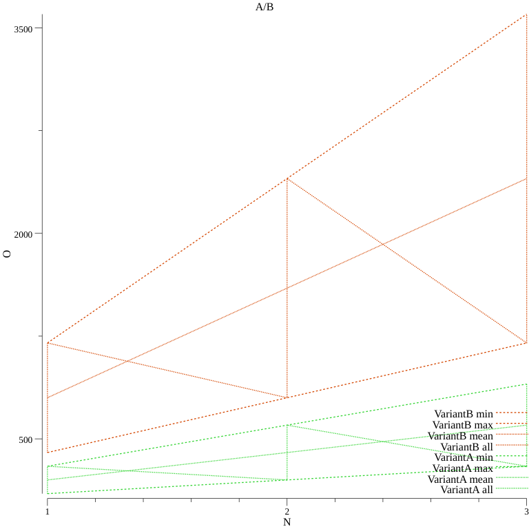
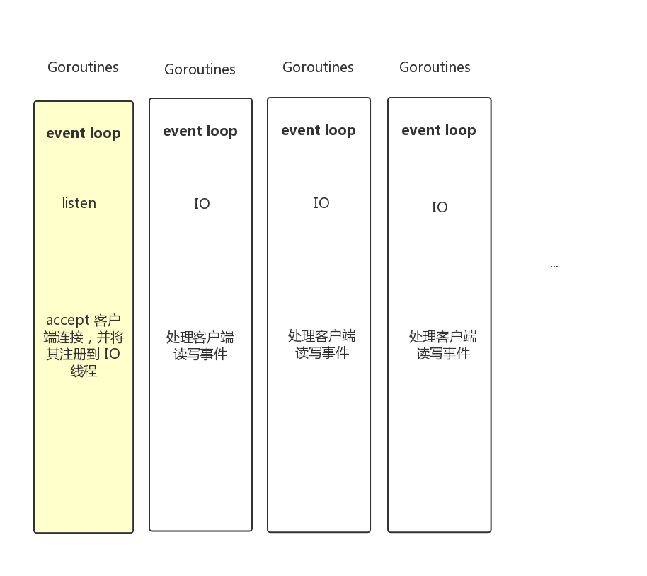

# Go语言爱好者周刊：第 10 期

这里记录每周值得分享的 Go 语言相关内容，周日发布。

本周刊开源（GitHub：[polaris1119/golangweekly](https://github.com/polaris1119/golangweekly)），欢迎投稿，推荐或自荐文章/软件/资源等，请[提交 issue](https://github.com/polaris1119/golangweekly/issues) 。

鉴于大部分人可能没法坚持把英文文章看完，因此，周刊中会尽可能推荐优质的中文文章。优秀的英文文章，我们的 GCTT 组织会进行翻译。


## 刊首语

对技术人员的一些建议（来自前辈的一些经验）：

- 多和他人学习经验，搞技术的比较封闭，多出去走走。线上&线下
- 有人的地方就有江湖，建立好规则、良性发展
- 圈子内统一战线、一起合作共赢
- 一个模式成功，不要想着创新。先复制这个方式
- 没事别创业

## 资讯

1、[Go 1.13.1 和 Go 1.12.10 发布，安全更新](https://github.com/golang/go/commits/release-branch.go1.13-security)

Go Team 发布了 Go 1.13.1 和 Go 1.12.10，以解决最近报告的安全问题。我们建议所有受影响的用户更新到以下版本之一（如果不确定哪个版本，请选择 Go 1.13.1）。

net/http (通过 net/textproto)接受无效的 HTTP/1.1 报头并将其标准化，在冒号前会出现空格，产生 RFC 7230 错误。

如果一个 Go 服务器在一个不常见的反向代理后面使用，该代理接受并转发这些无效的报头，却不对这些无效报头进行规范化，反向代理和服务器就会互不相同地解释这些报头。这可能导致过滤旁路或请求漏洞（ request smuggling），如果来自不同客户端的请求被代理多路复用到相同的上游连接上，则导致请求漏洞。这些无效的报头现在被 Go 服务器拒绝，并且在没有规范化的情况下传递给 Go 客户端应用程序。

2、[Prometheus 2.13.0-rc.0 发布](https://www.oschina.net/news/110194/prometheus-2-13-rc0-released)

Prometheus 是一个 Go 语言开发的开源的服务监控系统和时间序列数据库。该版本引入了一些新特性，比如记录其他组件、增强功能和修复 bug，这些都是为了提高可用性。

3、[gmanager v0.1.3 发布，基于 gf 的管理平台](https://www.oschina.net/news/110190/gmanager-0-1-3-released)

gmanager是基于 gf 框架的管理平台，具备登录、认证、组织机构、用户、角色、菜单和日志管理。

4、[Ants 2.0 发布，高性能的 Goroutine 协程池](https://github.com/panjf2000/ants)

`ants`是一个高性能的协程池，实现了对大规模 goroutine 的调度管理、goroutine 复用，允许使用者在开发并发程序的时候限制协程数量，复用资源，达到更高效执行任务的效果。

5、[Caddy 2.0 Beta 2 发布](https://github.com/caddyserver/caddy/releases/tag/v2.0.0-beta2)

具有自动 HTTPS 的快速、跨平台 HTTP/2 Web 服务器。

6、[Go team 新 Proposal：通过 inline 实现低损耗的 defer](https://github.com/golang/proposal/blob/master/design/34481-opencoded-defers.md)

defer 的性能问题大家讨论的也不少，Go team 真是对性能的任何优化都不放过。

7、[Go 语言事件驱动架构开发框架 watermill 发布 1.0.0 版本](https://github.com/ThreeDotsLabs/watermill/releases/tag/v1.0.0)

Watermill 是一个 Go 库，用于有效处理消息流。它旨在用于构建事件驱动的应用程序，启用事件源，消息上的 RPC，sagas 以及您想到的其他任何东西。您可以使用传统的 pub/sub 实现，例如 Kafka 或 RabbitMQ，也可以使用 HTTP 或MySQL binlog（如果适合您的用例）。

## 问答

1、[golang 结构体中申明变量的方式不理解](https://segmentfault.com/q/1010000020513803)

`<-` 在类型定义中时是什么意思呢？

2、[优秀 golang 编码规范有哪些？](https://www.zhihu.com/question/347872912/answer/837345346)

比如：定义的接口是分别在多个文件（.go文件） 还是统一在一个文件中；struct 是分布在多个文件 还是 一个文件；同步场景 是优先使用锁机制 还是channel

3、[golang channel 怎么判断是否读取完成？](https://segmentfault.com/q/1010000012553798)

你又遇到需要这样处理的场景吗？

4、[select中default的疑惑](https://studygolang.com/topics/10139)

提问者对 timer、select 之类的理解不够。

5、[Gin框架如何解析json中的时间](https://studygolang.com/topics/9960)

用Gin框架遇到的问题，如果前端用json传了"seven_expiry": "2020-05-08"而后端SevenExpiry的类型是time.Time的话,怎么去获取这个值呢？我试了直接ShouldBindJSON这个方法报错parsing time ""2020-05-08"" as ""2006-01-02T15:04:05Z07:00"": cannot parse """ as "T”

6、[为什么用指针取得的值是一样的呢？](https://studygolang.com/topics/10117)

新手常见问题。

3.同步场景 是优先使用锁机制 还是channel

## 文章

1、[Go对接ElasticSearch如此顺畅：只因做到了这一点](https://mp.weixin.qq.com/s/ze7Ws567SgaFQ7OVDyyWEg)

面对并发问题，是用channel解决，还是用Mutex解决？

2、[Go RESTful 服务挂了怎么能第一时间知晓？分享一个超实用的健康检查方法](https://mp.weixin.qq.com/s/tpWAYN18cSW9lRXGumsEbw)

想象一下，您最近发布并部署了一段很酷的 `RESTful` 微服务，您已经使用了一段时间。您松了一口气却听到 Ops 团队说您的服务不稳定。您真的很确定服务应该没问题，可能是它依赖的服务有问题。那该怎么办？

3、[为什么 Go 模块在下游服务抖动恢复后，CPU 占用无法恢复](https://mp.weixin.qq.com/s/g-qpdwTj4H4cLwVUnYySfQ)

某团圆节日公司服务到达历史峰值 10w+ QPS，而之前没有预料到营销系统又在峰值期间搞事情，雪上加霜，流量增长到 11w+ QPS，本组服务差点被打挂，什么原因呢？

4、[查看 Go 的代码优化过程](https://mp.weixin.qq.com/s/yK62URAIC0V_o_bybdVo6A)

之前有人在某群里询问 Go 的编译器是怎么识别下面的代码始终为 false，并进行优化的：

```go
package main

func main() {
    var a = 1
    if a != 1 {
        println("oh no")
    }
}
```

5、[这个代码怎么会编译不通过？Goland 新手常见问题解决：GOPATH 和 Go Modules 编译不成功](https://mp.weixin.qq.com/s/knVXs38-qSzO1GPk1QiKLw)

自从 Go1.11 开始，官方开始支持依赖管理，这就是 Go Modules。如果你对 Go Modules 还不熟悉，请一定要掌握。

6、[Golang并发：再也不愁选channel还是选锁](https://segmentfault.com/a/1190000017890174)

面对并发问题，是用channel解决，还是用Mutex解决？

7、[干货满满的 Go Modules 和 goproxy.cn](https://mp.weixin.qq.com/s/AsdCDodxZFxs2SkhSwOvpg)

由盛傲飞分享，煎鱼整理的完整、全面的 Go module 指南，推荐阅读。B 站的视频：https://www.bilibili.com/video/av69111199


8、[一文理清 Go 引用的常见疑惑](https://mp.weixin.qq.com/s/o-iE3ny3-GOIhcWsUbVgVA)

要彻底搞懂引用，得从类型和传递两个角度分别进行思考。

9、[Go 业务基础库之 Error](https://mp.weixin.qq.com/s/PLzA22yfSV_byckTTezl5Q)

在 2019 年 4 月 27 日举办的 Gopher China 2019 中，国内 Go 语言专家，Bilibili 架构师毛剑进行了题为《 Go 业务基础库之 Error & Context 》的演讲。

10、[Prometheus架构与实践分享](https://mp.weixin.qq.com/s/beusaP2f3mOMIlEETBhtjg)

Prometheus已经被广泛应用于数据中心监控，尤其是和Kubernetes结合的容器监控。本文主要从架构分析到落地实践，详细介绍Prometheus原理和使用。对比Prometheus与其他监控工具（Zabbix、Open-Falcon）的特点与使用场景。然后介绍Prometheus与Kubernetes集成，主要从监控和自动伸缩两个方面。最后通过企业案例，分享实践经验和注意事项。

11、[go 学习笔记之仅仅需要一个示例就能讲清楚什么闭包](https://mp.weixin.qq.com/s/ZIIBvCuDgrsdNbQXBeAR9A)

图文并茂的讲解闭包。


## 开源项目

1、[一个分析算法大O时间复杂度的库](https://github.com/Oppodelldog/bigo)

算法必备。



2、[govvv：go build 包装，为 Go 应用加入版本信息](https://github.com/ahmetb/govvv)

包装 go build 命令的简单 Go 二进制版本控制工具。


3、[gev: 基于 Reactor 模式的轻量级，快速，无阻塞的 TCP 网络库](https://github.com/Allenxuxu/gev)

`gev` 只使用极少的 goroutine, 一个 goroutine 负责监听客户端连接，其他 goroutine （work 协程）负责处理已连接客户端的读写事件，work 协程数量可以配置，默认与运行主机 CPU 数量相同。



4、[shardmap: 一个简单、高性能的线程安全的分片 hashmap](https://github.com/tidwall/shardmap)

这是标准 Go map 和 sync.Map 的替代方法，并且针对您的 map 需要执行大量并发读写操作进行了优化。

5、[beagle: 在互联网上查找特定用户名的命令行工具](https://github.com/danielkvist/beagle)

Beagle是用 Go 语言编写的 CLI，可在Internet上搜索特定的用户名。

6、[v8go: 在 Go 中执行 JavaScript](https://github.com/rogchap/v8go)

示例：

```go
ctx, _ := v8go.NewContext(nil) // creates a new V8 context with a new Isolate aka VM
ctx.RunScript("const add = (a, b) => a + b", "math.js") // executes a script on the global context
ctx.RunScript("const result = add(3, 4)", "main.js") // any functions previously added to the context can be called
val, _ := ctx.RunScript("result", "value.js") // return a value in JavaScript back to Go
fmt.Printf("addition result: %s", val)
```

7、[stateless: Go 中创建状态机](https://github.com/qmuntal/stateless)

直接在 Go 代码中创建状态机和基于轻量级状态机的工作流。支持与[`C＃` 中类似项目](https://github.com/dotnet-state-machine/stateless)几乎相同的API。

8、[xurls: 从文本中提取网址](https://github.com/mvdan/xurls)

使用正则表达式从文本中提取网址。

9、[Gizmo: 纽约时报的微服务工具包](https://github.com/nytimes/gizmo)

微服务工具包。

10、[dt: Go 缺少的 DateTime 包](https://github.com/ribice/dt)

Go 的标准库包含一个日期包- time。它提供的类型 `time` 包含日期，时间和位置信息。

11、[websocket: 一个小巧、Go 习语的 WebSocket 库](https://github.com/nhooyr/websocket)

文档中有几个 websocket 库的对比。

## 资源&&工具

1、[Gin v1.4 中文文档](https://rsy.me/gin-chn-document/)（感觉翻译质量不是太好，建议对比英文阅读）

Gin 是一款用 Go（Golang）编写的Web框架. 它拥有 Martini-like API 的特性，由于使用了 [httprouter](https://github.com/julienschmidt/httprouter)，速度提高了40倍。如果你需要表现和良好的生产力，你会爱上 Gin。

2、[Gopher 的艺术作品](https://github.com/ashleymcnamara/gophers)

下载并解压缩 gophers.zip，然后在其中找到 PNG 文件。这些文件已准备好打印，我建议使用 [Sticker Mule](https://www.stickermule.com/) 获得高质量，色彩正确的贴纸。

3、[非官方泛型的尝试](https://github.com/vasilevp/aboriginal)

它们看起来像尖括号，但不是。 是的，这只是一个有趣的小项目。

4、[GopherCon UK 2019 – Conference Report](https://blogs.sap.com/2019/09/24/gophercon-uk-2019-conference-report/)

会议上一些主题的介绍。

5、[goflyway: 加密的 HTTP 服务器](https://github.com/coyove/goflyway)

V2 版本是一个基于HTTP构建的本地端口转发器。

## 订阅

这个周刊每周日发布，同步更新在[Go语言中文网](https://studygolang.com/go/weekly)、[微信公众号](https://weixin.sogou.com/weixin?query=Go%E8%AF%AD%E8%A8%80%E4%B8%AD%E6%96%87%E7%BD%91) 和 [今日头条](https://www.toutiao.com/c/user/59903081459/#mid=1586087918877709)。

微信搜索"Go语言中文网"或者扫描二维码，即可订阅。


