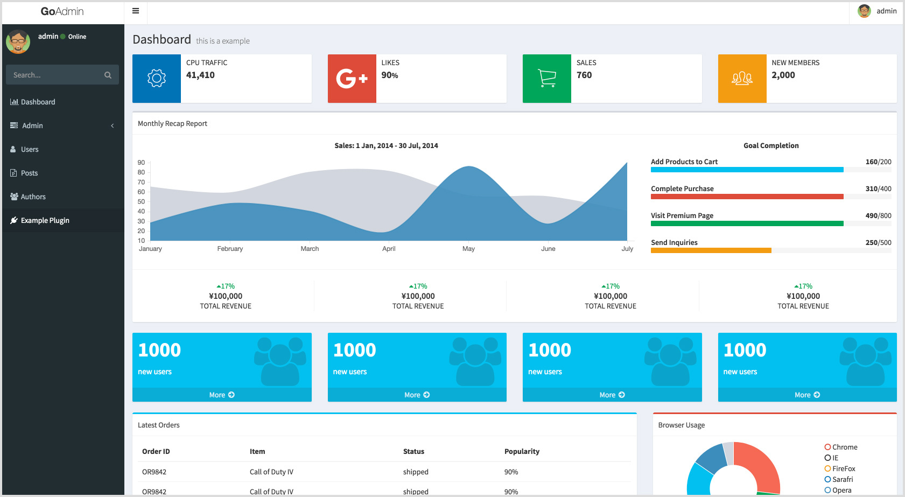
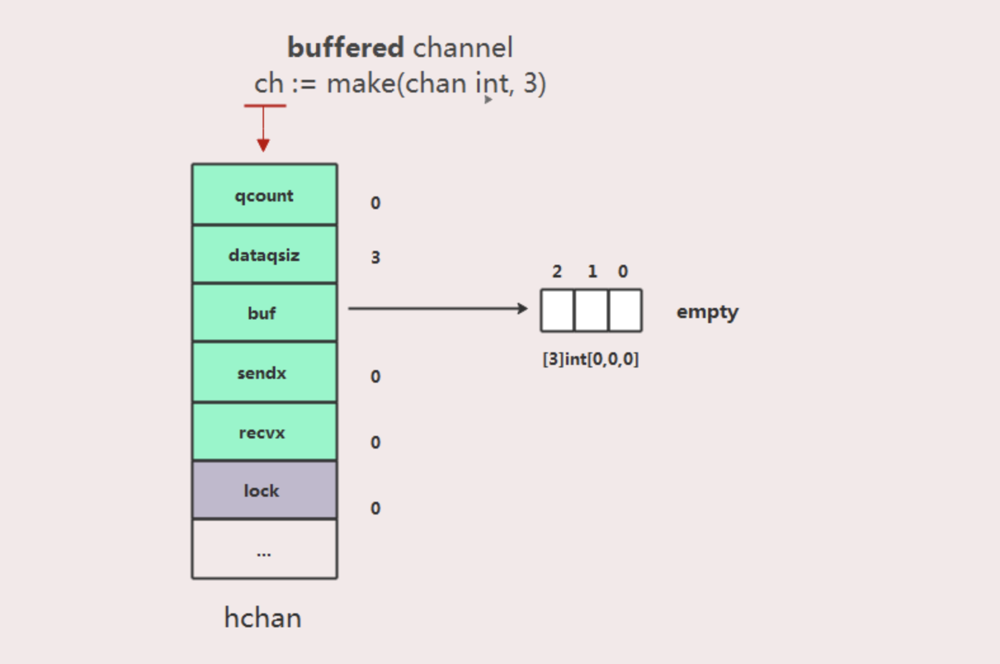
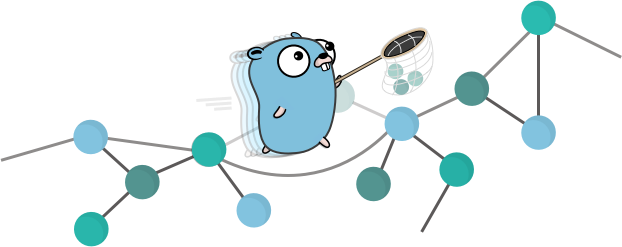

# Go语言爱好者周刊：第 11 期

这里记录每周值得分享的 Go 语言相关内容，周日发布。

本周刊开源（GitHub：[polaris1119/golangweekly](https://github.com/polaris1119/golangweekly)），欢迎投稿，推荐或自荐文章/软件/资源等，请[提交 issue](https://github.com/polaris1119/golangweekly/issues) 。

鉴于大部分人可能没法坚持把英文文章看完，因此，周刊中会尽可能推荐优质的中文文章。优秀的英文文章，我们的 GCTT 组织会进行翻译。


题图：庐山三叠泉

## 刊首语

国庆节快乐！假期马上结束了，大家玩的开心吗？是时候收收心，进入学习状态了。可以从本周刊开始。

国庆期间爬了庐山，感慨风景和书上、听到的差距太多，水少了很多，大部分地方都没有水，景色少了很多迷人之处。感受到生态被破坏了很多很多~

## 资讯

1、[Go 1.14 将带来什么](https://docs.google.com/presentation/d/1HfIwlVTmVWQk94OLKfTGvXpQxyp0U4ywG1u5j2tjiuE/edit#slide=id.g550f852d27_228_0)（英文）

自己科学上文查看。

2、[gotime 讨论：Gophers 安全性](https://changelog.com/gotime/101)

Mat, Filippo, Johan, 和 Roberto 讨论了Go中的安全性。Go能让您轻松保护代码吗？Gophers 犯了哪些常见错误？fuzzing 是什么？如果您使用默认的 HTTP 多路复用器，攻击者将如何滥用您的代码？

3、[Elasticsearch 7.4.0 发布，分布式搜索和数据分析引擎](https://www.oschina.net/news/110323/elasticsearch-7-4-0-released)

Elasticsearch 是一个分布式的 RESTful 风格的搜索和数据分析引擎。此版本更新内容较多。

4、[Kong 2.0 Alpha 发布，支持 Go、数据与控制平面分离](https://www.oschina.net/news/110306/kong-2-0-alpha-released)

此版本包含 Golang 语言的 PDK 插件，除此之外，Kong 还表示将继续支持其它社区流行的语言进行开发。

5、[基于 Golang 的后台管理框架 GoAdmin 将于 10 月 8 号发布 1.0 正式版](https://www.oschina.net/news/110298/goadmin-to-release-1-0-at-1008)

目前越来越流行的golang语言编写的后台管理框架，能让你在十分钟内搭建起一个crud完善的后台管理系统。目前开发人员正在紧锣密鼓的开发中，1.0正式版将于国庆后第一天发布。



## 问答

1、[如何在golang http服务端程序中读取2次Request Body？](https://www.zhihu.com/question/329045911/answer/714781838)

有时候会有这样的需求吗？

2、[Golang 发展到现在是否有类似 Python 那样数据分析和爬虫包呢？](https://www.zhihu.com/question/316207016)

其实有挺多的这样的库的。

3、[关于go框架gin的静态托管和api同时使用报错的问题](https://segmentfault.com/q/1010000020593317)

gin 框架，我想使用 /，在打开网站的时候返回静态首页，使用其他比如/hello的时候返回接口，我是新鸟啊，开发的时候遇到了问题，求解大家，谢谢！

4、[go mod怎么引用同一个项目下面的子目录](https://segmentfault.com/q/1010000020590559)

怎么在 go 的子路径下面引用子包下面的函数？

5、[Go函数传参 []int 与 [3]int 有何区别？](https://segmentfault.com/q/1010000020543158)

这个挺基础，但也重要。

6、[go mod 机制到底如何运作的](https://segmentfault.com/q/1010000020519654)

知其然并知其所以然，这样遇到问题才能更好的解决。

7、[gorm查询结构体不确定，如何动态传递结构体？](https://segmentfault.com/q/1010000020532050)

有一个需求，用户配置查询sql，查询结果入库表名,根据这个需求我创建了入库表结构体，查询func、但是golang的方法参数必须指定类型，入库表类型我是不能确定的。这种需求大家怎么处理的？

## 文章

1、[一个让业务开发效率提高10倍的golang库](https://mp.weixin.qq.com/s/Y-2625zqBe9eQKyxIUnkjw)

这篇文章推荐一个库，https://github.com/jianfengye/collection。这个库是我在开发业务过程频繁使用 Slice 结构，就产生了要做一个 Collection 包的想法。本文说说我开发这个库的前因后果。

2、[Go微服务全链路跟踪详解](https://mp.weixin.qq.com/s/AOE9K6JVKdI7cYIJpGgmNA)

在微服务架构中，调用链是漫长而复杂的，要了解其中的每个环节及其性能，你需要全链路跟踪。

3、[细说Golang的JSON解析](https://mp.weixin.qq.com/s/nNgtLtiaA48nAz2CcEhy7w)

之前一直写一些动态语言，觉得解析JOSN还是很简单的，往往只需要几行代码就能拿到解析好的JSON对象。Go语言自带的json包可以让你在程序中方便的读取和写入 JSON 数据。生成JSON场景相对简单一些，`json.Marshal()`会根据传入的结构体生成JSON数据。

4、[你可能从来没有注意到的特性：Go 语言中的快速检查（quickcheck）测试](https://mp.weixin.qq.com/s/_-Gvv43U8ufSKL3ZeV68Vg)

我们只能看到我们了解的东西。

5、[Go中没有枚举类型：通过这种方式可以模拟](https://mp.weixin.qq.com/s/Xk538LUbWjhuqEu1dASB7g)

在这篇博文中我们看到使用 `go generate` 和遍历抽象语法树来生成强大的枚举类型。

6、[go平滑重启调研选型和项目实践](https://studygolang.com/articles/23728)

当线上代码需要更新时，我们平时一般的做法需要先关闭服务然后再重启服务。本文主要结合linux和Golang中相关实现来介绍如何选型与实践过程。

7、[Golang实现请求限流的几种办法](https://blog.csdn.net/micl200110041/article/details/82013032)

- 简单的并发控制
- 使用计数器实现请求限流
- 使用golang官方包实现httpserver频率限制
- 使用Token Bucket（令牌桶算法）实现请求限流

8、[通过Goalng内存逃逸分析讨论GC的压力](https://studygolang.com/articles/23711)

逃逸分析在编译阶段完成，逃逸分析目的是决定内分配地址是栈还是堆，通过了解了逃逸分析后，我们可以了解内存究竟是在heap上分配还是在stack上分配，从而更有效的利用heap内存，从而减轻GC压力。

9、[gRPC + Zipkin 分布式链路追踪](https://mp.weixin.qq.com/s/iQYhdMz_nUV7ODZF7oorRQ)

本文将通过 gRPC + Opentracing + Zipkin 搭建一个**分布式链路追踪系统**来实现查看整个系统的链路、性能等指标。

10、[go 学习笔记之10 分钟简要理解 go 语言闭包技术](https://mp.weixin.qq.com/s/GJnvPgW7IONK9LVw-i34hQ)

闭包是主流编程语言中的一种通用技术,常常和函数式编程进行强强联合,本文主要是介绍 Go 语言中什么是闭包以及怎么理解闭包。

11、[go ctx超时导致资源释放失败](https://segmentfault.com/a/1190000020549820)

避免使用上下文通用的ctx来释放资源。

12、[Go channel 实现原理分析](https://www.jianshu.com/p/d841f251d3bc)

channel一个类型管道，通过它可以在goroutine之间发送和接收消息。它是Golang在语言层面提供的goroutine间的通信方式。Go依赖于成为CSP的并发模型，通过Channel实现这种同步模式。Golang并发的核心哲学是不要通过共享内存进行通信。



13、[go+realize实现热更新](https://studygolang.com/articles/23756)

习惯了webpack多年，Golang Web开发环境中怎么能少了热更新功能呢，于是搜索发现一款还不错的工具，在我的windows机器上安装，过程中发现了三个坑，还好最终都解决了。

## 开源项目

1、[ent: Facebook开源的实体(entity)框架](https://github.com/facebookincubator/ent)

简单而强大的 ORM，用于建模和查询数据。



2、[sprig: 有用的 Go 模板函数](https://github.com/Masterminds/sprig)

Go 语言带有内置的模板语言，但是模板函数不是很多。Sprig 是一个提供100多种常用模板函数的库。它受到 Twig 和各种 JavaScript库（例如 underscore.js）中的模板函数的启发。

3、[dnscrypt-proxy: 灵活的 DNS 代理，支持加密的 DNS 协议](https://github.com/DNSCrypt/dnscrypt-proxy)

支持 DNSCrypt v2 和 HTTP-over-HTTPS。

4、[go-fuzz: Go 的随机测试](https://github.com/dvyukov/go-fuzz)

Go-fuzz 是一种覆盖率指导的模糊测试解决方案，用于测试 Go 软件包。模糊测试主要适用于解析复杂输入（文本和二进制）的程序包，对于强化对可能来自潜在恶意用户（例如，网络上接受的任何内容）的输入进行解析的系统的加固特别有用。

5、[packr: 将静态文件嵌入 Go 二进制文件的简便方法](https://github.com/gobuffalo/packr)

Packr 是在 Go 二进制文件中捆绑静态资源的简单解决方案。最重要的是，它以对开发人员友好的方式进行开发。

6、[env: 简单的 lib 可以将环境变量解析为结构体](https://github.com/caarlos0/env)

```go
type config struct {
	Home         string        `env:"HOME"`
	Port         int           `env:"PORT" envDefault:"3000"`
	IsProduction bool          `env:"PRODUCTION"`
	Hosts        []string      `env:"HOSTS" envSeparator:":"`
	Duration     time.Duration `env:"DURATION"`
	TempFolder   string        `env:"TEMP_FOLDER" envDefault:"${HOME}/tmp" envExpand:"true"`
}

func main() {
	cfg := config{}
	if err := env.Parse(&cfg); err != nil {
		fmt.Printf("%+v\n", err)
	}

	fmt.Printf("%+v\n", cfg)
}
```

7、[gontroller: 用于创建 k8s controller 的 Go 库(无需依赖 k8s 资源)](https://github.com/spotahome/gontroller)

Go 库用于创建 [feedback loop/control controllers](https://en.wikipedia.org/wiki/Control_theory)，或者换句话说，Go 库用于创建无需依赖Kubernetes资源的控制器。

8、[golicense: 从编译的Go二进制文件中扫描和分析开源依赖关系和许可证](https://github.com/mitchellh/golicense)

golicense 是一种工具，可以扫描已编译的 Go 二进制文件，并可以输出所有依赖项、它们的版本以及各自的许可证（如果知道）。golicense 仅适用于使用 Go 模块进行依赖性管理的 Go 二进制文件。

9、[rain: BitTorrent 客户端库和工具](https://github.com/cenkalti/rain)

在 https://put.io 上投入使用。


10、[go-spring: didi开发人员开源的模仿 Java Spring 的 Go 应用程序开发框架](https://github.com/didi/go-spring)

Go-Spring 实现了两个非常核心的特性：IoC 容器和开箱即用

11、[2019，Go GUI项目爆发的一年？](https://mp.weixin.qq.com/s/iVDNwKeZGCmrT99Tcg6w4g)

整理了一份目前GUI/图形/图像相关的Go项目列表。

12、[bigslice: 用于Go编程语言的无服务器集群计算系统](https://github.com/grailbio/bigslice)

Bigslice是Go的无服务器集群数据处理系统。Bigslice公开了可组合的API，该API使用户可以通过调用用户代码的一系列数据转换来表达数据处理任务。然后，Bigslice运行时使用Bigmachine库透明地并行化和分发工作，并在云提供商上创建一个临时群集。

## 资源&&工具

1、[使用 Go 重振 Linux 编程课程](http://www.ccsc.org/publications/journals/MW2019.pdf#page=61)（英文）

一篇英文论文。

2、[GopherCon UK 2019 视频合集](https://www.bilibili.com/video/av70127356)

英文好的可以看看。

3、[Go 云开发工具包](https://gocloud.dev/)

Go Cloud 开发工具包（Go CDK）是一个开放源代码项目，用于构建库和工具，以改善使用 Go 开发云的体验。

4、[在 Go 上精选的博客文章](https://github.com/enocom/gopher-reading-list)（英文）

这是有关 Go 的博客文章的阅读列表。它希望仅包含与 Go 相关的最有用和最相关的材料。

## 订阅

这个周刊每周日发布，同步更新在[Go语言中文网](https://studygolang.com/go/weekly)、[微信公众号](https://weixin.sogou.com/weixin?query=Go%E8%AF%AD%E8%A8%80%E4%B8%AD%E6%96%87%E7%BD%91) 和 [今日头条](https://www.toutiao.com/c/user/59903081459/#mid=1586087918877709)。

微信搜索"Go语言中文网"或者扫描二维码，即可订阅。


