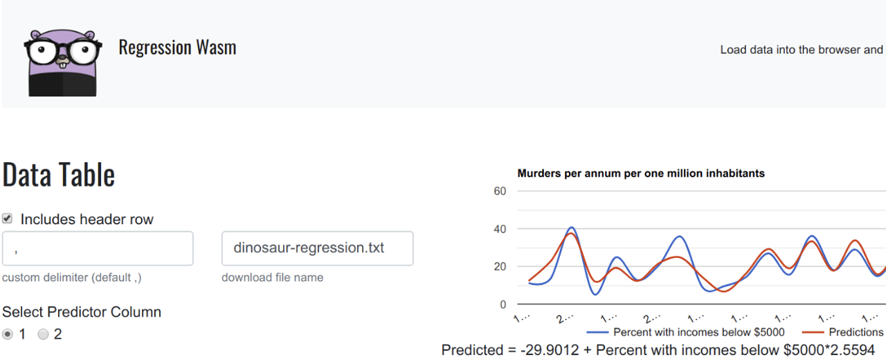
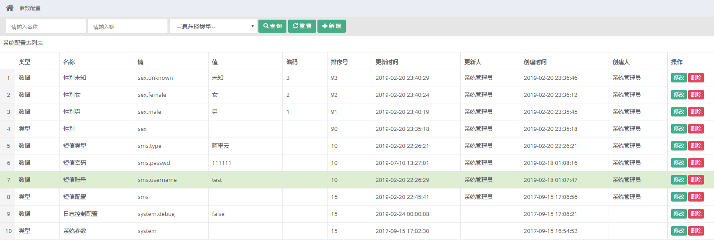

# Go语言爱好者周刊：第 12 期

这里记录每周值得分享的 Go 语言相关内容，周日发布。

本周刊开源（GitHub：[polaris1119/golangweekly](https://github.com/polaris1119/golangweekly)），欢迎投稿，推荐或自荐文章/软件/资源等，请[提交 issue](https://github.com/polaris1119/golangweekly/issues) 。

鉴于大部分人可能没法坚持把英文文章看完，因此，周刊中会尽可能推荐优质的中文文章。优秀的英文文章，我们的 GCTT 组织会进行翻译。

题图：来源 golangweekly.com

## 刊首语

Go有语言公认的一个很好的工具是 gofmt，它让不同人的代码写出来风格差不多，这也极大的减少了团队对代码风格的要求。

最近 Uber 公开的一份 [Go 语言编程规范](https://github.com/uber-go/guide)，受到极大的欢迎。2、3天时间，star 数 2.4k+，今天（2019-10-13日），Tony Bai 和 legendtkl（陶大）同时发布了翻译版本（见下文），推荐大家学习，根据情况用在自己的日常编码和团队规范中。

## 资讯

1、[gcs v0.1.1 加入接口缓存，Go 配置管理平台](https://www.oschina.net/news/110487/gcs-0-1-1-released)

gcs(go config server) 配置管理平台,此项目基于 gf 框架开发，支持项目管理、配置管理、配置发布、项目对比、配置复制，接口获取配置等。

2、[Traefik 2.0.2 发布，HTTP 反向代理与负载均衡工具](https://www.oschina.net/news/110473/traefik-2-0-2-released)

Træfɪk 是一个新型的 HTTP 反向代理、负载均衡软件，能轻易的部署微服务，它支持多种后端 (Docker, Swarm, Mesos/Marathon, Consul, Etcd, Zookeeper, BoltDB, Rest API, file...) ，可以对配置进行自动化、动态的管理。

3、[gout v0.0.1 发布，golang 流式 http client](https://www.oschina.net/news/110460/gout-0-0-1-released)

gout 是 go 写的 http 客户端，为提高工作效率而开发。

4、[Rancher 2.3 发布，支持 Windows 容器，集成 Istio](https://mp.weixin.qq.com/s/4kEcDIi1uFdlgnnnRp_wbA)

据说这是Rancher Labs迄今为止最重要的版本更新。Rancher 2.3是业界首个GA支持Windows容器的Kubernetes管理平台，并正式集成了Istio，还引入了创新的“集群模板”功能以增强企业集群的安全性。

5、[Grafana 6.4.2 发布，系统指标监控与分析平台](https://www.oschina.net/news/110440/grafana-6-4-2-released)

Grafana 是一个功能丰富的指标标准仪表板和图形编辑器，用于分析和监控 Graphite、Elasticsearch、OpenTSDB、Prometheus 和 InfluxDB。

6、[Excelize 发布 2.0.2 版本，Go 语言 Excel 基础库](https://studygolang.com/topics/10207)

Excelize 是 Go 语言编写的一个用来操作 Office Excel 文档类库，基于 ECMA-376 OOXML Spec。可以使用它来读取、写入 XLSX 文件，相比较其他的开源类库，Excelize 支持操作带有数据透视表、切片器、图表与图片的 Excel 并支持向 Excel 中插入图片与创建简单图表，可应用于各种报表系统中。Excelize 作为 [2018 开源中国 Gitee 最有价值开源项目 GVP](https://gitee.com/xurime/excelize)，现已成为 Go 语言最受欢迎的 Excel 文档基础库。

7、[TiDB 3.0.4  发布，分布式 NewSQL 数据库](https://www.oschina.net/news/110416/tidb-3-0-4-released)

TiDB 是国内 PingCAP 团队开发的一个分布式 SQL 数据库。其灵感来自于 Google 的 F1 和 Google spanner, TiDB 支持包括传统 RDBMS 和 NoSQL 的特性。

8、[Harbor 1.9 发布，新增多项企业级功能](https://www.oschina.net/news/110413/harbor-1-9-released)

Harbor 是为企业用户设计的 Registry server 开源项目，包括了权限管理(RBAC)、LDAP、审计、安全漏洞扫描、镜像验真、管理界面、自我注册、HA 等企业必需的功能，同时针对中国用户的特点，设计镜像复制和中文支持等功能。

9、[MongoDB Go 官方驱动 1.1.2 版本发布](https://www.mongodb.com/blog/post/mongodb-go-driver-version-112-now-available)

这是小版本更新。

10、[GoLand 2019.2.3 发布](https://blog.jetbrains.com/go/2019/10/07/goland-2019-2-3-is-out/)

主要是 bug 修复。

## 问答

1、[对于无缓冲的 channel，用 select 来处理通道超时时间，如果在接收超时后，退出接收，那么该通道的发送会被阻塞吗？](https://studygolang.com/topics/10211)

欢迎讨论。

2、[map 怎么确定 key 是否存在，如果访问了不存在的 key 会出现什么问题？](https://studygolang.com/topics/10221)

这个属于比较基础的问题。

3、[golang time Unmarshal 必须包含时区吗？](https://segmentfault.com/q/1010000020616117)

不包含时区貌似不会成功呢！

4、[如何在Go语言的模板中定义数组变量?](https://segmentfault.com/q/1010000020645071)

模板本身不强大，但可以通过 Go 代码中进行扩展。

5、[golang中方法定义取舍](https://segmentfault.com/q/1010000020592340)

golang中这两种方法的如何取舍选择，之间有什么区别？比如：`func test(&post) error{}` 和 `func test() (post Post, err error){}`。

6、[goland 无法解析 go.mod里的包](https://segmentfault.com/q/1010000020603338)

这个问题新手挺常见的吧，可能将来默认都使用 module，可能就不会有这样的问题了。

## 文章

1、[通过测试学习 Go 语言](https://mp.weixin.qq.com/s/MGT_yoP_NdWVGpwlAJFK4A)

从今天起，Go语言中文网公众号为大家带来一个系列：通过测试学习 Go 语言，希望对新手学习有帮助！

2、[只因掌握它，便轻松使用Go构建微服务](https://mp.weixin.qq.com/s/N432TLcsVbxNh5MoNvMVOw)

本教程提供了 Go 使用 gRPC 的基础教程

3、[Uber Go 语言编程规范](https://mp.weixin.qq.com/s/2BMGGt31pvnPM363GZw6aA)

Uber 出品，值得团队借鉴学习。除了  legendtkl 大神翻译外，Tony Bai 也进行了翻译，都在同一天发布。[Uber Go语言编码规范](https://mp.weixin.qq.com/s/LYLLghOjevBDieAM_LKrjA)。原文：https://github.com/uber-go/guide/blob/master/style.md 。

4、[通过实例快速掌握k8s（Kubernetes）核心概念](https://mp.weixin.qq.com/s/P5j8Dx3-d7rfNMZg4sQUyw)

容器技术是微服务技术的核心技术之一，并随着微服务的流行而迅速成为主流。Docker 是容器技术的先驱和奠基者，它出现之后迅速占领市场，几乎成了容器的代名词。但它在开始的时候并没有很好地解决容器的集群问题。

5、[Go中某些语句中的表达式之间的相对估值顺序未定义](https://mp.weixin.qq.com/s/21rkZgBvOVHsAcXPS4XV_Q)

Go语言中有很多独特的设计，也有很多从其它语言借鉴过来的设计。总体上看，Go和C语言的血缘最近。事实上，我们可以将Go语言称为C+语言。相对于C语言，Go语言的一大特点是尽可能地减少了未定义行为。

6、[掌握本文，Go语言新手也可以写出高质量代码：Go测试高级窍门和技巧](https://mp.weixin.qq.com/s/cWbx9bv_kntZr0lHEu9hjQ)

测试的的技巧值得掌握。

7、[如何使用 Golang 处理 MySQL 的 binlog？](https://mp.weixin.qq.com/s/pV7NPbsWyVscT2EDyACrvQ)

也许你什么时候需要用到。

8、[Go高级编程：指针和内存分配详解](https://mp.weixin.qq.com/s/46T6hO9Ht4fN5jD8kXuCSQ)

简化版的指针。

9、[Go有GC就不需要掌握内存堆栈知识了吗？Go 堆栈的理解](https://mp.weixin.qq.com/s/SGbiWLW6pLfd32TKIil10A)

什么是堆栈？在计算机中堆栈的概念分为：数据结构的堆栈和内存分配中堆栈。

10、[Go GC 卡顿由秒级降到毫秒级以下：到底做了哪些优化？](https://mp.weixin.qq.com/s/2BMGGt31pvnPM363GZw6aA)

Go GC 的优化还是很明显的。

11、[800 字彻底理解 Go 指针](https://mp.weixin.qq.com/s/m9EXQa5lgQ8T3tXzB84n9g)

这篇文章是为不熟悉 Go 的指针或指针类型的程序员而准备的。Dave Cheney 大神出品。「Golang来啦」公众号的 Seekload 翻译。

12、[小米 Go 开发实践——用 Go 构建高性能数据库中间件](https://mp.weixin.qq.com/s/gzjFt9zi4trMzFi92WqF-A)

GopherChina 2019 上的演讲整理。

13、[Go 1.13中 sync.Pool 是如何优化的?](https://colobu.com/2019/10/08/how-is-sync-Pool-improved-in-Go-1-13/)

如何改进的？做了哪些改进？

14、[etcd 性能测试与调优](https://www.jianshu.com/p/f31ef5e7bdd0)

etcd 是一个分布式一致性键值存储。其主要功能有服务注册与发现、消息发布与订阅、负载均衡、分布式通知与协调、分布式锁、分布式队列、集群监控与leader 选举等。

## 开源项目

1、[scc: 非常快速准确的代码计数器](https://github.com/boyter/scc)

与 cloc，sloccount 和 tokei 类似的工具。用于计数许多编程语言中的物理代码行，空行，注释行和源代码的物理行。

2、[gocryptfs: Go编写的加密overlay文件系统](https://github.com/rfjakob/gocryptfs)

官方网站：https://nuetzlich.net/gocryptfs

3、[guard: kubernetes webhook身份验证服务器](https://github.com/appscode/guard)

支持使用各种身份验证提供程序(比如：github账号等)登录Kubernetes集群。

4、[oauth2_proxy: 反向代理和静态文件服务器](https://github.com/pusher/oauth2_proxy)

支持使用Google，GitHub和其他提供商账号提供身份验证。

5、[imgproxy: 高性能且安全的图片 size 和格式转换服务器](https://github.com/imgproxy/imgproxy)

imgproxy 可用于提供一种快速，安全的方式来替换 Web 应用程序的所有图像大小调整代码（如调用 ImageMagick 或GraphicsMagick 或使用库），同时还能够快速，轻松地实时调整所有内容的大小。在处理大量图像大小调整时，尤其是当图像来自远程来源时，imgproxy 也是必不可少的。

6、[wasmer: 用于执行WebAssembly二进制文件的Go语言库](https://github.com/wasmerio/go-ext-wasm)

WebAssembly 似乎很火，但实际应用有多少？

7、[docx2md: Go实现的微软word格式转换为markdown格式的工具](https://github.com/mattn/docx2md)

这真是个好工具。

8、[golangci-lint: 一个 linter 聚合器](https://github.com/golangci/golangci-lint)

号称速度很快！

9、[devdash: 面向开发人员的高度可配置的终端仪表板](https://github.com/Phantas0s/devdash)

DevDas是一个高度可配置的终端仪表板，适用于希望在一个地方选择并显示所需的最新指标的开发人员。

## 资源&&工具

1、[微软出品的 Kubernetes 学习路径](https://azure.microsoft.com/mediahandler/files/resourcefiles/kubernetes-learning-path/Kubernetes%20Learning%20Path%20version%201.0.pdf)（英文）

PDF，可以下载到本地阅读。

2、[软件设计和架构学习路线图](https://www.freecodecamp.org/news/software-design/)（英文）

好资源大整理。

3、[go time 讨论应用程序设计](https://changelog.com/gotime/102)（英文）

Mat 与 Peter Bourgon，KatZień 和 Ben Johnson 一起参加了 Go 的应用程序设计讨论。

4、[GitHub中文排行榜，帮助你发现高分优秀中文项目、更高效地吸收国人的优秀经验成果](https://github.com/kon9chunkit/GitHub-Chinese-Top-Charts)

榜单每周更新一次！

5、[面试编码资源](https://github.com/hoanhan101/algo)（英文）

每周4-6次编码面试问题，包括详细的解决方案，测试用例和程序分析。

## 订阅

这个周刊每周日发布，同步更新在[Go语言中文网](https://studygolang.com/go/weekly)、[微信公众号](https://weixin.sogou.com/weixin?query=Go%E8%AF%AD%E8%A8%80%E4%B8%AD%E6%96%87%E7%BD%91) 和 [今日头条](https://www.toutiao.com/c/user/59903081459/#mid=1586087918877709)。

微信搜索"Go语言中文网"或者扫描二维码，即可订阅。

