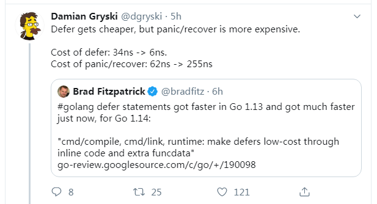
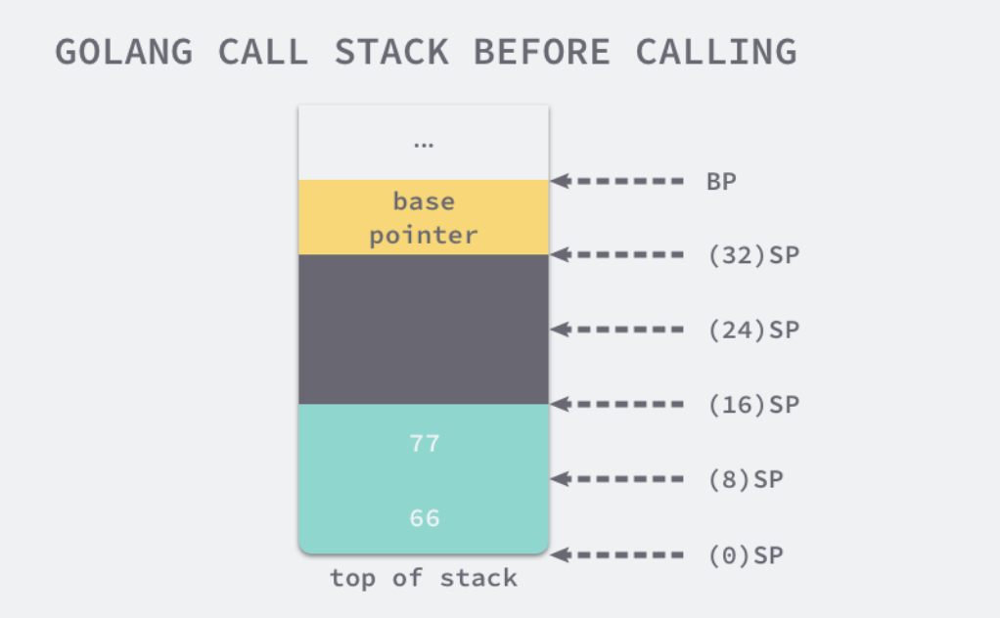
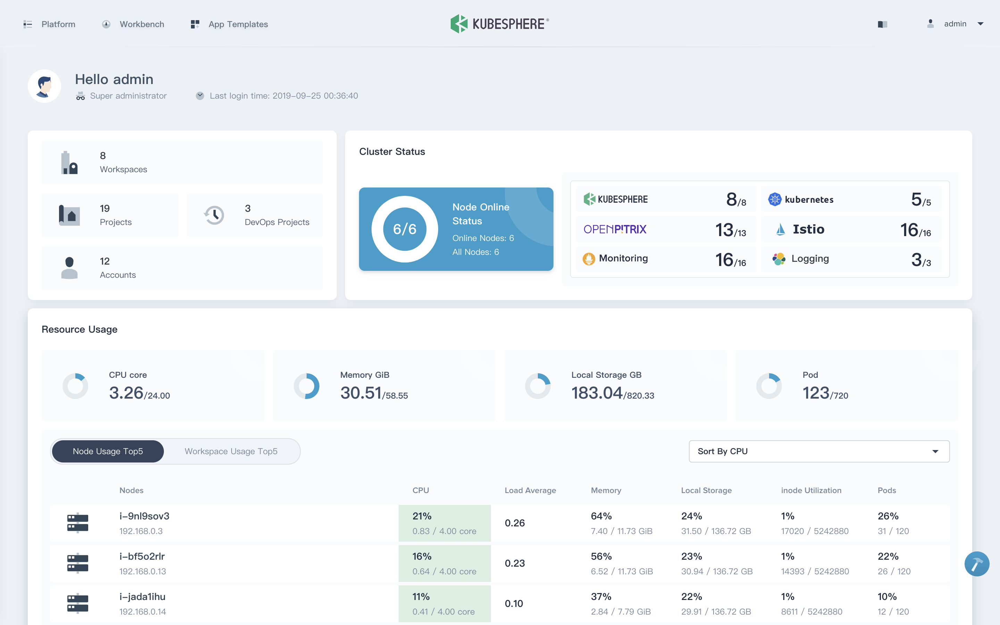
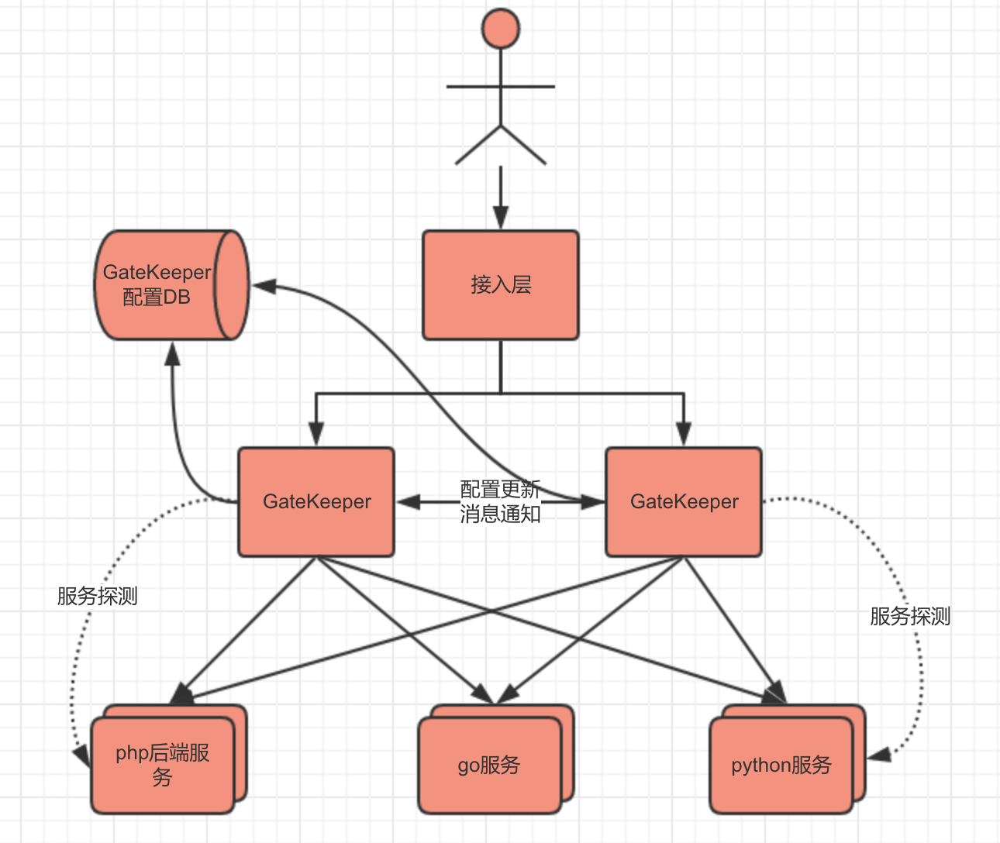

# Go语言爱好者周刊：第 13 期

这里记录每周值得分享的 Go 语言相关内容，周日发布。

本周刊开源（GitHub：[polaris1119/golangweekly](https://github.com/polaris1119/golangweekly)），欢迎投稿，推荐或自荐文章/软件/资源等，请[提交 issue](https://github.com/polaris1119/golangweekly/issues) 。

鉴于大部分人可能没法坚持把英文文章看完，因此，周刊中会尽可能推荐优质的中文文章。优秀的英文文章，我们的 GCTT 组织会进行翻译。

题图：来自 golangweekly.com

## 刊首语

### 字节跳动张一鸣谈「新员工系统上线」

我们鼓励新员工在入职第一周进行代码发布上线，很多公司要经过培训，并且经过考核，在老员工的指导下才能把他的代码放到线上去，可能要一个季度过去了。我们是鼓励放上去的，放上去出错也没有关系，我们只需要出错能够快速回稳，比如出错能快速检查出来，线上有快速的基本的验证工具说他的代码不合格，那么回或者他放上去了，确实通过检测也出现意外，比如100次有1次，确实造成了服务器宕机了，但没关系，我们希望1秒钟之内把服务切回来，我们允许出错，只要错误是能被快速修复的，所以这样我们就可以大胆使用年轻人，大胆让他实践和让他实现他的产品想法，就是他有产品想法不是特别有把握不算很靠谱也可以。

传统的单位可能要写可行性验证报告，然后开研究会讨论。而我们是70%靠谱就上线，上线看结果，先从5%的用户试一下这个功能，反馈不好就下线，所以我们鼓励犯错误。我们每天都有上线，每天线上产品都有迭代，每天都能搜到昨天功能改进效果是上升了还是下降了，上升幅度大不大，要不要做下一步的实验。所以容错也是保持灵活的机制。比如航空公司是不容错的，所以每个飞行员可能得非常复杂培训，非常缓慢的上岗流程，但是在我们这种公司不是的，一个非常优秀的毕业生或者毕业一两年的人，如果他基础很好，很快他在一两年就能成为公司的骨干。为什么？因为他有最大的锻炼机会。

这样的公司应该是技术人员向往的公司吧！

## 资讯

1、[Go1.13.3 和 Go1.12.12 小版本发布](https://studygolang.com/topics/10268)

北京时间 2019年10月18日凌晨2点49，Go team 宣布发布 Go1.13.2 和 Go1.12.11，4 小时后接着发布了 Go1.13.3 和 Go1.12.12。建议升级到 Go1.13.3。

2、[TinyGo 0.9.0 发布](https://github.com/tinygo-org/tinygo/releases/tag/v0.9.0)

此版本增加了对 [Windows 的实验性支持](https://tinygo.org/getting-started/windows/#windows-native-install-experimental)，更新了对 Go 1.13 的支持，改善了许多主板的刷新体验（不再需要按下按钮），并增加了对缓冲通道的支持。 还有许多其他较小的更改。

3、[Grafana 6.4.3 发布，系统指标监控与分析平台](https://www.oschina.net/news/110652/grafana-6-4-3-released)

Grafana 6.4.3 发布了，Grafana 是一个功能丰富的指标标准仪表板和图形编辑器，用于分析和监控 Graphite、Elasticsearch、OpenTSDB、Prometheus 和 InfluxDB。

4、[Proxy-Go v8.4 发布](https://www.oschina.net/news/110640/proxy-go-8-4-released)

Proxy 是 golang 实现的高性能 http、https、websocket、tcp、udp、socks5 代理服务器，支持正向代理、反向代理、透明代理、内网穿透、TCP/UDP 端口映射、SSH 中转、TLS 加密传输、协议转换、DNS 防污染智能代理、前置 CDN/Nginx 反代、代理连接重定向、API动态调用上级代理、限速限连接数。同时提供全平台的功能强大的命令行版本和友好易用的 web 控制面板版本。

5、[gcsc v0.1.0 发布](https://www.oschina.net/news/110638/gcsc-0-1-0-released)

gcsc(go config server client) 配置管理平台客户端,此项目基于 gf 框架开发，主要针对配置管理平台 [gcs ](https://github.com/goflyfox/gcs)项目的客户端实现。

6、[gcs v0.1.3 完善客户端适配，Go 配置管理平台](https://www.oschina.net/news/110635/gcs-0-1-3-released)

gcs(go config server) 配置管理平台,此项目基于gf框架开发，支持项目管理、配置管理、配置发布、项目对比、配置复制，接口获取配置等

7、[go-fastdfs 1.3.3 发布，优化集群管理](https://www.oschina.net/news/110633/go-fastdfs-1-3-3-released)

go-fastdfs是一个基于http协议的分布式文件系统，它基于大道至简的设计理念，一切从简设计，使得它的运维及扩展变得更加简单，它具有高性能、高可靠、无中心、免维护等优点。

8、[gRPC 1.24.2 发布](https://www.oschina.net/news/110538/grpc-1-24-2-released)

gRPC 是 Google 开源的高性能、通用 RPC 框架，面向移动和 HTTP/2 设计，是由谷歌发布的首款基于 Protocol Buffers 的 RPC 框架。此版本包含细节优化、改进和 bug 修复，详情查看更新说明：https://github.com/grpc/grpc/releases

9、[SeaweedFS 1.44 发布](https://www.oschina.net/news/110537/seaweedfs-1-44-released)

SeaweedFS 是简单，高伸缩性的分布式文件系统，包含两部分：存储数十亿的文件；快速为文件服务。

10、[Go 1.14 中 defer 性能再次提升](https://go-review.googlesource.com/c/go/+/190098)

然而据说 panic/recover 性能变差。按下葫芦浮起瓢？

另外，Go 1.14增加 `-d=checkptr` 选项帮助 Gophe r检查对 `unsaft.Pointer` 的使用是否符合要求：https://go-review.googlesource.com/c/go/+/162237

## 问答

1、[可以用grpc的双向流模式当普通的socket用吗？](https://segmentfault.com/q/1010000020729334)

因为需要双向通讯，用grpc的双向流比普通socket性能差多少？

2、[time.AfterFunc 定时器函数如何避免程序重启造成的中断](https://segmentfault.com/q/1010000020721814)

线上不可避免的会重启进程, 一重启这个定时器就没了, 应该有啥解决办法的吧？

3、[Golang 不确定传参](https://segmentfault.com/q/1010000020706635)

上游传递不确定 的json ,如何透传给下游业务？

4、[结构体中的匿名结构体切片如何初始化呢？](https://studygolang.com/topics/10263)

匿名结构体

5、[go mod 怎么导入本地其它项目的包？](https://segmentfault.com/q/1010000020696591)

在做微服务中使用了 grpc，每个微服务都用了 go mod 模式，因为grpc在创建client时 需要调用在另一个服务里的 pb包。请问怎么导入啊？

6、[如何非侵入式的停止一个 goroutine](https://v2ex.com/t/609469)

我的意思有点类似 kill 它，而不是退出它。

## 文章

1、[为什么要使用 Go module proxy？](https://mp.weixin.qq.com/s/M8at2wbujEfHRAzQUwK4Vw)

Go module proxy 是近几年来 Go 语言最重要的变化之一。为什么会这样呢？是什么让 `Go module` 代理如此特别？

2、[golang核心原理-协程栈](https://juejin.im/post/5da7385ae51d45782a478d2d)

每个协程都需要有自己的栈空间，来存放变量，函数，寄存器等信息。所以系统需要给协程分配足够的栈空间。

3、[官方博文：Go 1.13 中的错误处理——中文版](https://tonybai.com/2019/10/18/errors-handling-in-go-1-13/)

权威出品。

4、[为什么Go的自定义error有时候会内存溢出](https://mp.weixin.qq.com/s/39T_AL0zzz6l9YP4K2QgiA)

来自 go tour 上的一道练习题。

5、[Go 语言反射的实现原理](https://draveness.me/golang/basic/golang-reflect.html)

反射是 Go 语言比较重要的一个特性之一，虽然在大多数的应用和服务中并不常见，但是很多框架都依赖 Go 语言的反射机制实现一些动态的功能。本文帮你熟悉反射实现原理。

6、[如果 map 不是引用变量，那是什么？](https://mp.weixin.qq.com/s/FakSuggYei294iOl_4hP3w)

Dave 大神的文章，Seekload 翻译。

7、[Go 如何解析 json 内部结构不确定的情况](https://mp.weixin.qq.com/s/N6BY98V7aGgJpJMPsGHMlQ)

本文是通过组织曾经梳理过的一篇文章和一个问答而成。主要介绍的是关于 Go 如何解析 json 内部结构不确定的情况。

8、[Golang不到100行实现一套灵活的JWT库](https://studygolang.com/articles/24047)

JWT 全 chen JSON Web Tokens 现在被广泛的应用于各种前后端分离的场景，他比传统的 Token Session 方式，更具灵活性。

9、[12306抢票带来的启示：看我如何用Go实现百万QPS的秒杀系统](https://mp.weixin.qq.com/s/fHct-RlGcjt6v7pVB5qJqg)

笔者专门研究了一下“12306”的服务端架构,学习到了其系统设计上很多亮点，在这里和大家分享一下并模拟一个例子：如何在 100 万人同时抢 1 万张火车票时，系统提供正常、稳定的服务。

10、[通过搭建MySQL掌握k8s（Kubernetes）重要概念](https://mp.weixin.qq.com/s/ISIy3EO5SyZpBN86ATcqCw)

上下两篇。[通过搭建MySQL掌握k8s（Kubernetes）重要概念（上）：网络与持久卷](https://mp.weixin.qq.com/s/ISIy3EO5SyZpBN86ATcqCw) 和 [通过搭建MySQL掌握k8s重要概念（下）：参数配置](https://mp.weixin.qq.com/s/9r-oqjBuTPutxBdxBoZe6g)

## 开源项目

1、[gocache：可扩展的Go缓存库，为您带来了许多用于缓存数据的功能](https://github.com/eko/gocache)

Go + Cache = GoCache，支持 Memcache、Redis 等。

2、[Bigslice：Go 中的无服务器集群计算](https://github.com/grailbio/bigslice)

用于 Go 编程语言的无服务器集群数据处理系统，它公开了可组合的API，该API使用户可以通过一系列调用用户函数的数据转换来表达数据处理任务。

3、[Bigmachine：Go 中用于自我管理无服务器计算的库](https://github.com/grailbio/bigmachine)

Bigmachine 提供了一个API，该驱动程序使驱动程序进程可以形成特定的机器集群，这些机器将用户代码透明地分发到这些机器。

4、[sessionup](https://github.com/swithek/sessionup)

简单但有效的HTTP 会话管理和标识包。

5、[Harmony：用于与 Discord API 进行交互的强大 Go 模块](https://github.com/skwair/harmony)

[Discord](https://discordapp.com) 是一个受欢迎的聊天应用程序，尤其是在游戏社区中。 [DiscordGo](https://github.com/bwmarrin/discordgo) 这是另一个类似的库。

6、[progressbar：适用于 Go 应用程序的非常基本的线程安全进度条](https://github.com/schollz/progressbar)

一个非常简单的线程安全进度条，它可以在每个操作系统上正常工作。 我需要一个用于 [croc](https://github.com/schollz/croc) 的进度条，而我尝试的所有内容都有问题，所以我又做了一个。 为了与操作系统无关，我不打算支持[多行输出](https://github.com/schollz/progressbar/issues/6)。

7、[Vearch: 用于深度学习向量的高效相似性搜索的分布式系统](https://github.com/vearch/vearch)

架构图：

8、[vulcain: 使用 HTTP/2 Server Push创建高性能且客户端驱动的REST API](https://github.com/dunglas/vulcain)

它还提供了一个开源网关服务器，您可以在任何现有的 Web API 上放置它，以立即将其转换为与 Vulcain兼容的服务器！

9、[dapr: 一种可移植的，事件驱动的运行时，用于跨云和边缘构建分布式应用程序](https://github.com/dapr/dapr)

微软开源。

10、[wtf: 终端的个人信息仪表板](https://github.com/wtfutil/wtf)

基于个人终端的仪表板实用程序，旨在显示不经常但非常重要的日常数据。

11、[KubeSphere：易于使用的容器平台](https://github.com/kubesphere/kubesphere)

[KubeSphere](https://kubesphere.io/) 是在 [Kubernetes](https://kubernetes.io/) 之上构建的以**应用为中心的**多租户**容器管理平台**，支持部署和运行在**任何基础设施之上**，提供**简单易用的操作界面**以及**向导式操作**方式，在降低用户使用容器调度平台学习成本的同时，极大减轻开发、测试、运维的日常工作的复杂度，旨在解决 Kubernetes 本身存在的存储、网络、安全和易用性等痛点。帮助企业轻松应对**敏捷开发、自动化运维、应用快速交付、微服务治理、多租户管理、监控日志告警、服务与网络管理、镜像仓库**等业务场景。

12、[gin-admin: 管理脚手架](https://github.com/LyricTian/gin-admin)

基于 Gin + GORM + Casbin + Dig 实现的RBAC权限管理脚手架，目的是提供一套轻量的中后台开发框架，方便、快速的完成业务需求的开发。

13、[gatekeeper: 不依赖分布式数据库的 API 网关](https://github.com/didi/gatekeeper)

滴滴出品。使用它可以高效进行服务代理 以及 在线化服务配置并且你无需重启服务器。

14、[genji: 在键值存储之上构建的嵌入式 SQL 数据库](https://github.com/asdine/genji)

支持Bolt、Badger等。兼容 database/sql 包。

## 资源&&工具

1、[系列教程：通过测试学习Go](http://mp.weixin.qq.com/mp/homepage?__biz=MzAxMTA4Njc0OQ==&hid=14&sn=1c4a95dd75d79f2ec0d0b7399177a7ae&scene=18#wechat_redirect)

Go语言中文网公众号开始连载系列教程：通过测试学习Go（测试驱动开发）。

2、[学术论文：Go 语言大规模单元测试](https://www.academia.edu/40301628/Large_Scale_Unit_Testing_for_Go_Programming_Language_Packages)（英文）

PDF 格式下载。

3、[100 本最佳编程书籍](https://bookauthority.org/books/best-programming-books)（英文）

是不是最佳自己判断哈。

4、[Go.Sed](https://github.com/rwtodd/Go.Sed)

使用 Go 重写实现 sed。

5、[findlock](https://github.com/napsy/findlock)

解析 Go traceback 结果并寻找可能的死锁。

6、[refreturn](https://github.com/dominikbraun/refreturn)

查找返回引用并引起分配的函数。

7、[证明Go语言魅力的10个开源项目](https://mp.weixin.qq.com/s/B88etBeTfJ9ZpSGOo0hPXg)

它们对 Go 有很大的促进作用。

8、Go语言汇编资料推荐

曹大的：https://github.com/cch123/golang-notes/blob/master/assembly.md 

https://lrita.github.io/2017/12/12/golang-asm/

## 订阅

这个周刊每周日发布，同步更新在[Go语言中文网](https://studygolang.com/go/weekly)、[微信公众号](https://weixin.sogou.com/weixin?query=Go%E8%AF%AD%E8%A8%80%E4%B8%AD%E6%96%87%E7%BD%91) 和 [今日头条](https://www.toutiao.com/c/user/59903081459/#mid=1586087918877709)。

微信搜索"Go语言中文网"或者扫描二维码，即可订阅。

