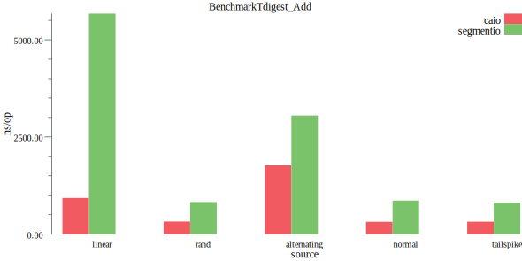
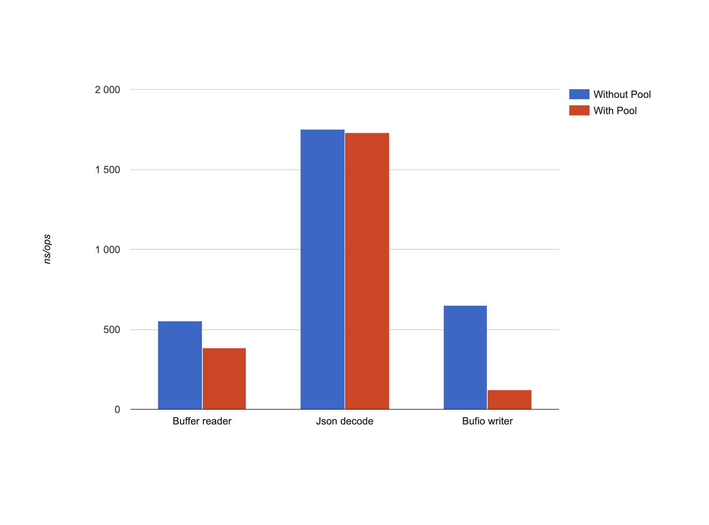
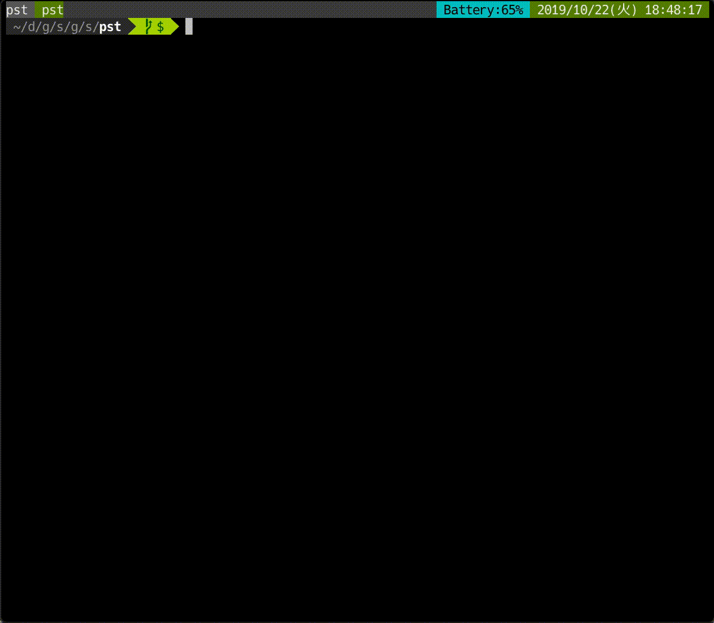
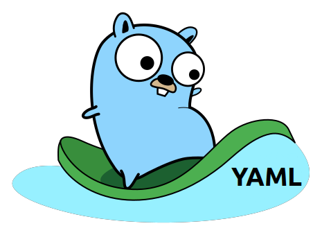

# Go语言爱好者周刊：第 14 期

这里记录每周值得分享的 Go 语言相关内容，周日发布。

本周刊开源（GitHub：[polaris1119/golangweekly](https://github.com/polaris1119/golangweekly)），欢迎投稿，推荐或自荐文章/软件/资源等，请[提交 issue](https://github.com/polaris1119/golangweekly/issues) 。

鉴于大部分人可能没法坚持把英文文章看完，因此，周刊中会尽可能推荐优质的中文文章。优秀的英文文章，我们的 GCTT 组织会进行翻译。

题图：来自 benchdraw 这个项目

## 刊首语

习大大在中央政治局第十八次集体学习时强调 把区块链作为核心技术自主创新重要突破，加快推动区块链技术和产业创新发展。一时间，区块链的春天来了，我相信这也对 Go 来说也是一大喜讯！

如果你从来没有接触过区块链，推荐阅读阮一峰老师的[《区块链入门教程》](http://www.ruanyifeng.com/blog/2017/12/blockchain-tutorial.html)。

## 资讯

1、[提案：扩展 Go 页分配器 (Page Allocator)](https://go.googlesource.com/proposal/+/refs/changes/57/202857/2/design/35112-scaling-the-page-allocator.md)

据称页分配器在应用程序中具有可伸缩性问题，“堆分配率很高且 GOMAXPROCS 很高”。

2、[GoAdmin 发布 v1.0.3 版本，新增主题 sword](https://www.oschina.net/news/110809/goadmin-1-0-3-released)

GoAdmin 是一款基于 golang 的后台数据可视化管理搭建工具。致力于简化 saas，数据可视化系统搭建难度，提升 golang 开发效率，将高效率高性能的体验带给所有开发者。

3、[Electron 7.0.0 发布，跨平台桌面应用开发工具](https://www.oschina.net/news/110795/electron-7-0-0-released)

Electron 是 GitHub 开发的跨平台桌面应用开发工具，支持使用 Web 技术开发桌面应用，其基于 C++ 开发，GUI 核心来自于 Chromium，而 JavaScript 引擎使用 V8。

4、[Proxy-Go SDK v8.4 发布，新增内网穿透 P2P、TCP 指定出口 IP](https://www.oschina.net/news/110784/proxy-go-8-4-released)

Proxy-Go全平台SDK是proxy使用gombile实现了一份go代码编译为android和ios平台下面可以直接调用的sdk类库, 另外还为linux和windows提供sdk支持，基于这些类库,APP开发者可以轻松的开发出各种形式的代理工具，比如代理池，安全代理。

5、[Hugo 0.59.0 发布](https://github.com/gohugoio/hugo/releases/tag/v0.59.0)

Go 语言实现的快速静态站点生成器。此版本发布的时机是通过同步获取文档存储库的副本来实现的，现在完全“ Hugo Modularized”。

6、[Delve 1.3.2 发布](https://github.com/go-delve/delve/blob/master/CHANGELOG.md#132-2019-10-21)

Go 语言实现的 Go 语言调试器，发布 1.3.2。

7、[Zap 1.11.0 发布](https://github.com/uber-go/zap)

Uber 的结构化日志组件。

8、[Micro 1.12.0 发布]([Micro 1.12.0](https://golangweekly.com/link/79024/web))

微服务运行环境。

## 问答

1、[http.Client 读gzip内容读不全](https://studygolang.com/topics/10278)

涉及到 io 读的问题

2、[gorm 的 gorm.Model 在 Create 数据时不是会自动插入时间吗？怎么一直报错](https://studygolang.com/topics/10290)

Error 1292: Incorrect datetime value: '0000-00-00' for column 'created_at' at row 1

3、[Ubuntu系统中安装了多个Go SDK，怎么设置当前使用指定的Go SDK？](https://segmentfault.com/q/1010000020805656)

我目前在写的 Echo 系列教程，其中就涉及到多版本控制问题。[Echo系列教程—基础篇：搭建 Echo 开发环境](https://studygolang.com/topics/10285)。

4、[想把数据库查询的结果放入一个变量，但是不知道怎么放了](https://segmentfault.com/q/1010000020783290)

在实现数据库查询后想把结果放到一个变量但是不知道怎么做了。推荐其中波罗学的答案。

5、[go 的结构体嵌套](https://segmentfault.com/q/1010000020780405)

json 解析常见的问题。

## 文章

1、[Go语言中如何开启 TCP keepalive？](https://mp.weixin.qq.com/s/v8QPxefWLfAmgPNW2HOYHA)

本篇文章首先简单介绍了 TCP keepalive 的机制以及运用场景。接着介绍了 Go 语言中如何开启与设置 TCP keepalive。但是由于 Go 语言最上层的接口不够灵活，从而引出在 Go 语言中如何使用系统调用设置 TCP 连接的文件描述符属性。

2、[Go 中哪些值可以被取地址，哪些值不可以被取地址？](https://mp.weixin.qq.com/s/HBlmxn3MY9aHDEspAtrYKQ)

这些细节可以了解了解。

3、[Docker 容器编排实践练习](https://mp.weixin.qq.com/s/NNcUrg5kbsw38joFratSFQ)

在本次练习中，你将体验到 Docker 的容器编排功能。

4、[Go gRPC 客户端服务保障如何做？负载均衡、重试、健康检查](https://mp.weixin.qq.com/s/q496LLLPq4tjtlEkcMGW6g)

服务健壮性的保证方法。

5、[微服务如何保证不会出现连锁反应？Go实现的断路器了解下](https://mp.weixin.qq.com/s/Q1a0TVpjG4EyNzi0EKJn0A)

Circuit Breaker 模式。

6、[如何使用 Go kit 工具包编写微服务](https://mp.weixin.qq.com/s/MofEci-CEekTHPDztuiiVg)

提供一个边做边学的教程。

7、[你为什么要喜欢 sync.Pool ？](https://mp.weixin.qq.com/s/oF5gIR8DYEM9zTk8-cQ3Kw)

务必使用 **sync.Pool** ！它确实可以节省内存并提高应用程序的性能。

8、[Go垃圾回收1：历史和原理](https://mp.weixin.qq.com/s/THleFV_uKMq4qsoODi2PdQ)

系列教程的第1部分。

9、[如何实现 Go Module 依赖关系的可视化](https://mp.weixin.qq.com/s/zY4MwN8ziTiLzk89zRfQQg)

最近开发了一个非常简单的小工具，总的代码量 200 行不到。这是个什么工具呢？它是一个用于可视化展示 Go Module 依赖关系的工具。

10、

## 开源项目

1、[benchdraw：通过 CLI 将 Go 的基准测试输出转换为图片](https://github.com/cep21/benchdraw)

benchdraw 使您可以轻松地将 Go 基准格式的数据转为图片。Benchdraw 不会像 gnuplot 那样具有可配置性或外观。它仅打算为用户可以以最小的努力生成的最常见情况生成足够好的图片。

2、[slug: 具有多语言支持的 URL Slugify](https://github.com/gosimple/slug)

从 unicode 字符串生成 slug，具有多种语言支持。

3、[go-imap: 一个同时支持客户端和服务端的 imap4 库](https://github.com/emersion/go-imap)

Go 语言实现的 [IMAP4rev1](https://tools.ietf.org/html/rfc3501) 库。它可以用来构建客户端或服务器端。

4、[go-sx: Go 简单的 SQL 扩展](https://github.com/travelaudience/go-sx)

go-sx 提供了对标准库 `database/sql` 软件包的一些扩展。 它是为那些希望在没有沉重的抽象层的情况下使用 SQL 的全部功能的用户设计的。

5、[buf cli: 让 protobuf 更好用](https://github.com/bufbuild/buf)

使用 Protocol Buffers 的新方法。

6、[useragent](https://github.com/x899/useragent)

与 UserAgent 相关的工具包

7、[pst](https://github.com/skanehira/pst)

Go 编写的进程管理器

8、[gerrit-linter: go 实现的与 Gerrit Checks 插件一起使用的代码样式验证工具](https://github.com/google/gerrit-linter)

这是一种样式验证程序，旨在与 Gerrit Checks 插件一起使用。

9、[kf: go 打造的类 cloud foundry 命令行工具](https://github.com/google/kf)

与 Cloud Foundry 应用程序和生命周期完全兼容。它支持日志，构建包，应用清单，路由，服务代理和注入。

10、[go-jose: JOSE标准(JWE, JWS, JWT) 的Go实现](https://github.com/square/go-jose)

包 jose 旨在提供 JSON 签名和加密标准集的实现。 这包括对 JSON Web 加密，JSON Web 签名和 JSON Web 令牌标准的支持。

11、[csvdiff: 快速的 csv 比较工具](https://github.com/aswinkarthik/csvdiff)

12、[使用 Go 添加 HTTPS](https://juejin.im/post/5daeb504f265da5b7e2406a4)

HTTPS 是一种趋势，也是未来。API 接口为了安全性， 一般都是需要上 HTTPS 的。

13、[如何写出优雅的 Golang 代码](https://draveness.me/golang-101.html)

Go 语言是一门简单、易学的编程语言，对于有编程背景的工程师来说，学习 Go 语言并写出能够运行的代码并不是一件困难的事情，对于之前有过其他语言经验的开发者来说，写什么语言都像自己学过的语言其实是有问题的，想要真正融入生态写出优雅的代码就一定要花一些时间和精力了解语言背后的设计哲学和最佳实践。

14、[用 Golang 编写一个简易聊天室](https://juejin.im/post/5dafb4435188256290692f05)

本文更像是一份我在练习如何去用Go编写程序时的总结。

15、[Golang应付百万级请求/分钟](https://studygolang.com/articles/24229)

简洁化设计永远是我所追求的东西。我们可以设计一个复杂的系统用很多的队列，后台运行worker，复杂的部署等等，但取而代之我们决定利用Elasticbeanstalk强大的自动伸缩功能以及Go所提供开箱即用的并发特性。

16、[一文让你了解Kubernetes架构](https://mp.weixin.qq.com/s/hgN1xmwb0yOWep71CHdBtQ)

Kubernetes起源自Google内部系统Borg，它是容器应用集群部署和管理的系统。Kubernetes核心功能是为了减轻物理机或者虚拟机集群编排、网络以及存储等的管理负担，使开发者只需要关注应用的业务逻辑。通过Kubernetes开发者可以自定义工作流甚至自动化的任务流。

## 资源&&工具

1、[yaml2go: 转换 YAML 为 Go 类型](https://yaml2go.prasadg.dev/)

您可以将其用作在线工具，也可以获取副本并自己进行部署。https://github.com/PrasadG193/yaml2go

2、[将 cURL 命令转为 Go 代码](https://curl.trillworks.com/#go)

仓库地址：https://github.com/NickCarneiro/curlconverter/ 。除了转为 Go 代码，还支持 Python, javascript, php, R, Go, Rust, Dart, JSON, Ansible 等语言。

3、[Go 时间：Go 应用设计](https://changelog.com/gotime/102)

原则、权衡、模式和常见问题。

4、[Go 时间：关于 Cache](https://changelog.com/gotime/103)

 Go 实现的高性能并发缓存库 [Ristretto](https://github.com/dgraph-io/ristretto)，其重点是性能和正确性。创建 Ristretto 的动机来自对 Dgraph 中无锁缓存的需求。

5、[想进阿里吗？送你一份 4000 字《阿里内推指南》](https://mp.weixin.qq.com/s/c2BblWuruysHpFSJPq79YA)

阿里人写的指南。

6、[只因有了它，我找到了优秀的候选人：推荐一款候选人现场编程的神器 ShowMeBug](https://mp.weixin.qq.com/s/grqXL6Z9FxxUqSnDlZ4DWw)

面试辅助工具。

## 订阅

这个周刊每周日发布，同步更新在[Go语言中文网](https://studygolang.com/go/weekly)、[微信公众号](https://weixin.sogou.com/weixin?query=Go%E8%AF%AD%E8%A8%80%E4%B8%AD%E6%96%87%E7%BD%91) 和 [今日头条](https://www.toutiao.com/c/user/59903081459/#mid=1586087918877709)。

微信搜索"Go语言中文网"或者扫描二维码，即可订阅。

