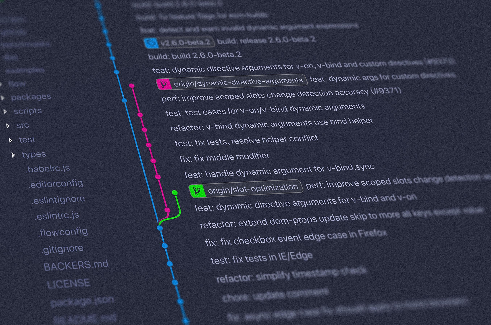
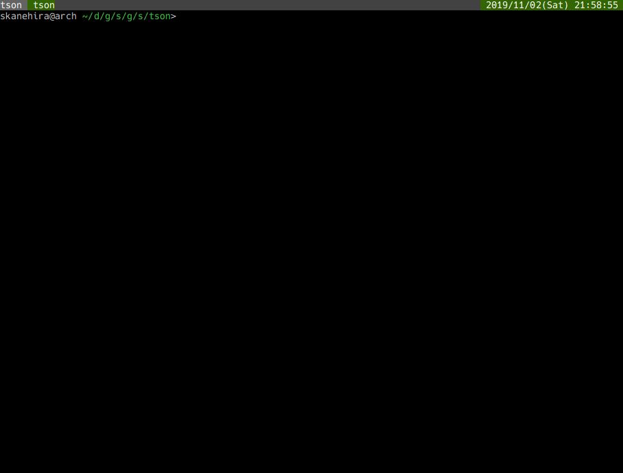

# Go语言爱好者周刊：第 15 期

这里记录每周值得分享的 Go 语言相关内容，周日发布。

本周刊开源（GitHub：[polaris1119/golangweekly](https://github.com/polaris1119/golangweekly)），欢迎投稿，推荐或自荐文章/软件/资源等，请[提交 issue](https://github.com/polaris1119/golangweekly/issues) 。

鉴于大部分人可能没法坚持把英文文章看完，因此，周刊中会尽可能推荐优质的中文文章。优秀的英文文章，我们的 GCTT 组织会进行翻译。

题图：Games With Go

## 刊首语

技术学累了，来点鸡汤补补！

> 你能伤害的，都是在乎你的人；你能欺骗的，都是信任你的人。所以，别打着真心实意的幌子，却把善良的人当傻子；对你好的，一辈子都别忘；欺你善的，一辈子都别交。记得善待每一颗纯洁的心，也不辜负每一份慈悲的情！

## 资讯

1、[Go1.13.4 和 1.12.13 两个小版本发布](https://studygolang.com/topics/10355)

主要修复 MacOS 的一个问题和 net/http 包的修复。

2、Go1.14 应该很棒！

这个周期有很多 runtime 的工作。主要有： 

* 异步抢占 (https://github.com/golang/go/issues/24543) 
* 更快的 defers (https://studygolang.com/topics/10356) 
* 可扩展计时器 (https://github.com/golang/go/issues/6239, https://github.com/golang/go/issues/27707) 
* 新的页分配器 (https://github.com/golang/proposal/blob/master/design/35112-scaling-the-page-allocator.md)

3、GopherCon 2020 将进入迪士尼世界！

GopherCon 将于 2020 年在佛罗里达州奥兰多的沃尔特·迪斯尼世界海豚度假村举行。我们只希望地鼠和老鼠相处融洽。

4、[GORP 3.0 发布: 一个 'ORM-ish' Go 库](https://github.com/go-gorp/gorp/releases/tag/v3.0.0)

相比 GORM 和 XORM，这个库似乎没那么流行。在过去的一年中，这个曾经很受欢迎的项目的维护和发布速度有所放缓，但是现在有一个新的基于模块的版本，支持 Go 1.13。 （GORP 代表 Go Relational Persistence）

5、[Flaggy 1.3.0 发布: Go 惯用的命令行解析库](https://github.com/integrii/flaggy)

在任何位置都支持子命令，位置值和标志(flag)。 没有外部依赖。 类似的类库中，[Kingpin](https://github.com/alecthomas/kingpin) 是另一个受欢迎的选择。

6、[Zap 1.12 发布: 快速、结构化的 Go 日志库](https://github.com/uber-go/zap)

刚刚迁移到模块。支持模块是大势所趋！

## 问答

1、[关于 chan 的用法困惑](https://studygolang.com/topics/10344)

求素数的一个程序。

2、[gorm 关联查询如何排除字段?](https://segmentfault.com/q/1010000020887156)

学会查阅文档很重要。

3、[golang 中怎么一次把 []int 转为 []int32](https://segmentfault.com/q/1010000020854848)

除了遍历的方式，你觉得还有其他方式吗？

4、[golang 中 websocket 读取消息的问题!](https://segmentfault.com/q/1010000020841936)

其实是 json 解析的问题。

5、[golang Open 函数打开的文件不主动关闭,在程序关闭时会发生什么?](https://segmentfault.com/q/1010000020836375)

进程退出时操作系统会回收给进程的所有资源。

## 文章

1、[Go 1.13 中值得关注的几个变化](https://tonybai.com/2019/10/27/some-changes-in-go-1-13/)

TonyBai 的值得关注系列，这次来的有点晚。

2、[一文读懂 Go profiling 和性能优化](https://mp.weixin.qq.com/s/nqOXcetOLQN09IFjOz4PtQ)

本文总结自 [**Profiling and Optimizing Go**](https://www.youtube.com/watch?v=N3PWzBeLX2M)，对应的 [**PPT**](https://docs.google.com/presentation/d/1n6bse0JifemG7yve0Bb0ZAC-IWhTQjCNAclblnn2ANY/present?slide=id.g39a91bbe9_0264)，有梯子的可以直接看视频。

3、[给Go程序加入编译版本时间等信息](https://mp.weixin.qq.com/s/1OpMV3Fk690NUdhRCQepIA)

你可能会需要。

4、[并发陷阱 2: 未完成的工作](https://mp.weixin.qq.com/s/DokDQ_DlodBPOHNoeKA7wA)

介绍一个新的陷阱，这个陷阱叫做未完成的工作。当进程在非主协程的协程结束前终止时，这种陷阱就会发生。根据 Gorotine 的特性，强制关闭它将造成一个严重的问题。

5、[创建优化的Go镜像文件以及踩过的坑](https://mp.weixin.qq.com/s/QpUUyKp2J_9aOckRu5lEiA)

也许对你有用的经验！

6、[你真的了解跨域吗？如何解决？为Go程序员准备的跨域教程](https://mp.weixin.qq.com/s/qauMSFTrJNNyB3kXpH4Izw)

本文为 Go 程序员介绍了几种解决跨域的方法。

7、[如何把应用程序迁移到 K8S？](https://mp.weixin.qq.com/s/65ZDehlzGkY0dT91uusagg)

程序部署环境的容器化已经是大势所趋，微服务为容器化提供了广阔的应用舞台，k8s 已经把 Docker 纳入为它的底层支撑容器引擎，一统江湖，成为了容器技术事实上的标准。

8、[Go 编程：记一次函数定义的争论](https://mp.weixin.qq.com/s/y11wVIbN5AVPYg6u2qkFMA)

将这些“自以为是”的东西写下来，供读者参考。

9、[一文详解微服务架构](https://www.cnblogs.com/skabyy/p/11396571.html)

本文将介绍微服务架构和相关的组件，介绍他们是什么以及为什么要使用微服务架构和这些组件。本文侧重于简明地表达微服务架构的全局图景，因此不会涉及具体如何使用组件等细节。

10、[使用 git bisect 定位你的 BUG](https://wujunze.com/2019/2019-10-30-git-bisect/)

Git 是开发者的好帮手，今天跟大家分享的是用 git bisect 来找到你代码中的 bad commit 。

11、[[译]Golang应付百万级请求/分钟](https://juejin.im/post/5db1464b6fb9a0202a261ca9)

简洁化设计永远是我所追求的东西。我们可以设计一个复杂的系统用很多的队列，后台运行worker，复杂的部署等等，但取而代之我们决定利用Elasticbeanstalk强大的自动伸缩功能以及Go所提供开箱即用的并发特性。

12、[何处安放我们的 Go 代码](https://liujiacai.net/blog/2019/10/24/go-modules/)

本文大致顺序：包管理的历史；新的包管理方式 module；最后加上一个问题排查，彻底解决如何放置 Go 代码的问题。

13、[Go 语言出现后，Java 还是最佳选择吗？](https://mp.weixin.qq.com/s/K1us6aH-gjHsWGhQ3SulFg)

阿里人写的文章，你懂的。

## 开源项目

1、[golang.cafe](https://github.com/golang-cafe/golang.cafe)

一个 Go 实现的开源招聘 web 站点。这是国外人搞的。基于它，你可以构建一个国人的招聘站点。

2、[Kilo](https://github.com/squat/kilo)

一个为 k8s 设计的、基于 wireguard 构建的多云 overlay 网络插件。

3、[imgcrypt](https://github.com/containerd/imgcrypt)

为容器提供 API 扩展以支持加密的容器映像。

4、[go-gitdir](https://github.com/belak/go-gitdir)

基于一个目录的 git 托管服务。

5、[snake-go: Go 实现的贪吃蛇终端小游戏](https://github.com/tristangoossens/snake-go)

一款基于文本的“贪吃蛇”游戏，随心所欲制作。10 年前拥有诺基亚手机或玩过 NIBBLES.BAS 的任何人都会熟悉它。

6、[gazette/core](https://github.com/gazette/core)

构建流处理平台的基础设施代码库。

7、[hemera](https://github.com/andresoro/hemera)

一个零依赖的 statsd 的Go语言实现。

8、[tson: Go实现的 json 查看器](https://github.com/skanehira/tson)

Go语言编写的 TUI json 编辑器和查看器。

9、[ktunnel](https://github.com/omrikiei/ktunnel)

将本地资源暴露到 k8s 集群的命令行工具。

10、[goldmark: Go 编写的 markdown 解析器](https://github.com/yuin/goldmark)

易于扩展，符合标准（CommonMark），结构合理。

11、[go-restful](https://github.com/emicklei/go-restful)

构建 Restful Web Service 的 Go 包。

12、[gitql](https://github.com/cloudson/gitql)

git 查询语言，有点意思！

## 资源&&工具

1、 [Linux性能调优 by Brendan Gregg on USENIX LISA 2019](https://www.slideshare.net/brendangregg/lisa2019-linux-systems-performance)（英文）

很给力的 Linux 资料，值得收藏查阅。

2、[学习使用 Go 编写游戏(几十个免费视频)](https://gameswithgo.org/)（英文）

3、[Ebook: 静态程序分析](https://cs.au.dk/~amoeller/spa/)（英文）

有功力的可以好好研究研究。

4、[【第 64 期 Go 夜读】深入浅出 Golang Runtime](https://mp.weixin.qq.com/s/np0jpRNd-IhisEt3XJi4lA)

本次分享将会对 go runtime 的调度，内存分配，gc 做一些细节上的讲解，同时也需要参与者对 runtime 有一些初步了解。[文档完整版](res/gopher-meetup-runtime-yifhao-full.pdf)、[文档精简版](res/gopher-meetup-runtime-yifhao-jian.pdf)

5、[Micro 中国站教程](https://github.com/micro-in-cn/tutorials)

Micro 中文示例、教程、资料，源码解读！

## 订阅

这个周刊每周日发布，同步更新在[Go语言中文网](https://studygolang.com/go/weekly)、[微信公众号](https://weixin.sogou.com/weixin?query=Go%E8%AF%AD%E8%A8%80%E4%B8%AD%E6%96%87%E7%BD%91) 和 [今日头条](https://www.toutiao.com/c/user/59903081459/#mid=1586087918877709)。

微信搜索"Go语言中文网"或者扫描二维码，即可订阅。

