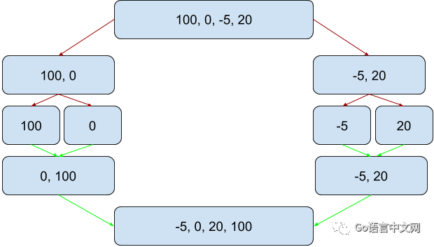
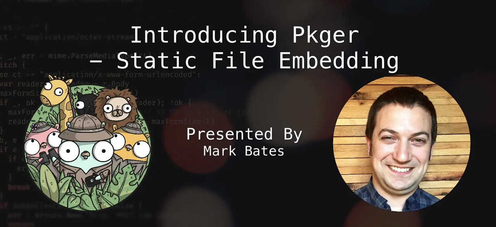

# Go语言爱好者周刊：第 16 期

这里记录每周值得分享的 Go 语言相关内容，周日发布。

本周刊开源（GitHub：[polaris1119/golangweekly](https://github.com/polaris1119/golangweekly)），欢迎投稿，推荐或自荐文章/软件/资源等，请[提交 issue](https://github.com/polaris1119/golangweekly/issues) 。

鉴于大部分人可能没法坚持把英文文章看完，因此，周刊中会尽可能推荐优质的中文文章。优秀的英文文章，我们的 GCTT 组织会进行翻译。


题图：Go 10 years

## 刊首语

马上双十一了，又到了剁手的日子了！既然剁手，那不如投资学习 Go 语言。Go语言中文网的「Go项目实战」知识星球送出 100 元优惠券，前 11 人加入有效。目前该知识星球正在出第 2 个实战项目：简书，同时在出 Echo 框架系列。加入后支持 3 天理由退款。


## 资讯

1、[Grafana 6.4.4 发布，系统指标监控与分析平台](https://www.oschina.net/news/111185/grafana-6-4-4-released)

Grafana 6.4.4 发布了，Grafana 是一个功能丰富的指标标准仪表板和图形编辑器，用于分析和监控 Graphite、Elasticsearch、OpenTSDB、Prometheus 和 InfluxDB。该版本是 Bug 的修复。

2、[Vitess 4.0 发布，MySQL 数据库集群水平扩展系统](https://www.oschina.net/news/111162/vitess-4-0-0-released)

这是 Go 语言实现的。Vitess 是一个分布式 MySQL 工具集，它可以自动分片存储 MySQL 数据表，将单个 SQL 查询改写为分布式发送到多个 MySQL Server 上，支持行缓存（比 MySQL 本身缓存效率高）与复制容错等。

3、[Proxy-Go v8.5 发布，全能代理服务工具，专业加速](https://www.oschina.net/news/111074/proxy-go-8-5-released)

Proxy 是 golang 实现的高性能 http、https、websocket、tcp、udp、socks5 代理服务器，支持正向代理、反向代理、透明代理、内网穿透、TCP/UDP 端口映射、SSH 中转、TLS 加密传输、协议转换、DNS 防污染智能代理、前置 CDN/Nginx 反代、代理连接重定向、API动态调用上级代理、限速限连接数。同时提供全平台的功能强大的命令行版本和友好易用的 web 控制面板版本。

更新内容：

- tcp代理转发增加了指定出口IP功能。
- 修复了智能模式某些情况不能准确工作的问题。
- socks/http(s)/sps监听支持多端口和端口范围了。
- 
	参数-p现在可以这样写了： 

	```
   -p ":8081"  监听8081
-p ":8081,:8082"  监听8081和8082
   -p ":8081,:8082,:9000-9999" 监听8081和8082以及9000,9001至9999，共1002个端口
	```
  
- 增加了freebsd平台。

4、[InfluxDB 1.7.9 发布](https://www.influxdata.com/blog/release-announcement-influxdb-1-7-9/)

将 Golang 版本更新为 1.12.10。

## 问答

1、[web 框架中的每个请求是一个 goroutine 吗？](https://studygolang.com/topics/10394)

对 channel 似乎有误解。

2、[golang 的指针主要用途是不是函数调用的时候传参数？](https://studygolang.com/topics/10352)

指针的用途有哪些？

3、[golang 如何返回一个有序的map类型的数据](https://segmentfault.com/q/1010000020263981)

golang的map我们知道是无序的, 可是实际应用的时候, 我回经常需要返回一个有序的格式
比如list列表按时间分组排序, 这种的实现思路 应该如何呢？

4、[golang 的静态文件打包输出 如何与gin结合作为模板输出 packr](https://segmentfault.com/q/1010000020928692)

之前gin是通过 router.LoadHTMLGlob("templates/*")
然后指定模板文件名可以直接加载html文件输出的，

现在我想用 packr 把静态文件作为资源文件内嵌，怎么与gin配合？

5、[当golang调用 time.Sleep()时 调度器发生了什么 G、P和M之间又是怎样的关系？](https://segmentfault.com/q/1010000020903479)

golang中time.Sleep是如何实现的，在这背后调度器对time.Sleep又是如何处理的？

## 文章

1、[漫画：Go 语言的并发](https://mp.weixin.qq.com/s/9xwFapohMkutVRczSmrNfQ)

本文适用于Go的新手，以及想要了解Go的并发原语：go routine 和 channel 的学习者。

2、[排序运行时间能否做到 O(n)？让Go语言来告诉你](https://mp.weixin.qq.com/s/dHp-OJ0v9yNTazdYSsEKGw)

时间复杂度为 `O(nlogn)` 的最优排序算法中，归并排序是其中之一。它的原理为将数组分为两部分，分别进行排序，最后再归并，这种做法的开销没那么大。



3、[持续集成和部署如何做？一步步教你在k8s上安装Jenkins](https://mp.weixin.qq.com/s/QcV1ASYiztQ7Jj-VSqy_mQ)

本文分成两部分，第一部分讲正常安装步骤，如果一切顺利，就不需要看第二部分了。我只能说恭喜你，你的运气太好了。第二部分是讲各种问题及解决办法，这应该是本文最有价值的部分。

4、[开源社区福利，微软不断拥抱开源：Go 实现的微服务构建软件 Dapr 入门](https://mp.weixin.qq.com/s/hVhpet_RCwcgMMwZJnadrg)

微软开源的微服务套件？我一下子来了兴趣，作为一个开发人员，当然是先上手试试手感啦。

5、[好消息，无闻大神又出课程了：Go 语言 Web 应用开发](https://mp.weixin.qq.com/s/TZuHdxvo0rI-X5gxe8FHvQ)

学习Go的，对无闻应该不陌生，可能很多人是看着他的课程入门的。今天，他又出新课程了，你没有理由不学习！大家可以关注他新开的公众号：无闻是个码痴。

本系列课程同步首发在：「无闻是个码痴」、「Go语言中文网网站」（专栏**Go 语言 Web 应用开发**：https://studygolang.com/subject/479）和公众号 「Go语言中文网」。

6、[无闻出品 — 第 01 课：初窥 HTTP 服务器](https://mp.weixin.qq.com/s/341LO-M3_Qj4Kym_Q5O_Zg)

我们不需要依赖任何第三方组件就能构建并启动一个高并发的 HTTP 服务器。

7、[无闻出品 — Go 语言 Web 应用开发 第 02 课：基础模板用法](https://mp.weixin.qq.com/s/XaSe5qYDN3--jPNn7MMYNQ)

这堂课我们来学习如何使用 Go 语言标准库的 `text/template` 包来向客户端（即浏览器或终端）响应动态的内容。

8、[Go语言中文网和币威合作，共同打造Go语言区块链社区](https://mp.weixin.qq.com/s/fkB8jDYbikHiOJpiwTmkdg)

后续不断为大家带来福利、核心知识！

9、[详细介绍 Go 中如何实现 bitset](https://mp.weixin.qq.com/s/8gxsnY0fEmixakMsLjLM5g)

最近尝试在 B 站录些小视频。录视频当是为了彻底搞懂某个知识点的最后一步吧，同时也希望能习得一些额外的能力。在讲 Go 如何实现 bitset 的时候，发现这块内容有点难讲。思考后，我决定通过文字辅以视频的方式说明，于是就写了这篇文章。

10、[Go netpoll I/O 多路复用构建原生网络模型之源码深度解析](https://mp.weixin.qq.com/s/_NcVrAooHNCl1ae225-_mQ)

本文将基于 linux 平台来解析 Go netpoll 之 I/O 多路复用的底层是如何基于 epoll 封装实现的，从源码层层推进，全面而深度地解析 Go netpoll 的设计理念和实现原理，以及 Go 是如何利用 `netpoll`来构建它的原生网络模型的。

11、[容器中某 Go 服务 GC 停顿经常超过 100ms 排查](https://mp.weixin.qq.com/s/Lk1EbiT7WprVOyX_dXYMyg)

实战经验排查问题。

12、[Go语言的遗产(中译版)](https://tonybai.com/2019/11/04/the-legacy-of-go/)

本文是gohugo作者Steve Francia在意大利佛罗伦萨举办的GoLab上分享的闭幕演讲讲稿的文字版，该演讲的主题为"Go的遗产"。该演讲讨论了Go语言继承的遗产，以及它是如何尊重这些遗产的，并在最后总结了Go希望留给后来者的遗产。

13、[让数据库运行在浏览器里？TiDB + WebAssembly 告诉你答案](https://mp.weixin.qq.com/s/n3NAhohDqB-O5NHACEolKQ)

挺有意思！


14、[Go语言开源十周年](https://tonybai.com/2019/11/09/go-opensource-10-years/)

本文翻译自[Go官方博客](https://blog.golang.org)上[Russ Cox](https://research.swtch.com/)代表Go核心团队发表的[“Go Turns 10″](https://blog.golang.org/10years)一文。


15、[Golang template 小抄](https://colobu.com/2019/11/05/Golang-Templates-Cheatsheet/)

这是 Curtis Vermeeren 做的 [Go模板技术的小抄](https://curtisvermeeren.github.io/2017/09/14/Golang-Templates-Cheatsheet)。

16、[为什么要使用 goroutines 取代 threads](https://juejin.im/post/5dc144c05188255f695be5f8)

goroutines 和 threads 都是为了并发而生。准确的说，并不能说 goroutines 取代 threads。因为其实 goroutines 是建立在一组 threads 之上。将多路并发执行的能力复用在 threads 组上。当某一个 goroutine 需要运行时，会自动将它挂载到一个 thread 上。而且这一系列的调度对开发者是黑盒，无感知的。

## 开源项目

1、[go-testdeep](https://github.com/maxatome/go-testdeep)

灵活的 Go 深度比较包，用于扩展 go testing 包。

2、[utask](https://github.com/ovh/utask)

一个业务流程建模和执行的自动化引擎。

3、[staticcheck](https://github.com/dominikh/go-tools)

一个 Go 代码静态检查工具集合。这里有一篇英文版 staticcheck 实战文章：https://superhighway.dev/staticcheck-in-action 。

4、[gox](https://github.com/mitchellh/gox)

一个超级简单的跨平台 Go 编译器。

5、[stripe-cli](https://github.com/stripe/stripe-cli)

用于简化与国际支付服务 Stripe 集成的工作。

6、[kube-ovn](https://github.com/alauda/kube-ovn)

灵雀云开源的基于ovn的kubernetes网络方案。

7、[goque: LevelDB 支持的 Go 持久堆栈和队列](https://github.com/beeker1121/goque)

现在还支持将对象编码/解码为 JSON，从而可以更轻松地存储复杂对象。

8、[lungoDB：与 MongoDB 兼容的可嵌入数据库和工具包](https://github.com/256dpi/lungo)

想象一下类似 SQLite 的东西，但具有 MongoDB 风味。

9、[dns: Go 实现的 DNS 库](https://github.com/miekg/dns)

该库支持大量与DNS相关的RFC和功能。

10、[sqlhooks：为 database/sql 驱动加上钩子](https://github.com/gchaincl/sqlhooks)

一种简便的方法来检测 SQL 查询。 刚刚进行了近两年的首次更新，并添加了 go mod 支持。

11、[pkger](https://github.com/markbates/pkger)

将静态文件嵌入Go二进制文件中（建议替换 gobuffalo/packr）。这里有一个英文教程：https://golangweekly.com/link/79660/web 。



12、[inletsctl](https://github.com/inlets/inletsctl)

用 Go 编写的快速的 HTTP (L7) 和 TCP (L4) 隧道。

## 资源&&工具

1、[go语言golang实现区块链blockchain源代码](https://www.flysnow.org/2019/11/08/golang-bitcoin-blockchain-sources.html)

为了便于学习Golang区块链，从零入门，分享几个Go语言实现的区块链项目，可以参考学习，理解区块、区块链、POW、钱包、交易、记账等这些术语。

很给力的 Linux 资料，值得收藏查阅。

2、Go每日面试题，「Golang来啦」公众号已经更新 60 多期了

十分佩服 Seekload 的坚持。日拱一卒，一起成长！Go语言中文网对每日面试题也进行了转载，欢迎来刷题。

## 订阅

这个周刊每周日发布，同步更新在[Go语言中文网](https://studygolang.com/go/weekly)、[微信公众号](https://weixin.sogou.com/weixin?query=Go%E8%AF%AD%E8%A8%80%E4%B8%AD%E6%96%87%E7%BD%91) 和 [今日头条](https://www.toutiao.com/c/user/59903081459/#mid=1586087918877709)。

微信搜索"Go语言中文网"或者扫描二维码，即可订阅。


