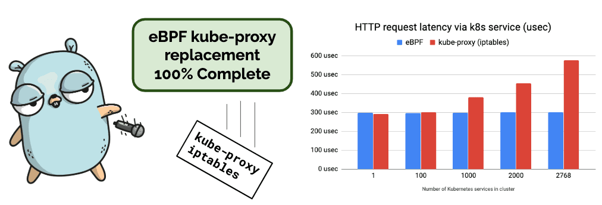
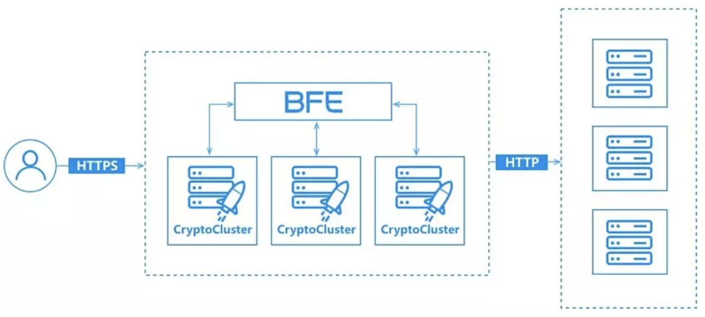
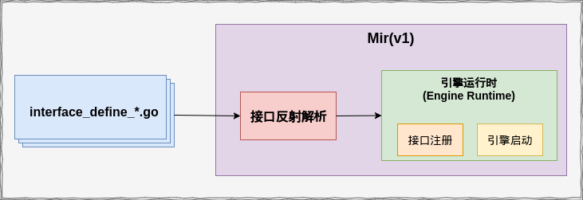
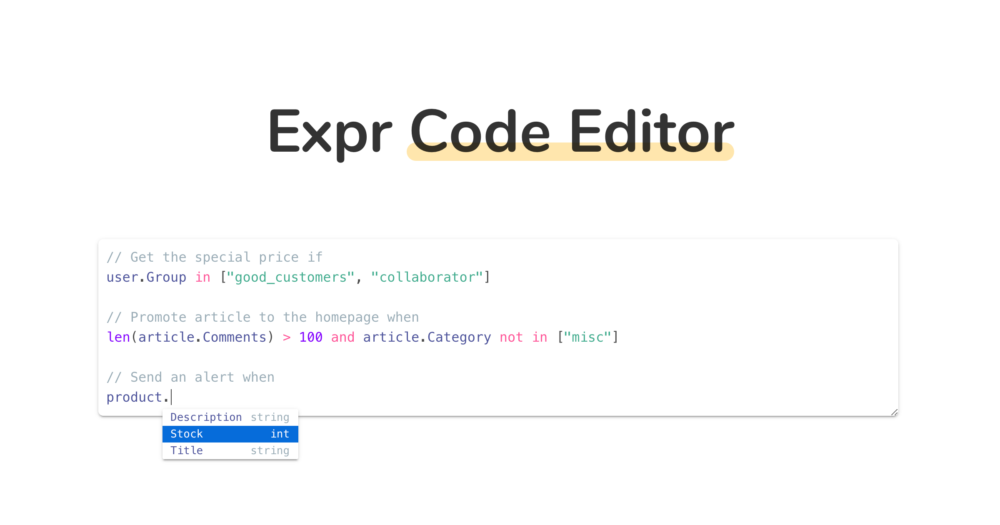
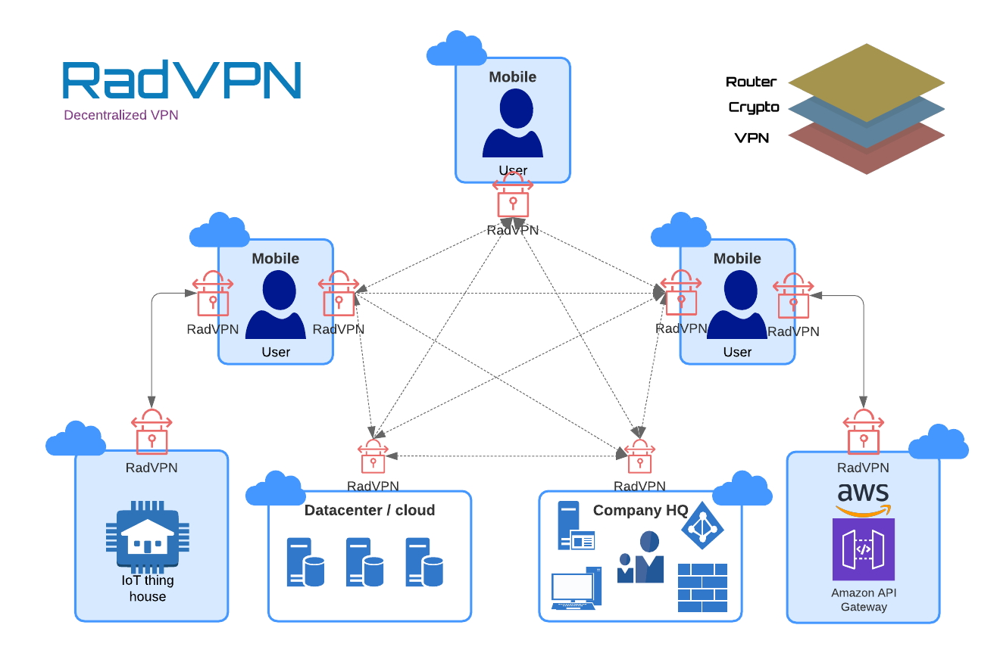
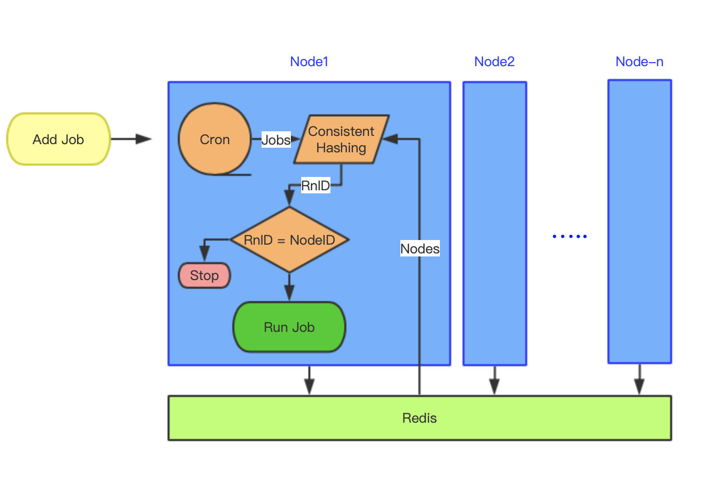

# Go语言爱好者周刊：第 17 期

这里记录每周值得分享的 Go 语言相关内容，周日发布。

本周刊开源（GitHub：[polaris1119/golangweekly](https://github.com/polaris1119/golangweekly)），欢迎投稿，推荐或自荐文章/软件/资源等，请[提交 issue](https://github.com/polaris1119/golangweekly/issues) 。

鉴于大部分人可能没法坚持把英文文章看完，因此，周刊中会尽可能推荐优质的中文文章。优秀的英文文章，我们的 GCTT 组织会进行翻译。


题图：暗黑破坏神2

## 刊首语

go.dev：一个新的 Go 开发人员中心，提供了关于 Go 的学习资源等信息。这么好的东西，国内是不是应该有一个类似的针对本土化的站点呢？是的，我们已经在行动了：https://github.com/polaris1119/golangclub 这是仓库地址，有兴趣的可以加入我们，可加微信：274768166。

## 资讯

1、[大家用Go都做什么？Go官方新发布的 Go.Dev 告诉你](https://mp.weixin.qq.com/s/vwBlrJvHXdWhqWmVFhv7-A)

北京时间 2019 年 11 月 14 日凌晨 1 点 16 分，Go 官方团队在 golang-nuts 邮件组宣布 go.dev 上线

2、[Helm 3.0 正式发布，Kubernetes 包管理器](https://www.oschina.net/news/111342/helm-3-0-released)

Helm 3.0  已经发布，该版本是 CLI 工具的最新主要版本，主要关注简单性、安全性和可用性。

3、[Gitea 1.10.0 发布](https://blog.gitea.io/2019/11/gitea-1.10.0-is-released/)

是时候发布另一个重要版本了！ 我们很荣幸向世界展示 Gitea 1.10.0。

4、[OpenDiablo2:《暗黑破坏神2》的开源重新实现](https://github.com/OpenDiablo2/OpenDiablo2)

这个牛逼了，Go 实现的开源 暗黑破坏神2 游戏引擎。


5、[cilium 1.6 发布](https://cilium.io/blog/2019/08/20/cilium-16)

可 100% 替换kube-proxy，基于套接字的负载平衡，通用 CNI 链接，本机 AWS ENI 支持。



6、[百度万亿流量的转发引擎BFE开源了(Go实现)](https://mp.weixin.qq.com/s/uAigHYDBxrCIziaAhVwZYQ)

BFE（Baidu Front End，百度统一前端）是百度的统一七层流量转发平台。BFE平台目前已接入百度大部分流量，每日转发请求接近1万亿，峰值QPS超过1000万。在2019年百度春晚红包活动中，BFE平台在超大用户压力、数次流量波峰下平稳运行，保证了春晚红包活动的顺利进行。



7、[go-mir v1.0.2 发布，用 Go 结构体标签定义 handler 路由信息的辅助库](https://www.oschina.net/news/111297/go-mir-1-0-2-released)

go-mir v1的架构大体是这样：



8、[GitHub Mobile 抢先体验篇（多图预警）](https://mp.weixin.qq.com/s/uSH48yDzIV6oKUwBqeJxFA)

GitHub 终于官方宣布了将会推出自家研发的手机版应用：GitHub Mobile。

9、[gopls v0.2.0 发布](https://github.com/golang/go/issues/33030)

据说性能还是有待优化。

## 问答

1、[结构体指针切片和结构体数组指针的区别?](https://segmentfault.com/q/1010000020942293)

```go
type Widget struct {
    id    int
    attrs []string
}
//下面两种传参有什么区别?
func doSomThing(ss *[]Widget){

}
func doOtherThing(sp []*widget){

}
```

2、[golang 的接口指针为什么不能调用方法？](https://segmentfault.com/q/1010000020955970)

```go
type I interface {
    name()
}
type S struct{}

func (*S) name() {
}
func TestInterface(t *testing.T) {
    var value I = &S{}
    value.name() //可以调用

    var point = &value
    point.name() //不能调用
}
```

3、[golang 如何返回一个有序的map类型的数据](https://segmentfault.com/q/1010000020263981)

golang的map我们知道是无序的, 可是实际应用的时候, 我回经常需要返回一个有序的格式
比如list列表按时间分组排序, 这种的实现思路 应该如何呢？

4、[slice地址问题](https://studygolang.com/topics/10399)

你理解吗？

## 文章

1、[Go 为什么能成功？Rob Pike 认为做了这 5 件事](https://mp.weixin.qq.com/s/vq7Jf7NZ612ItlN-u3fDew)

在《Go Time》第 100 期中，Rob Pike 和 Robert Griesemer（Go 的两位创建者）一起探讨了 Go语言的成功经验。

2、[Leader 这样说对吗？还是自己动手验证 Go 逃逸分析](https://mp.weixin.qq.com/s/JxWlI2LRXQX2kHxMQzJRPw)

总结逃逸分析的各种情况。

3、[超详细的讲解Go中如何实现一个协程池](https://mp.weixin.qq.com/s/RDeNxMc6B8NQ6FFYNgdLBA)

本文将通过runtime对goroutine的调度分析，帮助大家理解它的机理和发现一些内存和调度的原理和问题，并且基于此提出一种个人的解决方案 — 一个高性能的Goroutine Pool（协程池）。

4、[两位Go大佬的对话引发的对 Race 的思考总结](https://mp.weixin.qq.com/s/6cbDcyuhQpM-UBH_GMV2GA)

开始煎鱼大佬和无闻大佬在讨论 **go-ini/ini** 这个库为什么不加个 **WatchConfig** 的功能呢？另一个加载配置文件的库 **viper** 有类似的功能。其实这是很常见的需求，不用修改代码， 修改一下配置文件即可实现热更配置。

5、[Go项目实战：用 Go 语言构建 SQL 解析器](https://mp.weixin.qq.com/s/ROo168oOSkZon_EE0kEbAw)

本文旨在对如何用 Go 语言构建 **LL(1) 文法的解析器** ——此例用来解析 SQL 请求——作出简要的介绍。只需要读者具有极少的编程能力（函数、结构体、条件语句和 for 循环）。

6、[让数据库运行在 Markdown 文档中：这是真的吗？](https://mp.weixin.qq.com/s/0Vo4apK4VdBfOs0-KyWXZA)

TiDB Wasm 的后续。

7、[线上问题排查实战：容器中某Go服务GC停顿经常超过100ms](https://mp.weixin.qq.com/s/5SDDSYFlEYyi6yNtPRgmTw)

实际线上问题的排查过程分享。

8、[Go实现简单TCP扫描器](https://mp.weixin.qq.com/s/OhS_RQZojJbkenOSS_tEng)

一篇关于Go实现TCP扫描器的文章。

9、[uber-go漏桶限流器使用与原理分析](https://www.cyhone.com/articles/analysis-of-uber-go-ratelimit/)

uber在Github上开源了一套用于服务限流的go语言库[ratelimit](https://github.com/uber-go/ratelimit/), 该组件基于Leaky Bucket(漏桶)实现。

10、[你不知道的Go unsafe.Pointer uintptr原理和玩法](https://www.cnblogs.com/sunsky303/p/11820500.html)

这个类型比较重要，它是实现定位和读写的内存的基础，Go runtime大量使用它，但我们使用它是需要考虑清楚。

11、[go的text/template源码解析](https://bigpigeon.org/post/go-text-template/)

go的模板库一直缺少indent的功能，于是我决定自己造个轮子来解决这个问题。

12、[斗鱼基于 Golang 在高并发场景下的日志系统实践](http://100000p.com/article/2c9f60ef6e5884e0016e58875e4e0000)

斗鱼的业务是经典的高并发场景，不仅要优化业务逻辑，同时还要提升日志等基础组件的性能。

13、[GitHub Universe 2019 Keynote 回顾](https://mp.weixin.qq.com/s/7Y5M4xQ0MGWOJZlBCfujYQ)

大会内容总结。

## 开源项目

1、[BadgerDB: Go 中的一种快速，可嵌入的 Key-Value 数据库](https://github.com/dgraph-io/badger)

BadgerDB 是一个用纯 Go 编写的可嵌入，持久和快速键值（KV）数据库。 它是 Dgraph（快速，分布式图数据库）的基础数据库。它打算成为 RocksDB 等非基于 Go 的键值存储的高性能替代品。

2、[tview: 用于终端 UI 的Rich Interactive Widget](https://github.com/rivo/tview)

具有各种控件：文本视图，表视图，列表，flexbox 布局等的输入表单。 这里有文章做[基本介绍](https://rocketnine.space/post/tview-and-you/)。


3、[gev: 一个轻量、比 net 库更快的基于 Reactor 模式的非阻塞 TCP 网络库](https://github.com/Allenxuxu/gev) (@[Allenxuxu](https://github.com/Allenxuxu) 投稿)

一个轻量、快速的基于 Reactor 模式的非阻塞 TCP 网络库，支持自定义协议，轻松快速搭建高性能服务器。

特点：

- 基于 epoll 和 kqueue 实现的高性能事件循环
- 支持多核多线程
- 动态扩容 Ring Buffer 实现的读写缓冲区
- 异步读写
- SO_REUSEPORT 端口重用支持
- 支持 WebSocket
- 支持定时任务，延时任务
- 支持自定义协议

4、[apns2](https://github.com/sideshow/apns2)

适用于 Go 的 HTTP/2 Apple 推送通知服务（APN）推送提供程序——使用 APNs HTTP/2 协议将推送通知发送到 iOS，tvOS，Safari 和 OSX 应用程序。

5、[validator: Go Struct 和 Field 验证器，包括跨结构、Map、Slice 和数组等](https://github.com/go-playground/validator)

该验证器基于标签对结构和单个字段实现值验证。

6、[goreplay: 捕捉和重放 http 流量](https://github.com/buger/goreplay)

GoReplay 是一个开源网络监视工具，可以记录您的实时流量，并将其用于负载测试，监视和详细分析等。

7、[expr: 表达式编译和求值引擎](https://github.com/antonmedv/expr)

可以在线试验：https://antonmedv.github.io/expr/



8、[imgproxy](https://github.com/imgproxy/imgproxy)

一个 Go 语言写的图片代理网关，可以代理远程图片，并且提供格式转换和大小缩放功能。

9、[Shiori: 使用 Go 构建的简单书签管理器](https://github.com/go-shiori/shiori)

旨在作为 [Pocket](https://getpocket.com//) 的简单克隆。您可以将其用作命令行应用程序或 Web 应用程序。该应用程序以单个二进制文件的形式分发，这意味着它可以轻松安装和使用。

10、[go2ast](https://github.com/reflog/go2ast)

将 Go 代码转换为抽象语法树(AST)

11、[gothanks: 自动为你 go.mod 中的依赖项加注星标](https://github.com/psampaz/gothanks)

感谢其他 Go 模块维护者。

12、[RadVPN: 去中心化的分布式 VPN](https://github.com/mehrdadrad/radvpn)

RadVPN 不需要任何中心点，因为它直接连接到其他节点（全网），并且具有内置的路由器，该路由器可以帮助数据包路由到适当的目的地。



13、[fastzip：快速创建和读取zip的库](https://github.com/saracen/fastzip)

Fastzip 是一个 Zip 存档器和提取器，专注于速度。

14、[musig](https://github.com/sfluor/musig)

像 shazam 那样实现音乐识别。

15、[dcron: 分布式定时任务库 distributed-cron](https://github.com/LibiChai/dcron)

基于 redis 同步节点数据，模拟服务注册。然后将任务名 根据一致性 hash 选举出执行该任务的节点。



16、[wego: Go 实现的终端的天气应用](https://github.com/schachmat/wego)


17、[stack: Error 的堆栈跟踪](https://github.com/romanyx/stack)

与 fmt.Errorf 相同，但具有堆栈跟踪。

18、[gohack](https://github.com/rogpeppe/gohack)

新go module机制将外部依赖缓存在本地只读目录中无法更改，如果要更改外部模块代码做debug，gohack可以来帮您。

## 资源&&工具

1、[go time: 用 Go 构建搜索工具](https://changelog.com/gotime/104)

Bleve 作者出席 gotime。

2、[gotime: 讨论代码编辑器](https://changelog.com/gotime/106)

Go 常用的编辑器就那几个吧。

3、[LXC 系统教程](https://stgraber.org/2013/12/20/lxc-1-0-blog-post-series/)

LXC 是 Linux 容器的一个运行时，可以看作 Docker 的替代品。本系列是 LXC 的一个作者写的如何上手的系列文章。

4、[《高性能 Go 代码工坊》中译](https://www.yuque.com/ksco/uiondt)

[原文](http://www.ruanyifeng.com/blog/2019/11/：https://dave.cheney.net/high-performance-go-workshop/dotgo-paris.html)是深入研究 Go 应用性能提升的英语系列文章，这里是中译。

5、[浏览器运行数据库是如何实现的？TiDB-Wasm 原理与实现](https://mp.weixin.qq.com/s/zLYiulqO00q9AA3DQCslLw)

TiDB-Wasm 项目是 TiDB Hackathon 2019 中诞生的二等奖项目，实现了将 TiDB 编译成 Wasm 运行在浏览器里，让用户无需安装就可以使用 TiDB。

## 招聘信息

【公司】：北京长亭科技有限公司

【网址】：https://www.chaitin.cn/zh/products

【岗位】：Golang工程师

【薪资】：15－30k，特别优秀的可谈

【联系】：简历投递邮箱:[xiao.zhao@chaitin.com](mailto:xiao.zhao@chaitin.com)

【岗位职责】：

- 参与后端服务的需求分析与技术方案设计
- 完成服务模块的编码与测试工作
- 根据项目计划，按时提交高质量代码
- 完成所负责模块的文档撰写

【岗位要求】：

- 熟悉 Python/Go/SQL 等后端相关编程语言
- 了解常用数据结构与算法
- 熟悉至少一种常用后端框架如 Django
- 熟悉至少一种常用关系型数据库如 PostgreSQL、MySQL 等
- 熟悉至少一种常用非关系型数据库如 MongoDB、Redis 等

【加分项】：

- 了解前端相关技术，有前端相关开发经验
- 有 DevOps 实践经验

## 订阅

这个周刊每周日发布，同步更新在[Go语言中文网](https://studygolang.com/go/weekly)、[微信公众号](https://weixin.sogou.com/weixin?query=Go%E8%AF%AD%E8%A8%80%E4%B8%AD%E6%96%87%E7%BD%91) 和 [今日头条](https://www.toutiao.com/c/user/59903081459/#mid=1586087918877709)。

微信搜索"Go语言中文网"或者扫描二维码，即可订阅。


