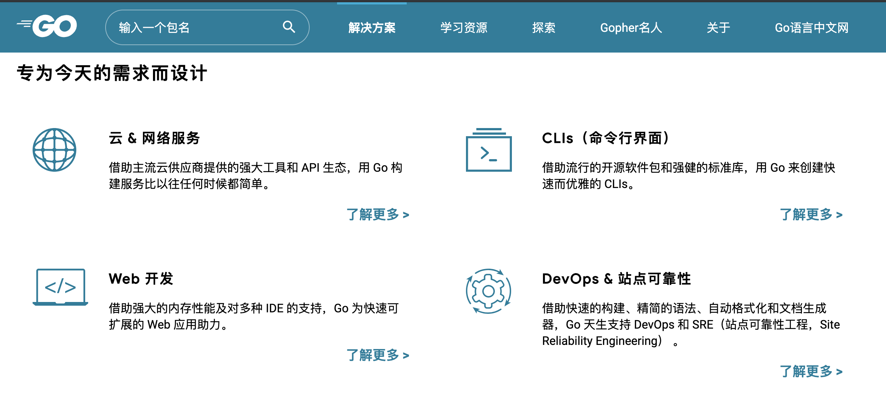
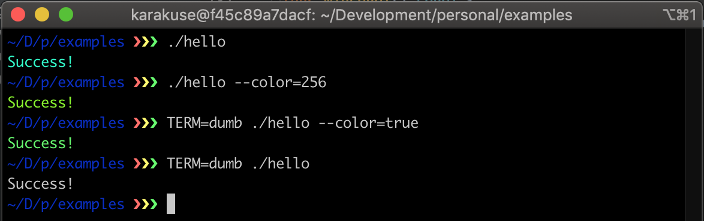
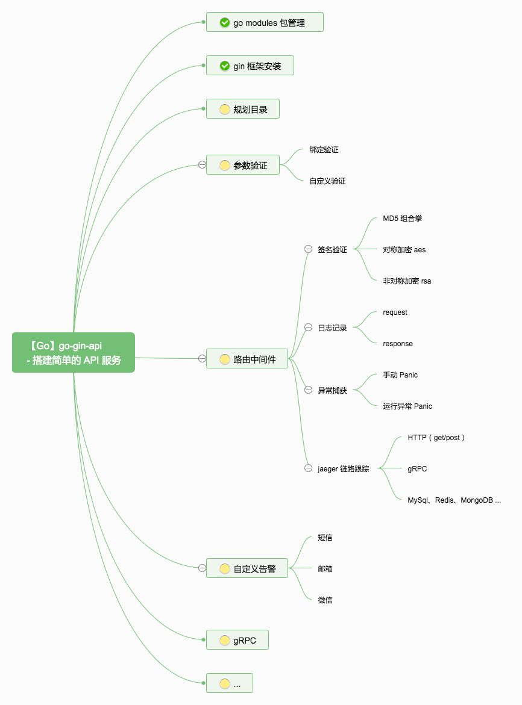

# Go语言爱好者周刊：第 18 期

这里记录每周值得分享的 Go 语言相关内容，周日发布。

本周刊开源（GitHub：[polaris1119/golangweekly](https://github.com/polaris1119/golangweekly)），欢迎投稿，推荐或自荐文章/软件/资源等，请[提交 issue](https://github.com/polaris1119/golangweekly/issues) 。

鉴于大部分人可能没法坚持把英文文章看完，因此，周刊中会尽可能推荐优质的中文文章。优秀的英文文章，我们的 GCTT 组织会进行翻译。

题图：来自 golangweekly.com

## 刊首语

几个值得在刊首提的事情：

1、问答方面，能找到的较少，后续考虑引入 stackoverflow.com，工作量不小；欢迎大家贡献相关资源，提到 https://github.com/polaris1119/golangweekly/issues ；leetcode 的方面的面试题也会是考虑的资源；

2、Go 语言中文网深圳 Meetup 定在 12 月 15 日举行，免费报名地址：http://hdxu.cn/AVyKG

3、Go.Dev 本土化项目：golangclub 在自愿者的努力下，目前完成了很大一部分。

## 资讯

1、[cli 2.0: 快速构建 cli 应用](https://github.com/urfave/cli)

一个历史悠久的库，今年重新焕发了生命。 这是 [v2 手册](https://github.com/urfave/cli/blob/master/docs/v2/manual.md)，其中显示了所有主要功能。

2、[Google App Engine 现在支持 Go1.13](https://cloud.google.com/blog/products/application-development/updating-app-engine-with-more-new-runtimes)

目前处于测试阶段，但将App Engine 带入了基于模块的世界，“用户普遍反馈其内存占用减少了 20％-50％”。

3、[BadgerDB v2.0 发布](https://blog.dgraph.io/post/releasing-badger-v2/)

Badger 是 Go 驱动的键值存储，可支持 DGraph 的许多功能。

4、[Go 官方发起 2019 用户调查](https://google.qualtrics.com/jfe/form/SV_b1xqnBCMpZAhJZ3)

欢迎 Go 爱好者参与。

## 问答

1、[Go 中 在 for 里 的 print](https://segmentfault.com/q/1010000021078297)

注意 print 和 fmt.Print 的区别。之前分享过。

2、[为什么golang time包中的Unix函数要返回int64?](https://segmentfault.com/q/1010000021080161)

你觉得什么原因呢？

3、[应届生学Java还是go好，我现在是php，勿笑，急？](https://www.zhihu.com/question/356754225)

作为老司机的你觉得怎么选？

## 文章

1、[Go开发过程中总是要停下来编译：用它解决你的烦恼，快乐编程](https://mp.weixin.qq.com/s/4xwswOB17A-wup3Gqdlndw)

这样的工具可能不少，这里推荐的 [air](https://github.com/cosmtrek/air) 可以试试。

2、[从Go开源项目BigCache学习加速并发访问和避免高额的GC开销](https://mp.weixin.qq.com/s/SLWj9Qph22cweHtnmh5QhQ)

BigCache 是一个快速，支持并发访问，自淘汰的内存型缓存，可以在存储大量元素时依然保持高性能。BigCache 将元素保存在堆上却避免了 GC 的开销。

3、[在国外远程办公是一种怎样的体验？](https://mp.weixin.qq.com/s/iiteMLkXzQGbz8dFhuU9Tg)

受到 Go 语言中文网的站长 P 神和公司内其它同事的鼓励，我经过反复思考，决定写下这篇文章描述一下我在 Sourcegraph 这家公司作为一名软件工程师的日常。

4、[由一个简单程序图解Go语言内存分配和管理](https://mp.weixin.qq.com/s/Slf7J6ZP4Uz9ukRc-JORyg)

Go 程序的内存从申请阶段到不再使用后的释放阶段都由 Go 标准库自动管理。尽管管理工作不需要开发者参与，但是 Go 对内存管理的底层实现做了非常好的优化，里面充满了有意思的知识点，还是值得我们学习的。

5、[golang 避坑指南(1)interface 之坑多多](https://mp.weixin.qq.com/s/bWsg-ZDBTp3Fp_3Lik83oA)

interface 时 golang 编程中使用得非常频繁的特性，我们需要明白它的底层结构，以及一些编译和运行时的特殊之处，能帮我们避免一些不必要的麻烦。

6、[为什么golang没有volatile？](https://mp.weixin.qq.com/s/FUI-Eoc6V2e5RhDSFxy6Dw)

从 java 转 golang 程序员可能会有一个疑问：为什么 golang 没有 volatile 关键字？这样的话如何保证可见性？

7、[深入浅出Golang Runtime](https://mp.weixin.qq.com/s/TPIIjBycYuhXWOKTg1_2vA)

基于2019.02发布的go 1.12 linux amd64版本, 主要介绍了Runtime一些原理和实现的一些细节, 对大家容易不容易理解或者网络上很多错误的地方做一些梳理！超长文章。

8、[深入理解Golang之http server](https://juejin.im/post/5dd11baff265da0c0c1fe813)

对于 Golang 来说，实现一个简单的`http server`非常容易，只需要短短几行代码。同时有了协程的加持，Go实现的`http server`能够取得非常优秀的性能。这篇文章将会对go标准库`net/http`实现http服务的原理进行较为深入的探究，以此来学习了解网络编程的常见范式以及设计思路。

9、[Go 命令行解析 flag 包之快速上手](https://mp.weixin.qq.com/s/rzgYifoMzWOO_PD0-2UIpw)

本篇文章是 Go 标准库 flag 包的快速上手篇。

10、[编程书说的“Go程序员应该让聚合类型的零值也具有意义”是在讲什么](https://segmentfault.com/a/1190000021098323)

在《Go语言编程》这本书和很多其他Go 编程教程中很多都提到过“Go程序员应该让一些聚合类型的零值也具有意义”的概念，我们这篇文章主要说一下有意义的零值这个话题。

11、[go 学习笔记之咬文嚼字带你弄清楚 defer 延迟函数](https://mp.weixin.qq.com/s/t5tmqsjZ4y4Z_n6u4c9bMw)

温故知新不忘延迟基础。

12、[Golang生态：使用viper管理配置](https://mp.weixin.qq.com/s/p-eFNb6VDSbnNXJxT8LgGA)

通过配置，我们可以动态地改变程序的行为，常用的方式包括配置文件，命令行参数，环境变量等。

13、[用Go重构C语言系统，这个抗住春晚红包的百度转发引擎承接了万亿流量](https://mp.weixin.qq.com/s/bkSDeBqDu1hYnrebIZqiUA)

百度的万亿流量转发引擎 BFE 登上了 GitHub Trending Top 3！

14、[【Golang源码系列】一：Map实现原理分析](https://mp.weixin.qq.com/s/c_7omM1SocMlPnm8heyj4Q)

 学而思网校技术团队出品。

## 开源项目

1、[Rare: 实时正则表达式提取器](https://github.com/zix99/rare)

支持将结果聚合展现为各种格式，如直方图，数值汇总，表格等。

2、[gocloc: Go语言版cloc(代码行统计工具)](https://github.com/hhatto/gocloc)

之前推荐过另外一个工具 [scc](https://github.com/boyter/scc)。

3、[nebula](https://github.com/slackhq/nebula)

在 Slack 每台服务器上运行的可扩展 overlay 网络工具，提供了一个全球覆盖网络。

4、[RedisShake](https://github.com/alibaba/RedisShake)

阿里开源的Redis数据同步工具，Go 语言实现。

5、[gosearch](https://github.com/mingrammer/gosearch)

通过命令行搜索 pkg.go.dev 上的 Go package。

6、[Fastzip](https://github.com/saracen/fastzip)

注重性能的`zip`存档和提取器。

7、[ffuf](https://github.com/ffuf/ffuf)

用 Go 编写的快速网络模糊器。

8、[termcolor](https://github.com/efekarakus/termcolor)

检测终端是否支持颜色。

9、[ff](https://github.com/skanehira/ff)

用 Go 编写的终端上的文件管理器。

## 资源&&工具

1、[Go Time：106 期，代码编辑器与语言服务器(language server)](https://changelog.com/gotime/106)

Go Time 还是挺不错的，有点类似国内的 Go 夜读？

2、[Go Time: 107 期](https://changelog.com/gotime/107)

关于使用 Go 编写编译器和解释器的话题。

3、[NATS 在 k8s 上的一键安装工具](https://github.com/nats-io/k8s)

4、[用 Go 编写的 UNIX ed (line editor) 克隆版本](https://github.com/prologic/ed)

古老的编辑器。

5、[musig: 一个类似 Shazam 的音乐识别工具](https://github.com/sfluor/musig)

对于想要托管自己的类似 Shazam 的服务以从音频样本中识别音乐的所有人，请 Star！

6、Gin 框架系列

- [Gin 框架系列 - 安装和路由配置](https://mp.weixin.qq.com/s/753ZVif7ZRq5L777vqrUrw)
- [Gin框架系列 - 日志记录：Logrus 如何用？](https://mp.weixin.qq.com/s/BNRleKHfyWx7DfUenaZCLA)
- [Gin框架系列 - 数据绑定和验证](https://mp.weixin.qq.com/s/h8wGEyCkmjeUZUGJfQnx-Q)
- [Gin框架系列 - 自定义错误处理](https://mp.weixin.qq.com/s/vUM2Ei_WzXs4M94pNU3bcw)
- [Gin框架系列 - 你是如何组织项目目录的？](https://mp.weixin.qq.com/s/EQYJVRZuAGW964ZyXyxd5A)
- [Gin 框架系列 - 使用 go modules 包管理工具](https://mp.weixin.qq.com/s/8NGwJ4YUmFBQwjg3NOOQlQ)

后续不断发布~

## 订阅

这个周刊每周日发布，同步更新在[Go语言中文网](https://studygolang.com/go/weekly)、[微信公众号](https://weixin.sogou.com/weixin?query=Go%E8%AF%AD%E8%A8%80%E4%B8%AD%E6%96%87%E7%BD%91) 和 [今日头条](https://www.toutiao.com/c/user/59903081459/#mid=1586087918877709)。

微信搜索"Go语言中文网"或者扫描二维码，即可订阅。

