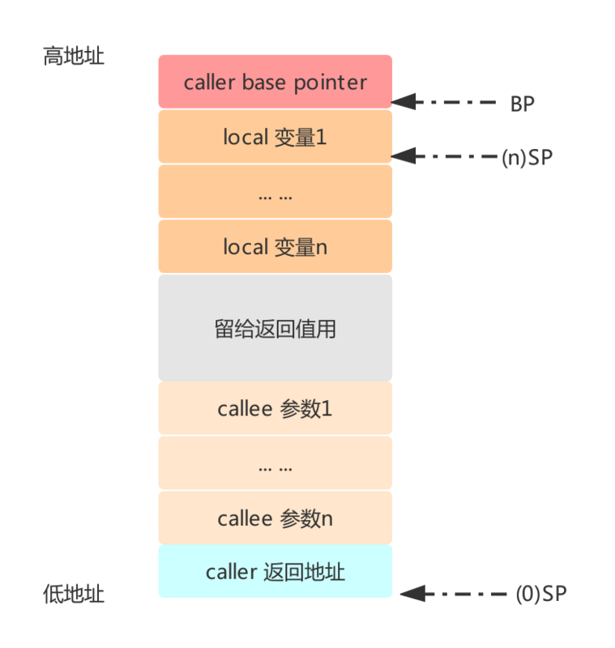
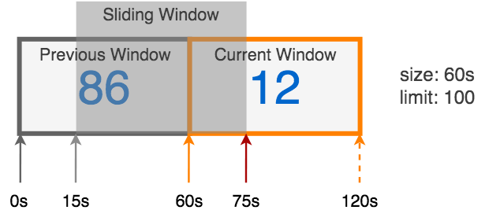

# Go语言爱好者周刊：第 19 期

这里记录每周值得分享的 Go 语言相关内容，周日发布。

本周刊开源（GitHub：[polaris1119/golangweekly](https://github.com/polaris1119/golangweekly)），欢迎投稿，推荐或自荐文章/软件/资源等，请[提交 issue](https://github.com/polaris1119/golangweekly/issues) 。

鉴于大部分人可能没法坚持把英文文章看完，因此，周刊中会尽可能推荐优质的中文文章。优秀的英文文章，我们的 GCTT 组织会进行翻译。

## 刊首语

今天是 2019 年 12 月 1 日了，这是 2019 年最后一个月，也是 201x 系列的最后一个月。2019 年，你的计划完成了吗？

## 资讯

1、[Gin 1.5 发布](https://github.com/gin-gonic/gin/releases/tag/v1.5.0)

目前国内大家推荐最多的 Web 框架。

2、[Hugo 0.60.0 发布，Go 编写的静态网站生成器](https://www.oschina.net/news/111694/hugo-0-60-0-released)

新版本最大改进是：[Goldmark](https://github.com/yuin/goldmark) 现在是供 Hugo 使用 Markdown 的默认库。

3、[百灵快传(B0Pass) 0.1.9 发布](https://github.com/bitepeng/b0pass/releases/tag/v0.1.9)

基于 Go 的高性能“手机电脑超大文件传输神器”、“局域网共享文件服务器”，只需一个文件双击开启。内存占用也很小。

4、[美国运通技术官博：运通选择 Go 语言](https://americanexpress.io/choosing-go/)

Go 是不是真的越来越火了呢？

5、[TinyGo 0.10 发布](https://github.com/tinygo-org/tinygo/releases/tag/v0.10.0)

LLVM 9 改进了对 CGO 的支持，堵塞 select 的支持，以及对某些新 boards 的支持，例如 Adafruit Feather M4 和 X9 Pro 和 [PineTime](https://wiki.pine64.org/index.php/PineTime) 智能手表。

## 问答

1、[关于 golang testing 无法获取覆盖率问题](https://segmentfault.com/q/1010000021142202)

使用的 `go test ./ -v -cover` 。

2、[可以用grpc的双向流模式当普通的socket用吗？](https://segmentfault.com/q/1010000020729334)

因为需要双向通讯，用grpc的双向流比普通socket性能差多少啊

3、[Go net/http Client 某些参数并不是并发安全的？](https://segmentfault.com/q/1010000021108405)

怎么处理？

4、[fmt.Scanf问题，前面的可以输入值，后面的fmt.Scanf不能输入](https://studygolang.com/topics/10486)

## 文章

1、[Go 简单性的价值：来自对 Go 倍加青睐的谷歌软件工程师的自述](https://mp.weixin.qq.com/s/YOrUW17tyKDUrnYNpHN0kg)

Go 语言最近几年逐渐获得越来越多的开发者的喜欢。

2、[Go 特意模糊堆和栈之后，你对 Goroutine 栈了解多少？](https://mp.weixin.qq.com/s/Q-gXt33lAG49MjpaZujvfQ)

每个协程都需要有自己的栈空间，来存放变量，函数，寄存器等信息。所以系统需要给协程分配足够的栈空间。

3、[Go 语言 Web 应用开发 第 04 课：高级模板用法](https://mp.weixin.qq.com/s/wwFBzGlVYLQ9sqxcLA6uAw)

这节课，我们将学习标准库模板引擎中的一些高级概念和使用方法，并将渲染结果转换为 HTML。

4、[带你领略Go源码的魅力 — Go内存原理详解](https://mp.weixin.qq.com/s/z3q1A-Apky53Z8OHzNBvEw)

Go语言的内存管理模型可以说是生来高贵，既继承了C/Unix系的内存管理血统，又在实现的时候还做了很多优化，我们下面通过源码一步步来看一下 Golang 的内存管理实现。

5、[实战：使用 Go 打造另一款简单实用的 ORM](https://mp.weixin.qq.com/s/L8b82xN6qB9yfvgyX3tYQA)

一个类似Laravel DB操作的ORM。

6、[Go 号称几行代码开启一个 HTTP Server，底层都做了什么？](https://mp.weixin.qq.com/s/n7mSUB6pxoYmr5u575Nqqg)

这篇文章将会对go标准库`net/http`实现http服务的原理进行较为深入的探究，以此来学习了解网络编程的常见范式以及设计思路。

7、[sync.Pool 一定会提升性能吗？建议你先学习一下它的设计](https://mp.weixin.qq.com/s/uAjcH7raKnlkJ29iX1q8cw)

本文基于 Go 1.12 和 1.13 版本，并解释了这两个版本之间 sync/pool.go 的演变。

8、[Go 如何处理 HTTP 请求？掌握这两点即可](https://mp.weixin.qq.com/s/iGS4ue-_JSRv7XrfIRaqpg)

使用 Go 处理 HTTP 请求主要涉及两件事：ServeMuxes 和 Handlers。

9、[你真的不需要再设置 GOROOT](https://mp.weixin.qq.com/s/8APTpaXRgTSGBkzYqEL5-w)

为什么不再需要设置 `GOROOT` 呢？推荐读两篇英文文章，我意译了下，将它们放在了一篇里。

10、[Go 命令行解析 flag 包之通过子命令实现看 go 命令源码](https://mp.weixin.qq.com/s/JTjueDUts_zCP-FShT4Ovw)

本篇介绍如何使用 `flag` 实现子命令，总的来说，这篇才是这个系列的核心。

11、[Git commit message 规范](https://juejin.im/post/5d0b3f8c6fb9a07ec07fc5d0)

git是现在市面上最流行的版本控制工具，书写良好的commit message能大大提高代码维护的效率。但是在日常开发中由于缺少对于commit message的约束，导致填写内容随意、质量参差不齐，可读性低亦难以维护。在项目中引入commit message规范已是迫在眉睫。

12、[走进 Golang 之运行与 Plan9 汇编](https://mp.weixin.qq.com/s/5x7OV47dfOwwVvQCPkvFKg)

我们一起来学习一下生成的目标代码如何在计算机上执行。以及通过查阅 `Golang` 的 Plan9 汇编来了解 Golang 的一些内部秘密。

## 开源项目

1、[inlets: ngrok 的替代品](https://github.com/inlets/inlets)

将你本地的服务端点暴露到互联网上。

2、[beyond: Go 语言 AOP 库(aspect-oriented programming)](https://github.com/wesovilabs/goa)

Java 转 Go 的是不是很喜欢？

3、[go-netty](https://github.com/go-netty/go-netty)

大量参考了netty 的设计并融合 Go 本身的协程特性而开发的一款高性能网络库。

4、[hubble](https://github.com/cilium/hubble)

一个为云原生工作负载打造的完全分布式的有关网络和安全的可视平台。

5、[slidingwindow](https://github.com/RussellLuo/slidingwindow)

用于分布式限速的滑动窗口算法的Go实现。

6、[watch](https://github.com/antonmedv/watch)

使用Go重新实现unix watch命令。

7、[clusterlint](https://github.com/digitalocean/clusterlint)

Kubernetes 集群的最佳实践检查器，DigitalOcean 出品。

8、[nutsdb](https://github.com/xujiajun/nutsdb)

一个用纯 Go 编写的简单，快速，可嵌入和持久的键/值存储库。

9、[keda](https://github.com/kedacore/keda)

微软和红帽联合开发的一个基于 Kubernetes 的事件驱动自动缩放组件，已发布 1.0。

10、[fx: Go 的基于依赖注入的应用程序框架](https://github.com/uber-go/fx)

Uber 出品。你对 Go 中的依赖注入可能了解不多，但是它的概念可以很好地应用。 Fx 是使 DI 变得容易的便捷工具。这里有一篇介绍文章：https://blog.huyage.dev/posts/simple-dependency-injection-in-go/ 。

11、[secure: 用于 Go 的 HTTP 中间件，有助于快速获得安全性](https://github.com/unrolled/secure)

涵盖内容安全策略，SSL 重定向，允许某些主机，设置引荐来源网址策略等领域。

12、[go-sqlbuilder: 灵活的 SQL 字符串生成器库](https://github.com/huandu/go-sqlbuilder)

主要关注 MySQL 和 Postgres。包括通过结构体的基本 ORM 类型支持。

13、[bigmachine: Go 中用于自我管理无服务器计算的库](https://github.com/grailbio/bigmachine)

生物技术初创公司 Grail 的两个大数据相关项目，另一个是：[bigslice](https://github.com/grailbio/bigslice)，无服务器集群计算系统。这里有一篇英文介绍文章：https://thenewstack.io/bigmachine-and-bigslice-two-new-open-source-serverless-projects/

14、[gcache](https://github.com/8treenet/gcache)

gorm 的中间件，插入后 gorm 即刻拥有缓存。

15、[gotop](https://github.com/cjbassi/gotop)

基于 gtop 和 vtop 的终端图形活动监视器。

16、[qt](https://github.com/therecipe/qt)

支持各个系统的 Qt 绑定。

17、[reflow](https://github.com/muesli/reflow)

可以自动换行字符串或整个文本块。它遵循 io.Writer 接口并支持 ANSI 转义序列。

18、[rqlite](https://github.com/rqlite/rqlite)

基于 SQLite 的轻量级分布式关系数据库。

19、[ToBeAdmin](https://github.com/fanpei0121/ToBeAdmin)

beego 与 Ant Design Pro Vue 基础权限系统。

## 资源&&工具

1、[Uncle Bob 的 Clean Architecture 的 Go 实现样例](https://github.com/bxcodec/go-clean-arch)

你会采用吗？

2、[最受欢迎的 Go 语言在线课程列表](http://www.coursenames.com/skills/golang/)

英文的！感觉 GolangClub 可以搞搞中文的。有中文资料欢迎留言推荐！

3、[gtrace](https://github.com/agis/gtrace)

适用于 Linux x86-64 的实验系统调用跟踪程序。

4、[PNGR: Dockerized (Postgres + Nginx + Go + React)](https://github.com/karlkeefer/pngr) 

用于 Web 应用程序的入门工具包，包括用户和会话管理，JWT 身份验证和基本的 CRUD 示例。作为学习的一个项目推荐。

5、[errwrap](https://github.com/fatih/errwrap)

使用新的 `％w` 动词指令包装和修复错误的 Go 工具。

6、[Golang 程序员开发效率神器汇总！](https://segmentfault.com/a/1190000021155038)

汇总了开发工具、调试工具、网络工具、常用网站和 golang 常用库。

7、2019 年 11 月 30 日北京 Meetup PPT 下载

- [探探长链接项目的Go语言实践](res/探探长链接项目的Go语言实践.pdf)
- [蚂蚁金服深度剖析Mosn](res/深度剖析Mosn.pdf)
- [美团构建部署平台解析与Go 的实践](res/美团构建部署平台解析与Go 的实践.pdf)
- [探探微服务架构演进之路](res/探探微服务架构演进之路.pdf)
- [Go语言电子表格文档格式标准实践](res/Go语言电子表格文档格式标准实践.pdf)

或通过网盘下载: https://pan.baidu.com/s/1v12Q1N2s6-P5JD3gwfmAuQ 提取码: zeip 

## 订阅

这个周刊每周日发布，同步更新在[Go语言中文网](https://studygolang.com/go/weekly)、[微信公众号](https://weixin.sogou.com/weixin?query=Go%E8%AF%AD%E8%A8%80%E4%B8%AD%E6%96%87%E7%BD%91) 和 [今日头条](https://www.toutiao.com/c/user/59903081459/#mid=1586087918877709)。

微信搜索"Go语言中文网"或者扫描二维码，即可订阅。

