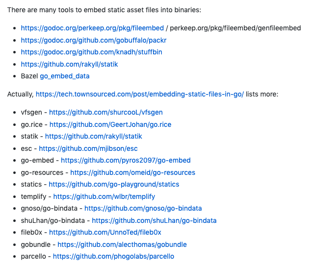
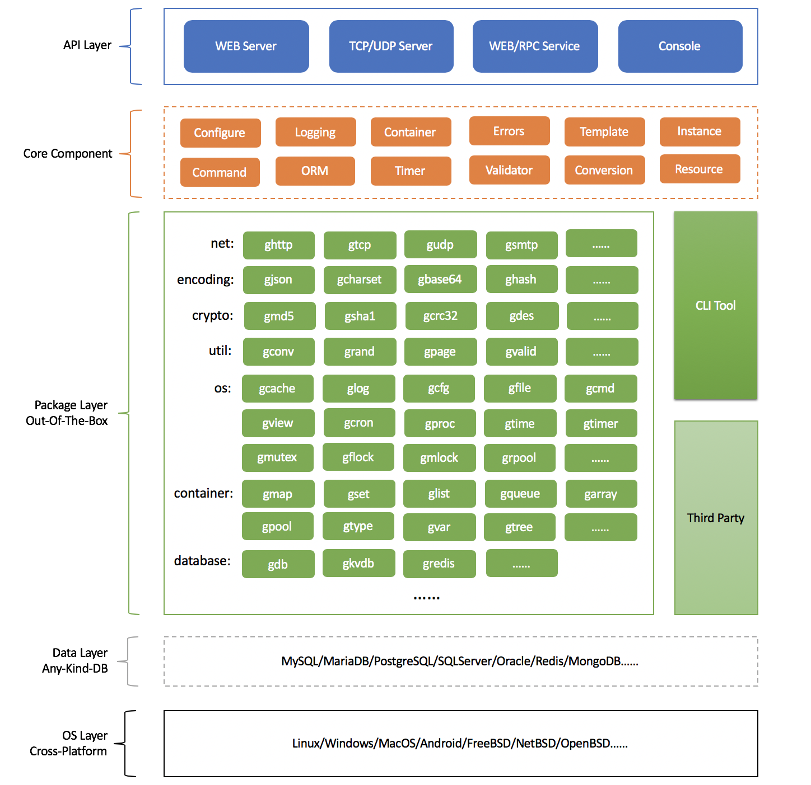
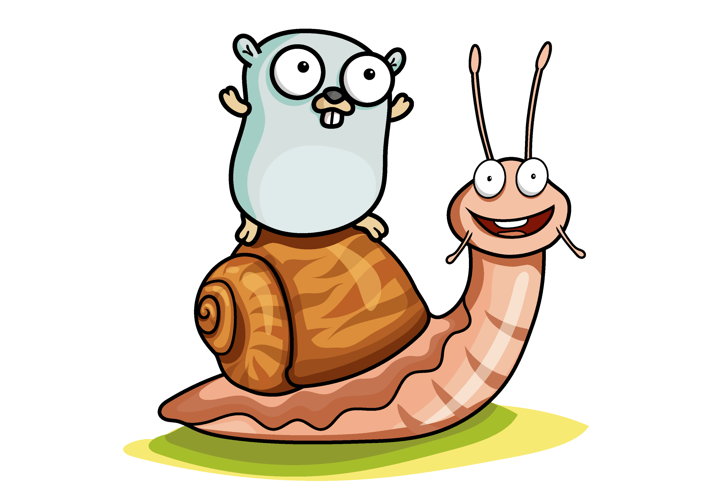
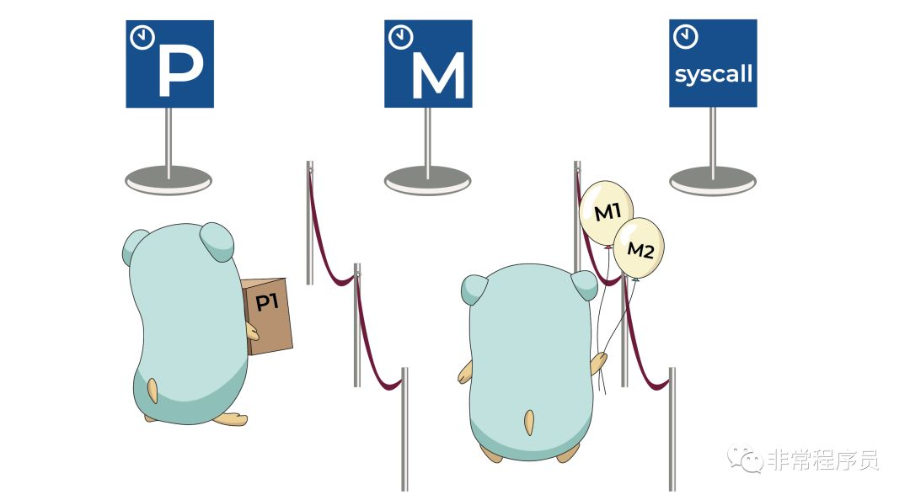
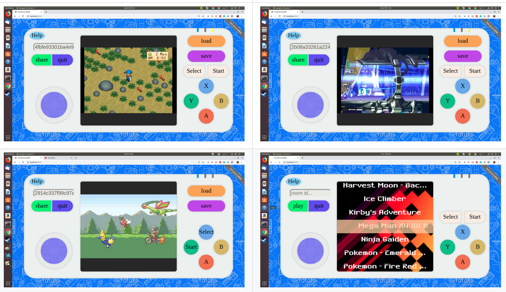
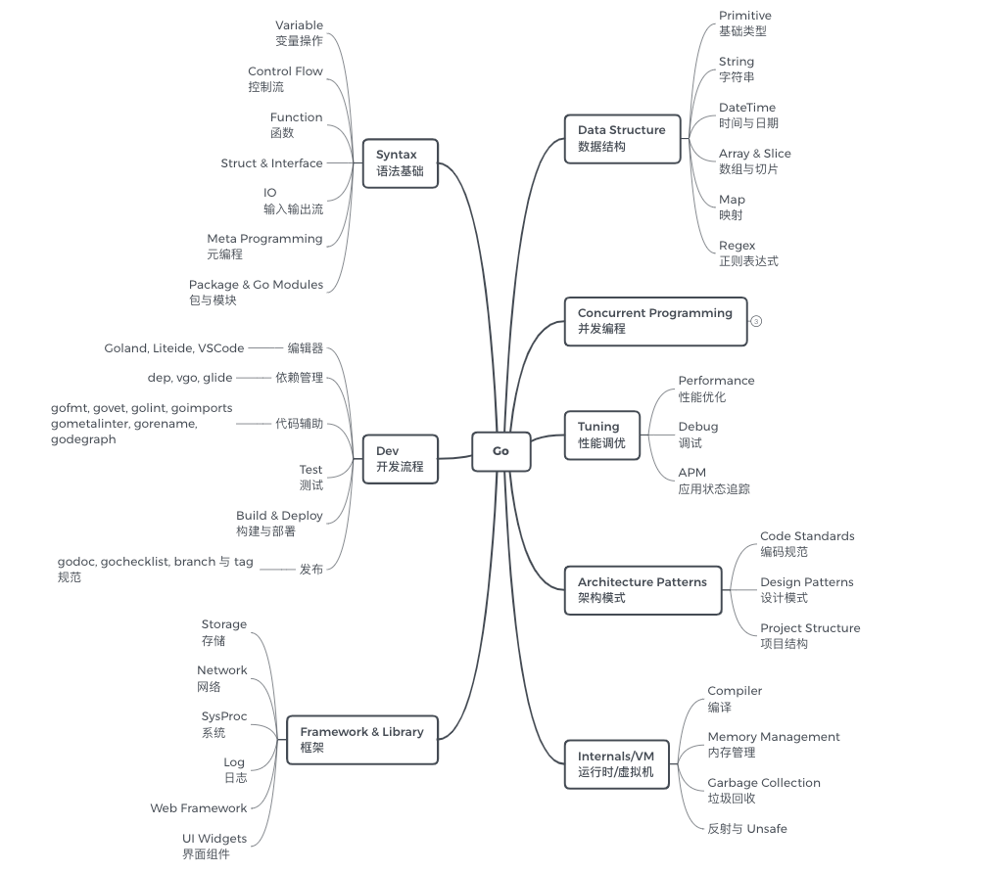

# Go语言爱好者周刊：第 20 期

这里记录每周值得分享的 Go 语言相关内容，周日发布。

本周刊开源（GitHub：[polaris1119/golangweekly](https://github.com/polaris1119/golangweekly)），欢迎投稿，推荐或自荐文章/软件/资源等，请[提交 issue](https://github.com/polaris1119/golangweekly/issues) 。

鉴于大部分人可能没法坚持把英文文章看完，因此，周刊中会尽可能推荐优质的中文文章。优秀的英文文章，我们的 GCTT 组织会进行翻译。

题图：Illustration created for “A Journey With Go”, made from *the original Go Gopher, created by Renee French.*

## 资讯

1、[提案：cmd/go — 支持将静态资产（文件）嵌入二进制文件](https://github.com/golang/go/issues/35950)

我只能说现有这样的工具真的很多，可能是真有需求。

2、[Go 1.13.5 和 Go 1.12.14 发布](https://studygolang.com/dl)

小版本，主要一些 bug 修复。

3、[TiDB 3.0.7 发布，分布式 NewSQL 数据库](https://www.oschina.net/news/111906/tidb-3-0-7-released)

主要性能优化和问题修复。

4、[gmanager v0.1.6 发布，基于 gf 的管理平台](https://www.oschina.net/news/111901/gmanager-0-1-6-released)

gmanager 是基于 gf 框架的管理平台，具备登录、认证、组织机构、用户、角色、菜单和日志管理。

5、[gtoken v1.3.7 发布，支持 gf 最新版本 v1.10.0](https://www.oschina.net/news/111900/gtoken-1-3-7-released)

基于 gf 框架的 token 插件，通过服务端验证方式实现 token 认证；已完全可以支撑线上 token 认证，并支持集群模式；使用简单。

6、[go-fastdfs v1.3.5 发布，支持断点续传自定义认证，路径自定义认证](https://www.oschina.net/news/111892/go-fastdfs-1-3-5-released)

go-fastdfs 是一个基于 http 协议的分布式文件系统，它基于大道至简的设计理念，一切从简设计，使得它的运维及扩展变得更加简单，它具有高性能、高可靠、无中心、免维护等优点。

7、[GoFrame v1.10.0 发布，Go 应用开发框架](https://www.oschina.net/news/111866/goframe-1-10-0-released)

`GF(Go Frame)`是一款模块化、高性能、生产级Go应用开发框架。提供了常用的核心开发组件，如：缓存、日志、文件、时间、队列、数组、集合、字符串、定时器、命令行、文件锁、内存锁、对象池、连接池、资源管理、数据校验、数据编码、文件监控、定时任务、数据库ORM、TCP/UDP组件、进程管理/通信、 并发安全容器等等。这次更新了挺多东西。

8、[rqlite 4.6.0 发布，它是 SQLite，但是分布式的](https://github.com/rqlite/rqlite/releases/tag/v4.6.0)

本质上是在后台使用 SQLite 的轻型分布式关系数据库。

## 文章

1、[Go 创建对象时，如何优雅的传递初始化参数](https://mp.weixin.qq.com/s/hwuDB5Awx4ifuD9V7XW9pg)

本文将通过一个渐进式的`demo`示例来介绍`Option`模式，以及相关的一些思考。*本文将内容切分为 10 个小模块，如果觉得前面的铺垫冗余，想直接看 Option 模式的介绍，可以从小标题七开始阅读。*

2、[发布订阅模式：使用 Go 实现简单的事件总线](https://mp.weixin.qq.com/s/cRab8ttjqgrZUN0Zoqc-XA)

事件驱动架构是计算机科学中一种高度可扩展的范例。它允许我们可以多方系统异步处理事件。

3、[培训大师 William 图解 Go 中的 GC 系列：第一部分 - 基础](https://mp.weixin.qq.com/s/mYp3QbdWR4HEZimFUw9bAA)

这是三篇系列文章的第一篇博文，系列文章提供了 Go 中垃圾回收背后的机制和概念的理解。这篇博文主要介绍回收器的基础概念。

4、[培训大师 William 图解 Go 中的 GC 系列：第二部分 - GC 追踪](https://mp.weixin.qq.com/s/0r8R1elPd32ayFpURt2Arw)

这是三篇系列文章中的第二篇，该系列文章将会提供一个对 Go 垃圾回收器背后的机制和概念的理解。本篇主要介绍如何生成 GC 追踪并解释它们。

5、[50 条争论的文章发生了啥：Go 标准库 encoding/json 真的慢吗？](https://mp.weixin.qq.com/s/U3QcbqOaRAABd-ESkzpI1Q)

这篇文章在 Go 语言中文网发布后，有网友争吵起来了，近 50 条评论，真是佩服技术人员！！这里看评论：https://studygolang.com/articles/25100 。

6、[Go 标准库源码学习（一）详解短小精悍的 Once](https://mp.weixin.qq.com/s/Lsm-BMdKCKNQjRndNCLwLw)

Once：保证某个动作只执行一次。

7、[线上真实场景：实战 Goroutine 泄露排查](https://mp.weixin.qq.com/s/EXMP9lV-YQeAvLShd7Ee4w)

值得学习排查过程。

8、[用图说话：Go语言的协程，系统线程以及CPU管理](https://mp.weixin.qq.com/s/neLVacrxrvhb2gbEP_g5dA)

创建系统线程以及在系统线程间切换，会对程序的内存和性能造成较大的开销。`Go`的目标是尽量利用`CPU`多核资源。设计之初就考虑了高并发性。

9、[golang 在 runtime 中的一些骚东西](https://purewhite.io/2019/11/28/runtime-hacking-translate/)

最近在研究性能优化的时候，看到了 golang runtime 包下的一个文档 [`HACKING.md`](https://github.com/golang/go/blob/master/src/runtime/HACKING.md)觉得颇有意思，读完之后觉得对于 runtime 的理解更上一层，于是想着翻译一下。

10、[Golang为什么没有整型的max/min方法](https://studygolang.com/articles/25200)

作为有一些经验的Golang开发者，你可能意识到了Golang并没有max/min方法来返回给定的两个或多个整型数值中的最大值或最小值。其他语言通常会在核心库中提供这类方法。 你有没有想过为什么Golang没有这么做？

11、[Go语言第一深坑 - interface 与 nil 的比较](https://studygolang.com/articles/10635)

这个很常见，讲解的人也很多，如果你不知道，建议再看看。

## 开源项目

1、[GoFakeIt: 随机伪数据生成器](https://github.com/brianvoe/gofakeit)

GoFakeIt 具有 120 多种功能，可以生成用户名，电子邮件地址，电话号码，颜色等信息。

2、[enmime: MIME 邮件编码和解码包](https://github.com/jhillyerd/enmime)

enmime 是 Go 的 MIME 编码和解码库，专注于生成和解析 MIME 编码的电子邮件。

3、[joker](https://github.com/candid82/joker)

Go 语言实现的小型 Clojure 解释器。

4、[cloud-game](https://github.com/giongto35/cloud-game)

Go 实现的流行游戏云服务框架。

5、[go-srp](https://github.com/getinsomnia/go-srp)

Go版安全远程密码（SRP）协议库。

6、[dbq](https://github.com/rocketlaunchr/dbq)

零样本数据库操作库。

7、[hubble](https://github.com/cilium/hubble)

Kubernetes 的网络，服务，安全性的监测工具。

8、[encoding](https://github.com/segmentio/encoding)

Go 软件包，其中包含有效的编码，解码和验证 API 的实现。

## 资源&&工具

1、[go-advices](https://github.com/cristaloleg/go-advices/blob/master/README_ZH.md)

Go 的一些最佳实践。

2、[Gopherpalooza 是上个月在硅谷举行的 2019 Go 会议](http://gopherpalooza.com/)

会议上 [13 个主题演讲，在 youtube 上](https://www.youtube.com/playlist?list=PLeGxIOPLk9EL4BDb-8tAUY2YYv0aVgTXY#gopherpalooza2019) 。

3、[Go Series：语法基础、工程实践、并发编程、Web 开发](https://github.com/wx-chevalier/Go-Series)

涵盖了 Golang 由浅入深的学习笔记。

4、[Go 刷 LeetCode 系列](https://mp.weixin.qq.com/s/zHGyz0vWprlozJn1thgS7g)

Go 语言中文网公众号开始发布 Go 刷 LeetCode 系列，欢迎关注一起刷题。

5、[Git commit message 规范](https://juejin.im/post/5d0b3f8c6fb9a07ec07fc5d0)

书写良好的 commit message 能大大提高代码维护的效率。

## 订阅

这个周刊每周日发布，同步更新在[Go语言中文网](https://studygolang.com/go/weekly)、[微信公众号](https://weixin.sogou.com/weixin?query=Go%E8%AF%AD%E8%A8%80%E4%B8%AD%E6%96%87%E7%BD%91) 和 [今日头条](https://www.toutiao.com/c/user/59903081459/#mid=1586087918877709)。

微信搜索"Go语言中文网"或者扫描二维码，即可订阅。

