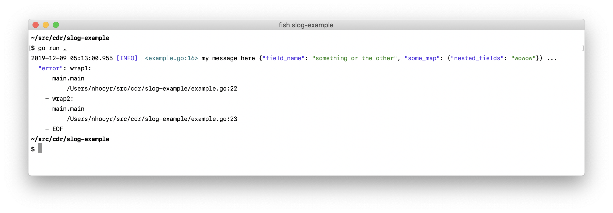

# Go语言爱好者周刊：第 21 期

这里记录每周值得分享的 Go 语言相关内容，周日发布。

本周刊开源（GitHub：[polaris1119/golangweekly](https://github.com/polaris1119/golangweekly)），欢迎投稿，推荐或自荐文章/软件/资源等，请[提交 issue](https://github.com/polaris1119/golangweekly/issues) 。

鉴于大部分人可能没法坚持把英文文章看完，因此，周刊中会尽可能推荐优质的中文文章。优秀的英文文章，我们的 GCTT 组织会进行翻译。

## 刊首语

第一次到深圳，第一次远距离参加自己组织的 Go 语言 Meetup，这个日子很特别，让我印象深刻！很感谢尹总亲自到机场接我。线下交流，我觉得最重要的是多认识一些人，多一些交流，开阔视野。

深圳的气候真的很好，很舒服！期待和大家见面交流！

## 资讯

1、[Kubernetes 1.17 发布，包含 22 个增强功能](https://www.oschina.net/news/112009/kubernetes-1-17-released)

这是其在 2019 年的第四次也是最后一次发布。Kubernetes v1.17 包含有 22 个增强功能：其中，14 个增强功能已逐渐稳定，4 个增强功能已进入 beta 版，还有 4 个增强功能则已进入 alpha 版本。

2、[TiDB 2.1.18 发布，分布式 NewSQL 数据库](https://www.oschina.net/news/111961/tidb-2-1-18-released)

主要是优化和问题改进。

3、[Traefik 2.1.0 发布，HTTP 反向代理与负载均衡工具](https://www.oschina.net/news/112030/traefik-2-1-0-released)

功能增强和 Bug 修复。

## 文章

1、[培训大师 William 图解 Go 中的 GC 系列：第三部 - GCPacing](https://mp.weixin.qq.com/s/aeIf0YqS0W-sbf5LbfBmKw)

这是三篇系列文章中的第三篇。该系列文章提供了一种对 Go 垃圾回收背后的机制和概念的理解。本篇的主要内容是 GC 如何控制自己的步调。

2、[小米大佬讲解 Go 之运行与Plan9汇编](https://mp.weixin.qq.com/s/WLISnJ1J7_iKlwCed0uxYQ)

学习一下生成的目标代码如何在计算机上执行，以及通过查阅 `Golang` 的 Plan9 汇编来了解Golang的一些内部秘密。

3、[妙到颠毫：你应该学会的 bigcache 优化技巧](https://mp.weixin.qq.com/s/RrwyzhUZDUymGNcgUo2vnA)

结合 bigcache 的代码，仔细学习了相关的优化设计，感觉设计非常的精妙，所以特意根据自己的理解又总结了一篇。

4、[也许你不知道的 Go 中 defer 的一个隐藏功能](https://mp.weixin.qq.com/s/VqltwKHsg3TZ8NE2KNo9iA)

你知道是什么功能吗？

5、[Go 不建议使用的 unsafe 包有什么用处？](https://mp.weixin.qq.com/s/z5xZ6y32K6VLRd_2EF-2CQ)

该名称被用作提示 unsafe 包可能带来 Go 类型的不安全性。现在我们来深入探讨一下文档中提到的两点。

6、[明白了，原来 Go Web 框架中的中间件都是这样实现的](https://mp.weixin.qq.com/s/KcjXEH7C4GhREg7c0Z_fuA)

这篇文章想谈谈 Go 的装饰器模式、pipeline(filter)模式以及常见 web 框架中的中间件的实现方式。

7、[Go 实战：Twitter 的分布式 ID 生成算法 snowflake 的 Go 语言实现](https://mp.weixin.qq.com/s/a_g6wy4DzkAmc-i1Wen3XA)

snowflake 单词原意为雪花，是 twitter 开源的一种分布式 ID 生成算法。该算法可以保证在不借助第三方服务或者说工具的情况下，在多台机器上持续生成保证唯一性的 64 位整型 ID。

8、[你应该掌握的 Go 高级并发模式：计时器](https://mp.weixin.qq.com/s/Sk8SmDFdaOSxg_bQlQBHLg)

准确使用计时器很难的，所以这里进行一些说明。

9、[Go1.13 标准库的 http 包爆出重大 bug，你的项目中招了吗？](https://mp.weixin.qq.com/s/zb3ld-6ySFvwM8XcQUdnpg)

据官方开发人员表示，该 bug 于 1.13 版本引进，目前已经在 1.13.5 修复。

10、[Go Gin 系列一：Go 介绍与环境安装](https://mp.weixin.qq.com/s/uO310Fou1HNOonfl4flgCg)

从今天开始将会把 Go Gin 的入门系列给更新过来，如果大家有什么问题、建议疑问，欢迎随时交流和碰撞，也可以到 go-gin-example 项目提问。

11、[从 HTTP 角度看 Go 如何实现文件提交](https://mp.weixin.qq.com/s/_IwbltYHvH5BPSBhq-S0TQ)

介绍下 Go 如何实现文件上传。

12、[Go实现简单负载均衡](https://mp.weixin.qq.com/s/sd13tn1_HOl3xEGwOyUmTA)

为大家分享一篇关于Go实现简单的负载均衡器的文章，只是对负载均衡进行了基础的功能实现，有助于对负载均衡的理解。如果有兴趣，也可以以此为基础进行功能扩展，希望能对大家有所帮助。

13、[一文让你知道为什么学了 PHP 的都要转学 Go 语言](https://mp.weixin.qq.com/s/lenXm3BIbmrj37fd9O7soQ)

你准备好学习 Go 了吗？

14、[Golang 在电商即时通讯服务建设中的实践](https://mp.weixin.qq.com/s/2n1peAsc-3DyO5EX-oOOPA)

本文我们将结合马蜂窝旅游电商 IM 服务的发展历程，重点介绍基于 Go 的 IM 重构，希望可以给有相似问题的朋友一些借鉴。

## 开源项目

1、[dockerslim](https://github.com/docker-slim/docker-slim)

对 Docker 容器镜像进行瘦身和安全加固。

2、[base64Captcha](https://github.com/mojocn/base64Captcha)

高度可自定义的图形验证码库。

3、[garble](https://github.com/mvdan/garble)

Go 构建混淆工具。

4、[fyne](https://github.com/fyne-io/fyne)

跨平台 Go GUI 工具包，最新的 1.2.0 版本支持 Android 和 iOS。

好吧，稍微有点丑！

5、[ghw](https://github.com/jaypipes/ghw)

硬件检查和发现库(无需ROOT权限)。

6、[sqlc](https://github.com/kyleconroy/sqlc)

将 SQL 查询语句编译为类型安全的 Go 源码。

7、[offline-browser-communication](https://github.com/pion/offline-browser-communication)

Go实现不发出信号的情况下连接两个WebRTC服务

8、[slog](https://github.com/cdr/slog)

Go 的最小结构化日志记录库。

9、[lotus](https://github.com/filecoin-project/lotus)

用 Go 编写的 Filecoin 协议（分布式存储网络）的实现。

10、[rclone](https://github.com/rclone/rclone)

各大云存储的 rsync。

## 资源&&工具

1、[Nodejs 开发人员的 Go 学习指南（及例子)](https://github.com/miguelmota/golang-for-nodejs-developers) （英文）

例子学习是一种很好的方式。

2、[GoTime：并发、并行与异步设计](https://changelog.com/gotime/109)

有音频可以听，英文好的可以听听。

3、[Go 语言资料汇总](https://github.com/ardanlabs/gotraining/blob/master/reading/README.md)

William Kennedy 整理，英文的。

4、[Go 中不常注意的各种细节集锦](https://mp.weixin.qq.com/s/dPSa934ysHVt9dpOXEmG4w)

来自 Go 夜读。

## 订阅

这个周刊每周日发布，同步更新在[Go语言中文网](https://studygolang.com/go/weekly)、[微信公众号](https://weixin.sogou.com/weixin?query=Go%E8%AF%AD%E8%A8%80%E4%B8%AD%E6%96%87%E7%BD%91) 和 [今日头条](https://www.toutiao.com/c/user/59903081459/#mid=1586087918877709)。

微信搜索"Go语言中文网"或者扫描二维码，即可订阅。

