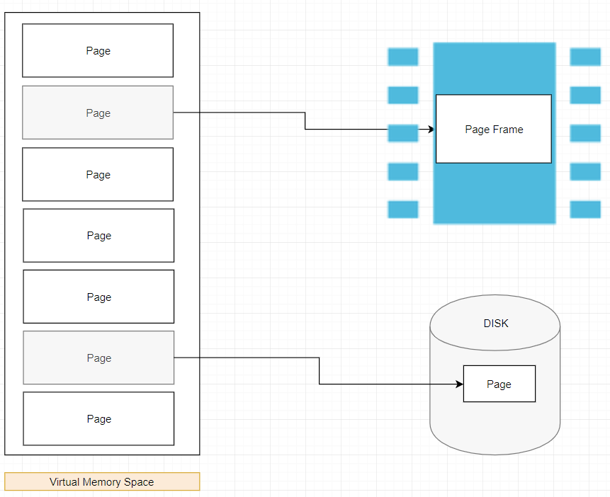
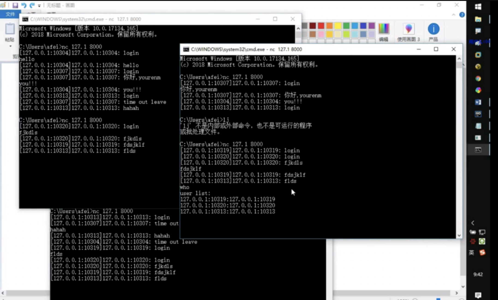
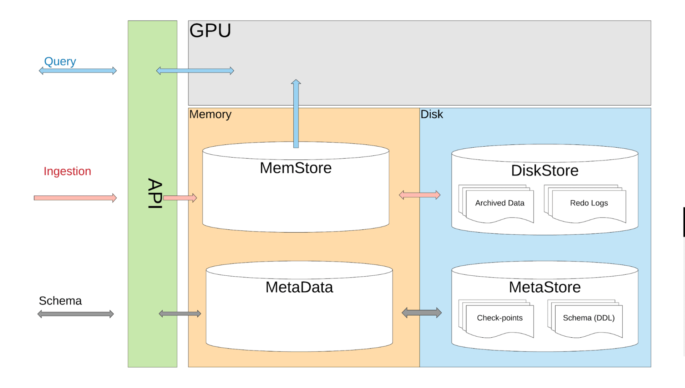
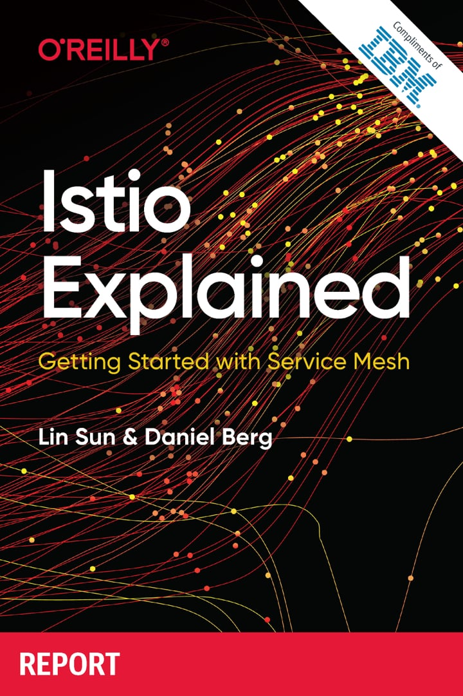

# Go语言爱好者周刊：第 22 期

这里记录每周值得分享的 Go 语言相关内容，周日发布。

本周刊开源（GitHub：[polaris1119/golangweekly](https://github.com/polaris1119/golangweekly)），欢迎投稿，推荐或自荐文章/软件/资源等，请[提交 issue](https://github.com/polaris1119/golangweekly/issues) 。

鉴于大部分人可能没法坚持把英文文章看完，因此，周刊中会尽可能推荐优质的中文文章。优秀的英文文章，我们的 GCTT 组织会进行翻译。

题图：2019 年冬至，来自网络。

## 刊首语

自从来了北京后才知道有冬至这么一个节日（更别说南汤圆了，我家根本不过这个节日），入乡随俗？一般冬至碰上工作日，会跟着同事一起吃顿饺子，但今天周日，所以你懂的~不管怎地，大家冬至快乐！

要打造一个好的社区真不容易，需要不断的琢磨，怎么才能做得更好？如果你是一个社区爱好者，希望为 Go 社区贡献一份力量，欢迎加入「Go语言中文网」社区，一起做一件有意义的事情，欢迎加我微信：274768166。详细信息可以参考：[12 月 15 日 Go 语言中文网深圳 Meetup 总结暨有偿自愿者招募](https://mp.weixin.qq.com/s/NyIXjAgadCbi6wq2HJkkmQ)。

## 资讯

1、[Go 1.14 应该很棒](https://studygolang.com/topics/10612)

Go 1.14 Beta 发布，文档：https://tip.golang.org/doc/go1.14

2、[Go Micro 1.6 发布](https://github.com/micro/go-micro)

一个微服务开发框架。提供分布式系统开发所需的核心功能。最近的几个发行版改进了该项目对 Go 模块的使用。

3、[Watermill 1.0 发布](https://github.com/ThreeDotsLabs/watermill/tree/v1.0.0)

一个可有效处理消息流的 Go 库。

4、[cli 2.0 发布](https://github.com/urfave/cli)

构建 Go CLI 应用程序的快速方法。一个历史悠久的库今年重新焕发了生命。[这是 v2 手册](https://github.com/urfave/cli/blob/master/docs/v2/manual.md)，其中展示了所有主要功能。

5、[Go 泛型提案新进展：参数化的 interface 替换 contract](https://go-review.googlesource.com/c/go/+/187317)

科学上网查看。

## 文章

1、[用 70 行 Go 代码击败 C 语言](https://mp.weixin.qq.com/s/4HCh55eFu-JF9TBbhdsuZg)

Chris Penner 最近发布的一篇文章 **Beating C with 80 Lines of Haskell** 引发了 Internet 领域内广泛的论战，进而引发了一场用不同语言实现 `wc` 的圣战。

2、[聊聊 Go 语言中的字符表示与字符串遍历](https://mp.weixin.qq.com/s/ganVVI2kGMuXIsw6tpSo1A)

和其他语言不同，在 Go 语言中没有字符类型，**字符只是整数的特殊用例**。

3、[Go 质量保证：集成测试（1） - 用 Docker 执行测试](https://mp.weixin.qq.com/s/UYCXp7TrIm4d2cUwi7Un-Q)

测试会带来失败，而失败会带来理解。

4、[Go 在马蜂窝即时通讯服务建设中的实践](https://mp.weixin.qq.com/s/xs6WePLXtIu43bYynsxMWA)

本文我们将结合马蜂窝旅游电商 IM 服务的发展历程，重点介绍基于 Go 的 IM 重构，希望可以给有相似问题的朋友一些借鉴。

5、[你应该知道的 Go 调度器知识：Go 核心原理 — 协程调度时机](https://mp.weixin.qq.com/s/aoZn1JoND252swkwIdOy-Q)

- 会阻塞的系统调用，比如文件 io，网络 io；
- time 系列定时操作；
- go func 的时候, func 执行完的时候；
- 管道读写阻塞的情况；
- 垃圾回收之后。
- 主动调用 runtime.Gosched()

6、[Go内存泄漏？不是那么简单!](https://mp.weixin.qq.com/s/IA14BSTt4FaIIVpg8v5rkg)

最近遇到一个 Go 内存不释放的问题，记录一下测试和调研的情况。我到不把它归为 Go 内存泄漏的问题，因为它和一般的内存泄漏的方式不同。

7、[深入 Go 内存分配超级棒的文章：Go 内存分配器可视化指南](https://mp.weixin.qq.com/s/RYtc5oZ4CmQZouLIcsloDw)

我们将通过这篇文章来一层层的剥离这些细节。如果你想学习所有关于 Go 内存分配器的知识，那么这篇文章正适合你。

8、[Go modules：最小版本选择](https://mp.weixin.qq.com/s/gDIV6hHcjJ0SCpRZdk2VhQ)

在本文中，我将尽最大努力解释MVS语义，展示一个实际的Go语言示例，并实际使用MVS算法。

9、[golang服务开发平滑升级之优雅重启](https://mp.weixin.qq.com/s/T6Z0jmQxX10mRm5eQTvexg)

本文章主要探讨golang服务器开发中在平滑升级过程中对优雅重启的使用与研究。

10、[Go 开发关键技术指南 | 为什么你要选择 Go？(内含超全知识大图）](https://mp.weixin.qq.com/s/FFVm0f_QQu1tJASzs0Oofw)

从问题本身出发，不局限于 Go 语言，探讨服务器中常常遇到的问题，最后回到 Go 如何解决这些问题，为大家提供 Go 开发的关键技术指南。

11、[Go 语言浅析二叉树](https://segmentfault.com/a/1190000021326471)

给大家带来的分享是关于关于二叉树相关的知识点，并用go语言实现一个二叉树和对二叉树进行遍历。

12、[goroutine究竟占用多少内存？](https://juejin.im/post/5d9ff459f265da5b8a5160f5)

单个 goroutine 究竟占用多少内存？本文将针对这些问题进行解释。

13、[Golang 实现并发聊天室](https://studygolang.com/articles/25502)

本文只对服务器的功能模块进行了详细说明，实际开发的时候我是服务器客户端同时来写的，如果你能完全看明白服务器的代码，那么客户端的代码就很容易了，所以这里对于客户端不做介绍。

## 开源项目

1、[asm](https://github.com/akyoto/asm)

一个 Go 实现的 x86-64 汇编器。

2、[iter](https://github.com/disksing/iter)

C++ STL iterators 和 algorithms 的 Go 实现。

3、[mtf](https://github.com/smallinsky/mtf)

微服务测试框架。

4、[go-locale](https://github.com/Xuanwo/go-locale)

跨平台 locale 探测库。

5、[LBADD](https://github.com/tomarrell/lbadd)

用 Go 从头开始写分布式 SQL 数据库。

6、[AresDB：Uber 的 Go 和 GPU 支持的实时分析引擎](https://github.com/uber/aresdb)

Uber 使用 Go 和 CUDA 构建了一个非常重要的项目，该项目使用 GPU 来实现并行的实时计算和数据处理。

7、[Tracerr: 支持堆栈跟踪和源片段的 Go Errors 库](https://github.com/ztrue/tracerr)

一个有趣的实验，可让 Go 错误输出提供更多信息。

8、[gim](https://github.com/alberliu/gim)

Go 语言写的 IM（一个即时通讯） 服务器。

## 资源&&工具

1、[IBM 免费书：Istio Explained](https://wwwstage.ibm.com/account/reg/us-en/signup?formid=urx-33258)（英文）

Service Mesh 入门。

2、[slide: Go playgroud 历史及 v3 版本介绍](https://talks.golang.org/2019/playground-v3/playground-v3.slide#1)（英文）

Go 程序员代码沟通很好的一个工具。

3、[实用 Go：编写可维护 Go 程序的实用建议](https://dave.cheney.net/practical-go/presentations/qcon-china.html)（英文）

Dave Cheney 出品。在 QCon China 上的两次会议的输出结果中，Dave 仔细研究了从命名到并发的一系列建议，并生成了一份可靠的 Go（ld）编程手册。

4、[飞雪无情 Go Gin 框架系列教程](https://www.flysnow.org/2019/12/10/golang-gin-quick-start.html)

目前更新到第 5 篇。

## 订阅

这个周刊每周日发布，同步更新在[Go语言中文网](https://studygolang.com/go/weekly)、[微信公众号](https://weixin.sogou.com/weixin?query=Go%E8%AF%AD%E8%A8%80%E4%B8%AD%E6%96%87%E7%BD%91) 和 [今日头条](https://www.toutiao.com/c/user/59903081459/#mid=1586087918877709)。

微信搜索"Go语言中文网"或者扫描二维码，即可订阅。

