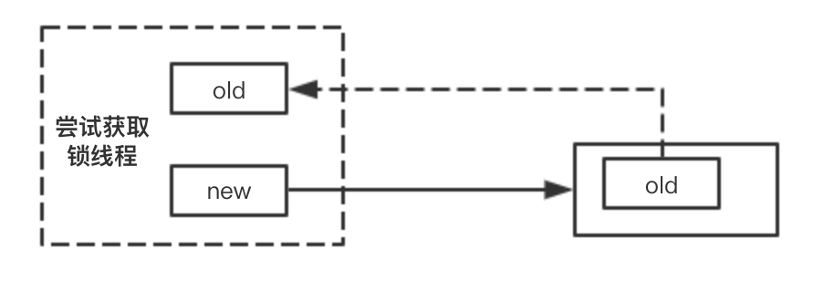
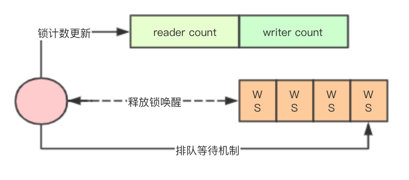
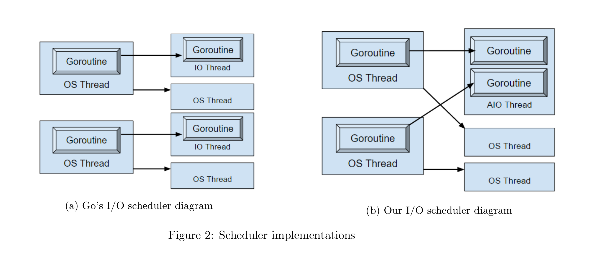
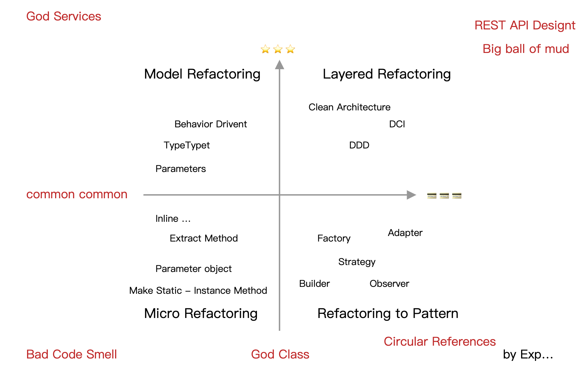
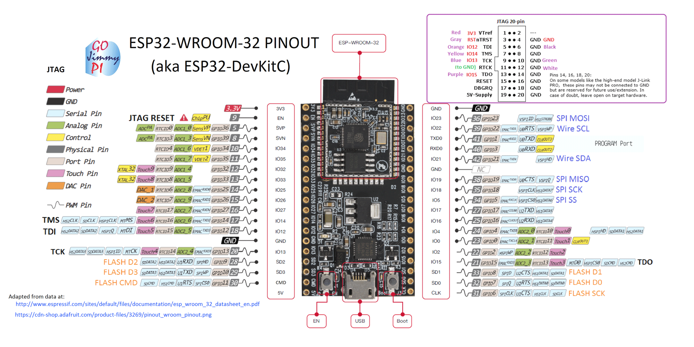
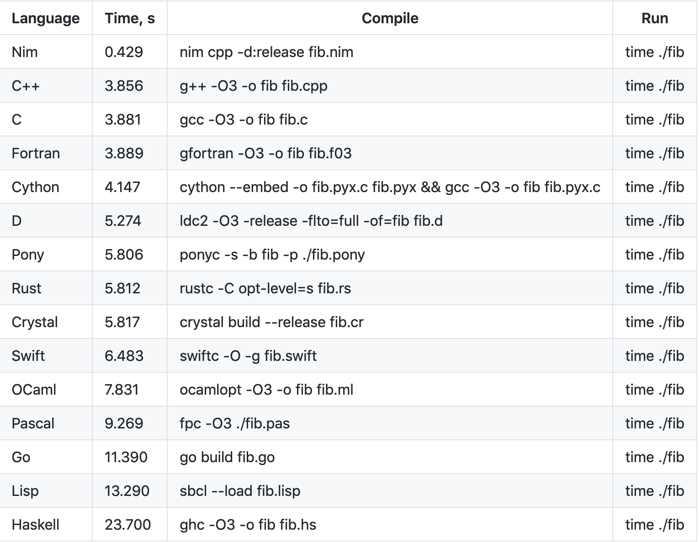

# Go语言爱好者周刊：第 23 期

这里记录每周值得分享的 Go 语言相关内容，周日发布。

本周刊开源（GitHub：[polaris1119/golangweekly](https://github.com/polaris1119/golangweekly)），欢迎投稿，推荐或自荐文章/软件/资源等，请[提交 issue](https://github.com/polaris1119/golangweekly/issues) 。

鉴于大部分人可能没法坚持把英文文章看完，因此，周刊中会尽可能推荐优质的中文文章。优秀的英文文章，我们的 GCTT 组织会进行翻译。

题图：这是 reddit 上发布者从女友那得到的圣诞礼物，是不是很可爱？！

## 刊首语

快过年了，又面临抢票这个难题。这不，GitHub 上这周趋势排行榜 1、2 位都是 12306 相关，不过都是 Python 的，没人用 Go 搞搞呢？

你抢到回家的车票了吗？反正我是没抢到。

## 资讯

1、[Prometheus 2.15.0 发布，Go 编写的服务监控系统](https://www.oschina.net/news/112335/prometheus-2-15-released)

Prometheus 2.15.0 发布了，Prometheus 是一个 Go 语言开发的开源的服务监控系统和时间序列数据库。该版本引入了一些新特性，比如记录其他组件、增强功能和修复 bug，这些都是为了提高可用性。

2、[Proxy-Go v8.8 发布，新增 iptables 透明转发支持，网关轻松实现全局透明代理](https://www.oschina.net/news/112277/proxy-go-8-8-released)

1）sps代理增加了当系统是Linux的时候，支持通过iptables透明转发过来的tcp连接请求。
 利用此功能实现路由器等网关设备为其它设备实现全局透明代理，详细教程可以参考项目主页wiki里面的《透明代理》。
2）修复使用代理后，网易云音乐UWP应用无法正常使用的问题。
3）修复了http/sps反向代理https不能工作的问题。
4）优化了http代理，兼容一些旧的http客户端发送http代理请求时，使用不标准的URL情况。

3、[golang 流式 http client gout v0.0.5 版本发布](https://www.oschina.net/news/112272/gout-0-0-5-released)

做 github 最好用的 http client 库，让你体会到还没有爽玩，活已经干玩。

4、[jackal v0.8.0 发布，增加 context 支持](https://github.com/ortuman/jackal/releases/tag/v0.8.0)

用 Go 编写的 XMPP 服务器。

5、[Proposal: Go2: Drying up Error Handling in Go](https://github.com/golang/go/issues/36284)

我们仍在尝试可能的方法，以简化 Go 的未来版本中的错误处理。

6、[Hugo v0.62.0 发布；圣诞节版本](https://gohugo.io/news/0.62.0-relnotes/)

此版本带来 Markdown Render Hooks。

## 文章

1、[Go：我应该用指针替代结构体的副本吗？](https://mp.weixin.qq.com/s/11wxINd_RA40YD0bL2Zbqg)

对于许多 Go 开发者来说，考虑到性能，最佳实践是系统地使用指针而非结构体副本。我们将回顾两个用例，来理解使用指针而非结构体副本的影响。

2、[大神是如何学习 Go 语言系列](https://mp.weixin.qq.com/s/9-eLJqYZrOpNLoiTGpBrKA)

1）[大神是如何学习 Go 语言之浅谈 select 的实现原理](https://mp.weixin.qq.com/s/9-eLJqYZrOpNLoiTGpBrKA)

2）[大神是如何学习 Go 语言之 panic 和 recover 的原理](https://mp.weixin.qq.com/s/iRdKLWt0FTHoQyOQSwtHYg)

3）[大神是如何学习 Go 语言之浅入浅出接口的原理](https://mp.weixin.qq.com/s/62F6bd4UXiqWC8f8i7GBGQ)

4）[大神是如何学习 Go 语言之写出优雅的 Go 代码](https://mp.weixin.qq.com/s/g412oBwHXO_B5Axncn34Aw)

3、[使用多年的 go pprof 检查内存泄漏的方法居然是错的?!](https://mp.weixin.qq.com/s/qC5iZ2gq_0EvSmnKCwB9og)

另一种使用方式可以了解一下。

4、[别告诉我这是真的？goroutine 可能使程序变慢](https://mp.weixin.qq.com/s/PkuspIWKQpL7awtpCg-rOA)

我们将会展示一个关于 for 循环的代码，将输入分成几个序列添加到 Goroutines 里面！我敢打赌你之前可能有过几次这种情况，但是每次引入 gorountine 都让你的代码变得更快吗？

5、[我是如何在大型代码库上使用 pprof 探索 Go 中的内存泄漏](https://mp.weixin.qq.com/s/2VI8xO7v3JKq2D071bgqfw)

我们知道 Go 拥有一个良好的社区和一个非常棒的工具集，所以我们选择了 Go。

6、[100 行左右有效 Go 代码实现 tcp server & graceful shutdown](https://mp.weixin.qq.com/s/P8xh9FQNKQevGWuejVr83w)

工作需要快速写了个`tcpserver`的框架，有效代码差不多 100 行左右，写篇文章分享下实现思路， 顺便解释一下如何实现类似网络服务的`Graceful Shutdown`功能。

7、[利用 CPU cache 特性优化 Go 程序](https://mp.weixin.qq.com/s/kMlB5RbEUucNp_IiRhryBw)

cache line padding 适用于多个相邻的变量频繁被并发读写的场景。

8、[图解Go里面的互斥锁mutex了解编程语言核心实现源码](http://www.sreguide.com/2019/12/23/go/sync_mutex/)

丰富的图讲解。

9、[Go里面的读写锁与源码实现](http://www.sreguide.com/2019/12/20/go/sync_reader_writer/)

读写锁区别与互斥锁的主要区别就是读锁之间是共享的，多个goroutine可以同时加读锁，但是写锁与写锁、写锁与读锁之间则是互斥的。

10、[GORM之ErrRecordNotFound采坑记录](https://juejin.im/post/5dff33c7518825126131ce30)

在我印象中有个错误的认知：如果 GORM 没有找到 record，则会返回ErrRecordNotFound 的错误，直到上次业务中出现了bug，我才发现这个印象中的认知是错误的，且没有官方文档的支持。那么，ErrRecordNotFound  到底在什么时候返回呢，这篇文章将会根据源码来进行分析一下。

11、[提升Go磁盘IO性能的尝试](https://sevenyu.top/2019/12/15/reducing-costs-of-disk-I/O-in-Go.html)

并发是个比较难理解的东西。Go是谷歌创建的一门编程语言，它通过轻量级线程(协程)提供了容易理解的并发抽象。减轻了并发编程的难度。为了支持这些Goroutine，Go使用runtime将Goroutine多路复用到OS线程上，为了简化磁盘IO，Go保留了一组IO线程，用于阻塞IO以提升CPU的使用率。

12、[GOMAXPROCS 与容器的相处之道](http://gaocegege.com/Blog/maxprocs-cpu)

本文从 Docker 和 Kubernetes 对 CPU 资源的限制出发，利用实验的方式验证了这一问题，并且给出了一些个人看法。

13、[谈谈go.sum](https://segmentfault.com/a/1190000021425527)

众所周知，Go 在做依赖管理时会创建两个文件，`go.mod` 和 `go.sum`。相比于 `go.mod`，关于 `go.sum` 的资料明显少得多。自然，`go.mod` 的重要性不言而喻，这个文件几乎提供了依赖版本的全部信息。而 `go.sum` 看上去就是 go module 构建出来的天书，而不是什么人类可读的数据。

## 开源项目

1、[evalfilter](https://github.com/skx/evalfilter/)

在 Go 应用嵌入小型脚本引擎。

2、[age](https://github.com/FiloSottile/age)

一个简单，安全和现代的加密工具。

3、[chromedp](https://github.com/chromedp/chromedp)

驱动浏览器的 Go 语言库，支持 Chrome DevTools 协议。抓取动态网页利器。

4、[sqlstats](https://github.com/dlmiddlecote/sqlstats)

采集 sql.DBStats 并以 Prometheus 格式导出。

5、[buf](https://github.com/bufbuild/buf)

一种新的 Protobuf 处理库。

6、[coca: 系统重构和系统分析工具箱](https://github.com/phodal/coca)

Coca 是一个用于系统重构、系统迁移和系统分析的瑞士军刀。它可以分析代码中的 badsmell，行数统计，分析调用与依赖，进行 Git 分析，以及自动化重构等。

7、[eris: 处理跟踪和记录 Go 中的错误](https://github.com/rotisserie/eris)

提供了一种更好的方式来处理，跟踪和记录 Go 中的错误。

8、[go-term-markdown](https://github.com/MichaelMure/go-term-markdown)

Go Markdown 终端渲染库。

9、[trdsql](https://github.com/noborus/trdsql)

可以在 CSV，LTSV，JSON 和 TBLN 上执行 SQL 查询的 CLI 工具。可以输出各种格式。

## 资源&&工具

1、[KubeCon North America 2019 视频列表](https://www.youtube.com/watch?v=F1w7P2H1gwY&list=PLBOtlFtGznBjuTVfzSZDoLLPbemn1CW7g)

国内似乎还没有类似的大会？

2、[go-flutter](https://github.com/go-flutter-desktop/go-flutter)

基于 flutter 构建桌面应用。

3、[go time 播客 108 期](https://changelog.com/gotime/108)

Go 与图数据库。

4、[以软件工程师的身份学习硬件编程](https://blog.athrunen.dev/learning-hardware-programming-as-a-software-engineer/)（英文）

硬件编程的人员应该很少吧。

5、[Go 常见错误](https://github.com/golang/go/wiki/CommonMistakes)

官方 Wiki 总结的。

6、[dockertags](https://github.com/goodwithtech/dockertags)

通过 CLI 获取容器 镜像、标签等信息。

7、[为什么在此 fib 测试中 Go 如此之慢？](https://github.com/drujensen/fib)

[Reddit 上有人解释：](https://www.reddit.com/r/golang/comments/eegbrh/why_is_go_so_extremely_slow_in_this_fib_test/)

1）fib 函数根本不执行任何操作，因此基准测试实际上是在测量函数调用的开销；

2）而 Go 语言因为 goroutine 的机制，每个函数调用会多一些指令，同时在必要时会扩展堆栈，这是有开销的。

你怎么看？

8、[Go 语言实现常用数据结构和算法](https://github.com/x899/algorithms)

对算法感兴趣，特别是大学生，建议学习学习。

## 订阅

这个周刊每周日发布，同步更新在[Go语言中文网](https://studygolang.com/go/weekly)、[微信公众号](https://weixin.sogou.com/weixin?query=Go%E8%AF%AD%E8%A8%80%E4%B8%AD%E6%96%87%E7%BD%91) 和 [今日头条](https://www.toutiao.com/c/user/59903081459/#mid=1586087918877709)。

微信搜索"Go语言中文网"或者扫描二维码，即可订阅。

