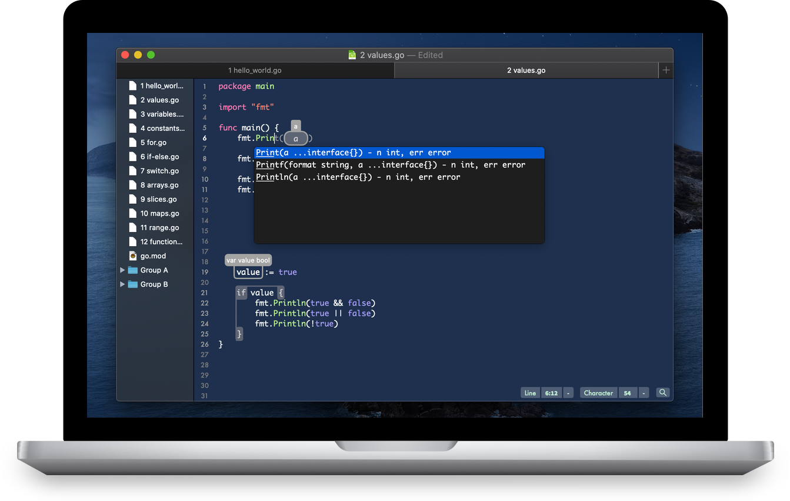
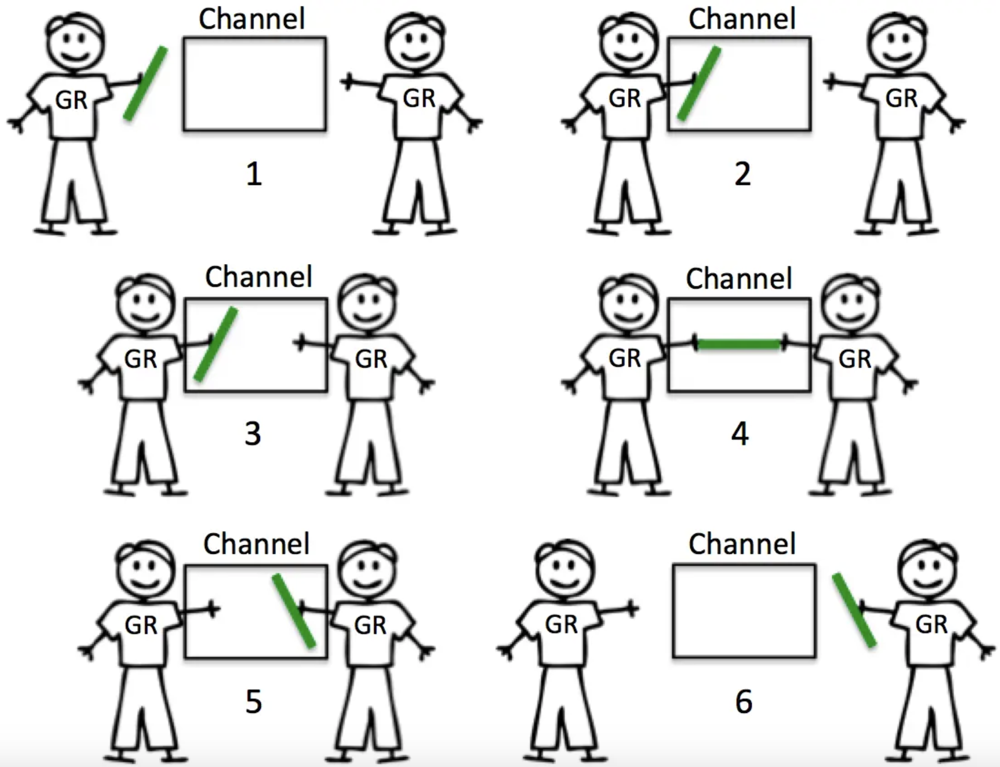
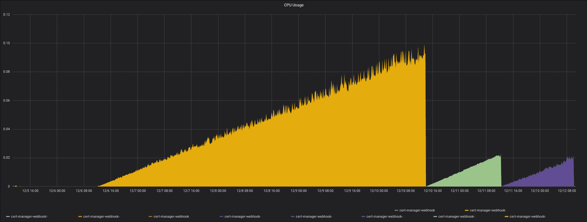
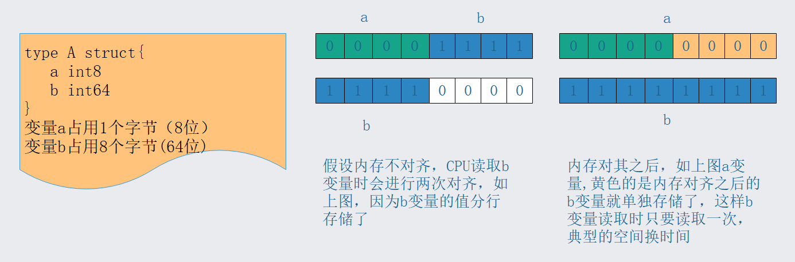
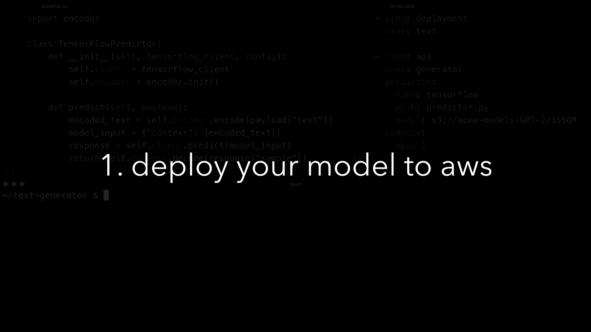
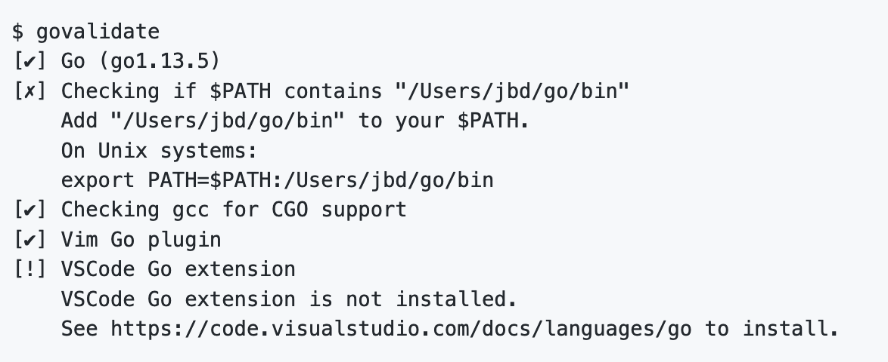
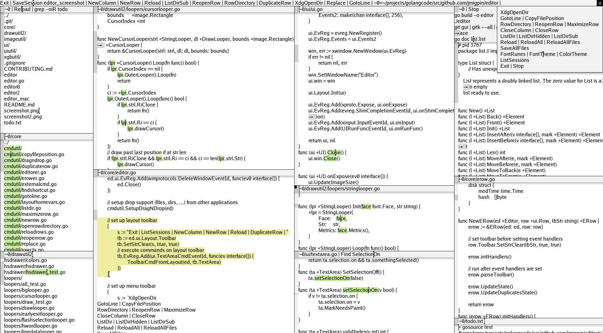
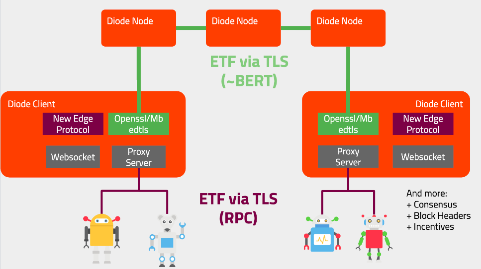

# Go语言爱好者周刊：第 25 期

这里记录每周值得分享的 Go 语言相关内容，周日发布。

本周刊开源（GitHub：[polaris1119/golangweekly](https://github.com/polaris1119/golangweekly)），欢迎投稿，推荐或自荐文章/软件/资源等，请[提交 issue](https://github.com/polaris1119/golangweekly/issues) 。

鉴于大部分人可能没法坚持把英文文章看完，因此，周刊中会尽可能推荐优质的中文文章。优秀的英文文章，我们的 GCTT 组织会进行翻译。

题图：Chime，一个 Mac 的 Go 编辑器，目前还未正式发布。

## 资讯

1、[Go 1.13.6 和 Go 1.12.15 发布](https://forum.golangbridge.org/t/go-1-13-6-and-go-1-12-15-are-released/17031)

小 bug 修复。可以通过 https://studygolang.com/dl 下载。

2、[rqlite 5.0.0 发布](http://www.philipotoole.com/rqlite-5-0-0-released/)

rqlite 是一个轻量级的分布式关系数据库，它使用 SQLite 作为其存储引擎。形成集群非常简单，可以很好地处理领导者选举，并容忍包括领导者在内的机器故障。rqlite 可用于 Linux，OSX 和 Microsoft Windows。

3、[Istio 1.4.3 发布，大型微服务系统管理工具](https://www.oschina.net/news/112726/istio-1-4-3-released)

Istio 是一个由谷歌、IBM 与 Lyft 共同开发的开源项目，旨在提供一种统一化的微服务连接、安全保障、管理与监控方式。具体来说，Istio 是一个开源服务网格平台，它确保微服务在处理故障时以指定的方式相互连接。

4、[InfluxDB 2.0.0 Beta 1 发布](https://www.oschina.net/news/112706/influxdb-2-0-0-bate-1-released)

开源时序数据库。

5、[BookStack v2.4 发布](https://www.oschina.net/news/112626/bookstack-2-4-released)

类似 GitBook 的文档管理系统。

6、[Chime：适用于 macOS 的 Future Go 编辑器](https://www.chimehq.com/)

它目前处于内测阶段，但你可能希望订阅其更新，以便知道 Chime 准备就绪的时间。

7、[go-sql-driver/mysql 1.5.0 发布](https://github.com/go-sql-driver/mysql/releases/tag/v1.5.0)

增加 Module 的支持；不再支持 Go1.9 及以下版本。

8、[TinyGo 0.11.0: 嵌入式 Go 编译器](https://github.com/tinygo-org/tinygo/releases/tag/v0.11.0)

最新版本将 Clang 捆绑在发行包中，并增加了对 Adafruit Pybadge 的支持。

## 文章

1、[高频 golang 服务接口超时排查&性能调优](https://mp.weixin.qq.com/s/rDjTqqR0q4VTSQrYFzbR7w)

业务中超时抖动是大家平时比较容易遇到的一种技术问题，本文详细记录了一次线上容器中高频 go 服务超时的排查过程。本文可以给大家提供查服务业务超时问题的一些思路，理解为什么 go 服务会获取错 cpu 核数，了解获取宿主 cpu 核数会有多大影响并怎样最小成本避开。

2、[Reflect-Go 一分钟快速入门](https://studygolang.com/articles/25982)

本文侧重讲解 reflect 反射的实践应用，适合新手初窥门径。

3、[channel的使用及源码解析](https://studygolang.com/articles/25971)

熟悉Go的人都知道，它提倡着不要通过共享内存来通讯，而要通过通讯来共享内存。Go提供了一种独特的并发同步技术来实现通过通讯来共享内存，此技术即为通道。我们可以把一个通道看作是在一个程序内部的一个FIFO数据队列。 一些协程可以向此通道发送数据，另外一些协程可以从此通道接收数据。

4、[你真的需要微服务吗？](https://mp.weixin.qq.com/s/4R1SlIX8nXC1MLdPAdZlHQ)

你们进行服务化没有？

5、[Go并发设计模式之 Active Object](https://mp.weixin.qq.com/s/D-3-Bpl5UZ_w_tnUHh6UaA)

介绍实用Go语言去实现这些并发设计模式。

6、[必会技能：简明的 Go Protocol Buffer 教程](https://mp.weixin.qq.com/s/s_6H68RQ9JDiA6TGmiZyOQ)

在这个教程里面，我们将学习如何在你的 Go 应用中使 protocol Buffers 数据格式。我们将详细讲述这种数据格式，以及为什么这种数据格式优于传统的数据格式，例如 XML 甚至 JSON。在我们写更多复杂的例子之前，我们将从一个简单的例子开始编写运行。

7、[在 Go 中的 ORM 和查询构建](https://mp.weixin.qq.com/s/RQJZUqcFvrNoqPerfRnr7A)

在 Go 中，第一类函数是进行 SQL 查询构建的惯用方法。该仓库包含我编写的一些示例代码：https://github.com/andrewpillar/query。

8、[Go 切片是胖指针？](https://mp.weixin.qq.com/s/cTc4Q-MtWhRLpjA0C06RAQ)

本文的内容曾在 Hacker News 上进行讨论。

9、[Go GC 20 问](https://mp.weixin.qq.com/s/o2oMMh0PF5ZSoYD0XOBY2Q)

本文作者欧长坤，德国慕尼黑大学在读博士，Go/etcd/Tensorflow contributor，开源书籍《Go 语言原本》作者，《Go 夜读》SIG 成员/讲师，对 Go 有很深的研究。Github：@changkun，https://changkun.de。

10、[Go 编程: 对不起，你的 CPU 泄露了](https://www.gitdig.com/cpu-leak/)

前段时间给后端几个服务配证书，试着用了一下 Cert-Manager 项目。 Github 几千 Star 的项目使用起来的确很方便，秒配域名免费证书。但是，运行了三天，机器CPU报警。

11、[Go 的内存对齐和指针运算详解和实践](https://learnku.com/articles/39255)

uintptr 和 unsafe 普及。

## 开源项目

1、[goleak: goroutine 泄露检测](https://github.com/uber-go/goleak)

它仍然处于 Alpha 状态，但是你可以使用它来检测函数末尾是否有任何意外的 goroutines 正在运行。

2、[cortex](https://github.com/cortexlabs/cortex)

在生产中部署机器学习模型。

3、[govalidate](https://github.com/rakyll/govalidate)

验证 Go 安装和依赖的小工具。

4、[godirwalk](https://github.com/karrick/godirwalk)

快速目录遍历库。

5、[editor](https://github.com/jmigpin/editor)

纯 Go 的源代码编辑器。号称“知道你正在做什么的源代码编辑器”。

6、[sarama](https://github.com/Shopify/sarama)

Sarama 是 Apache Kafka 0.8 及更高版本的 Go 库。

7、[timex](https://github.com/cabify/timex)

测试友好的替代 Go 的 time 包。

8、[autocache](https://github.com/pomerium/autocache)

使用成员列表进行对等注册的组缓存。

9、[canvas](https://github.com/tdewolff/canvas)

Go 实现的基于 wasm 的矢量绘图库。

## 资源&&工具

1、[Kubernetes 相关优秀工具列表](https://docs.google.com/spreadsheets/d/1WPHt0gsb7adVzY3eviMK2W8LejV0I5m_Zpc8tMzl_2w/edit#gid=0)

k8s 的爱好者可以收藏一波。

2、[如何编写Go代码(官方新版) ](https://golang.org/doc/code.html)

有关如何编写第一个 Go 程序的这份 Go 文档的核心部分已完全按照现代标准进行了重写。

3、[Go Get My/Vulnerabilities](https://www.youtube.com/watch?v=GGQcv7fK0JY)

深入分析 Go 语言运行时及其引入的新漏洞。

4、[Go 台北 MEETUP 小记](https://diode.io/diode/Diode-Presented-at-the-Golang-Taipei-Meetup-20002/)

12 月 24日 星期二，我们有机会在 Golang 台北聚会上介绍了我们的工作。

## 订阅

这个周刊每周日发布，同步更新在[Go语言中文网](https://studygolang.com/go/weekly)、[微信公众号](https://weixin.sogou.com/weixin?query=Go%E8%AF%AD%E8%A8%80%E4%B8%AD%E6%96%87%E7%BD%91) 和 [今日头条](https://www.toutiao.com/c/user/59903081459/#mid=1586087918877709)。

微信搜索"Go语言中文网"或者扫描二维码，即可订阅。

