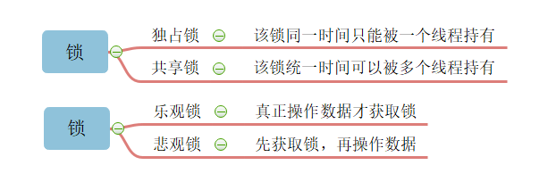
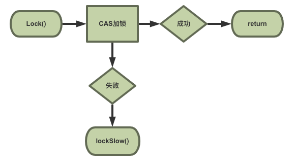
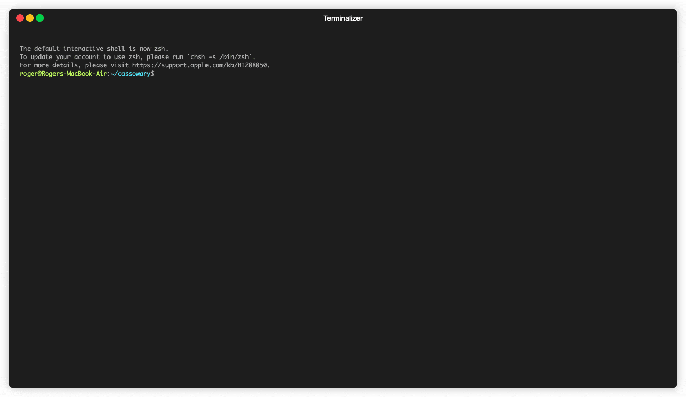

# Go语言爱好者周刊：第 26 期

这里记录每周值得分享的 Go 语言相关内容，周日发布。

本周刊开源（GitHub：[polaris1119/golangweekly](https://github.com/polaris1119/golangweekly)），欢迎投稿，推荐或自荐文章/软件/资源等，请[提交 issue](https://github.com/polaris1119/golangweekly/issues) 。

鉴于大部分人可能没法坚持把英文文章看完，因此，周刊中会尽可能推荐优质的中文文章。优秀的英文文章，我们的 GCTT 组织会进行翻译。

题图来自 Unsplash

## 刊首语

猪年马上过完了，鼠年马上来临。本期也是猪年最后一期周刊了，祝大家过年快乐，吃好喝好！

## 资讯

1、[TiDB 3.0.9 发布](https://pingcap.com/docs-cn/v3.1/releases/3.0.9/)

分布式 NewSQL 数据库。

2、[Go 语言开发工具 LiteIDE X36.3 发布](https://www.oschina.net/news/112838/litelde-x-36-3-released)

新版本重构了配置系统，更新 gotools & gocode 以更好地支持 Go Module 功能。

3、[GoFrame v1.11 发布，Go 基础开发框架](https://www.oschina.net/news/112783/goframe-1-11-released)

1）新年新气象，官网文档大量更新；2）GF 工具链更新；3）数据库 ORM 新特性。

4、[花椒服务端 4 个 Go 开源项目介绍](https://mp.weixin.qq.com/s/IcBbLCmGXMQtktUVs0jY4g)

新年伊始，花椒直播服务端系统开发组对多个内部广泛使用到的基础服务开源，包括之前介绍过的总线系统和分布式 cron 管理。

## 文章

1、[使用 Go 和 ReactJS 构建聊天系统](https://mp.weixin.qq.com/s/qg-hrRTDCw5hxaXY3OoFtw)

在这个项目中，我们将考虑使用 Go 作为后端，React.JS 作为前端来构建一个聊天系统。

本课程将有助于你巩固 Go 的并发概念和技术，提供开发更复杂的 Go 应用程序的实际经验，希望你能够轻松编写常用的 Go 程序。

Go 语言中文网公众号已经更新到 [使用 Go 和 ReactJS 构建聊天系统（五）：优化前端](https://mp.weixin.qq.com/s/aqubuzDVKQMENiM7lTnh3A)。

2、[Golang 源码包分析 01 net/http包](https://mp.weixin.qq.com/s/EuucDt5yVjnXHXmmfhT_vQ)

Golang 仅需要几行代码，便可以建立一个简单的 Web 服务。

3、[2019 年 Go 读者点击最多的十篇文章](https://colobu.com/2020/01/07/Top-Go-Links-of-2019/)

golangweekly.com 统计的。

4、[理解 Golang 子进程测试](https://juejin.im/post/5e19309c5188254c45778617)

源于 Andrew Gerrand（Golang的开发者之一） 在 Google I/O 2014 上一篇关于测试技巧的 slide。

5、[Go 中锁的那些姿势，估计你不知道](https://learnku.com/articles/39577)

什么是锁，为什么使用锁？

6、[探究sync.Mutex代码流程细节](https://juejin.im/post/5e1d8723f265da3e0535ef0c)

互斥锁对于日常使用来说非常简单, 但是sync.Mutex里的状态变更, 并发控制, 原子操作, 循环体等表示很复杂, 让我探究一下里面是什么葫芦药呢。

7、[老弟在吗，我怀疑Go标准库中的二分查找有bug！](https://mp.weixin.qq.com/s/LxkHgenQS9l0i3-OWetFuQ)

你怎么看？

8、[Golang最强大的访问控制框架 casbin 全解析](https://mp.weixin.qq.com/s/B2FCMuBt0RvjLhkI3Fv60A)

开箱即用的访问控制框架 casbin 原理是啥？支持哪些权限模型？本文一一解答。

9、[Go 每日一库之 go-ini](https://juejin.im/post/5e1f9953e51d450209730323)

ini 是 Windows 上常用的配置文件格式。MySQL 的 Windows 版就是使用 ini 格式存储配置的。 [go-ini](https://github.com/go-ini/ini) 是 Go 语言中用于操作 ini 文件的第三方库。本文介绍 go-ini 库的使用。

10、[golang 官方工具 mock 接口](https://segmentfault.com/a/1190000021613786)

当一个团队合作一个项目时，必然会涉及到接口的调用，这时倘若你的上下游团队成员还未写好接口，但是又要测试自己的代码，mock便可派上用场。mock出的对象能模拟接口的行为，给出预期的结果，比如一个远程调用接口mock后可以在本机调用并立刻返回预设的结果。

11、[Go语言代码安全审计分享](https://mp.weixin.qq.com/s/8Ju05hYCYk6bOgkvjtP11A)

Go语言主要用作服务器端开发语言，适合于很多程序员一起开发大型软件，并且开发周期长，支持云计算的网络服务。Go语言能够让程序员快速开发，并且在软件不断的增长过程中，它能让程序员更容易地进行维护和修改。Go语言是强类型语言，它融合了传统编译型语言的高效性和脚本语言的易用性和富于表达性。

12、[聊聊base64编码](https://mp.weixin.qq.com/s/1G9v0ysUBK0VLAFzYMIp3A)

base64 的作用有哪些？

## 开源项目

1、[Avo: 使用 Go 生成 x86 程序集](https://github.com/mmcloughlin/avo) 

通过使用 Go 控件结构和虚拟寄存器，Avo 使汇编更容易编写，并为你做了值处理。两个数相加的[例子](https://github.com/mmcloughlin/avo/tree/master/examples/add)演示了它如何以简单的方式工作。

2、[asciigraph: 制作轻量级 ASCII 折线图](https://github.com/guptarohit/asciigraph)

命令行中输出，没有其他依赖。

3、[aini](https://github.com/relex/aini)

解析 Ansible 库存文件。

4、[ok-zoomer: 将人像变成缩放的 GIF 动画](https://github.com/jbirms/ok-zoomer)

一个 Go 程序，该程序可以拍摄图像，使用 Pigo 来检测人脸，并创建可放大人脸的 gif。

5、[zero-width: 零宽度字符检测和删除](https://github.com/trubitsyn/go-zero-width)

字符串中零宽度空格之类的内容可能会导致各种头痛。

6、[pgx](https://github.com/jackc/pgx)

PostgreSQL 驱动包。

7、[gonet](https://github.com/dathoangnd/gonet)

Go 实现的多层神经网络。

8、[imagick](https://github.com/gographics/imagick)

ImageMagick MagickWand C API 的 Go binding。

9、[cob](https://github.com/knqyf263/cob)

持续基准测试工具。

10、[gjson: 快速获取 json 中的值](https://github.com/tidwall/gjson)

这是我很喜欢的操作 json 的库。

11、[sqlvet](https://github.com/houqp/sqlvet)

对 Go 代码库中原始 SQ L查询进行静态分析。

12、[cassowary](https://github.com/rogerwelin/cassowary)

跨平台 http 负载测试工具。

13、[wagon](https://github.com/go-interpreter/wagon)

一种基于 WebAssembly 的 Go 解释器。

14、[sqlmw](https://github.com/ngrok/sqlmw)

为 database/sql 增加像 http middleware 的机制。

## 资源&&工具

1、[gotime 第 112 期](https://changelog.com/gotime/112)

关于 Go defer 以及 Go 1.14 defer 性能的大幅提升。

2、[gotime 第 113 期](https://changelog.com/gotime/113)

Cloudflare 公司的 Go 实践。

## 订阅

这个周刊每周日发布，同步更新在[Go语言中文网](https://studygolang.com/go/weekly)、[微信公众号](https://weixin.sogou.com/weixin?query=Go%E8%AF%AD%E8%A8%80%E4%B8%AD%E6%96%87%E7%BD%91) 和 [今日头条](https://www.toutiao.com/c/user/59903081459/#mid=1586087918877709)。

微信搜索"Go语言中文网"或者扫描二维码，即可订阅。

