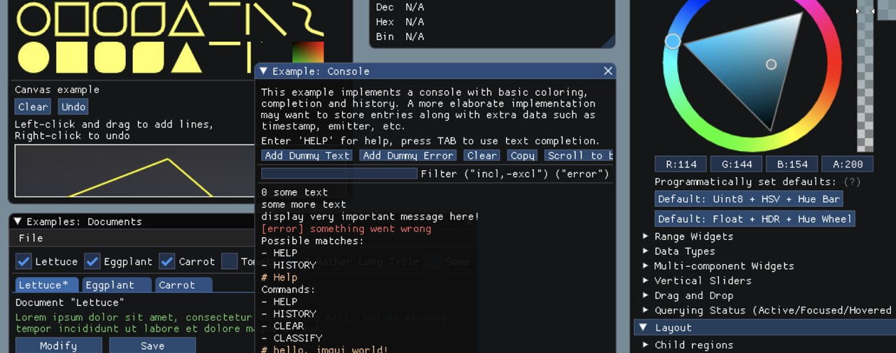
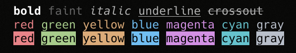
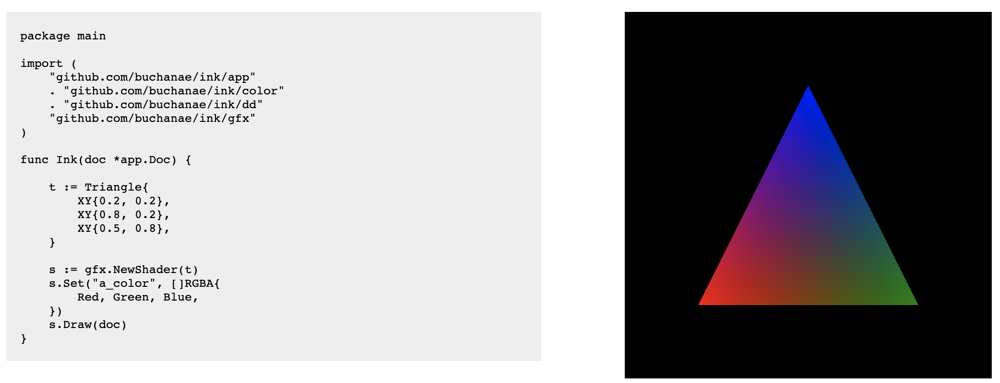
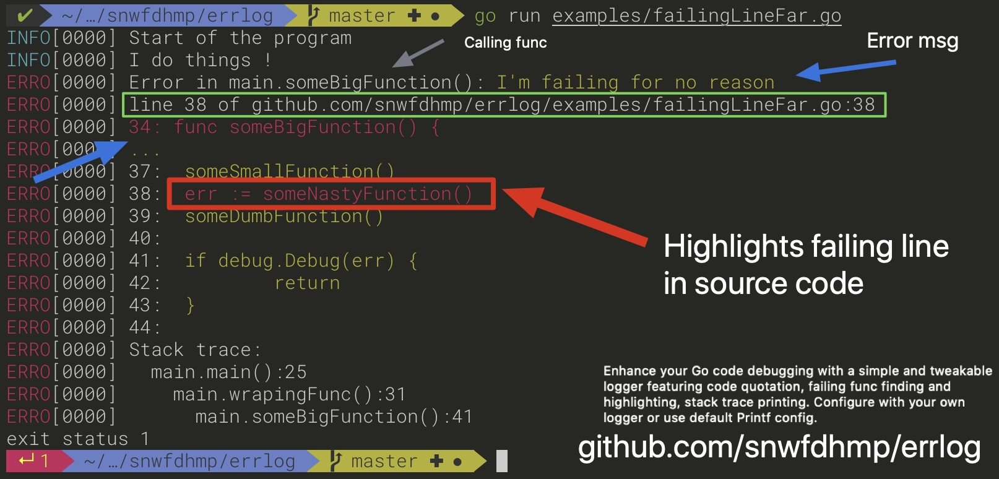
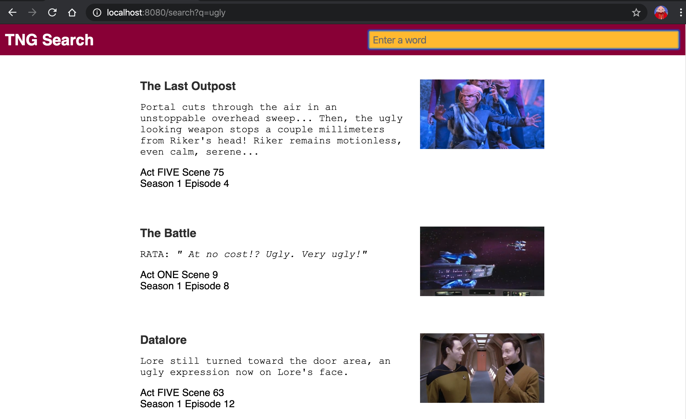

# Go语言爱好者周刊：第 27 期

这里记录每周值得分享的 Go 语言相关内容，周日发布。

本周刊开源（GitHub：[polaris1119/golangweekly](https://github.com/polaris1119/golangweekly)），欢迎投稿，推荐或自荐文章/软件/资源等，请[提交 issue](https://github.com/polaris1119/golangweekly/issues) 。

鉴于大部分人可能没法坚持把英文文章看完，因此，周刊中会尽可能推荐优质的中文文章。优秀的英文文章，我们的 GCTT 组织会进行翻译。

题图：giu

## 刊首语

新年快乐！这个特殊的新年，大家安心在家，可以顺便学习学习 Go 哦。在这里祈祷疫情尽快控制住，武汉加油！！

## 资讯

1、[Traefik 2.1.3 发布，HTTP 反向代理与负载均衡工具](https://github.com/containous/traefik/releases/tag/v2.1.3)

小版本更新。

2、[TiDB 4.0.0-beta 发布，分布式 NewSQL 数据库](https://www.oschina.net/news/112907/tidb-4-0-0--beta-released)

期待正式版发布。

3、[gout v0.0.7 版本发布，Golang 流式 http client](https://www.oschina.net/news/112900/gout-0-0-7-released)

号称做 GitHub 最好用的 http client 库，让你体会到还没有爽玩。那什么是流式客户端？

## 文章

1、[有趣实验: hack go interface](https://mp.weixin.qq.com/s/_Th5plNZa5LwINExKrMcCw)

Go interface 代表一组方法的集合，凡是实现这组集合的对象都称之为实现了这个接口，具体的对象不必像其它编程语言比如Java那样必须显示的`Implement`某个或者某些接口，所以说Go的接口类型是鸭子类型(`Duck type`)。

2、[Go 实现百万 WebSocket 连接](https://mp.weixin.qq.com/s/nukISdSBwnaCKeQSxep8dg)

本文主要介绍如何使用 Go 开发高负载的 WebSocket 服务。如果你熟悉 WebSockets，但对 Go 了解不多，仍希望你对这篇文章的想法和性能优化方面感兴趣。

3、[漫画：排序数组删除重复元素（leetcode 26）](https://mp.weixin.qq.com/s/T254utw4efpux2Qu2IIRhg)

漫画的形式讲解 LeetCode。

4、[Go 语言代码安全审计分享](https://mp.weixin.qq.com/s/8Ju05hYCYk6bOgkvjtP11A)

由于 Go 语言代码审计资料较少，这里就把最近学习的对Vulnerability-goapp项目的审计过程分享一下。整个审计过程结合代码安全扫描工具和人工审计，期间也发现代码安全审计工具的漏报误报问题。

5、[Go 语言标准库中 atomic.Value 的前世今生](https://blog.betacat.io/post/golang-atomic-value-exploration/)

在 Go 语言标准库中，sync/atomic包将底层硬件提供的原子操作封装成了 Go 的函数。但这些操作只支持几种基本数据类型，因此为了扩大原子操作的适用范围，Go 语言在 1.4 版本的时候向sync/atomic包中添加了一个新的类型Value。此类型的值相当于一个容器，可以被用来“原子地"存储（Store）和加载（Load）任意类型的值。

6、[用一个生产与消费例子学习 go 语言中 goroutine，channel，select，time](https://studygolang.com/articles/26266)

通过一个例子来说一下对它们的理解与使用。

## 开源项目

1、[giu](https://github.com/AllenDang/giu)

基于 [Dear ImGui](https://github.com/ocornut/imgui) 的 Golang 跨平台快速 GUI 框架

2、[stats: 全面的 Go 统计资料库套件](https://github.com/montanaflynn/stats)

没有外部依赖，经过良好测试，可以使用平均值、总和、百分位数、标准差等概念。

3、[termenv: 终端应用程序的高级 ANSI 样式和颜色支持](https://github.com/muesli/termenv)

提供方便的方法来为输出着色和样式设置，而无需处理怪异的 ANSI 转义序列和颜色转换。

4、[mock: Go 的模拟框架](https://github.com/golang/mock)

这是官方出品。有两种操作模式：源和反射。源模式从源文件生成模拟接口。反射模式通过构建使用反射来了解接口的程序来生成模拟接口。

5、[Eris: 处理，跟踪和记录错误的更好方法？](https://github.com/rotisserie/eris)

旨在通过错误包装，堆栈跟踪和输出格式为你提供对错误处理的更多控制。

6、[ink: Go 中的 2D 图形框架](https://github.com/buchanae/ink)

一个基于 OpenGL 的专注于创意编码的实验项目。这些[示例](https://github.com/buchanae/ink/tree/master/sketches)展示了它可以做什么（至少在代码中）。

7、[PipeIt](https://github.com/AllenDang/PipeIt)

文本转换，清理和提取工具。

8、[neffos](https://github.com/kataras/neffos)

一个快速且可扩展的 Websocket 框架。

9、[agones](https://github.com/googleforgames/agones)

一个用于在 Kubernetes 上托管、运行和扩展专用游戏服务器的库。

10、[fiber](https://github.com/gofiber/fiber)

一种 Express 风格的、基于 fasthttp 的 HTTP web 框架。

11、[go-plantuml](https://github.com/bykof/go-plantuml)

基于 Go 源码生成 plantuml 图。

12、[licenseclassifier](https://github.com/google/licenseclassifier)

识别文件中的 license 类型。

13、[app](https://github.com/maxence-charriere/app)

一个 WebAssembly 框架，用于使用 Go，HTML 和 CSS 构建 GUI 应用。

14、[c2go](https://github.com/elliotchance/c2go)

将 C 代码转换为 Go 代码的工具。

15、[errlog](https://github.com/snwfdhmp/errlog)

使用静态和堆栈跟踪分析来快速确定哪个函数调用导致的错误。

16、[regexp2](https://github.com/dlclark/regexp2)

全功能正则表达式引擎。如果标准库的 regexp 满足不了你，可以尝试使用 regexp2。

17、[gzip](https://github.com/nanmu42/gzip)

一个智能、高效、开箱即用、可定制，适用于 Gin 和 net/http 的 gzip 中间件。

18、[gotoprom](https://github.com/cabify/gotoprom)

用于 golang 的类型安全的 Prometheus 指标构建器库。

19、[squzy](https://github.com/squzy/squzy)

一个用 Golang 编写的高性能开源监控系统。

## 资源&&工具

1、[Go 语言算法视频课程](https://algorithmswithgo.com/)（英文）

Algorithms with Go 是完全免费的，但需要提供一个有效的电子邮件地址才能访问。它不会向你发送垃圾邮件，并且退订非常容易。

2、[百度 BFE 应用层负载均衡引擎使用手册](https://www.bookstack.cn/read/baidu-bfe/overview.md)

BFE 是基于百度统一前端技术框架开源的七层流量接入系统，Go 语言实现。

3、[使用 Go 实现基于终端的俄罗斯方块](https://rocketnine.space/post/tetris-1/)

这是有关使用 Go 创建基于终端的俄罗斯方块克隆的一系列教程的第一部分。

4、[gotime 第 113 期](https://changelog.com/gotime/113)

Go at Cloudflare

5、[gotime 第 114 期](https://changelog.com/gotime/114)

如何应对云基础架构管理发展的变化？

6、[Go 编程教程](https://github.com/TutorialEdge/go)

此项目的目标是能够跟踪所有 Go 教程及其各自的 github 存储库位置和构建状态。这些将在发布时随着 Go 的最新版本进行更新并运行。

7、[使用 Go 打造“星际迷航”为主题的搜索引擎服务](https://timberry.dev/posts/learning-to-go-part0/)（英文）

 实战系列教程。GCTT 会考虑翻译为中文。

8、[数据结构和算法的 Go 实现](https://github.com/priyankchheda/algorithms)

Go 中的数据结构库和算法实现，欢迎贡献。

## 订阅

这个周刊每周日发布，同步更新在[Go语言中文网](https://studygolang.com/go/weekly)、[微信公众号](https://weixin.sogou.com/weixin?query=Go%E8%AF%AD%E8%A8%80%E4%B8%AD%E6%96%87%E7%BD%91) 和 [今日头条](https://www.toutiao.com/c/user/59903081459/#mid=1586087918877709)。

微信搜索"Go语言中文网"或者扫描二维码，即可订阅。

