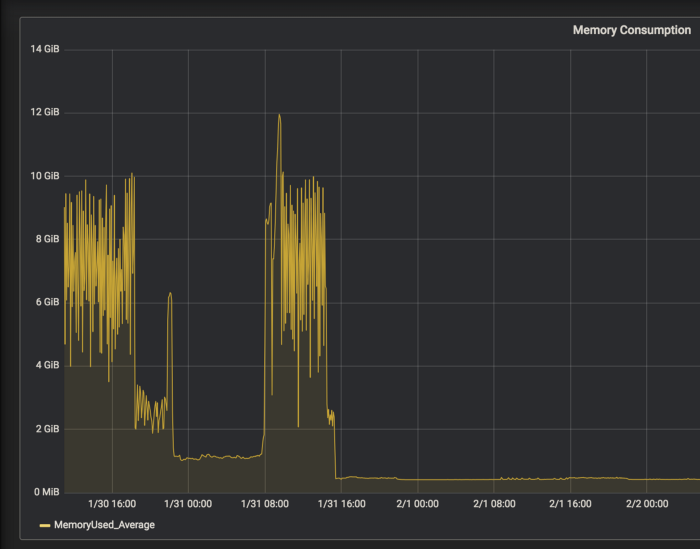
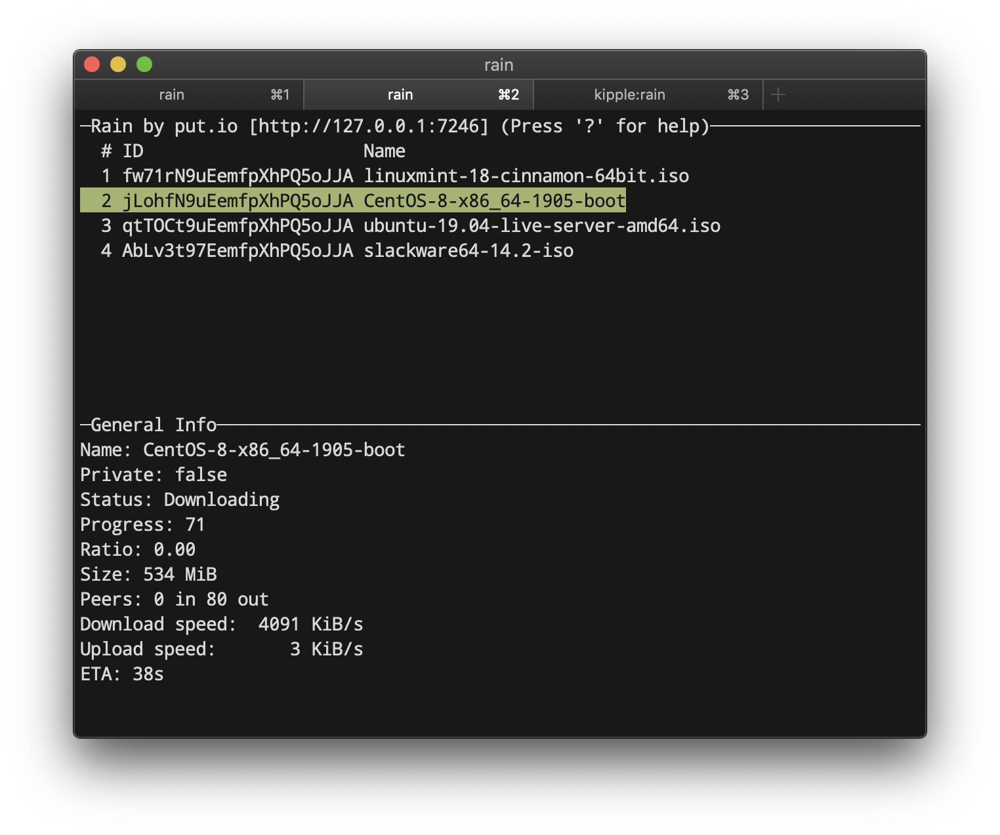
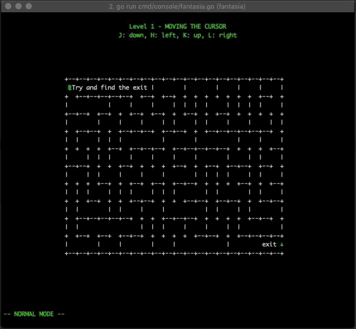

# Go语言爱好者周刊：第 28 期

这里记录每周值得分享的 Go 语言相关内容，周日发布。

本周刊开源（GitHub：[polaris1119/golangweekly](https://github.com/polaris1119/golangweekly)），欢迎投稿，推荐或自荐文章/软件/资源等，请[提交 issue](https://github.com/polaris1119/golangweekly/issues) 。

鉴于大部分人可能没法坚持把英文文章看完，因此，周刊中会尽可能推荐优质的中文文章。优秀的英文文章，我们的 GCTT 组织会进行翻译。

题图：疫情之下，奉献爱心；20200202 献给有爱的你。图片来自网络

## 刊首语

今天是全国延长春节假期的最后一天，明天起，大部分人应该都开始在家上班了吧。疫情严峻，大家注意个人防护，尽量别出门，祝福大家平安！

今天还是 20200202，一个对称的日子，据说挺多人准备今天领证，结果因为疫情的原因，大部分民政局不开门，大家都多理解吧。今天日子特别，网友为广大想表白的想好了内容，拿走不谢，发给你的那个他（她）吧！

> 今天是个特殊的日子，
>
> 20200202，倒过来念也是；
>
> 我想对你说：
>
> 你是爱的中心。倒过来念也是；
>
> 你是年少的欢喜。倒过来念也是；
>
> 我爱你。多么希望，倒过来念也是。

## 资讯

1、[Go 1.15 的提案](http://blog.studygolang.com/2020/02/go-1-15-proposal/)

已经临近 Go1.14 发布了，计划在 2 月份发布，RC1 候选版本已经准备好了。根据 Go 2, here we come! 这篇文章描述的过程，这到了我们开发和发布周期考虑的时候，我们是否希望在下一个版本中（Go1.15）增加语言和库的更改，并计划于今年 8 月份发布。

2、[Go 核心团队成员 Brad Fitzpatrick 离开了 Google](https://mp.weixin.qq.com/s/w_wnnIuqRHYOZsre1Kzzeg)

熟悉 Go 的朋友应该知晓 Brad Fitzpatrick，他是 Go 核心团队成员（他编写了HTTP/2实现），同时是 Memcached 的作者。他表示“会继续在 Go 社区，但时间会少些，而且参与方式有所不同。” 离开24小时后，他对失业感到无聊，现在加入了 Tailscale。

3、[Micro v2.0.0 发布](https://micro.mu/blog/2020/01/30/micro-v2.html)

我们很高兴地宣布 Micro 和 Go Micro v2 的发布！提供分布式系统开发所需的核心功能。对于默认版本，我们采用 gRPC 和嵌入式 NATS 对我们来说是一个重要的里程碑。

4、[Go1.13.7 和 Go1.12.16 发布](https://studygolang.com/dl)

这是小版本，是安全性发行版，涵盖 Windows 10 证书验证绕过和 `/x/crypto/cryptobyte` 的格式错误的输入，可能会引起 panic。

5、[Hugo 0.63.1 发布，Go 编写的静态网站生成器](https://github.com/gohugoio/hugo/releases/tag/v0.63.1)

这是一个 bug 修复版本，其中包含几个重要的修复程序。

## 文章

1、[我们应该怎么样编写 Go 语言库，有哪些标准可以参考？](https://mp.weixin.qq.com/s/rWk6zd3vXKaCfyEHyLB0GA)

每一个库都存在一些基本问题以至于它们在真实场景中不可用。并且每个库都以这样一种方式编写：不以非向后兼容的方式修改现有库的 API，这样是不可能修复问题的。不幸的是，由于很多其他的库也存在同样的问题，所以我会在下面列出一些作者错误的地方。

2、[Go 语言 <-time.After() 在计时器过期前不会被垃圾回收](https://mp.weixin.qq.com/s/bJhVPEF0Ek7khYFUw6PSSQ)

最近我在调查 Go 应用程序中内存泄漏的问题，这个问题主要因为我没有正确的阅读文档。

3、系统全面掌握 Go 语言的 Map

本文是三篇系列文章中的第一篇。每篇文章都将涵盖 map 的不同部分。我建议你按顺序阅读。

- [Go: 通过例子学习 Map 的设计 — Part I](https://mp.weixin.qq.com/s/IkMVgGelL3h_wyO8jmFywg)
- [Go: 通过代码学习 Map 的设计 — Part II](https://mp.weixin.qq.com/s/VtQFqEgbKzop08eLtVh4yA)
- [Go: 并发访问 Map — Part III](https://mp.weixin.qq.com/s/GZ9gnp1UTzSXOiV3-ksj7g)

4、[Docker 核心技术与实现原理](https://mp.weixin.qq.com/s/up3eg4rt7Zxg-mazzkrssw)

提到虚拟化技术，我们首先想到的一定是 Docker，经过四年的快速发展 Docker 已经成为了很多公司的生产环境中大规模使用，也不再是一个只能在开发阶段使用的玩具了。

5、Golang package sync 剖析系列

Go语言在设计上对同步（Synchronization，数据同步和线程同步）提供大量的支持，比如 goroutine和channel同步原语，库层面有：

- [Golang package sync 剖析(一)： sync.Once](https://mp.weixin.qq.com/s/_rp2KAvDeezR7VvQJhXmUg)
- [Golang package sync 剖析(二)： sync.WaitGroup](https://mp.weixin.qq.com/s/B2xxsPMXylatERFlBV3e1w)
- [Golang package sync 剖析(三)：sync.Cond](https://mp.weixin.qq.com/s/aRVHYQkCyHRsjaIWlBJGFw)

6、[学习 Go 编程的十大在线资源及新手如何学习 Go 语言](http://blog.studygolang.com/2020/01/study-resources/)

学习任何东西，基础都很重要。基础就好比建筑的地基，只有地基牢固了，才能建成高楼大厦。学习编程语言亦是如此。很多人喜欢一上来就学习各种框架，其实那些框架对你来说都是工具，你自己的基础好，懂得了它们的原理，自己也有能力创造更优秀的框架。

7、[五分钟用Docker快速搭建Go开发环境](https://mp.weixin.qq.com/s/eNBK2Xh0iCOQ1U9UoIUg3g)

怎么用 Docker 快速搭建 Go 语言项目的开发环境。

8、[Golang 服务大量 CLOSE_WAIT 故障排查](https://www.cnblogs.com/wangiqngpei557/p/12234115.html)

让系统运行的健康状态透明化才是发现问题的最有效手段，代码不出问题不现实。

9、[Go 程序性能分析 101](https://studygolang.com/articles/26289)

本文来自 [GopherCon 2019 的一个演讲](https://www.youtube.com/watch?v=nok0aYiGiYA&t=433s)，首先从一个计算文本字数的 go 程序与 wc 对比，通过 profile CPU 与内存逐步优化性能，涉及 Go 的并发模型及逃逸分析。然后由一个绘制曼德勃罗分形图的程序，讨论并发程序的执行追踪（trace）及并发程序能带来的性能提升的边界。

10、[asynq：一个由 Go 开发的轻量级的异步定时任务系统](https://juejin.im/post/5e2d02c15188252c6d368f52)

最近开发了一个Go的简单高效的异步任务处理库：[Asyqn](https://github.com/hibiken/asynq)

## 开源项目

1、[k6](https://github.com/loadimpact/k6)

使用 Go 和 JavaScript 的现代负载测试工具。

2、[ko](https://github.com/google/ko)

编译和部署 Go 应用到 Kubernetes 上的工具。0.2.0 发布。

3、[fabio](https://github.com/fabiolb/fabio)

fabio 是一种快速，现代化的零配置负载平衡 HTTP(S) 和 TCP 路由器，用于部署由 consul 管理的应用程序。

4、[rain](https://github.com/cenkalti/rain)

Go 语言实现的 BitTorrent 客户端和库。

5、[bed](https://github.com/itchyny/bed)

用 Go 编写的二进制编辑器。

6、[klum](https://github.com/ibuildthecloud/klum)

Kubernetes user 管理器。

7、[stern](https://github.com/wercker/stern)

支持 tail k8s 上的多个 Pod 以及 Pod 中的多个容器。

8、[vim-man](https://github.com/ozankasikci/vim-man)

一个基于终端的游戏，教你如何使用 Vim。

9、[hermes](https://github.com/matcornic/hermes)

Go 版本的 mailgen 引擎。

10、[noise](https://github.com/perlin-network/noise)

Go 实现的分布式 P2P 网络协议栈。

11、[sandy](https://github.com/hobochild/sandy)

一个用于运行不可信代码的沙箱。

12、[readline](https://github.com/chzyer/readline)

GNU-Readline 类库的实现。

13、[解放数据库查询, 写一个 go 的查询构造器](https://www.jianshu.com/p/a5e9c0d16ed8)

ORM 还是直接 SQL？

14、[为什么 Go 语言没有泛型](https://draveness.me/whys-the-design-go-generics)

Go 是一门语法元素少、设计简单的编程语言，简单的设计往往意味着较弱的表达能力，工程师也需要使用更多时间编写重复的逻辑。Go 语言从发布到今天已经过去了 10 多年，向 Go 语言添加泛型的讨论也从 2010 年一直持续到今天。

## 资源&&工具

1、[微软出品 ApplicationInspector](https://github.com/Microsoft/ApplicationInspector)

一个源代码分析器，用于通过使用基于json的规则引擎的静态分析来显示感兴趣的特征和其他特征，以回答问题“其中是什么”。非常适合在使用前扫描组件或检测功能级别变化。

2、[naabu](https://github.com/projectdiscovery/naabu)

在主机/主机列表上进行快速 SYN 扫描，并列出所有返回回复的端口。小心使用或仅研究其代码。

3、[Go Time 第 115 期：探讨 Go.dev](https://changelog.com/gotime/115)

据说 Go 官方要停止 godoc.org，全面转移到 go.dev（用 pkg.go.dev 替代 godoc.org），社区反对强烈，你怎么看？官方博文：[pkg.go.dev 的后续动作](https://blog.golang.org/pkg.go.dev-2020)

4、[Go GUI 项目列表](https://github.com/go-graphics/go-gui-projects)

看着 GUI 项目很多，但有哪个是很成熟的？

5、[Go Time 第 114 期：大单体架构才是未来](https://changelog.com/posts/monoliths-are-the-future)

你认可吗？

6、[视频：Go 十年回顾与反思](https://www.youtube.com/watch?v=em8n-nxAIFc)

需要解决上网问题。

## 订阅

这个周刊每周日发布，同步更新在[Go语言中文网](https://studygolang.com/go/weekly)、[微信公众号](https://weixin.sogou.com/weixin?query=Go%E8%AF%AD%E8%A8%80%E4%B8%AD%E6%96%87%E7%BD%91) 和 [今日头条](https://www.toutiao.com/c/user/59903081459/#mid=1586087918877709)。

微信搜索"Go语言中文网"或者扫描二维码，即可订阅。

