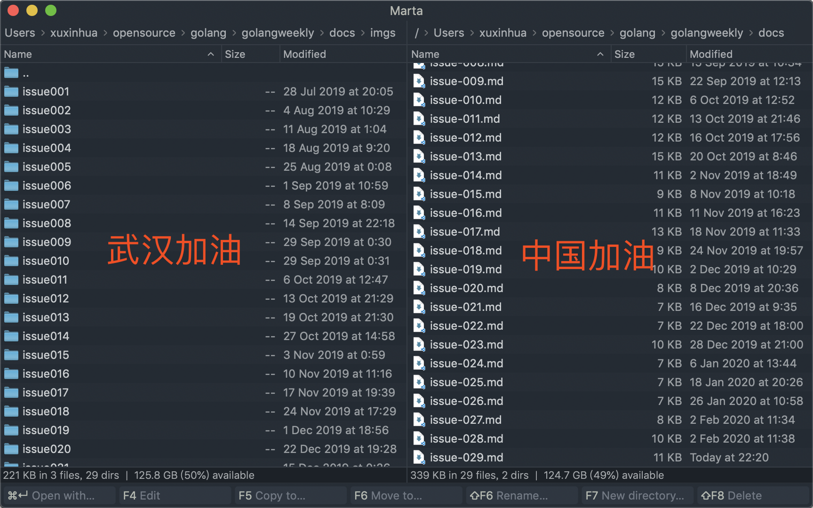
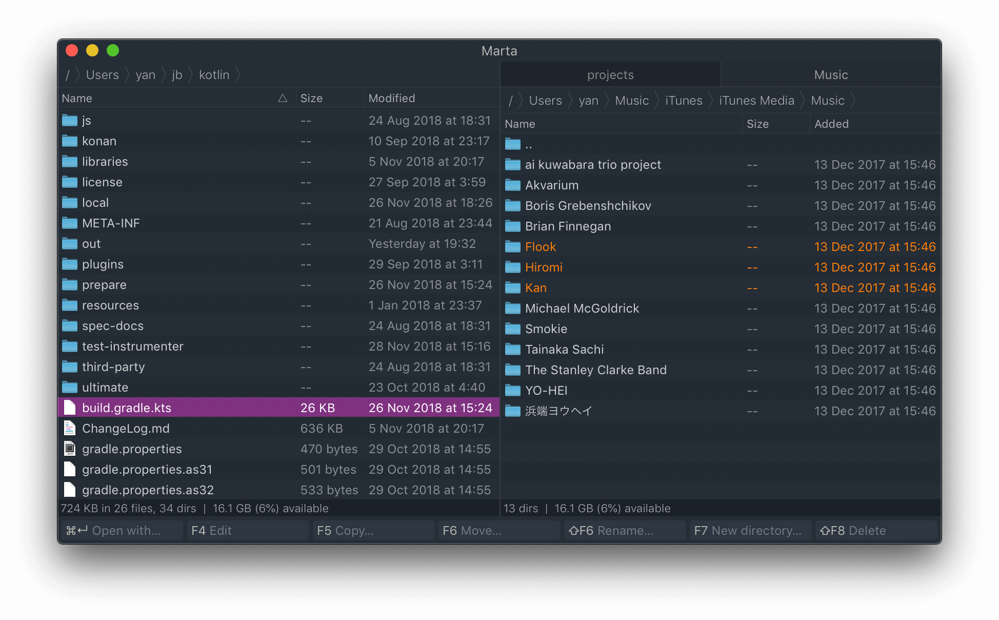
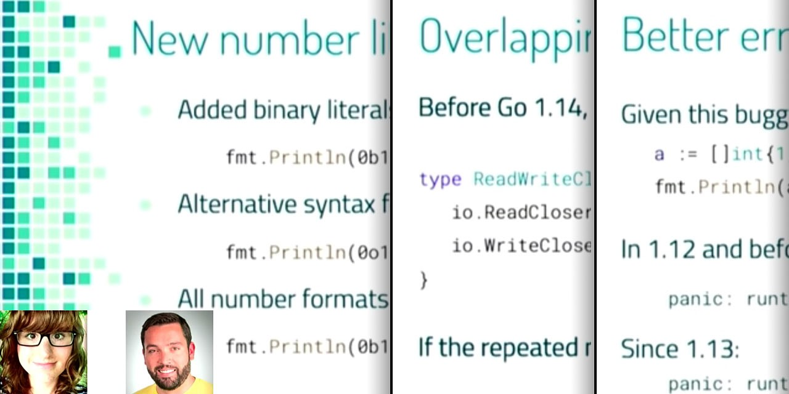
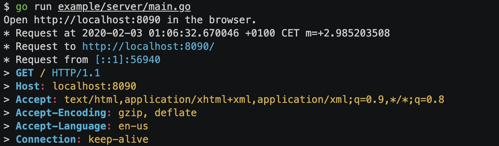
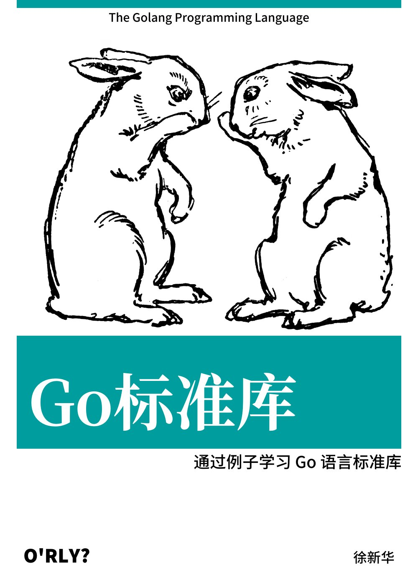

# Go语言爱好者周刊：第 29 期

这里记录每周值得分享的 Go 语言相关内容，周日发布。

本周刊开源（GitHub：[polaris1119/golangweekly](https://github.com/polaris1119/golangweekly)），欢迎投稿，推荐或自荐文章/软件/资源等，请[提交 issue](https://github.com/polaris1119/golangweekly/issues) 。

鉴于大部分人可能没法坚持把英文文章看完，因此，周刊中会尽可能推荐优质的中文文章。优秀的英文文章，我们的 GCTT 组织会进行翻译。

题图：Marta 文件管理器，武汉加油！

## 刊首语

给 Mac 用户推荐一个替换 Finder（访达）文件管理器：Marta。

Marta 是一个双窗格文件管理器。大多数时候，你使用两个并排放置的目录窗格。它使你可以快速高效地执行基本文件操作，例如复制或移动文件，因为你可以看到源目录和目标目录，并且可以直接复制或移动文件，而无需复制粘贴。

如果你之前是 Windows 下 TC 的用户，那么看到 Marta，你会感觉很亲切，是的，它们很相似。记得曾经有人说，因为 TC，很多人不愿离开 Windows 阵容，可见 TC 的强大。我曾经也是 TC 的爱好者，今天看到 Marta 很开心，赶紧使用上了，然后推荐给大家。后续我会考虑写文章详细介绍 Marta 的使用。

## 资讯

1、[Go1.14 RC1 发布](https://tip.golang.org/doc/go1.14)

语言的变化围绕允许具有重叠方法集的接口以及许多其他次要更改（包括 goroutine 现在可以异步抢占）等。

2、[TinyGo 成为 Google 的赞助项目](https://tinygo.org/)

对于 TinyGo 来说，这是个好消息，TinyGo 是一种越来越流行的 Go 编译器，它针对 “small places”（例如微控制器和WebAssembly），并成为 Google 赞助的项目。它的前途一片光明。

3、[Starlark：一个可以调用 Go 库函数的 Python 风格的语言](https://www.embly.run/star/)

它是一种旨在用作配置语言的语言。Google 有一个该语言的 Go 实现版本。https://github.com/google/starlark-go

4、[MongoDB Go 驱动程序 1.3 发布](https://github.com/mongodb/mongo-go-driver)

官方 MongoDB 驱动程序。

5、[fasthttp 1.9 发布](https://github.com/valyala/fasthttp)

一个长期存在的项目，该项目持续得到频繁的更新，并声称 速度比 net/http快 10 倍。

6、[vim-go 1.22 发布](https://github.com/fatih/vim-go/releases/tag/v1.22)

国内不知道用这个的多不多。

7、[gopls 发布 0.3.0 版本](https://github.com/golang/go/issues/33030#issuecomment-580827997)

已实现基本 IDE 功能。

8、[TIOBE 公布了 2020 年 2 月编程语言排行榜，Go 的排名你还满意吗？](https://mp.weixin.qq.com/s/AkQj_Z_ba2l1p_XVNXooCw)

Go 排名第 11。

## 文章

1、[Go1.14 都还没发布，官方已经准备 Go 1.15 了：它有哪些新东西？](https://mp.weixin.qq.com/s/BWFpV9bkw1wgkP9OEqRMaA)

已经临近 Go1.14 发布了，计划在 2 月份发布，RC1 候选版本已经准备好了。根据  Go 2, here we come!  这篇文章描述的过程，这到了我们开发和发布周期考虑的时候，我们是否希望在下一个版本中（Go1.15）增加语言和库的更改，并计划于今年 8 月份发布。

2、[学习 Go 编程的十大在线资源及新手如何学习 Go 语言](https://mp.weixin.qq.com/s/5thVaXXcT_GKiEtfZQ-ERg)

学习任何东西，基础都很重要。基础就好比建筑的地基，只有地基牢固了，才能建成高楼大厦。学习编程语言亦是如此。很多人喜欢一上来就学习各种框架，其实那些框架对你来说都是工具，你自己的基础好，懂得了它们的原理，自己也有能力创造更优秀的框架。

3、[Goroutine + Channel 是 Go 的招牌，但必须留意被忽略的 Channel](https://mp.weixin.qq.com/s/Y1EQb-pYxXzSkTTh92CTrw)

该文章提出了一个关于 Goroutines 如何出现内存泄露的情景。

4、[Go 语言 2020 年的状态：回顾 Go1.12 以来的变化](https://mp.weixin.qq.com/s/ecJ2K1Gzp6nfutlyYuT_oQ)

本文整理自 Slide：https://speakerdeck.com/campoy/the-state-of-go-2020 ，分析 Go1.13 和 Go1.14 的新特性。这里是演讲视频：https://www.youtube.com/watch?v=0c-1KJwSMCw

5、[一个资源，只希望需要时仅加载一次，即懒加载，Go 怎么实现？](https://mp.weixin.qq.com/s/FyZHtoLI4fdyx-yBcaSDhQ)

Go语言在设计上对同步（Synchronization，数据同步和线程同步）提供大量的支持。

6、[Go 之禅：Dave Cheney 大神告诉你编写简单、可读、可维护 Go 代码的十个工程经验](https://mp.weixin.qq.com/s/jYmjgAobyVfaOpb8mh8cNg)

编写简单、可读、可维护 Go 代码的十个工程经验，大神 Dave Cheney 于 2020/02/03 在 GopherCon Israel 2020 的演讲。

7、[Discord: 最终，我们放弃了GO，迁移至Rust，特性使然](https://mp.weixin.qq.com/s/KlDZx5s6fhn37BZMQAUm1g)

本文阐述了 Discord 从 Go 切换至 Rust 的深层原因，并分析了在内存管理中 Go 面临的一些固有问题，作者同时对比了 Go 和 Rust 在 Discord Read States 服务中的性能。原文：https://blog.discordapp.com/why-discord-is-switching-from-go-to-rust-a190bbca2b1f 。

8、[GraphQL Go 基于Golang实践](https://juejin.im/post/5e381dfee51d4526d87c5ddb)

GraphQL 既是一种用于 API 的查询语言也是一个满足你数据查询的运行时。 GraphQL 对你的 API 中的数据提供了一套易于理解的完整描述，使得客户端能够准确地获得它需要的数据，而且没有任何冗余，也让 API 更容易地随着时间推移而演进，还能用于构建强大的开发者工具。

9、[Golang 结构体指针解析](https://segmentfault.com/a/1190000021680265)

golang指针可以这样理解：本身为一个整型常量，但由于其声明时为指针，因此拥有了特殊的能力，即在其前增加 * ，即可直接访问内存编号为该整型常量的数据。

10、[Go1.14 为 time.Timer 定时器带来巨幅性能提升](https://www.pengrl.com/p/20021/)

After 函数从老版本的1.63ms直接下降到了0.11ms，提升相当恐怖。

11、[Go 之读懂 map 的底层设计](http://blog.newbmiao.com/2020/02/04/dig101-golang-map.html)

深挖系列。

12、[Go 中必须谈论的四个迷点](https://segmentfault.com/a/1190000021699341)

很多熟悉Go的程序员们都会说到 Go 是一门很简单的语言，话虽如此，但实际上 Go 的简单是基于复杂底层的极简包装。

13、[Go 每日一库之 log](https://mp.weixin.qq.com/s/MivVpGY1RJWf0ZFt7HjcFg)

在日常开发中，日志是必不可少的功能。虽然有时可以用fmt库输出一些信息，但是灵活性不够。Go 标准库提供了一个日志库log。本文介绍log库的使用。

## 开源项目

1、[mouselog](https://github.com/microsoft/mouselog)

一个基于 Web 的工具，用于记录，可视化和分析鼠标事件，例如移动和点击。微软出品。

2、[httpretty: 在终端上漂亮地打印出 HTTP 请求](https://github.com/henvic/httpretty)

受 curl 的 `--verbose` 功能启发，调试时很方便。

3、[Fiber: 一个 Express.js 风格的 HTTP Web 框架](https://github.com/gofiber/fiber)

又一个 Web 框架，基于 Fasthttp。如果你熟悉 Node.js，那这个框架肯定适合你。很有意思的是，这个项目时外国人写的，但提供了中文的 [README](https://github.com/gofiber/fiber/blob/master/.github/README_CH.md)，看来外国人也知晓国内 Go 的火爆。

4、[Caire: 内容感知图像调整库](https://github.com/esimov/caire)

使用接缝雕刻来拉伸图像的不重要部分，从而允许在调整大小的过程中考虑图像的内容。

5、[go-syslog：极速 Syslog 解析器](https://github.com/influxdata/go-syslog)

3.0 版本引入了最初的 RFC 3164（BSD Syslog协议）支持。

6、[cast](https://github.com/spf13/cast)

在 Go 中从一种类型安全转换为另一种类型。进行 Web 开发获取请求参数或从配置中读取数据时，经常要进行类型转换，该库可以值得你拥有。

7、[grabana](https://github.com/K-Phoen/grabana)

用 Go 代码快速创建 grafana dashboards。

8、[rose](https://gitlab.com/DevelopmentDuck/rose)

在 HTML 中嵌入和运行 Go 代码。

9、[tbls](https://github.com/k1LoW/tbls)

用于记录数据库文档的 CI 友好工具，Go 语言实现。

10、[crawlab](https://github.com/crawlab-team/crawlab)

基于 Golang 的分布式爬虫管理平台，支持Python、NodeJS、Go、Java、PHP等多种编程语言以及多种爬虫框架。这里可以[查看演示 Demo](http://crawlab.cn/demo)。

11、[go-spew](https://github.com/davecgh/go-spew)

为 Go 数据结构实现深层漂亮的打印，以帮助调试。

12、[wails](https://github.com/wailsapp/wails)

使用 Go 和 Web 技术创建桌面应用程序。

13、[websocket](https://github.com/nhooyr/websocket)

这是 2019 年新开发的 WebSocket 库，官方也推荐这个库，在性能方面，比经典的 https://github.com/gorilla/websocket 更好，推荐给大家。

14、[go-starter](https://github.com/adobe/go-starter)

adobe 的 go 工程模板。

## 资源&&工具

1、[Go Time 第 116 期](https://changelog.com/gotime/116)

Go 的异常用法：GUI。Go GUI 库不少，但哪个你用起来顺手呢？欢迎推荐。

该播客提到了以下内容：

- [Enlightenment Window Manager](https://www.enlightenment.org/) - 播客中提到的 Windows 管理器
- [Shiny Go Bindings](https://github.com/golang/exp/tree/master/shiny) - 用 Go 访问 Shiny 的方法
- [Qt Go Bindings](https://github.com/therecipe/qt) - Go 绑定 Qt
- [andlabs UI](https://github.com/andlabs/ui) - 一个 Go GUI 库
- [Fyne](https://fyne.io/) - 一个 Go GUI 库
- [Wails](https://wails.app/) - 使用 Vue.js 的 Go GUI 库
- [Awesome Go](https://github.com/avelino/awesome-go) - 包含了 GUI 库的各种 Go 库大全
- [Hands on GUI Application Development in Go](https://www.packtpub.com/gb/application-development/hands-gui-application-development-go) - Andrew 的书，介绍了 Go GUI 开发

2、[O'RLY 封面生成器](https://orly.nanmu.me/)

O'RLY Cover Generator 是模仿书的封面生成器，以 Golang 和 Vue.js 实现，支持包括 CJK 在内的多种语言。可以作为学习的资料。项目源码地址：https://github.com/nanmu42/orly

3、[Go 代码的高级调试技术](https://www.youtube.com/watch?v=2kjmLQY8RJk)（英文）

来自一个演讲。源视频连接是 youtube 的，B 站视频连接：https://www.bilibili.com/video/av87482478/

4、[garnish: 用 Go 语言编写的简单 varnish 实现](https://github.com/bkielbasa/garnish)

这里有一篇文章：https://developer20.com/garnish-simple-varnish-in-go/ （英文）

5、[7天用Go从零实现Web框架Gee教程](https://geektutu.com/post/gee.html)

系列教程，设计一个框架。

6、[Go 语言设计与实现](https://draveness.me/golang)

左神出品。本书的主要内容可以分成四个主要部分，分别是编译原理、运行时、基础知识和进阶知识，这四部分几乎可以覆盖 Go 语言从编译到运行的方方面面，让我们对 Go 语言有更加整体和深刻的认识。

## 订阅

这个周刊每周日发布，同步更新在[Go语言中文网](https://studygolang.com/go/weekly)、[微信公众号](https://weixin.sogou.com/weixin?query=Go%E8%AF%AD%E8%A8%80%E4%B8%AD%E6%96%87%E7%BD%91) 和 [今日头条](https://www.toutiao.com/c/user/59903081459/#mid=1586087918877709)。

微信搜索"Go语言中文网"或者扫描二维码，即可订阅。

