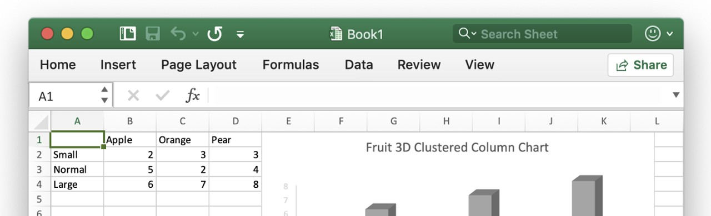
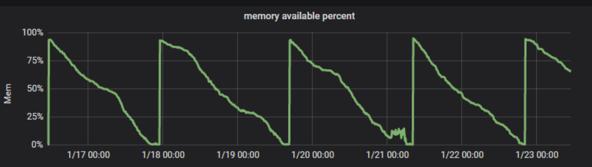
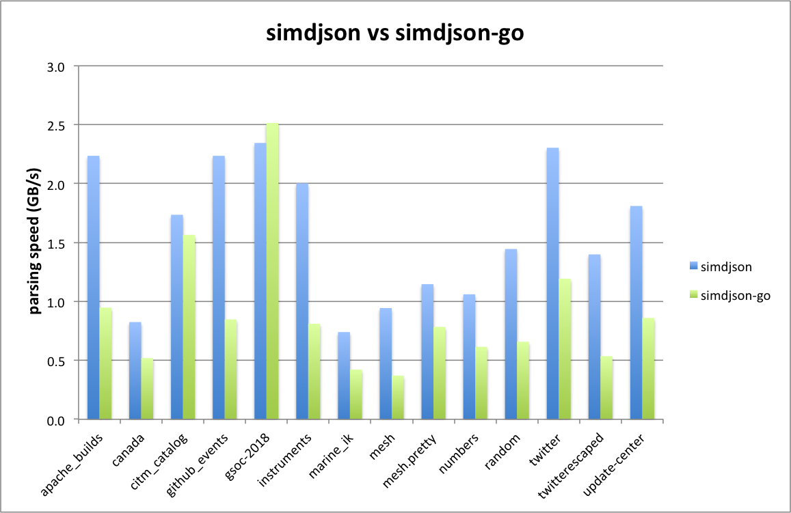
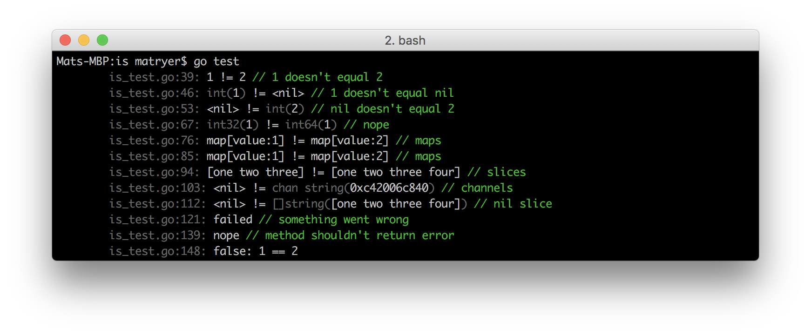
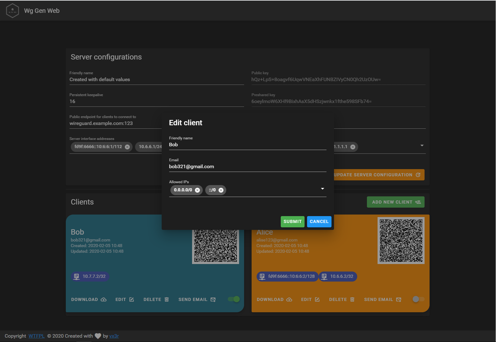
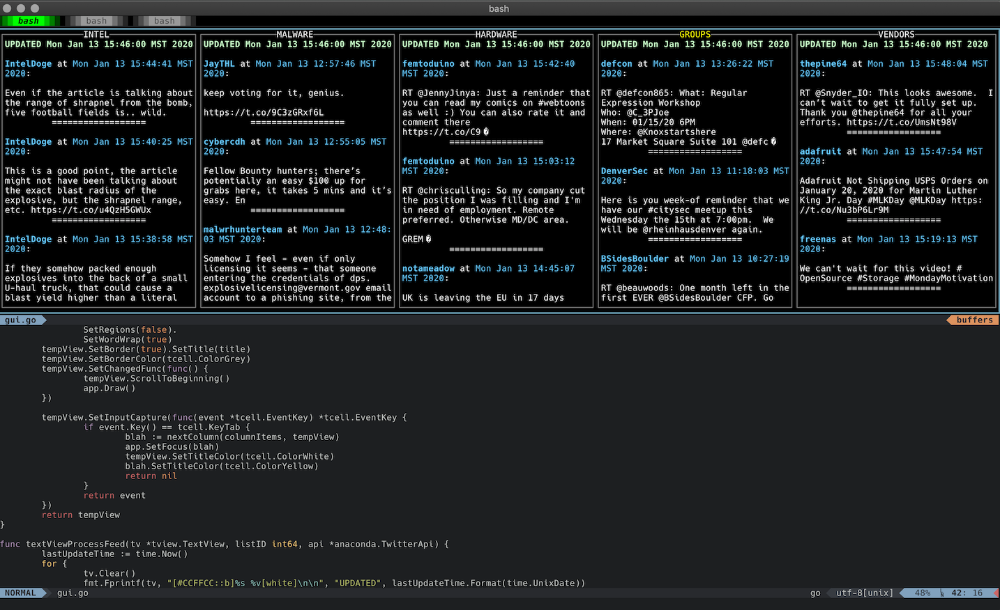

# Go语言爱好者周刊：第 30 期

这里记录每周值得分享的 Go 语言相关内容，周日发布。

本周刊开源（GitHub：[polaris1119/golangweekly](https://github.com/polaris1119/golangweekly)），欢迎投稿，推荐或自荐文章/软件/资源等，请[提交 issue](https://github.com/polaris1119/golangweekly/issues) 。

鉴于大部分人可能没法坚持把英文文章看完，因此，周刊中会尽可能推荐优质的中文文章。优秀的英文文章，我们的 GCTT 组织会进行翻译。

题图来自：json.org

## 刊首语

不得不感叹，Go 的 JSON 库层出不穷。这期周刊又新出现了两个。其他语言，比如 Java，官方标准库没有 json，所以有各种第三方库。但 Go 是有标准库 JSON 库的。只能说 JSON 现在太流行，其次大家对标准库不满足，比如性能、功能。

出现的第三方 JSON 库，一般着重解决两个问题：

- 嫌弃标准库性能太差，主打自己性能棒，比如：[valyala/fastjson](https://github.com/valyala/fastjson)、[mailru/easyjson](https://github.com/mailru/easyjson)、[buger/jsonparser](https://github.com/buger/jsonparser)、[pquerna/ffjson](https://github.com/pquerna/ffjson)、[json-iterator/go](https://github.com/json-iterator/go) 等，还有好多，不一一列举。感觉有点国内之前视频网站的感觉，都号称自己是最大的。这些库不少号称是自己是最快的，但充斥着矛盾，比如：buger/jsonparser 说它最快，比标准库快 10 倍，但 valyala/fastjson 说它比标准库快 15 倍。我个人感觉，这块真是瓶颈时，再来琢磨吧，平常大家用用标准库或从这一堆中挑一个 star 高的，API 用着顺的就行。这里有些是代码生成的，我个人很不喜欢；
- 嫌弃标准库功能太弱，主要提供更多功能，比如：[tidwall/gjson](github.com/tidwall/gjson)、[tidwall/sjson](github.com/tidwall/sjson)。当然，有些主打快的，也提供了额外的功能，比如 fastjson、jin 等；

最后列出目前看到的其他一些 JSON 库（本文后面有的两个库不在其中），你还知道哪些？官方看到这么多，不知道作何感想？

- https://github.com/Jeffail/gabs
- https://github.com/a8m/djson
- https://github.com/bitly/go-simplejson
- https://github.com/antonholmquist/jason
- https://github.com/mreiferson/go-ujson
- https://github.com/ugorji/go/codec

## 资讯

1、[Go1.13.8 和 Go1.12.7 发布，Go1.14 Delay 13 天，还有些 bug 没解决](https://studygolang.com/topics/10846#reply0)

2 月 13 日，Go Team 发布了 Go1.13.8 和 Go1.12.7，这是两个小版本。主要包括修复 runtime、crypto/x509、net/http 三个包的一些小 bug。Go1.13.8 修复的 bug 见 [Go 1.13.8 milestone ](https://github.com/golang/go/issues?q=milestone%3AGo1.13.8+label%3ACherryPickApproved)。建议大家升级到 Go1.13.8，下载地址：https://studygolang.com/dl

2、[Go 语言 Excel 文档基础库发布 2.1.0 版本](https://studygolang.com/topics/10824)

[Excelize](https://github.com/xuri/excelize) 是 Go 语言编写的用于操作 Office Excel 文档类库，基于 ECMA-376 Office Open XML 标准。

3、[BookStack v2.5 发布，功能类似 GitBook 长相清秀的文档管理系统](https://studygolang.com/topics/10835)

BookStack，基于 Mindoc、使用 Go 语言的 Beego 框架开发的功能类似GitBook和看云的在线文档管理系统，实现了文档采集、导入、电子书生成以及版本控制等强大的文档功能，并推出了配套的开源微信小程序 [BookChat](https://gitee.com/truthhun/BookChat) 和使用`uni-app`开发的开源手机APP [BookChatApp](https://gitee.com/truthhun/BookChatApp)。

4、[Gitea 1.11.0 发布](https://blog.gitea.io/2020/02/gitea-1.11.0-is-released/)

该版本更新了很多功能。

5、[Delve 1.4.0 发布，Go 调试器](https://github.com/go-delve/delve)

一个长期的项目，在本周刚刚增加了对 Linux/ARM64 的支持，以及对即将发布的 Go1.14 的支持。

6、[重磅！免费获得官方赠送GoLand，还有专属T恤：只要免费试用最新2020.1版](https://mp.weixin.qq.com/s/NHYplW-2FNABDQTpnV-Mzw)

GoLand 2020.1 抢先体验计划已经启动。对于此发行版，我们着重于易用性，性能以及减少浪费在样板代码和 IDE 中的冗余操作上的时间。

7、[go-testdeep 1.2.0 发布](https://github.com/maxatome/go-testdeep)

非常灵活的 golang 深度比较包，扩展了 go 测试包。

8、[fyne 1.2.0 发布](https://github.com/fyne-io/fyne/releases/tag/v1.2.0)

基于 Material Design 的 Go 跨平台 GUI。这次更新支持 Android 和 iOS。不过实话主页上的示例，看着也太丑了？

## 文章

1、[更懂 module 的包资源中心：关于 pkg.go.dev 的前世今生和未来](https://mp.weixin.qq.com/s/3GyU3jUlDSdqV3-xBHh2Vg)

本文就官方的博文和 Google 邮件组上的相关内容进行整理总结，分享给大家。

2、[go test 不为人知的一面](https://mp.weixin.qq.com/s/SB-89FDVc0xV37X5oOqkrg)

Go 被用得最频繁的命令我想应该是`go test`。然而，这个命令一些有趣的细节和用法可能你还不知道哟。下面让我们从测试本身讲起。

3、[关于Go1.14，你一定想知道的性能提升与新特性](https://mp.weixin.qq.com/s/ESf4-h1S9WeQNH2Z-kVIKw)

Go官方团队将在今年2月份发布1.14版本。相比较于之前的版本升级，Go1.14在性能提升上做了较大改动，还加入了很多新特性，我们一起来看一下Go1.14都给我们带来了哪些惊喜吧!

4、[依赖的第三方接口太慢影响自己的Go服务：掌握context的使用问题不再](https://mp.weixin.qq.com/s/nsEJsjkGMobRkQnIATpPow)

context 包在 Go 1.7 中引入，它为我们提供了一种在应用程序中处理 context 的方法。这些 context 可以为取消任务或定义超时提供帮助。通过 context 传播请求的值也很有用，但对于本文，我们将重点关注 context 的取消功能。

5、[LeetCode上并发题目无Go版本：台湾同胞试水 — 交替打印FooBar](https://mp.weixin.qq.com/s/I5va3PI1oGIj8R_n3Nw2yw)

由于 LeetCode Concurrency (并发) 目前还没有 Go 语言版本，所以我打算逐渐把自己的解题思路写下，这是我试水温的第一篇。

6、[多 Goroutine 的并发程序如何保证按序输出？channel 的使用是关键](https://mp.weixin.qq.com/s/wL-Cy6DScmPIpQAma6_3Qw)

来自 LeetCode 关于并发的又一道题目。

7、[记一次 golang 的内存泄露](https://www.cnblogs.com/CtripDBA/p/12289939.html)

此程序的主要功能是将文件中数据导入到 clickhouse 数据库中。服务器内存每隔一段时间会耗尽：

8、[Go 每日一库之 logrus](https://mp.weixin.qq.com/s/lO4hAjtwqY_YG3Q3Mz7qww)

logrus 貌似性能一般，追求性能，推荐 zerolog。

9、[Go 语言网络轮询器的实现原理](https://draveness.me/golang/docs/part3-runtime/ch06-concurrency/golang-netpoller/)

左神总是能产出高质量文章。

10、[Go1.14 巨大的性能是怎么实现的？主要关注 time.Timer 和 内联 defer](https://mp.weixin.qq.com/s/KukoOpnj6tCV360ENbIb-A)

Go1.14 核心的两个性能提升点。

11、[golang 高并发模型](https://www.yangyanxing.com/article/golang-concurrency.html)

较详细的介绍并发模型。

12、[Go语言之父带你重新认识字符串、字节、rune和字符](https://studygolang.com/articles/26551)

文章翻译自罗伯·派克发表在Go Blog的文章，文章中为读者详述了Go语言中字符串与我们经常提起的字节、字符还有rune的关系和相互之间的不同。

13、[Golang程序诊断](https://studygolang.com/articles/26598)

Go生态系统提供了一整套用于诊断Go程序中的逻辑和性能问题的API和工具。该篇文章总结了可用的工具，并帮助Go用户针对他们的特定问题选择合适的工具。

14、[Go之聊聊struct的内存对齐](http://blog.newbmiao.com/2020/02/10/dig101-golang-struct-memory-align.html)

深挖一下 Go 的 struct。

## 开源项目

1、[simdjson-go: Go 每秒解析千兆字节的 JSON](https://github.com/minio/simdjson-go)

simdjson（C++ 的 JSON 库） 使用一种新颖的两阶段方法，可以在单个内核上实现每秒千兆字节 JSON 的解析性能，这是 Go 语言实现，性能比 simdjson 差些，但是号称是标准库的 10 倍。似乎接口不友好，不好用。这里有一篇介绍文章：https://blog.min.io/simdjson-go-parsing-gigabyes-of-json-per-second-in-go/

2、[faillint: 报告不需要的导入路径使用情况](https://github.com/fatih/faillint)

vim-go 的创建者提供的新工具，旨在用于 CI CD环境中，以检查无效的导入路径。

3、[is: 适用于 Go 的专业轻量级测试迷你框架](https://github.com/matryer/is)

输出特别容易理解。

4、[esbuild](https://github.com/evanw/esbuild)

极其快速的 JavaScript 捆绑和压缩程序。

5、[go-ipfs: IPFS 的 Go 语言实现](https://github.com/ipfs/go-ipfs)

IPFS（InterPlanetary File System）是用于组织分布式文件系统的对等协议和网络。

6、[Broxy: Go 编写的 HTTP/HTTPS 拦截代理](https://github.com/rhaidiz/broxy)

此开源拦截代理仍处于 Alpha 状态。它使用 [goproxy](https://github.com/elazarl/goproxy) 作为核心代理实现，并且界面使用 Go 的 Qt 包装器实现。

7、[Faker: 适合你的 struct 的伪数据生成器](https://github.com/bxcodec/faker)

对电子邮件，IP地址，名称或类似内容的“用户”数据结构，有吗？Faker 可以用逼真的，假的数据填充它们。

8、[Oragono: Go 语言编写的现代 IRC 服务器](https://github.com/oragono/oragono)

支持 UTF-8 和 IRCv3 特性。

9、[grule](https://github.com/hyperjumptech/grule-rule-engine)

Go 实现的类 jboss drools 的规则引擎。

10、[tailscale](https://github.com/tailscale/tailscale)

网格 VPN，可让您随时随地轻松连接设备，不再需要配置防火墙端口。

11、[cli](https://github.com/cli/cli)

GitHub 官方命令行工具。

12、[tamago](https://github.com/f-secure-foundry/tamago)

适用于 ARM SoC 的裸机 Go。

13、[tinylru: Go LRU Cache 实现](https://github.com/tidwall/tinylru)

实现者是多个流行库的作者。该库的实现方式值得学习参考，面试中都可能让你实现一个 LRU Cache。

14、[arcli: 很棒的 Redmine CLI](https://github.com/mightymatth/arcli)

arcli 是 Redmine 的 CLI，它简化了一些操作，例如检查问题详细信息和跟踪时间。它支持 Redmine v3.3.1 +（已通过 v3.3.1 和 v4.1.0 测试）。

15、[go-jsonc](https://github.com/akshaybharambe14/go-jsonc)

将带注释的 json 转为无注释的。

16、[pgcat](https://github.com/kingluo/pgcat)

增强的 PostgreSQL 逻辑复制。

17、[wg-gen-web](https://github.com/vx3r/wg-gen-web)

用于 WireGuard 的简单的基于 Web 的配置生成器。

18、[fig: 极简的 Go 配置库](https://github.com/kkyr/fig)

大家可能知晓 viper，不一定知晓 fig。fig 将您的配置文件加载到结构中，并具有额外的支持，可将字段标记为必填项并设置默认值。可以对比下两者的使用。

19、[twitterMon](https://github.com/esell/twitterMon)

基于控制台的 Twitter 客户端，用于显示 Twitter 列表中的 Tweet。Geeker 们可以试试。

20、[agente](https://github.com/streetbyters/agente)

分布式简单而强大的发布管理和监视系统。

21、[curlyq](https://github.com/mcmathja/curlyq)

Go 高效、可靠的后台任务处理库。

22、[jin](https://github.com/ecoshub/jin)

一个快速、全面的 JSON 操作工具包。同时具有标准库和类似 [tidwall/gjson](github.com/tidwall/gjson) 和 [tidwall/sjson](github.com/tidwall/sjson) 的功能。

23、[blocky](https://github.com/0xERR0R/blocky)

作为局域网的广告阻止程序的 DNS 代理。

## 资源&&工具

1、[使用Go构建web服务系列文章](https://www.gophersumit.com/series/web-7/)（英文）

目前更新到第 7 部分。GCTT 会引进翻译。

2、[Go调度器：使用轻量级并发实现一门语言 by Dmitry Vyukov](https://youtu.be/-K11rY57K7k)

一个视频。

3、2020 重新学 Go 系列

1. [开发环境的搭建（Goland & VS Code）](https://mp.weixin.qq.com/s/8umPhTSrEnRo3l0hufXcuQ)
2. [掌握变量创建的六种方式](https://mp.weixin.qq.com/s/LZ3WhOaZ8wtMyM9nAhcl0A)

4、[Go: 100 天从新手到大师](https://github.com/rubyhan1314/Golang-100-Days)

这是一个培训机构出的，内容还挺全。

## 订阅

这个周刊每周日发布，同步更新在[Go语言中文网](https://studygolang.com/go/weekly)和[微信公众号](https://weixin.sogou.com/weixin?query=Go%E8%AF%AD%E8%A8%80%E4%B8%AD%E6%96%87%E7%BD%91)。

微信搜索"Go语言中文网"或者扫描二维码，即可订阅。

