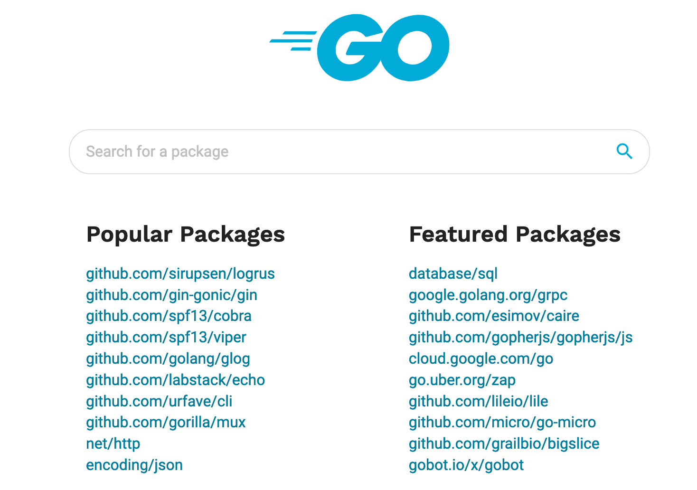
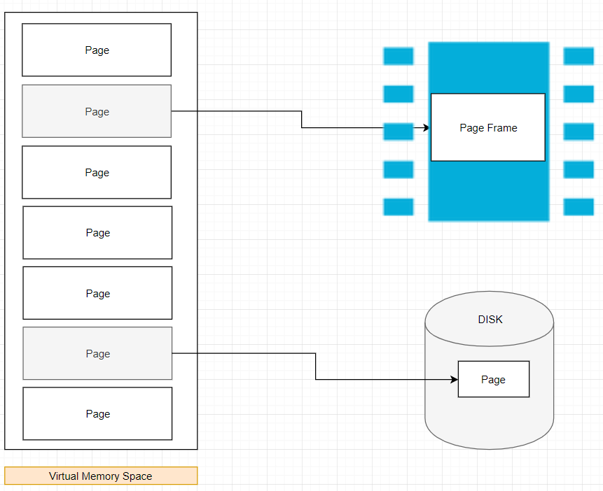
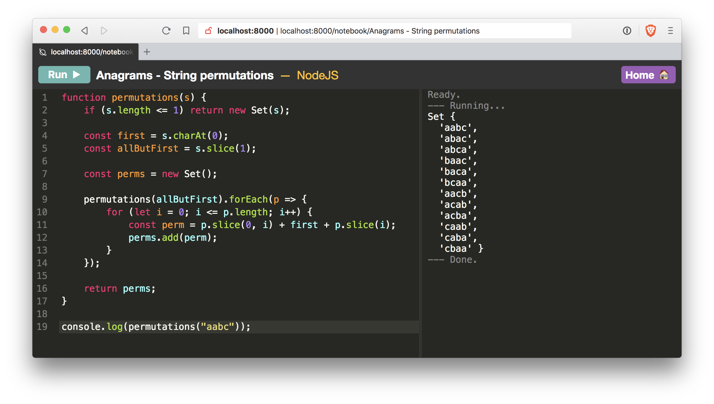
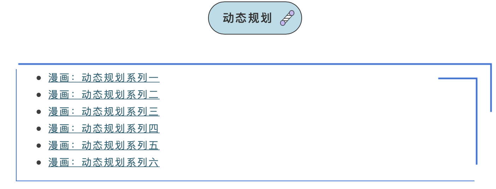

# Go语言爱好者周刊：第 31 期

这里记录每周值得分享的 Go 语言相关内容，周日发布。

本周刊开源（GitHub：[polaris1119/golangweekly](https://github.com/polaris1119/golangweekly)），欢迎投稿，推荐或自荐文章/软件/资源等，请[提交 issue](https://github.com/polaris1119/golangweekly/issues) 。

鉴于大部分人可能没法坚持把英文文章看完，因此，周刊中会尽可能推荐优质的中文文章。优秀的英文文章，我们的 GCTT 组织会进行翻译。

题图：pkg.go.dev 首页

## 刊首语

pkg.go.dev 上的流行库和精选库，除了标准库，你知道几个？又用过几个？Gin 和 Echo 这两个 Web 框架真的很流行！

## 资讯

1、[好消息：Go 语言新的代码文档中心 pkg.go.dev 不久将开源](https://mp.weixin.qq.com/s/COvi12VnZiat22NRq-KigQ)

Russ (rsc) 在 Go 邮件组发了一封邮件，提到目前 pkg.go.dev 的进展情况，其中提到不久将开源 pkg.go.dev ，这是一个令人兴奋的消息。

2、[Hugo 0.65.0 发布](https://gohugo.io/news/0.65.0-relnotes/)

Draft, expire, resource bundling 和任何页面的精细发布控制。而且速度更快。

如果您是 Hugo 的网站建设爱好者，那么如果您想在页面管理方面更加灵活，这似乎是一个重要的版本。

3、[SeqKit 0.12 发布](https://github.com/shenwei356/seqkit)

用于 FASTA/Q 文件操作的 Go 工具包。也许只有少数人会发现这很有用，但是看到 Go 可以用于生物化学研究就很好了。 FASTA/FASTQ 是用于存储“核苷酸和蛋白质序列”的格式。

4、[Istio 1.4.5 发布，大型微服务系统管理工具](https://www.oschina.net/news/113497/istio-1-4-5-released)

stio 1.4.5 发布了。Istio 是一个由谷歌、IBM 与 Lyft 共同开发的开源项目，旨在提供一种统一化的微服务连接、安全保障、管理与监控方式。具体来说，Istio 是一个开源服务网格平台，它确保微服务在处理故障时以指定的方式相互连接。

## 文章

1、[如何"优雅"地发布自己的 go module 模块到 pkg.go.dev](https://mp.weixin.qq.com/s/ditfcZYvtos00Sn65ymEfw)

截止到 go1.13, go 官方推出的包管理工具 go module 已经发布三个版本了，网上也有很多文章介绍如何使用 go module(推荐观看附录中Go夜读的视频和官方Wiki)，但是大部分都是讲如何引用别人的 go module 模块，鲜有提到如何发布自己的 go module 包的文章。本文将主要介绍如何“优雅”地发布自己的 go module 模块。

2、[这样的包该怎么命名？避免诸如 base、util、common 之类的包名](https://mp.weixin.qq.com/s/2t7lRjcVFztpUxqV1fIDWA)

写一个好的 Go 语言包的开端是起一个好名字。将你的包名视为一个 elevator pitch，你必须用一个单词来说明。

3、[只在我计算机上能跑的代码：select-case-default 忘记让出 CPU 的坑](https://mp.weixin.qq.com/s/zMZXd8DLtjhm06Q0lm1pcg)

为什么说是坑？当代码在自己的计算机上正常，我会很容易以为自己是对的，而且这个现象与操作系统的线程细节有关，很难找一个明确的环境原因。

4、[一天增长几千星星的 Go 项目：GitHub 的（CLI）命令行工具](https://mp.weixin.qq.com/s/OXtS88K_belZu7lbVUwm8w)

一直关注 Go 语言的应该了解，GitHub 的这个项目在 2019 年 10 月份就创建了。但最近才得到较好的传播。几天时间增长到 5700+ 星星，还在快速增长中。GitHub 爱好者一定要试试。

5、[2020 年为什么要选择 Go 并放弃 Python](https://mp.weixin.qq.com/s/rDypsB9yAua9uX2aC9_y1A)

过去一段时间，Go 语言中文网推过挺多 Python 相关的公众号，很多人诧异：为什么推的都是 Python 的呢？其实主要原因是因为 Python 类的公众号实在太多了，而且很多粉丝都特别多，我也挺纳闷的。不过他们值得我学习，也说明 Go 还有很长的路要走。另一篇：[Python 是过去式了吗？Golang 是未来吗？2020 Python 与 Go](https://mp.weixin.qq.com/s/6DttLAvbsxt9M5XhN30MoA)。

6、[Go 程序员的演变，最后的 “Rob Pike” 这个梗看懂了吗？](https://mp.weixin.qq.com/s/SA9dCjOQEtxvPEcYc4zCnw)

通过一个阶乘函数的不同写法将 Go 程序员进行划分。

7、[图解 Go 内存分配器(译)](https://tonybai.com/2020/02/20/a-visual-guide-to-golang-memory-allocator-from-ground-up/)

在这篇文章中，我们就来这么做(剥离抽象层去了解隐藏在其下面的技术魔法)。如果您想了解有关 Go 内存分配器的知识，那么本篇文章正适合您。

8、[如何优雅的使用 GDB 调试 Go](https://studygolang.com/articles/26715)

今天聊聊如何优雅的使用GDB调试Go程序。

9、[编写测试友好的 Golang 代码](https://studygolang.com/articles/26716)

目前我们有大量的应用采用了 Golang 程序进行构建，但是在执行研发流程里我们会发现一些来自于静态编译程序的不便：相对于我们之前使用的 Python 语言程序而言，我们无法在程序功能的单元测试里大量的使用 Mock 方式来进行高效测试。

10、[关于Golang过滤敏感信息的正确姿势](https://studygolang.com/articles/26717)

今天正好看到一篇关于敏感信息过滤的[文章](https://hackernoon.com/keep-passwords-and-secrets-out-of-your-logs-with-go-a2294a9546ce)，这算做一个interface实际应用的一些举例和应用。

11、[在 Go 中转向领域驱动设计](https://www.4async.com/2020/02/2020-02-16-moving-towards-domain-driven-design-in-go/)

本文的目的是帮助演示当应用程序随着时间不断推移不断演化时，我们如何利用领域驱动设计帮我们解决可能遇到的问题。

## 开源项目

1、[spinner](https://github.com/briandowns/spinner)

Go（golang）软件包，带有 70 多个可配置的终端 spinner/progress 指示器。

2、[Operator: 将运算符作为函数](https://github.com/tawesoft/go/tree/master/operator)

将逻辑，算术，按位和比较运算符实现为函数（例如Python的运算符模块）。包括一元，二进制和 nary 函数以及溢出检查的变量。

3、[Nodebook: 基于 Web UI 的极简的多语言 REPL](https://github.com/netgusto/nodebook) 

开始专门作为 Node 特定的 REPL，但现在它支持 Go，C，C ++，Elixir 等。不过，它主要是用 Go 语言编写的。直白话就是在线运行各种语言。

4、[go-memdb](https://github.com/hashicorp/go-memdb)

建立在不可变 Radix 树上的内存数据库。

5、[goxygen: 在几秒钟内生成一个由 Go 和 MongoDB 支持的 React 项目](https://github.com/Shpota/goxygen)

全栈应用生成器，可构建框架后端，该框架使用 Go 和 MongoDB 并在前端使用 React。

6、[Kivik: Go 的 CouchDB 或类似 CouchDB 的数据库的通用接口](https://github.com/go-kivik/kivik)

刚刚更新为使用模块的成熟库。

7、[go-blurhash: 纯 Go 的 “BlurHash” 实现](https://github.com/buckket/go-blurhash)

BlurHash，是模糊图片的一种哈希算法。图像占位符的超紧凑表示形式，模糊化地代表原始图像。

8、[REST: 专门用于 RESTful API 的 HTTP 客户端](https://github.com/sendgrid/rest)

SendGrid 的 Golang HTTP 客户端，用于调用 API。

9、[Twirp: 具有 Protobuf 服务定义的简单 RPC 框架](https://github.com/twitchtv/twirp)

它直接在 net/http 上运行，甚至可以在 HTTP 1.1 上运行。

10、[carbon](https://github.com/uniplaces/carbon)

一个时间扩展库，基于 PHP 的 carbon 库编写。提供易于使用的接口。这里有一篇介绍文章：[觉得 time.Time 太弱怎么办？Go 每日一库之 carbon](https://mp.weixin.qq.com/s/UyZKBzLhsePXWs6vn9uRgg)。

11、[clickhouse-go](https://github.com/ClickHouse/clickhouse-go)

clickhouse 官方 go 客户端 API  库。

12、[badidea](https://github.com/davecheney/badidea)

Go 反模式代码样例 by DaveCheney。

13、[collections](https://github.com/marcsantiago/collections)

Python collection 包的 Go 实现。

14、[super-graph](https://github.com/dosco/super-graph)

 无需编写代码即可在 Go web 项目中构建复杂的 GraphQL API。

15、[Gotri](https://github.com/monirz/gotri)

Go 中基于 Unicode 字符的前缀树的实现，Suggestion 需求可以用到。

16、[vectorsql](https://github.com/vectorengine/vectorsql)

一款类 ClickHouse 的 OLAP 型数据库。

17、[Task Pool](https://github.com/overtalk/task)

一个易于使用且高度可配置的 golang类库，专门用于任务的管理&执行，支持自定义次数的重发。介绍文章：https://studygolang.com/articles/26713

18、[gore](https://github.com/motemen/gore)

另一个运行良好的 Go REPL。具有行编辑，代码完成等功能。

## 资源&&工具

1、[一个 Go 语言在线课程](https://tutorialedge.net/course/golang/)

在本课程中，我们将研究如何开始使用 Go 编程语言。这个网站除了 Go 语言，还包括其他语言的在线课程，比如：Rust、Python、Vuejs 等。

2、[7 天用 Go 从零实现系列 第二期分布式缓存 GeeCache 已经完结](https://studygolang.com/topics/10934)

模仿 groupcache 实现了分布式缓存 [geecache](https://geektutu.com/post/geecache.html)，也算是学习经典项目源码的一种方式吧。

3、[2019 年翻译的 Go 编程语言规范](https://moego.me/golang_spec.html)

这是一篇 Go 编程语言的参考手册。访问 [golang.org](https://golang.org/) 以获取更多信息及其它文档。

Go 是一个在设计时便考虑到系统编程的通用语言。它是强类型的、带垃圾回收的并明确支持了并发编程。程序是由包所构建的，包属性支持高效的依赖管理。

4、[Go Web 框架 Gin 视频教程](https://youtu.be/qR0WnWL2o1Q)（英文）

自行科学上网。

5、[推荐一个用 Go 讲解算法的公众号：小浩算法](https://mp.weixin.qq.com/s/6eQbn2ZCEn0v4CBQk3m-HQ)

小浩算法 第一期（0102月汇总），随便截一张图：

## 订阅

这个周刊每周日发布，同步更新在[Go语言中文网](https://studygolang.com/go/weekly)和[微信公众号](https://weixin.sogou.com/weixin?query=Go%E8%AF%AD%E8%A8%80%E4%B8%AD%E6%96%87%E7%BD%91)。

微信搜索"Go语言中文网"或者扫描二维码，即可订阅。

