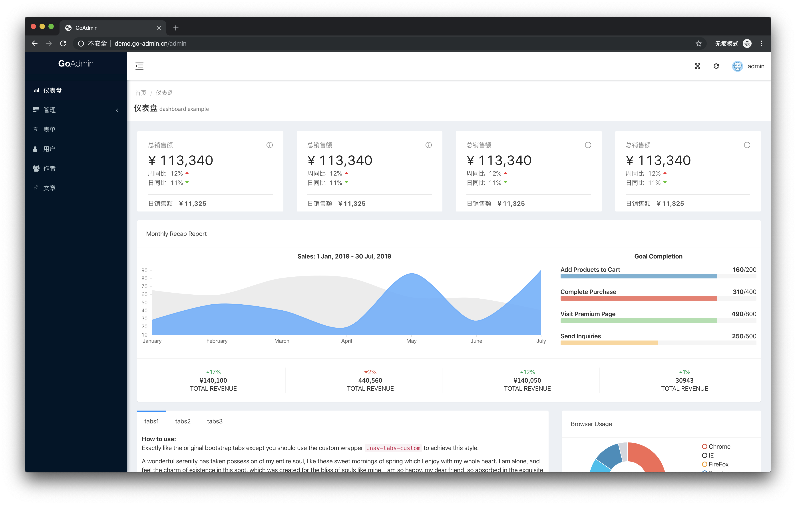
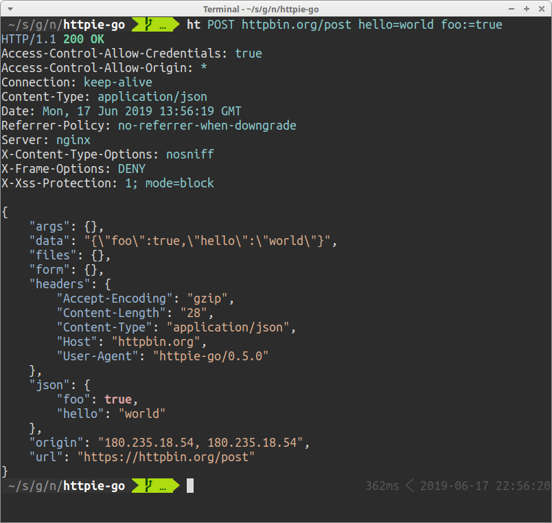
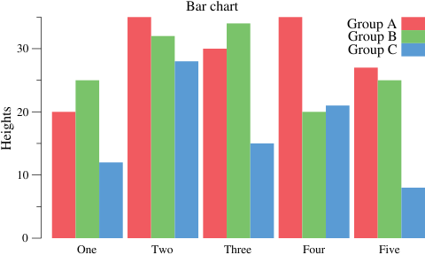
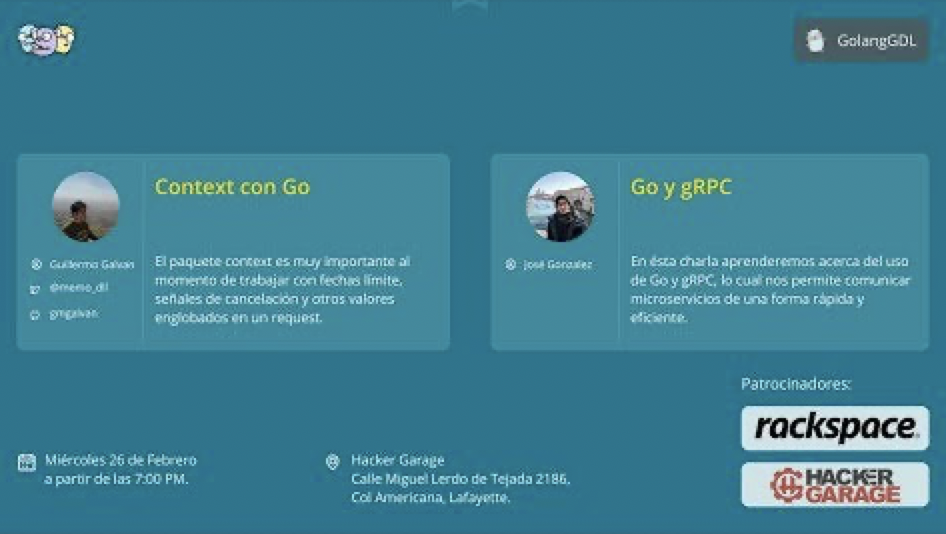

# Go语言爱好者周刊：第 33 期

这里记录每周值得分享的 Go 语言相关内容，周日发布。

本周刊开源（GitHub：[polaris1119/golangweekly](https://github.com/polaris1119/golangweekly)），欢迎投稿，推荐或自荐文章/软件/资源等，请[提交 issue](https://github.com/polaris1119/golangweekly/issues) 。

鉴于大部分人可能没法坚持把英文文章看完，因此，周刊中会尽可能推荐优质的中文文章。优秀的英文文章，我们的 GCTT 组织会进行翻译。

题图：来自网络

## 刊首语

今天是 3.8，女神节快乐。如果有女神 Gopher 看到了，留个言呗！

## 资讯

1、[istio1.5 发布](https://istio.io/news/releases/1.5.x/announcing-1.5/)

拥抱变化，爱上单体。

2、[TIOBE 发布 2020 年 3 月编程语言排行榜，Go 语言的表现令人惊叹！](https://mp.weixin.qq.com/s/_N0pEy7uUO8jvSc3OalsGQ)

TIOBE 公布了2020年3月的编程语言排行榜，Go 冲进前 10。

3、[TiDB 3.0.11 发布](https://www.oschina.net/news/113887/tidb-3-0-11-released)

分布式 NewSQL 数据库，有新功能增加。

4、[GoLand 2019.3.3 稳定版发布](https://blog.jetbrains.com/go/2020/03/04/goland-2019-3-3-is-out/)

GoLand 2019.3.3 稳定版已发布，此版本主要是修复错误和提供对 Go 1.14 的支持，旨在让开发者能够使用 GoLand 中的 vendor/ 和 Go 1.14 在 Go Modules 项目上进行开发。

5、[GoAdmin v1.2.4 版本发布](https://www.oschina.net/news/113825/goadmin-1-2-4-released)

GoAdmin是一款基于golang的数据可视化管理后台搭建框架。致力于简化saas，数据可视化系统搭建难度，提升golang开发效率，将高效率高性能的体验带给所有开发者。

## 文章

1、[获得了“官方自己都会踩的”坑认证：slice 类型内存泄露的逻辑](https://mp.weixin.qq.com/s/ZJ0-RTOYKfJySPdpDmGGkQ)

如果你的 slice 大小是用户输入决定的，在往 pool 里放的时候，应该提前判断一下 slice 的容量，否则即使能够复用，也始终有一部分内存空间是浪费掉的。

2、[IM系统的前世今生—2小时用Go快速搭建高性能、可拓展的IM系统](https://mp.weixin.qq.com/s/6LG4D4Bt3_lM0QW2RkqI_A)

使用Go搭建一个IM系统比使用其他语言要简单很多，而且具备更好的拓展性和性能。

3、[Go 官宣：新版 Protobuf API](https://mp.weixin.qq.com/s/7w6BM23CXrXGx4HD8ZnzMg)

我们很高兴地宣布，用于 Google 的语言无关数据交换格式 protocol buffers 的新版 Go API 发布了，这是一次重大的版本升级。

4、[Go：大切片一定比小切片代价大吗？](https://mp.weixin.qq.com/s/RlTVM0c20qnrC2Hu6sO7Tg)

来自 Dave Cheney 的文章。

5、[一位 Rust 开发者的 Go 初体验](https://mp.weixin.qq.com/s/E8OUaGqR_furgYsdey34bg)

在这篇文章中，我会尽量避免将 Go 与 Rust 进行过多的比较，不过，由于我是从 Rust 转向 Go，难免也会包含一些比较。应该事先声明的是，我更偏袒 Rust ，但会尽力做到客观。

6、[除了标准库 sync 包外，这个官方包(golang.org/x下的)你应该了解](https://mp.weixin.qq.com/s/WSwFbeSoedAtQCPD3andvQ)

本文是基于 https://rodaine.com/2018/08/x-files-sync-golang/ 并结合作者自己的一些观点混合而成，如有问题欢迎交流。

7、[Go Web 编程--超详细的模板库应用指南](https://segmentfault.com/a/1190000021908290)

如果你有过Web编程的经验，那么或多或少都听说过或者使用过模板。简而言之，模板是可用于创建动态内容的文本文件。

8、[Go 的方法集详解](https://mp.weixin.qq.com/s/sWDrVL0EsHzCDNDpGtpT-A)

Go语言以其本身具有的高并发特性，在云计算开发中，得到了广泛的应用，也深受广大开发者的欢迎。但是大家对go语言真的了解了么？本文作者经过对go语言的多年实践应用，现对go语言中的方法集进行了一次详细的总结，并通过实验进行了验证，相信对于go语言爱好者有很大的帮助。下来就跟随作者一起学习下吧。

9、[Golang调度器GMP原理与调度全分析](https://www.jianshu.com/p/fa696563c38a)

该文章主要详细具体的介绍Goroutine调度器过程及原理，可以对Go调度器的详细调度过程有一个清晰的理解，花 费4天时间作了30+张图。

10、[一次 golang 程序无故频繁重启的问题](https://studygolang.com/articles/27027)

详细的分析过程。

11、[一篇文章理解 golang 中切片与数组的关系](https://studygolang.com/articles/27012)

在 golang 文档中，对数组与切片有一些详细的讲解，本文主要讲解数组与切片的关系。

12、[Golang的sync.WaitGroup 实现逻辑和源码解析](https://juejin.im/post/5e5b62f86fb9a07cb1578fda)

方便的并发，是Golang的一大特色优势，而使用并发，对sync包的WaitGroup不会陌生

## 开源项目

1、[dque: 快速，可持久化、内嵌式队列](https://github.com/joncrlsn/dque)

刚发布的版本 2.2 包含阻塞出队方法，以等待将某些内容添加到队列中。

2、[Monkey: Go 中任意猴子修补](https://github.com/bouk/monkey) 

作为一个有趣的实验，它可以在运行时重写可执行文件，并插入跳转以重定向发生的事情。这是非常不安全的，请勿将其用于娱乐以外的用途。

3、[gonum: Go 的数字图书馆](https://github.com/gonum/gonum)

涉及矩阵，统计数据，优化等。两年前发布，但仍在不断更新。

4、[ergo](https://github.com/halturin/ergo)

Erlang/OTP 的 Go 实现。

5、[protostructure](https://github.com/mitchellh/protostructure)

使用 protobuffer 编解码结构体。

6、[mathfmt](https://github.com/mmcloughlin/mathfmt)

将 Go 代码注释中的数据标记转换为数据公式。

7、[httpie-go](https://github.com/nojima/httpie-go)

httpie 的 Go 实现。

8、[deviceplane](https://github.com/deviceplane/deviceplane)

嵌入式系统和边缘硬件的管理系统。

9、[florentino](https://github.com/0xsha/florentino)

静态文件分析框架。

10、[plot: Go 绘图和可视化库](https://github.com/gonum/plot)

gonum/plot 是 code.google.com/p/plotinum 的新官方分支。它提供了用于在 Go 中构建和绘制图的 API。请注意，此新API 仍在不断变化中，并且可能会发生变化。每日一库介绍：<https://mp.weixin.qq.com/s/1ajT4l0F3UZF7BsmN1SFjw>。

11、[goup](https://github.com/rvflash/goup)

Go 中检测 module 中更新操作库。

12、[Terraform](https://github.com/hashicorp/terraform)

Go 实现的一种用于安全高效地构建，更改和版本控制的基础设施。

13、[plik](https://github.com/root-gg/plik)

一款开源的临时文件上传系统。

14、[emoji](https://github.com/enescakir/emoji)

Go 简约表情包。该包包含基于 <https://unicode.org/Public/emoji/13.0/emoji-test.txt> 的完整表情符号列表 v13.0 版本。

15、[recursive-deep-hash](https://github.com/panospet/recursive-deep-hash)

用于哈希任何 Golang 接口的库。

16、[webview](https://github.com/zserge/webview)

适用于 C/C++/Golang 的微型跨平台 Webview 库。使用 WebKit（Gtk/Cocoa）和 Edge（Windows）。

## 资源&&工具

1、[【Go 夜读】第 77 期阅读 Go 源码带来的收益](https://studygolang.com/topics/11019)

夜读发起人杨文结合他最近阅读的 Go 源码，进而应用到开源项目，并反馈到项目的过程，来跟大家聊聊阅读 Go 源码带来的收益。

2、[goforward](https://github.com/jamesmoriarty/goforward)

Go 实现的有限速功能的代理。

3、[Go Time 第 120 期](https://changelog.com/gotime/120)

新 AI 的可能性探讨。有不少 Go 语言 AI 方面的库。

4、[开源电子书 TiDB In Action](https://github.com/pingcap-incubator/tidb-in-action)

TiDB in Action 是一本重视实操的书，更偏向工具的介绍和使用，介绍原理部分会比较少，而且会尽量通过宏观的描述或者图片的形式表达。

5、[GolangGDL Community](https://www.youtube.com/watch?v=CzLf8oCtT2o)

墨西哥瓜达拉哈拉（Guadalajara）举行的关于 Go 的 2020 年 2 月最后一次聚会。油管视频，请科学上网查看。

## 订阅

这个周刊每周日发布，同步更新在[Go语言中文网](https://studygolang.com/go/weekly)和[微信公众号](https://weixin.sogou.com/weixin?query=Go%E8%AF%AD%E8%A8%80%E4%B8%AD%E6%96%87%E7%BD%91)。

微信搜索"Go语言中文网"或者扫描二维码，即可订阅。

