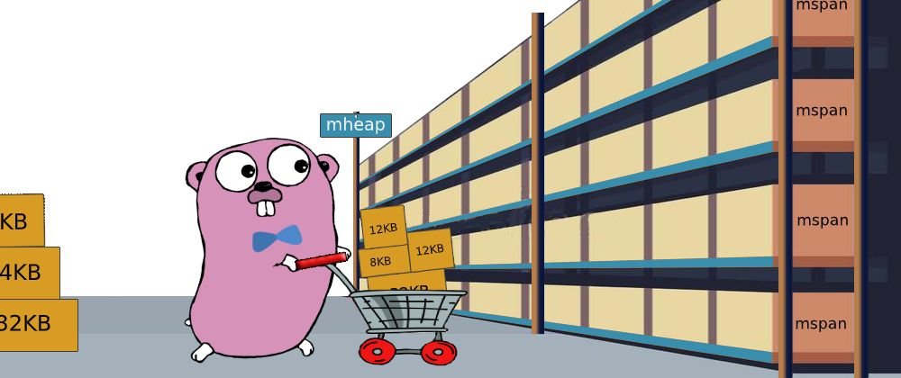
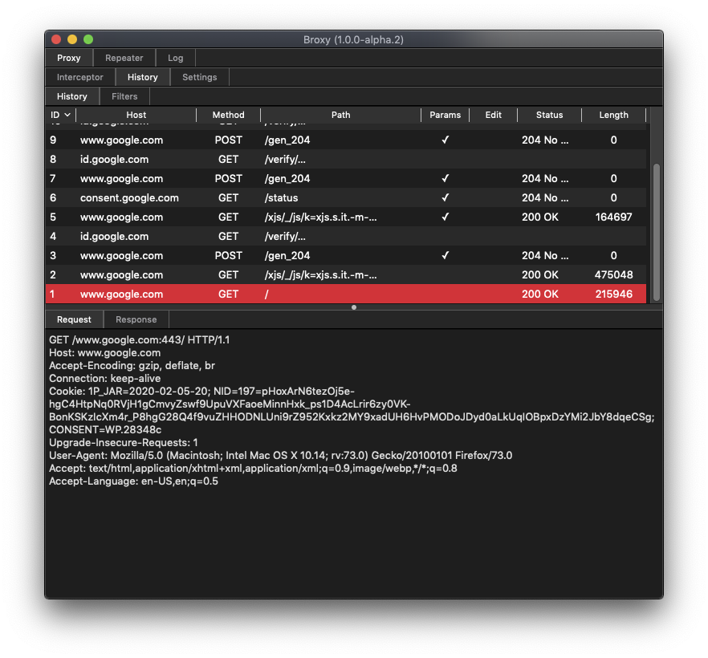
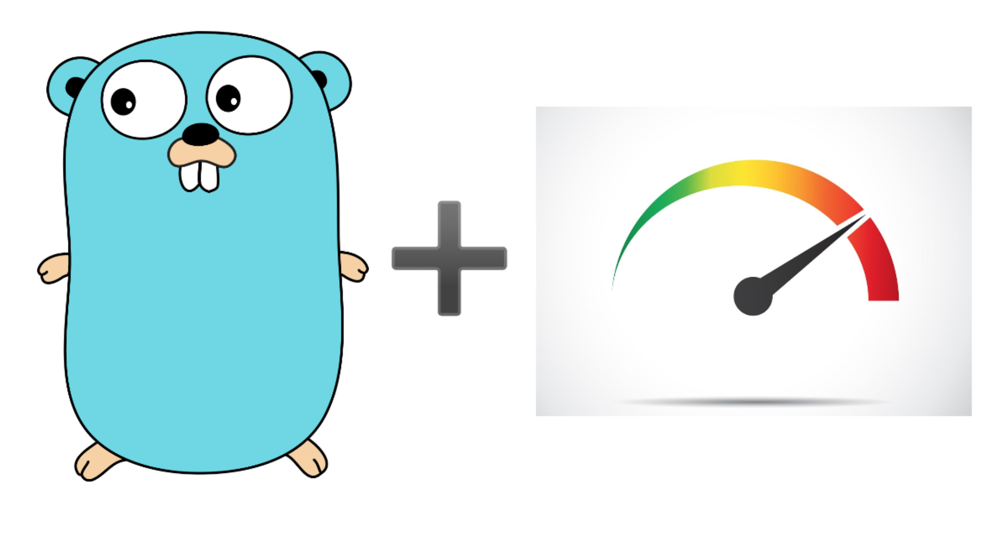
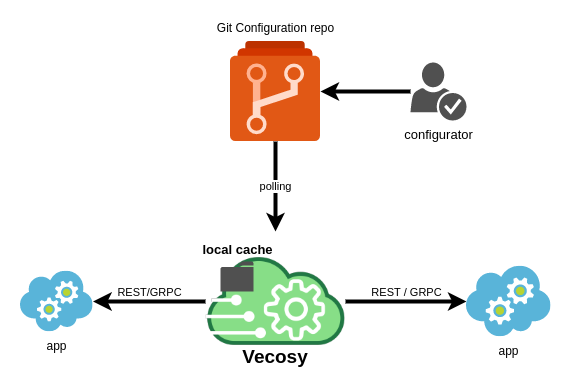
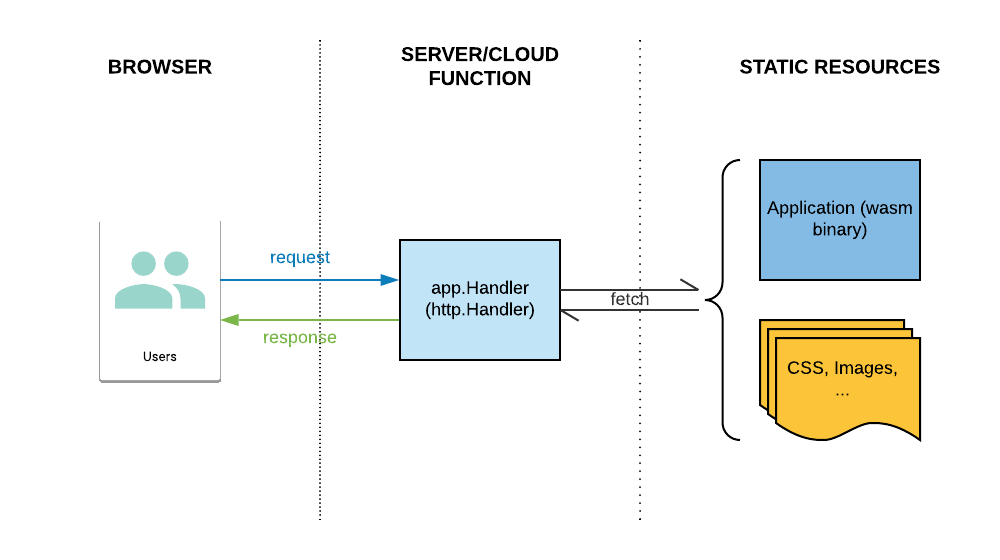
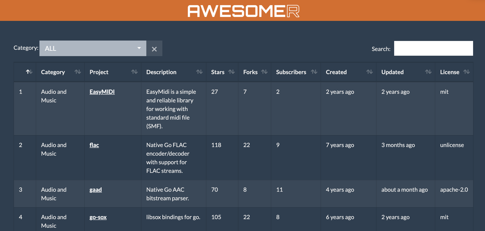

# Go语言爱好者周刊：第 34 期

这里记录每周值得分享的 Go 语言相关内容，周日发布。

本周刊开源（GitHub：[polaris1119/golangweekly](https://github.com/polaris1119/golangweekly)），欢迎投稿，推荐或自荐文章/软件/资源等，请[提交 issue](https://github.com/polaris1119/golangweekly/issues) 。

鉴于大部分人可能没法坚持把英文文章看完，因此，周刊中会尽可能推荐优质的中文文章。优秀的英文文章，我们的 GCTT 组织会进行翻译。

题图：最近的股市，你还好吗？来自：pexels

## 刊首语

Go 1.14 的这个 issue 大家怎么看，有人升级遇到过吗？[runtime: sometimes 100% CPU spin during init phase in Go 1.14 with preemptive scheduler](https://github.com/golang/go/issues/37741)。

## 资讯

1、[Oragono 2.0 发布，Go 语言编写的现代 IRC 服务器](https://github.com/oragono/oragono/releases/tag/v2.0.0)

支持最新的 IRC 聊天功能（例如 IRCv3），UTF-8，并且从本周的版本 2 开始，支持持久化历史记录，LDAP 支持以及全面的“bouncer” /始终在线客户端支持。

2、[关于 COVID-19 参加活动组织者的公告](https://golangweekly.com/link/85311/web)

Google 禁止员工进行所有国际旅行，直到另行通知为止，并且 Go 团队的任何成员至少在2020年5月之前不能进行国际旅行。因此一些原定的 Go 大会也取消了。除此以外，您还可以通过多种方式将您的状态通知给社区 Meetup。

3、[cli 2.2 发布](https://github.com/urfave/cli)

这是一个构建 Go CLI 应用程序的快速方法。这是 v2 版本文档：<https://github.com/urfave/cli/blob/master/docs/v2/manual.md>，很全。请考虑 bash 和 zsh 自动完成功能。

4、[Go Present 文件支持 Markdown](https://github.com/golang/tools/commit/8ac058ed9fb4355ae54723001f2956075c106a5b)

使用的是 github.com/yuin/goldmark 这个库。

5、[VS Code 1.43发布：远程开发、同步设置等新特性](https://mp.weixin.qq.com/s/XTUr9OZSb8UeBcGiYS5y1g)

Visual Studio Code 1.43 版本，即 2020 年的 2 月更新已发布。

## 文章

1、[Go1.14 的这个改进让 Gopher 生活更美好](https://mp.weixin.qq.com/s/qfou8AxoLAIG7CdnuKJGPw)

testing 包是 Go 标准库中我最喜欢的程序包之一，不仅是它具有低干扰的单元测试方法，而且在 Go 的整个生命周期中，它可以改善、提高生活质量。Go1.14 的 go test -v 支持流式输出。

2、[换个角度看：Go里的unsafe包是什么？](https://mp.weixin.qq.com/s/pb9TNEE4Jp2mdrJcKyzhEg)

unsafe 被用于和 Go 提供的安全类型相对立的一个名称了。让我们深入理解下文档中提到的 2 个要点。

3、[一文掌握 Go 语言 Select 的四大用法](https://mp.weixin.qq.com/s/-i-PoCTPuhRpd4cAKpNwuw)

本文带大家认识 Go 语言的 Select 用法。

4、[Go 如何防止缓存穿透](https://mp.weixin.qq.com/s/s8i2wQXHaP9EDJ0uXIR54A)

当线上接口请求量比较大时，如果恰好遇到缓存失效，会造成大量的请求直接打到数据库，导致数据库压力过大、甚至崩溃。如果缓存的数据实时性要求不那么高，可以试试 do-once-while-concurrent：<https://github.com/abusizhishen/do-once-while-concurrent>。

5、[Go 1.14 值得关注的几个变化](https://tonybai.com/2020/03/08/some-changes-in-go-1-14/) 

Go自从宣布Go1 Compatible后，直到这次的Go 1.14发布，Go的语法和核心库都没有做出不兼容的变化。这让很多其他主流语言的拥趸们觉得Go很“无趣”。但这种承诺恰恰是Go团队背后努力付出的结果，因此Go的每个发布版本都值得广大gopher尊重，每个发布版本都是Go团队能拿出的最好版本。解读一下Go 1.14的变化，看看这个新版本中有哪些值得我们重点关注的变化。

6、[可视化Go内存管理](https://tonybai.com/2020/03/10/visualizing-memory-management-in-golang/)

这篇文章为您提供了Go内存结构和内存管理的概述。这里不是全面详尽的说明，有许多更高级的概念，实现细节在各个版本之间都在不断变化。但是对于大多数Go开发人员来说，这些信息就已经足够了，我希望它能帮助您编写出更好的、性能更高的应用程序，牢记这些，将有助于您避免下一个内存泄漏问题。

7、[小心 go.mod 中的 go directive](https://tonybai.com/2020/03/09/take-care-of-the-go-directive-in-go-dot-mod/)

目前仅仅在使用比 go.mod 中 Go 指示器版本低的 Go 编译器对 module 下源文件进行编译，在报错的时候才会给出版本不匹配的提示。

8、[“网红” WebAssembly 与 K8s 如何实现双剑合璧？](https://mp.weixin.qq.com/s/TWt9-All1U_m_5RlGPOg3Q)

WebAssembly 技术已经走出浏览器，让计算无处不在。本文利用 containerd 的扩展机制，可以为 WebAssembly 应用提供与其他容器应用一致的、抽象的、应用分发、交付和运维模型，可以在 Kubernetes 集群中进行统一调度和管理。

9、[官方博文：使用 Go Cloud 的 Wire 进行编译时依赖注入](https://mp.weixin.qq.com/s/e8NeYNXS0ju5h6dnbZleDA)

Go 团队公布了用于开放云开发的可移植云 API 和工具，开源项目Go Cloud 。这篇文章详细介绍了 Wire，一个随 Go Cloud 提供的依赖注入工具。

这里还有另外一篇：[《一文读懂 Go官方的 Wire》](https://mp.weixin.qq.com/s/ZQKi9O7DRJ3qGWhDL9aTVg)。

10、[直击痛点，详解 K8s 日志采集最佳实践](https://mp.weixin.qq.com/s/hvDaEaokxcekXCxREcEX1A)

在 Kubernetes 中，日志采集和普通虚拟机的方式有很大不同，相对实现难度和部署代价也略大，但若使用恰当则比传统方式自动化程度更高、运维代价更低。

11、[map 并发崩溃一例：顺便吐槽 Go 打印堆栈不友好](https://mp.weixin.qq.com/s/DJeyxJhHD8IC0V-l7Ogwww)

曹大根据实际业务遇到的问题总结。

12、[用面向对象设计原则理解 Go 中 interface](https://mp.weixin.qq.com/s/MqQ6b-Z_wvYe9YpNI5LDeA)

interface 是GO语言的基础特性之一。可以理解为一种类型的规范或者约定。它跟java，C# 不太一样，不需要显示说明实现了某个接口，它没有继承或子类或“implements”关键字，只是通过约定的形式，隐式的实现interface 中的方法即可。因此，Golang 中的 interface 让编码更灵活、易扩展。

13、[API 网关和服务网格的区别](https://mp.weixin.qq.com/s/cdRjQdgaA6Z9x8UZgGTN2Q)

本文的目标是提供一个备忘单（Cheat sheet），指导架构师决定何时使用API网关，何时使用服务网格。

## 开源项目

1、[arkanoid-go: 用 Go 语言编写的 Arkanoid 游戏](https://github.com/x-hgg-x/arkanoid-go)

对于那些在 80 年代还没有玩游戏的人，请考虑一下球棒游戏，这是用 Go 语言编写的，使用了 Ebiten 2D 游戏引擎，并遵循实体组件系统（ECS）架构。

2、[pogreb](https://github.com/akrylysov/pogreb)

读优化的嵌入式键值存储。

3、[cidrchk](https://github.com/mhausenblas/cidrchk)

CIDR 地址范围重叠检查利器。

4、[broxy](https://github.com/rhaidiz/broxy)

用 Go 编写的 HTTP/HTTPS 拦截代理。

5、[netscanner](https://github.com/R4yGM/netscanner)

TCP&UDP 端口扫描器。

6、[flagr](https://github.com/checkr/flagr)

Flagr 是一个开源 Go 服务，它提供功能 flag，实验（A/B测试）和动态配置微服务。

7、[gonce](https://github.com/arham-jain/gonce)

用 Go 编写的 HTTP 性能测试工具。这里一篇介绍的英文文章：[Performance testing with Golang](https://medium.com/@arham.jain/performance-testing-with-golang-e125ced388b6)。

8、[vecosy](https://github.com/vecosy/vecosy)

用 Go 编写的集中式配置系统 — 兼容 Spring Cloud。

9、[reqstrategy](https://github.com/syavorsky/reqstrategy)

支持重试、限流等策略的 http.Client 客户端。

10、[srv](https://github.com/kevinpollet/srv)

简单，安全和现代化的 Go HTTP 服务器，可轻松服务于静态站点，单页应用程序或文件。

11、[unioffice](https://github.com/unidoc/unioffice)

用于创建和处理 Office Word（.docx），Excel（.xlsx）和 Powerpoint（.pptx）文档的纯 Go 库。

12、[go-app](https://github.com/maxence-charriere/go-app)

使用 Go 编程语言和 WebAssembly 构建渐进式 Web 应用程序的软件包。

## 资源&&工具

1、[faas: 将 Go 函数转换为 API](https://github.com/schollz/faas)

基本上是一种将函数转换为包装在容器中的 HTTP 服务的轻量级方法。

2、[goawk: Go 语言编写的 awk 解析器](https://github.com/benhoyt/goawk)

awk 是一种历史悠久的文本处理语言。好吧，又一个轮子！

3、[基于 Go 与 Redis 构建的高性能推荐引擎](https://lp.redislabs.com/rs/915-NFD-128/images/WP-RedisLabs-Recommendations-Engine-102-proof.pdf)

PDF 下载。

4、[可查询、排序的图形化 awesome-go 列表](https://awesomer-go.pantas.net)

很棒的工具，查询方便多了。

5、[给 Go 程序员的 Rust 语言介绍](https://www.youtube.com/watch?v=eQjPvsmfIts)

这是一个 youtube 视频。Rust 近期感觉挺火！

6、[太优秀了！竟然直播分布式写书：TiDB In Action 48小时写完了](https://mp.weixin.qq.com/s/hrXyd5qS2S4UtflxDuXHqg)

一本开源图书：TiDB In Action。地址：https://github.com/pingcap-incubator/tidb-in-action。

7、[Micro In Action 系列教程](https://mp.weixin.qq.com/s/LKNJyMx1gz6qrGlVpR0Mbg)

关注 Go 语言中文网，系列教程持续更新中。

8、[Go 夜读第 78 期 — 《Go scheduler 源码阅读》](https://qcrao.com/ishare/go-scheduler/)

饶全成（饶大）在 Go 夜读的分享。

9、[Go 语言实现的虚拟股市交易游戏](https://github.com/delta/dalal-street-server)

Dalal Street 是由一群本科生开发的虚拟股市交易游戏。它是使用 Go 构建的。在线地址：<https://dalal.pragyan.org/trade>。

## 订阅

这个周刊每周日发布，同步更新在[Go语言中文网](https://studygolang.com/go/weekly)和[微信公众号](https://weixin.sogou.com/weixin?query=Go%E8%AF%AD%E8%A8%80%E4%B8%AD%E6%96%87%E7%BD%91)。

微信搜索"Go语言中文网"或者扫描二维码，即可订阅。

