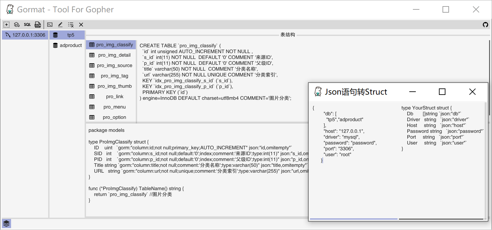

# Go语言爱好者周刊：第 35 期

这里记录每周值得分享的 Go 语言相关内容，周日发布。

本周刊开源（GitHub：[polaris1119/golangweekly](https://github.com/polaris1119/golangweekly)），欢迎投稿，推荐或自荐文章/软件/资源等，请[提交 issue](https://github.com/polaris1119/golangweekly/issues) 。

鉴于大部分人可能没法坚持把英文文章看完，因此，周刊中会尽可能推荐优质的中文文章。优秀的英文文章，我们的 GCTT 组织会进行翻译。

题图：全球范围的流行病新冠病毒。来自 pexels。祈祷疫情早日结束！

## 刊首语

有 3 期周刊没有发布原创，这期终于可以发布原创了。一晃已经 35 期了，9 个月了，希望我的这份周刊能够对 Gopher 们有所帮助，我会坚持下去的！

## 资讯

1、[Go 1.14.1 和 Go1.13.9 发布](https://studygolang.com/topics/11106)

主要修复的问题主要包括 go命令，工具，运行时，工具链，以及 crypto/cypher 包。最重要的是修复 抢占调度 的 bug。

2、[GopherCon 2020 因新冠疫情推迟，但尚未取消](https://blog.gopheracademy.com/gophercon-2020-news/)

最终情况得观察。

## 文章

1、[一次 golang fasthttp 踩坑经验](https://mp.weixin.qq.com/s/xreXM3mU47Qzj16bK1vxXA)

个人建议，尽可能还是使用标准库 net/http。

2、[官方不推荐使用 Goroutine ID，但它自己却使用了：原来是这么做的](https://mp.weixin.qq.com/s/K9HXoqSw3vIfSrsLcNBJEg)

在操作系统中，每个进程都会有一个唯一的进程编号，每个线程也有自己唯一的线程编号。同样在 Go 语言中，每个 Goroutine 也有自己唯一的 Go 程编号（下文简称为 goid），这个编号在 panic 等场景下经常遇到。虽然 Goroutine 有内在的编号，但是 Go 语言却刻意没有提供获取该编号的接口。

3、[用 Go 编写能存数百万条记录仍非常快的缓存服务](https://mp.weixin.qq.com/s/5OlvWwp6EXPntwayd5xtTQ)

我们的团队需要编写非常快速的缓存服务。目标非常明确，但可以通过多种方式实现。最后，我们决定尝试一些新的东西，并在 Go 中实现该服务。本文描述了我们是如何做到的以及由此产生的价值。

4、[曹春晖：谈一谈 Go 和 Syscall](https://mp.weixin.qq.com/s/YPiYNPa3xVD9Il1HeB5pTw)

syscall 是语言与系统交互的唯一手段，理解 Go 语言中的 syscall，本文可以帮助读者理解 Go 语言怎么与系统打交道，同时了解底层 runtime 在 syscall 优化方面的一些小心思，从而更为深入地理解 Go 语言。

5、[鹅厂工程师告诉你 Go 为什么这么“快”](https://mp.weixin.qq.com/s/enjlUh9ldfpLUdU1VQFkRA)

本文主要介绍了 Go 程序为了实现极高的并发性能，其内部调度器的实现架构（G-P-M 模型），以及为了最大限度利用计算资源，Go 调度器是如何处理线程阻塞的场景。

6、[通过这篇文章掌握 HTTP 协议和 Go http 库](https://mp.weixin.qq.com/s/eewXxLEDa3lujKbcePdTfw)

这篇文章我们就按照这几种常见的服务端对 HTTP请求的操作来说一下服务器应用程序如何通过 Request对象解析请求头和请求体。

7、[滴滴Go实战：高频服务接口超时排查&性能调优](https://mp.weixin.qq.com/s/8l2Qf2vozhCcb9AvvJSBYA)

业务中超时抖动是大家平时比较容易遇到的一种技术问题，本文详细记录了一次线上容器中高频 go 服务超时的排查过程。本文可以给大家提供查服务业务超时问题的一些思路，理解为什么 go 服务会获取错 cpu 核数，了解获取宿主 cpu 核数会有多大影响并怎样最小成本避开。

8、[如何使用go module导入本地包](https://mp.weixin.qq.com/s/9RKEe8k_BCRnXnzUWLKFsg)

详细介绍下如何使用go module导入本地包。

9、[30+张图讲解：Golang调度器GMP原理与调度全分析](https://mp.weixin.qq.com/s/SEPP56sr16bep4C_S0TLgA)

该文章主要详细具体的介绍Goroutine调度器过程及原理，可以对Go调度器的详细调度过程有一个清晰的理解，花费4天时间作了30+张图(推荐收藏)。

10、[众多的 Goroutine 如何在调试过程中方便快速找到](https://mp.weixin.qq.com/s/ANNUlYvWshNikNwCw6qSHw)

Goroutines 是大多数用 Go 编写的程序的重要组成部分。但是，使用大量 goroutines 会使程序难以调试。那怎么办？在此博文中，我们将介绍如何使用自定义数据为 goroutine 加上标签，这是 GoLand 2020.1（现已包含在 EAP 中）的最新功能之一。

11、[使用 minio 搭建高性能对象存储-第一部分：原型](https://tonybai.com/2020/03/16/build-high-performance-object-storage-with-minio-part1-prototype/)

项目有存储大量图片、短视频、音频等非结构化数据的需求可以考虑使用。项目地址：<https://github.com/minio/minio>

12、[图解Go运行时调度器(译)](https://tonybai.com/2020/03/21/illustrated-tales-of-go-runtime-scheduler/)

在这篇文章中，我们将深入 Go 运行时底层，从设计角度了解 Go 运行时调度程序是如何实现其魔法的，并运用这些原理去解释在 Go 性能调试过程中产生的 Go 调度程序跟踪信息。

13、[理解 Go 接口的实际应用](https://colobu.com/2020/03/15/understanding-Real-World-interface-design-in-go/)

Go是面向对象的编程语言吗？官方FAQ给出了标准答案: Yes and No。

14、[用 Golang 实现基于 Redis 的安全高效 RPC 通信](https://juejin.im/post/5e6eece16fb9a07cd614edcf)

从 Crawlab 早期节点通信方案 PubSub 开始，介绍当时遇到的问题和解决方案，然后如何过渡到现在的 RPC 解决方案，以及它是如何在 Crawlab 中发挥作用的。

15、[Go 调用原生 epoll 引起 event loop 阻塞问题](http://xiaorui.cc/archives/6758)

golang标准库net很优秀，可以让开发者轻易构建非阻塞网络服务，但开发爽快带来的问题协程数加大，比如在net/http里一个连接两个协程，grpc算是业务和keepalive心跳是四个协程，数据的进出是通过channel传输。

## 开源项目

1、[ntp: Go 的简单 NTP 客户端程序包](https://github.com/beevik/ntp)

用于查询你选择的网络时间协议服务器的当前时间。Facebook最近写了一篇[有趣的文章](https://engineering.fb.com/production-engineering/ntp-service/)，介绍了他们如何实施自己的准确 NTP 服务。

2、[pgzip: 并行 gzip 压缩和解压缩](https://github.com/klauspost/pgzip)

增加了并行性的 compress/gzip 的替代品。

3、[go-immutable-radix](https://github.com/hashicorp/go-immutable-radix)

hashicorp 出品的不可变 radix 树 Go 实现。

4、[LaTTe: 使用 LaTeX 模板和 JSON 生成 PDF](https://github.com/raphaelreyna/latte)

它使用 pdfLaTeX，并用 text/template 包渲染 `.tex` 文件来创建 PDF。这里提供了一个[在线演示](https://raphaelreyna.works/latte/)。

5、[gorush: Go 编写的推送通知服务器](https://github.com/appleboy/gorush)

支持 APNS（Apple 推送通知服务）和 Firebase。

6、[Wingo: 用 Go 语言编写的功能齐全的窗口管理器](https://github.com/burntsushi/wingo)

这不是一个新项目（实际上，它处于“维护模式”），但是到目前为止，我还不熟悉任何 Go 驱动的窗口管理器，因此，如果您有空的话，您可能会喜欢它。

7、[email](github.com/jordan-wright/email)

强大而灵活的电子邮件库。这里有一篇介绍文章：[Go 每日一库之 email](https://mp.weixin.qq.com/s/nxLZ3VEKV_6ory7n8feS9w)。

8、[jocko](https://github.com/nash-io/jocko)

Go 实现的 kafka，目前开发中。

9、[chat](https://github.com/tinode/chat)

即时通讯服务器：Go 的后端；iOS，Android，Web，命令行客户端；聊天机器人。

10、[syncthing: 文件同步工具](https://github.com/syncthing/syncthing)

一个免费开源的工具，它能在你的各个网络计算机间同步文件/文件夹，它的同步数据是直接从一个系统中直接传输到另一个系统的，并且它是安全且私密的。拥有 30.5+ 星星。

11、[nightingale: 分布式高性能监控系统](https://github.com/didi/nightingale)

Nightingale 是一套衍生自 Open-Falcon 的互联网监控解决方案，融入了部分滴滴生产环境的最佳实践，灵活易用，稳定可靠，是一个生产环境直接可用的版本。

## 资源&&工具

1、[slack-term: 基于终端的 Slack 客户端](https://github.com/erroneousboat/slack-term)

如果你开始在家中工作，并开始更多地使用 Slack，但又不想 与Web 或桌面客户端搭配使用。那么，这个试试这个使用 Go 开发的基于终端的客户端？

2、[gormat](https://github.com/airplayx/gormat)

golang 便捷转换器，支持从数据库到 Struct，从 SQL 到 Struct 和从 JSON 到 Struct。

类似的工具：<https://github.com/xxjwxc/gormt>，都是国人开发的。

3、[最佳 Kubernetes 教程大全](https://www.magalix.com/blog/the-best-kubernetes-tutorials)（英文）

我们一直在寻找最好的 Kubernetes 教程，并考虑分享一些我们发现有趣的 Kubernetes 入门知识。

4、[youtube 视频：GopherCon 以色列技术大会 2020 视频全集](https://www.youtube.com/playlist?list=PLRM-8sTy13XsffDigH_nsEV5l23sxoAU9)

科学上网观看！

5、[gotube](https://github.com/Marethyu12/gotube)

youtube 视频下载工具。

6、[视频：Go 垃圾收集机制](https://www.bigmarker.com/gobridge/Garbage-Collection-Semantics)

英文的。

7、[【Go 夜读】#80 带你提前玩 Go 2 新特性：泛型](https://studygolang.com/topics/11102)

泛型的内容不太好讲，一是因为对于熟悉泛型的人来说，Go 语言泛型的设计很好理解，几乎不需要介绍什么内容；二是因为目前 Go 语言泛型功能还不够丰富，虽然能够写出一部分泛型代码，但不够完美。 思前想后，这期分享的整体基调变成了讲述 Go 语言泛型设计的演变过程，为那些对泛型这一特性不够熟悉的人介绍 Go 语言泛型设计的变化，为什么成为了现在这个样子；并在介绍完具体设计后，通过实际编写几个例子来进一步理解目前泛型设计的优缺点。最后通过与 C++ 泛型设计的比较，来总结整个 Go 的泛型设计。

## 订阅

这个周刊每周日发布，同步更新在[Go语言中文网](https://studygolang.com/go/weekly)和[微信公众号](https://weixin.sogou.com/weixin?query=Go%E8%AF%AD%E8%A8%80%E4%B8%AD%E6%96%87%E7%BD%91)。

微信搜索"Go语言中文网"或者扫描二维码，即可订阅。

