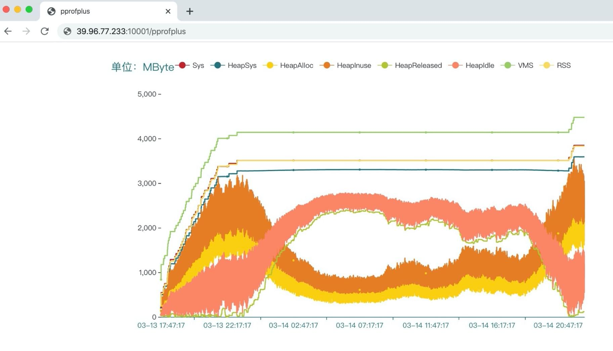
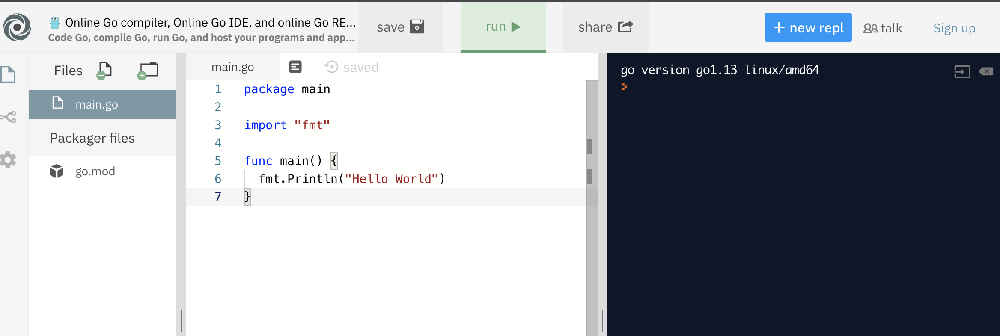
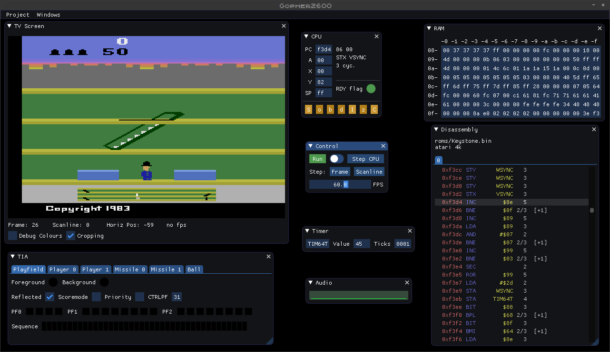

# Go语言爱好者周刊：第 36 期

这里记录每周值得分享的 Go 语言相关内容，周日发布。

本周刊开源（GitHub：[polaris1119/golangweekly](https://github.com/polaris1119/golangweekly)），欢迎投稿，推荐或自荐文章/软件/资源等，请[提交 issue](https://github.com/polaris1119/golangweekly/issues) 。

鉴于大部分人可能没法坚持把英文文章看完，因此，周刊中会尽可能推荐优质的中文文章。优秀的英文文章，我们的 GCTT 组织会进行翻译。

题图：k8s 1.18 Release Logo

## 刊首语

在 golang-dev 邮件列表中，Russ Cox 发布了一条有价值的消息：

> Go 开发并非与世界大事隔绝；Go 上的工作始终排在诸如个人和家庭健康与安全之类的基本问题之后。这些天，几乎我们所有人的工作量都减少了。我预计工作量将在未来几个月内进一步下降。
>
> 。。。
>
> 虽然我们自己的工作量减少了，但我们保留了相同的时间表，这样我们必须缩小发布期望的功能。一些新功能或计划中的功能将无法实现。没关系-下次再补上。为了我们自己的工作和他人的工作，我们都需要接受这一点。
>
> 最重要的是，让我们彼此保持友善和慈善。您不知道什么外部压力正在影响着电子邮件，review 或 GitHub comment 等另一端的人员。

以上只是部分，有兴趣的可以[阅读全文](https://groups.google.com/forum/#!msg/golang-dev/UxvN1W2B-zg/Vx1H8icfAwAJ)。希望疫情早点过去！

## 资讯

1、[Kubernetes 1.18正式发布](https://kubernetes.io/blog/2020/03/25/kubernetes-1-18-release-announcement/)

这是 2020 年首次版本发布。此版本包含 38 项功能增强，其中 15 项为稳定版功能、11 项 beta 功能以及 12 项 alpha 版功能。

2、[Go Blog 发文: 疫情之下的 Go 社区](https://mp.weixin.qq.com/s/DwWHC9vyrYx5jgKqSbYH9w)

Golang官方在3月25日发文，讨论了疫情对开发者生活的影响，官方为抗击疫情所做的工作，以及对疫情之下的Go开源工作的安排。

3、[xorm 发布 1.0 版本](https://gitea.com/xorm/xorm/src/tag/v1.0.0)

终于 1.0 版本了。这是我很喜欢的 ORM。

4、[Logrus 1.5 发布: 功能丰富的结构化记录器](https://github.com/sirupsen/logrus)

支持 JSON 格式，钩子（例如用于将某些日志条目发送到外部服务），以及支持与标准库的记录器兼容的 API。

5、[Duit: 使用 Go 和 Mithril.js 构建的简单资金跟踪器](https://github.com/RadhiFadlillah/duit)

一个完整，简单的资金跟踪网络应用程序。

## 文章

1、[分析标准库和优秀项目的接口：Go中接口应该这么定义](https://mp.weixin.qq.com/s/hj9sJov2XBBtq-HIPSWiHQ)

Go 是静态类型的编程语言，自 2009 年发布以来，已经十多岁了。现在，Go 广泛应用于云原生系统、微服务、web 开发、运维等场景，并且在 webassembly、嵌入式等也有进一步的探索。

2、[用 Go 构建不可变的数据结构](https://mp.weixin.qq.com/s/bCzAmt8LnOJgd46LNHZtTg)

共享状态是比较容易理解和使用的，但是可能产生隐晦以至于很难追踪的 bugs。尤其是在我们的数据结构只有部分是通过引用传递的。

3、[Go 常量学习-可视化指南](https://mp.weixin.qq.com/s/L6ysPUCyYhAwL6PsKXykhQ)

Go 的类型常量和非类型常量是两个必须要了解的关键概念

4、[对 Go GC 所谓的突破提出质疑？看现代垃圾收集策略](https://mp.weixin.qq.com/s/zFxlbUE1FhwjtBPgeJ8o-Q)

我最近看过很多文章，它们以令我困扰的方式推广 Go 语言最新的垃圾收集器。

5、[不到100行代码做并发控制：防缓存击穿的 singleflight 使用及原理](https://mp.weixin.qq.com/s/Fp9ueMRo-y8gTyxifJ84CQ)

`singleflight` 包主要是用来做并发控制，整个包的核心代码不到100行，充分利用到了`map`和`WaitGroup`的特性。

6、[流？I/O操作？阻塞？epoll? Go面试被问到 epoll，头大！](https://mp.weixin.qq.com/s/yxQgsuPm87MVc7BxYFRVhg)

本篇文章就是可以让你快速了解什么是epoll以及它的作用。

7、[Golang 三种方式实现超时退出](https://juejin.im/post/5e774a73e51d4526c70fd0a4)

熔断的方法。

8、[Go 进程的 HeapReleased 上升，但是 RSS 不下降造成内存泄漏？](https://pengrl.com/p/20033)

事情是这样的，线上一个服务，启动后RSS随任务数增加而持续上升，但是过了业务高峰期后，任务数已经下降，RSS却没有下降，而是维持在高位水平。

9、[源码解读 Golang 的 sync.Map 实现原理](https://juejin.im/post/5e784321518825493c7b7d8d)

通过这种读写分离的设计，解决了并发情况的写入安全，又使读取速度在大部分情况可以接近内建 map，非常适合读多写少的情况。

10、[Go项目简单接入travis ci](https://juejin.im/post/5e7592c0518825494a3fadd9)

本文主要讲述 Go 项目的使用，主要分为执行单元测试和 build 打包发步到 github release。

11、[Go 语言垃圾收集器的原理](https://mp.weixin.qq.com/s/KuWAO5Mh8pESS1eeZnIxPA)

详细介绍 Go 语言运行时系统中垃圾收集器的设计与实现原理，我们不仅会讨论常见的垃圾收集机制、从 Go 语言的 v1.0 版本开始分析其演进过程，还会深入源代码分析垃圾收集器的工作原理；接下来，我们进入 Go 语言内存管理的另一个重要组成部分 — 垃圾收集。

## 开源项目

1、[OpenBiohazard2](https://github.com/samuelyuan/OpenBiohazard2)

使用 Go 和 OpenGL 重新实现生化危机2 (Resident Evil 2) 游戏引擎。

2、[bigslice](https://github.com/grailbio/bigslice)

Go 编程语言实现的无服务器集群计算系统。类似  Apache Spark 和 FlumeJava。

3、[gold](https://github.com/aunum/gold)

Go 语言强化学习库。

4、[kafka-pixy](https://github.com/mailgun/kafka-pixy)

Go 实现的 Kafka 的 gRPC/REST 代理。

5、[sock5](https://github.com/txthinking/socks5)

Go 实现的全功能 Socks5 协议库。

6、[hof](https://github.com/hofstadter-io/hof)

使用 cuelang 语法的领域特定语言代码生成工具。

7、[mokku](https://github.com/kinbiko/mokku)

作者对该库有一篇文章讲解：5 天构建 Go mock 框架 <https://kinbiko.com/go/mokku/>。

8、[hostctl](https://github.com/guumaster/hostctl)

Go 开发的 hosts 文件管理工具。

9、[RxGo](https://github.com/ReactiveX/RxGo)

[ReactiveX](http://reactivex.io/)，使用 Observable 流进行编程的 API。如果要编写面向事件/可观察流，管道的异步程序，可以尝试它。

10、[typex: 检查Go类型的结构，接口和传递依赖项](https://github.com/dtgorski/typex)

在命令行上打印出 Go 包的树形结构及其类型结构和接口。

## 资源&&工具

1、[ion](https://github.com/pion/ion)

Go 与 Flutter 构建的分布式实时 RTC。

2、[在线 Go 开发环境](https://repl.it/languages/go)

在线 Go 编译器，在线 Go ID E和在线 Go 运行。这个网站还支持各种语言。

3、[Gopher2600: Atari VCS模拟器](https://github.com/JetSetIlly/Gopher2600)

功能相对完整的模拟器，包括控制器支持和游戏记录。

## 订阅

这个周刊每周日发布，同步更新在[Go语言中文网](https://studygolang.com/go/weekly)和[微信公众号](https://weixin.sogou.com/weixin?query=Go%E8%AF%AD%E8%A8%80%E4%B8%AD%E6%96%87%E7%BD%91)。

微信搜索"Go语言中文网"或者扫描二维码，即可订阅。

