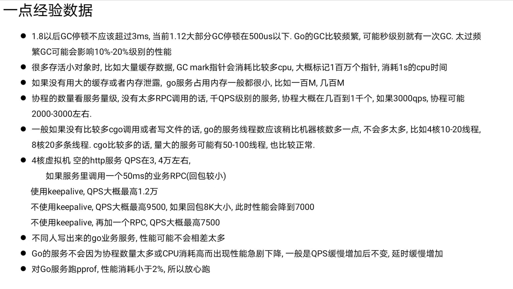
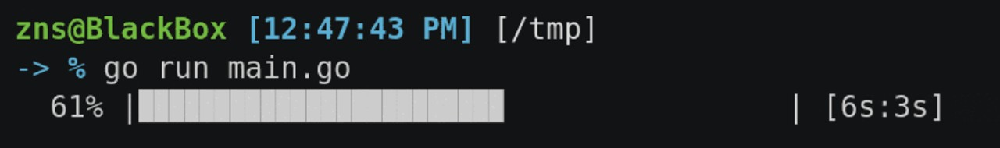
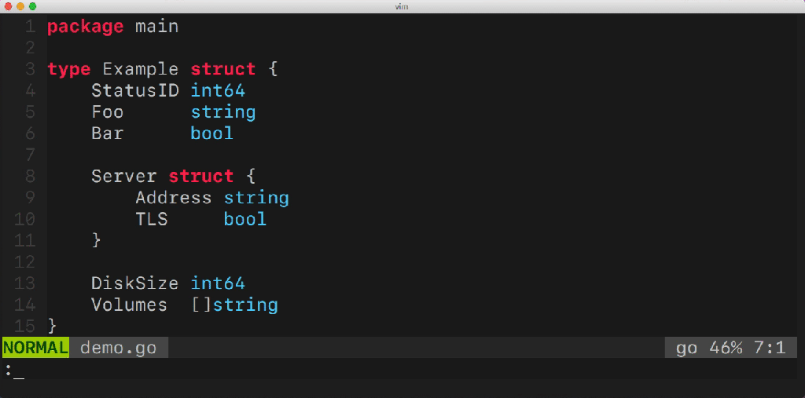
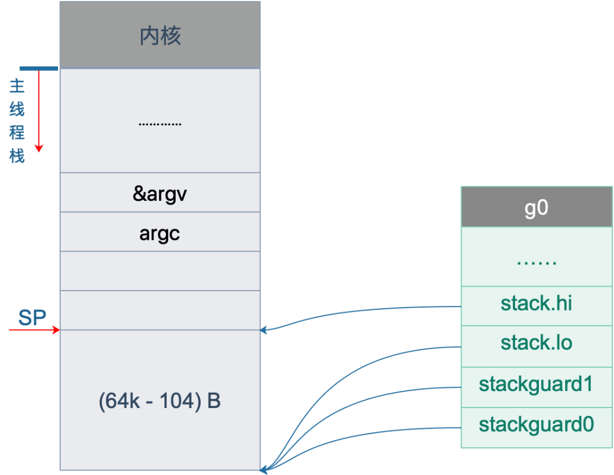
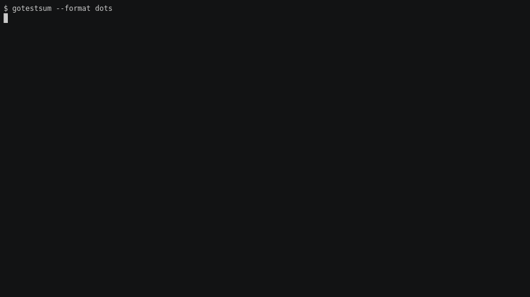
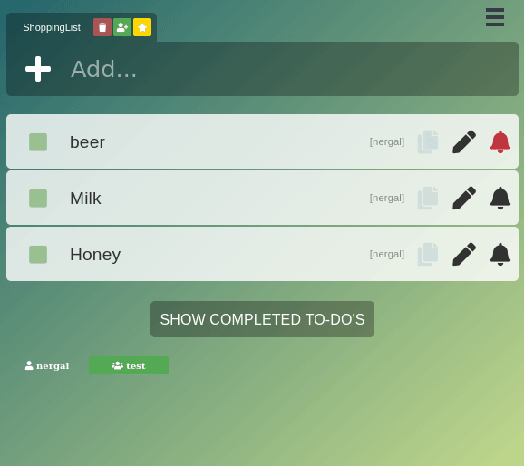

# Go语言爱好者周刊：第 37 期

这里记录每周值得分享的 Go 语言相关内容，周日发布。

本周刊开源（GitHub：[polaris1119/golangweekly](https://github.com/polaris1119/golangweekly)），欢迎投稿，推荐或自荐文章/软件/资源等，请[提交 issue](https://github.com/polaris1119/golangweekly/issues) 。

鉴于大部分人可能没法坚持把英文文章看完，因此，周刊中会尽可能推荐优质的中文文章。优秀的英文文章，我们的 GCTT 组织会进行翻译。

题图：春暖花开，有一个好心情

## 刊首语

来自腾讯大牛 yifhao 的 Go 相关经验数据，供参考。

## 资讯

1、[GoLand 2020.1 Beta 版本](https://blog.jetbrains.com/go/2020/03/26/goland-2020-1-reaches-beta/)

发行此 Beta 版意味着抢先体验计划已接近尾声。已经停止添加新功能，而致力于完善所有功能。

2、[Gitea 1.11.4 released](https://blog.gitea.io/2020/04/gitea-1.11.4-is-released/)

Bug 的修复，建议升级。

3、[progressbar 3.0 发布](https://github.com/schollz/progressbar)

适用于 Golang 应用程序的非常基础的线程安全进度条。

4、[gomodifytags 1.4 发布](https://github.com/fatih/gomodifytags)

修改 Go 结构字段标签的工具。

5、[RocketMQ Client Go 2.0 发布，Apache 官方出品](https://github.com/apache/rocketmq-client-go)

Apache RocketMQ 客户端。支持 Apache RocketMQ（分布式消息传递和数据处理平台）的几乎所有功能，例如发布和子消息，ACL 和跟踪。

6、[Gin 1.6.2 发布](https://github.com/gin-gonic/gin)

一个流行的 Go HTTP Web 框架。

## 文章

1、[Go 和 Rust 的优缺点；预测 Go 1.16-1.19 会支持泛型](https://mp.weixin.qq.com/s/B5ZR_zYfdMs-fcCzBR5fQA)

来自一位专家对这两门语言的优缺点的评价。

2、[Go语言 CPU 性能、内存分析调试方法大汇总：你要的都在这](https://mp.weixin.qq.com/s/-HojlxCZZIcWWwprQaVkzw)

本篇介绍Golang常用性能调试工具的应用场景。

3、[Golang vs Python：选哪个？](https://mp.weixin.qq.com/s/ICKpsE76dxjNeS2DF-QWJQ)

对开源开发来说 Golang 和 Python 哪个语言更好，我们详细分析对比一下。

4、[最流行的 Web 框架 Gin 源码阅读](https://mp.weixin.qq.com/s/69Ob4Qaq5byEYBqUVvLVJQ)

最近公司大部分项目开始往golang换, api的框架选定使用gin, 于是将 `gin`的源码看了一遍, 会用几篇文章将gin的流程及流程做一个梳理。

5、[滴滴实战分享：通过 profiling 定位 golang 性能问题 - 内存篇](https://mp.weixin.qq.com/s/wXzGZlvF6fCXjcGFzG74Xw)

线上性能问题的定位和优化是程序员进阶的必经之路，定位问题的方式有多种多样，常见的有观察线程栈、排查日志和做性能分析。性能分析（profile）作为定位性能问题的大杀器，它可以收集程序执行过程中的具体事件，并且对程序进行抽样统计，从而能更精准的定位问题。本文会以 go 语言的 pprof 工具为例，分享两个线上性能故障排查过程，希望能通过本文使大家对性能分析有更深入的理解。

6、[关于 Go 语言优秀命令行库 Cobra 的探索](https://mp.weixin.qq.com/s/PR7DBtBidBf-SAI7-n6-3w)

Cobra 是 Golang 生态系统中最着名的项目之一。它简单，高效，并得到 Go 社区的大力支持。让我们来深入探索一下。

7、[LeetCode Go 并发题详解：交替打印字符串](https://mp.weixin.qq.com/s/K032xlARjiyS8ecJrqZXaA)

本次将会示范 goroutine 教学中常讲到的「不要透过共享內存来通信，而要透过通信来共享內存」。

8、[Go语言的更新也将难逃疫情影响：顺带学习科技英语词汇](https://mp.weixin.qq.com/s/SnQ2ooZDJNYVUpfio7SAwA)

一般情况下，Go语言维持着半年发布一次更新的节奏。但是，随着疫情在世界范围内的发展，Go语言的更新也将受到影响。下面，我们就从英语原文来理解一下所受影响的情况，顺便了解一下相关的科技英语词汇。

9、[如何使用 Diago 诊断 Go 程序中的 CPU 和内存使用情况](https://mp.weixin.qq.com/s/UV4m4DmQvXGNr7l4d-JfWQ)

Diago 是借助 pprof 生成的配置文件和堆快照的可视化工具。

10、[Golang 连接池的几种实现案例](https://mp.weixin.qq.com/s/_J6CtjiamVHcnCNtCvvDOg)

因为TCP的三次握手等等原因，建立一个连接是一件成本比较高的行为。所以在一个需要多次与特定实体交互的程序中，就需要维持一个连接池，里面有可以复用的连接可供重复使用。

11、[【译】Go 语言源码贡献官方指导文档](https://mp.weixin.qq.com/s/0SzlFhdBHiavfW5gNUBbsg)

以前给 Go 语言项目源码提交过一些 commits，期间阅读他们的官方指导文档的时候觉得这篇指导文档可以作为绝佳的关于大型软件项目的规范管理的参考，因为最近又提交了几个 commits，就又把这篇文档再看了一遍，有感于 Go 团队在项目管理和工程实践上的一些宝贵经验，就把文档翻译成了中文；一来为了更加深入地理解 Go 语言团队的项目工程最佳实践，二来则是为了给其他有意给 Go 语言源码提交贡献的开发者提供一点参考。

12、[聊聊 g0](https://mp.weixin.qq.com/s/Ie8niOb_0C9z2kACNvWCtg)

很多时候，当我们跟着源码去理解某种事物时，基本上可以认为是以时间顺序展开，这是编年体的逻辑。还有另一种逻辑，纪传体，它以人物为中心编排史事，使得读者更聚焦于某个人物。以一种新的视角，把所有的事情串连起来，令人大呼过瘾。今天我们试着以这样一种逻辑再看 g0。

13、[关于如何收集，标准化和集中化处理 Golang 日志的一些建议](https://mp.weixin.qq.com/s/linxYO3N5oOhiVcS8-jpvw)

这篇文章将展开聊一些用于管理`Go`日志的工具和技术。我们将首先考虑要使用哪种日志记录包来满足各种记录要求。然后会介绍一些使日志更易于搜索和可靠，减少日志资源占用以及使日志消息标准化的技术。

## 开源项目

1、[mira](https://github.com/thecsw/mira)

提供了获取 Reddit 相关信息的简单API。

2、[pester: 提高 net/http 客户端的弹性](https://github.com/sethgrid/pester)

包装 Go 的 net/http 来添加退避和重试策略。

3、[Molecule: 高效解析 Protobuf 的库](https://github.com/richardartoul/molecule)

不仅高效，而且零内存分配。虽然还是 alpha 级别，但是对现有包的有前途的补充。

4、[Go-TinyTime: “微小”时间对象](https://github.com/lane-c-wagner/go-tinytime)

使用 4 字节的内存而不是 time.Time 的 24 字节。这是一个很小的胜利，因此，请仅考虑同时存储大量日期，嵌入式，时区并不重要等等情况下使用。[Go-TinyDate](https://github.com/lane-c-wagner/go-tinydate) 是相同的思路，但仅用于日级精度。

5、[Goro: 高级机器学习库](https://github.com/aunum/goro)

上周我推荐了新的强化学习库 [Gold](https://github.com/aunum/gold)，现在我们有了来自相同人群的 Keras 风格的 ML 库。

6、[dero](https://github.com/deroproject/derosuite)

又一款 Go 实现的区块链平台，160w 行代码。

7、[gotestsum](https://github.com/gotestyourself/gotestsum)

使 test 输出结果更人性化。

## 资源&&工具 

1、[使用 Go 实现 LeetCode 中 100+ 流行的题目](https://github.com/austingebauer/go-leetcode)

刷 LeetCode 似乎成为了一个程序员必修课，特别是找工作的。

2、[chisel: 通过 HTTP 的快速 TCP 隧道](https://github.com/jpillora/chisel)

这是 Go 的一个完美例子：将此类事情简化为单个可执行文件。

3、[tinykv](https://github.com/pingcap-incubator/tinykv)

基于 TiKV 模型构建分布式 key-value 服务的课程。

4、[kpt](https://googlecontainertools.github.io/kpt/)

谷歌开源的 Kubernetes 配置清单标准打包工具。

5、[fleet](https://github.com/rancher/fleet)

超大规模多 Kubernetes 集群的管理服务。

6、[播客：gotime 第 123 期](https://changelog.com/gotime/123)

居家工作的 Gopher。

7、[图书：kubebuilder cookbook](https://kubebuilder.io/)

在 Go 中快速构建和发布 Kubernetes API。

8、[kaf](https://github.com/birdayz/kaf)

一个很赞的 kafka 命令行工具。

9、[doit](https://github.com/Lallassu/doit)

Go 与 Vue 实现的 todo list 应用。

10、[cod](https://github.com/dim-an/cod)

Go 实现的 bash/zsh 的自动补全工具。

## 订阅

这个周刊每周日发布，同步更新在[Go语言中文网](https://studygolang.com/go/weekly)和[微信公众号](https://weixin.sogou.com/weixin?query=Go%E8%AF%AD%E8%A8%80%E4%B8%AD%E6%96%87%E7%BD%91)。

微信搜索"Go语言中文网"或者扫描二维码，即可订阅。

