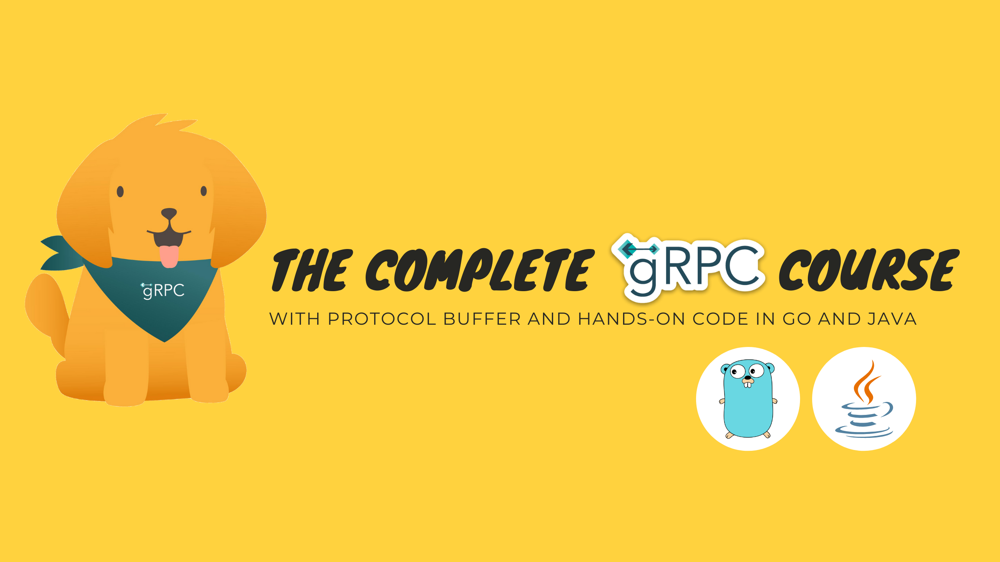
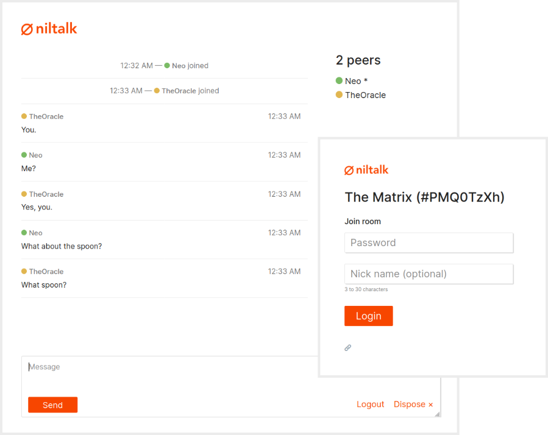
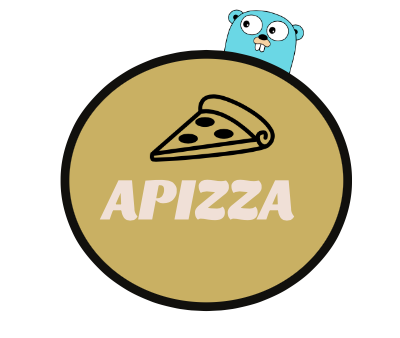
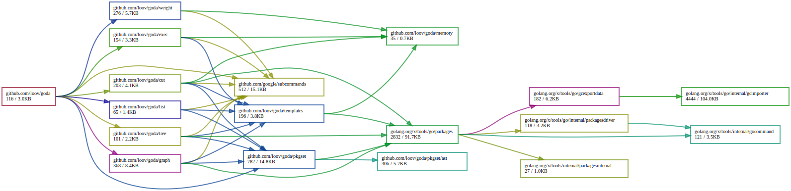

# Go语言爱好者周刊：第 38 期

这里记录每周值得分享的 Go 语言相关内容，周日发布。

本周刊开源（GitHub：[polaris1119/golangweekly](https://github.com/polaris1119/golangweekly)），欢迎投稿，推荐或自荐文章/软件/资源等，请[提交 issue](https://github.com/polaris1119/golangweekly/issues) 。

鉴于大部分人可能没法坚持把英文文章看完，因此，周刊中会尽可能推荐优质的中文文章。优秀的英文文章，我们的 GCTT 组织会进行翻译。

题图：gRPC 相关教程

## 刊首语

本周推荐了几本 Go 语言图书，发现 Go 相关的图书还是不少的，而且推荐的那几本都只是人民邮电出版社的，可见 Go 受众还是越来越多。5 折优惠截止 4 月 14 日，想购买的还有机会。[去购买](https://mp.weixin.qq.com/s/YTAzACjSOUvI9bUcQdihdQ)。

## 资讯

1、[Go1.14.2 和 Go1.13.10 发布](https://studygolang.com/topics/11244)

北京时间 2020-04-08 日，Go Team 发布了 Go1.14.2 和 Go1.13.10，这是小版本更新，主要修复了和 cgo, Go 命令，运行时，os/exec 和 testing 包相关的一些 Bug。

2、[Syncthing 1.4.2 发布，连续文件同步工具](https://github.com/syncthing/syncthing/releases)

Syncthing 是一个 Go  语言实现的免费开源的工具，它能在你的各个网络计算机间同步文件/文件夹，它的同步数据是直接从一个系统中直接传输到另一个系统的，并且它是安全且私密的。 

Syncthing 1.4.2 现已发布。这是一个很小的版本更新，修复了一些本不应该在 1.4.1 中出现的崩溃，并将更改还原到升级代码上。

3、[还在用 2019.3 就 Out 了：GoLand 2020.1 版本正式发布](https://mp.weixin.qq.com/s/O8nbaciZBK_96_Ptu8lP-A)

北京时间 2020 年 4 月 10 日凌晨，Jetbrains 宣布正式发布 GoLand 2020.1 版本。

4、[Cuelang v0.1.0 发布](https://github.com/cuelang/cue)

您知道 Cue 是 Go 的弟弟吗？Cue 中有许多 Go 源码，并且由 Go 团队的成员构建。这是一个验证和定义基于文本的动态配置。

5、[gopls v0.4.0 发布](https://github.com/golang/go/issues/33030#issuecomment-611219680)

我比较关注它什么时候能解决资源大规模占用的问题。

## 文章

1、[Docker 参考架构：设计可扩展、可移植的 Docker 容器网络](https://mp.weixin.qq.com/s/tHx8JHG8hKN3QhbMxuUOMw)

Docker 容器将软件封装到一个完整的文件系统当中，这个文件系统包括软件运行所需的一切：代码、运行时、系统工具、系统库，所有能安装在服务器上的东西。

2、[到底要不要用 ORM？ORM vs. 非 ORM 对比](https://mp.weixin.qq.com/s/lyAuC6fUaer1rFC_GdK1-Q)

一些关于 ORM 优缺点的想法。

3、[项目使用了 ORM，具体执行的是什么 SQL 语句总是很迷？xorm1.0 解决了](https://mp.weixin.qq.com/s/xpnbpnXUVg2ToIfLJLeBRQ)

自定义上下文 SQL Log 需求有哪些？

4、[Go 中的 SetFinalizer 有什么用？怎么实现的？](https://mp.weixin.qq.com/s/pK_0Rnnh7gE6nBPhiahakw)

Go runtime 提供了一种允许开发者将一个函数与一个变量绑定的方法 runtime.SetFinalizer，被绑定的变量从它无法被访问时就被垃圾回收器视为待回收状态。这个特性引起了高度的争论，但本文并不打算参与其中，而是去阐述这个方法的具体实现。

5、[使用 Golang 理解 MySQL 的两阶段提交](https://mp.weixin.qq.com/s/KeZId8WScnS-rlc0kedEzw)

文章源于一个问题：如果我们现在有两个mysql实例，在我们要尽量简单地完成分布式事务，怎么处理？还在 B 站提供了视频版。

6、[聊聊数据库的未来](https://mp.weixin.qq.com/s/Ahhaa9cAm248Sh4IHrcy-w)

写在 PingCAP 成立五周年前夕。

7、[图解kubernetes命令执行核心实现](https://mp.weixin.qq.com/s/0C48IypvwADQa7lBi8Sthw)

K8s 中的命令执行由 apiserver、kubelet、cri、docker 等组件共同完成, 其中最复杂的就是协议切换以及各种流拷贝相关,让我们一起来看下关键实现,虽然代码比较多，但是不会开发应该也能看懂。

8、[Go 实现 Raft 第四篇：持久化和调优](https://mp.weixin.qq.com/s/azdjVpeTHkr4knajmdPtgw)

对 Raft 中通过添加持久性和一些优化来完成 Raft 的基本实现。

9、[Go 每日一库之 gentleman](https://mp.weixin.qq.com/s/0B64B6y9TiU6rhy5ywXpVA)

gentleman 是一个功能齐全、插件驱动的 HTTP 客户端。gentleman以扩展性为原则，可以基于内置的或第三方插件创建具有丰富特性的、可复用的 HTTP 客户端。相比标准库net/http，gentleman更灵活、易用。

10、[Prometheus + Granafa 构建高大上的MySQL监控平台](https://mp.weixin.qq.com/s/PV42yQoI0rTxDHInx6dN0g)

Prometheus 是 Go 语言实现的。

11、[Golang 中生成密码](https://studygolang.com/articles/27917)

你想到的是什么方式？

## 开源项目

1、[mem](https://github.com/go4org/mem)

低损耗的 string 或 []byte 类型操作库。bradfitz 出品。

2、[Nuclei](https://github.com/projectdiscovery/nuclei)

Nuclei 是基于模板的可配置目标扫描的快速工具，具有大量可扩展性和易用性。

3、[oneinfra](https://github.com/oneinfra/oneinfra)

用于构建 Kubernetes 即服务的平台。

4、[gokey](https://github.com/f-secure-foundry/GoKey)

纯 Go 实现的智能卡应用。

5、[iso9660](https://github.com/KarpelesLab/iso9660)

用于读取和创建 ISO9660 镜像的 Go 库。

6、[niltalk](https://github.com/knadh/niltalk)

Go 语言实现的聊天室程序。

7、[rio](https://github.com/susamn/rio)

基于优先级队列的轻量级作业调度程序，具有超时，重试，上下文取消和简单语义的作业调度器。为 Go 网络应用构建。

8、[gostradamus](https://github.com/bykof/gostradamus)

更好用的日期时间库。

9、[TalariaDB](https://github.com/grab/talaria)

TalariaDB 是 Presto 的分布式，高可用性和低延迟时间序列数据库。Go 语言实现的时间序列数据库还真是多。

## 资源&&工具 

1、[设计插件式的地道的 Go 应用](https://www.youtube.com/watch?v=qerWv9JTlo8)

来自 Youtube 视频。

2、[播客：企业中的 Go](https://changelog.com/gotime/124)

gotime 第 124 期。

3、[apizza](https://github.com/harrybrwn/apizza)

通过命令行订披萨。

4、[gossh](https://github.com/krilor/gossh)

受 Ansible 启发但没有 Yaml 的配置管理工具。

5、[使用 Go 进行游戏开发](https://www.youtube.com/watch?v=XBQ6jMGGk_Y)

Youtube 视频。

6、[podcast-cli](https://github.com/goulinkh/podcast-cli)

CLI 播客播放器。作者在学习了 Go 语言基础之后创建了这个项目。

7、[goph](https://github.com/melbahja/goph)

本地 golang ssh 客户端，可通过 ssh 连接执行命令。

8、[gRPC 相关资源](https://gitlab.com/techschool/pcbook)

9、[x-go](https://github.com/go-board/x-go)

Go 标准库的拓展，提供各种便利的工具。

10、[goda](https://github.com/loov/goda)

Go 依赖性分析工具。

11、[go-interview](https://github.com/shomali11/go-interview)

Go 技术面试问题集。

## 订阅

这个周刊每周日发布，同步更新在[Go语言中文网](https://studygolang.com/go/weekly)和[微信公众号](https://weixin.sogou.com/weixin?query=Go%E8%AF%AD%E8%A8%80%E4%B8%AD%E6%96%87%E7%BD%91)。

微信搜索"Go语言中文网"或者扫描二维码，即可订阅。

