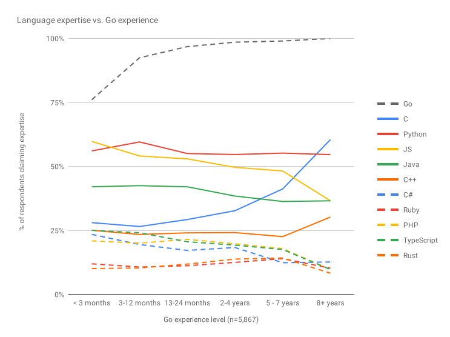

# Go语言爱好者周刊：第 40 期

这里记录每周值得分享的 Go 语言相关内容，周日发布。

本周刊开源（GitHub：[polaris1119/golangweekly](https://github.com/polaris1119/golangweekly)），欢迎投稿，推荐或自荐文章/软件/资源等，请[提交 issue](https://github.com/polaris1119/golangweekly/issues) 。

鉴于大部分人可能没法坚持把英文文章看完，因此，周刊中会尽可能推荐优质的中文文章。优秀的英文文章，我们的 GCTT 组织会进行翻译。

题图：Go Remote Fest 远程线上 Go 会议。

## 刊首语

全球疫情严重，大家大多居家，减少聚集，各种线下技术会议都取消了。然而疫情并没有阻止大家对 Go 交流的热情。这不，有一个网站叫做：[GoRemoteFest](https://goremotefest.com/)，坚定地进行远程 Go 会议交流。会议时间定在 2020 年 4 月 26 日（GMT +2 时间），会议从早 10 点到下午 14 点（北京时间 2020 年 4 月 26 日 16 点到 20点）。（也就是今天哦）

该活动的主要目的是使人们了解 Go 编程语言，一起环游世界，并从 Go 世界的主要演讲者那里收集最佳实践，技巧和窍门。这是第一次举办，也是第一次为了能够给你带来更好的体验，你将可以在家中通过 Youtube 享受它。

会议一个 8 个演讲者，DAVE CHENEY 很活跃，他是演讲者之一，而且第一个将，关于 Map 的细节。其他还有介绍 1.15 的新特性等。主题列表如下：

- Maps in detail
- Building the COVID19 API
- The Quest for the Fastest Deployment Time
- Tales From Event Sourcing Pastures
- What's coming in Go 1.15
- Let's build event-driven application in 15 minutes
- When to choose a mo*@!#th?
- Defer

## 资讯

1、[官方博文：2019 年 Go 开发者调查结果](https://mp.weixin.qq.com/s/grngFL2PkiwUmp2oCvykBw)

Go 官方团队发布的 2019 年 Go 开发者调查分析报告。

2、[Go 1.15 Release Note 草稿建立](https://tip.golang.org/doc/go1.15)

Go 1.15 尚未发布，这些是进行中的发行说明。Go 1.15 预计将于 2020 年 8 月发布。

3、[sdns v0.3.1 发布](https://github.com/semihalev/sdns)

注重隐私，具有 dnssec 支持的快速递归 dns 服务器。

## 文章

1、[Go 框架解析 -iris](https://mp.weixin.qq.com/s/-xhhuPkutY1-G4_NugNotQ)

这个框架据说被 awesome 除名。

2、[深度解密 Go 语言之 sync.Pool](https://mp.weixin.qq.com/s/O8EY0M4_Rt_0BLCcM8OwFw)

码农桃花出品的深度系列。

3、[记一次奇妙的 go-protobuf 包升级之旅](https://mp.weixin.qq.com/s/Q2e0kalsqm4RizjcyL1A1w)

升级完了，却依赖了两种 protobuf 包。

4、[Go 中的高级测试模式：集成测试如何做？](https://mp.weixin.qq.com/s/o71M9SU_fh8suuRdOaZ0Bw)

当你在使用 Go 编写服务实现时，希望你的测试覆盖率随着时间的推移而增长。随着测试范围的扩大，测试运行时间也会变长。你希望用服务集成及集成测试来测试服务的重要部分。你发现在某些情况下，集成测试和各种公共服务的耦合对 CI 和开发产生限制。

5、[Etcd集群的介绍和选主应用](https://mp.weixin.qq.com/s/IQEoXyewwXDc-BFl-ZpP5Q)

ETCD 作为开源、分布式、高可用、强一致性的 key-value 存储系统，提供了配置共享和服务发现等众多功能。目前已广泛应用在 Kubernetes、ROOK、CoreDNS、M3 以及 openstack 等领域。本文作者基于公司内部的场景需求，对 etcd 进行了介绍，并对选主机制进行了实践。

6、[bilibili 技术总监毛剑：B 站高可用架构实践](https://mp.weixin.qq.com/s/3NUd4jObuTKqlhUr-eKvhA)

流量洪峰下要做好高服务质量的架构是一件具备挑战的事情，本文是 B 站技术总监毛剑老师在「云加社区沙龙online」的分享整理，详细阐述了从 Google SRE 的系统方法论以及实际业务的应对过程中出发，一些体系化的可用性设计。对我们了解系统的全貌、上下游的联防有更进一步的帮助。

7、[Go 每日一库：使用 sqlx 批量插入数据](https://mp.weixin.qq.com/s/izZTySv4_1Uz6n3Yo2FHYA)

本文借助使用 sqlx 实现批量插入数据的例子，介绍了 sqlx 中可能被你忽视了的 sqlx.In和 DB.NamedExec 方法。

8、[Go 使用 gdb 调试](https://jiajunhuang.com/articles/2020_04_23-go_gdb.md.html)

我一般调试都是直接打 log 的，不过 gdb 调试还是很有用处，尤其是当碰到一些底层错误的需要单步跟踪的时候，比如，想研究一下 Go 的 runtime 是如何实现的的时候。

9、[Go 协作与抢占](https://mp.weixin.qq.com/s/nib0OD-LvNG57JAs4vB9RA)

欧神的新作。

10、[Go 每日一库之专为开发人员打造的调试日志库：what](https://mp.weixin.qq.com/s/sR1REZtGY3V9B5xN8GaUkw)

what 包含一组简单易用的日志记录函数，适用于跟踪代码中的各种类型的活动。what 可以打印当前函数名称，快速 Printf：格式化日期，并转储（dump）数据结构。

11、[go mod 的智障版本选择](https://xargin.com/go-mod-is-rubbish/)

之前 go mod 用的比较少，而且一直听社区有各种抱怨，所以也兴趣寥寥。新公司的项目直接使用了 go mod，本来觉得无非是个简单的工具，不需要学习，结果在一个简单的依赖上却浪费了很多时间。

12、[迷你指南——结合 MySQL 构建一个基于 Go 的 REST API 微服务](https://mp.weixin.qq.com/s/IgggbnEKh5z9fGsWbRFZSg)

在本篇迷你指导中，我会结合 MySQL 数据库创建一个简单的 REST-API。完整项目的代码会在文章的最后给出。

13、[Go 框架解析-Gin](https://mp.weixin.qq.com/s/9lVWy2LuQi8rYr9NrcJnsw)

目前最火的 Go Web 框架解析。

14、[学会用 Go 解析复杂 JSON 的思路](https://mp.weixin.qq.com/s/j_q0Hkz1WjRgB8XeBOw_tQ)

JSON 的解析是一个绕不开的话题。

15、[go protobuf v1 败给了gogo protobuf，那 v2 呢？](https://tonybai.com/2020/04/24/gogoprotobuf-vs-goprotobuf-v1-and-v2/)

从性能角度考虑，如果要使用 go protobuf api，首选 gogo protobuf。如果从功能角度考虑，显然 go protobuf v2 在成熟稳定了以后，会成为 Go 语言功能上最为强大的 protobuf API。

## 开源项目

1、[fynedesk](https://github.com/fyne-io/fynedesk)

使用 Fyne 的 Linux/Unix 完整桌面环境。之前分享过 Go 的跨平台 GUI 库 [Fyne](https://github.com/fyne-io/fyne)，这是基于它构建的整个 Linux/Unix 完整的桌面环境。

2、[lockgate](https://github.com/flant/lockgate)

Lockgate 是一个跨平台的锁定库，可使用 Kubernetes 和 OS 文件锁定来支持分布式锁定。

3、[pomerium](https://github.com/pomerium/pomerium)

以 Google BeyondCorp 为蓝本的身份识别访问代理，可以安全地访问内部应用程序。

4、[log](https://github.com/apex/log)

结构化的 Go 语言日志库。受 Logrus 启发。（好吧，自己的轮子又大又圆。哈哈哈~）

5、[mediary](https://github.com/HereMobilityDevelopers/mediary)

为 http.Client 增加拦截器功能。可以增加类似：跟踪，请求转储，统计信息收集等功能。

6、[iso9660](https://github.com/kdomanski/iso9660)

用于读取和创建 ISO9660 镜像的 Go 库。

7、[pxy](https://github.com/chuabingquan/pxy)

从 Websocket 到外部 RTMP 端点的代理直播流。

8、[qrcp](https://github.com/claudiodangelis/qrcp):

通过扫描二维码即可通过 wifi 将文件从计算机传输到移动设备。

9、[cloud](https://github.com/go-ocf/cloud) 

IOT 云平台开源项目。

10、[prot](https://github.com/umirode/prot)

protobuf 文件管理器。

11、[sabre](https://github.com/spy16/sabre)

可定制、可嵌入的 LISP 引擎。

## 资源&&工具 

1、[Go 语言快递视频教程](https://ke.qq.com/course/2202273)

主要讲解语言的新特性。免费的。

2、[技术面试问题集(Go版本)](https://github.com/shomali11/go-interview)

包含算法等的 Go 语言实现。

3、[awesome-go-perf](https://github.com/cristaloleg/awesome-go-perf)

高性能 Go 语言库和工具快查表。

4、[GoTime 第 126 期](https://changelog.com/gotime/126)

大单体与微服务的辩论。

5、[Go gRPC 系列教程](https://www.cnblogs.com/FireworksEasyCool/p/12669371.html)

gRPC 是一个高性能、开源和通用的 RPC 框架，面向移动和 HTTP/2 设计，带来诸如双向流、流控、头部压缩、单 TCP 连接上的多复用请求等特。这些特性使得其在移动设备上表现更好，更省电和节省空间占用。

6、[gin-vue-admin](https://mp.weixin.qq.com/s/8Q3sdCn5l7jof2yXKsSnQA)

基于 Go 语言 Gin 框架和 Vue 搭建的开源后台管理系统。

## 订阅

这个周刊每周日发布，同步更新在[Go语言中文网](https://studygolang.com/go/weekly)和[微信公众号](https://weixin.sogou.com/weixin?query=Go%E8%AF%AD%E8%A8%80%E4%B8%AD%E6%96%87%E7%BD%91)。

微信搜索"Go语言中文网"或者扫描二维码，即可订阅。

