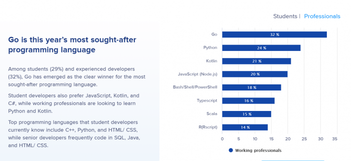
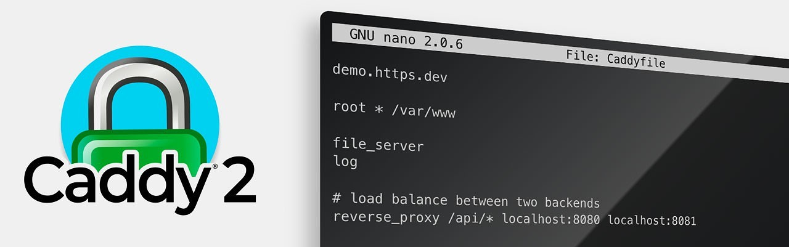
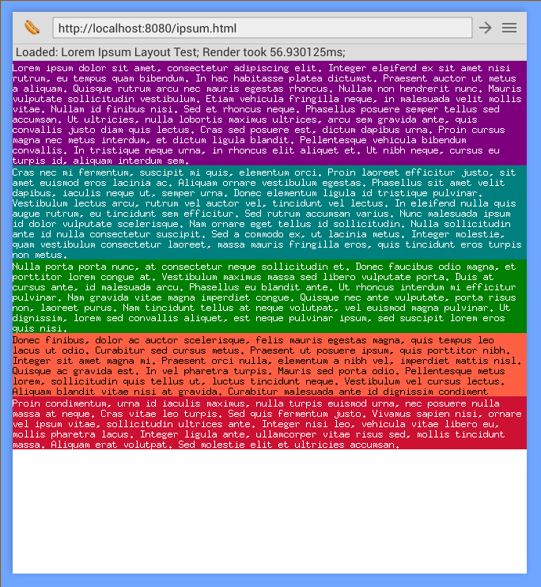

# Go语言爱好者周刊：第 42 期

这里记录每周值得分享的 Go 语言相关内容，周日发布。

本周刊开源（GitHub：[polaris1119/golangweekly](https://github.com/polaris1119/golangweekly)），欢迎投稿，推荐或自荐文章/软件/资源等，请[提交 issue](https://github.com/polaris1119/golangweekly/issues) 。

鉴于大部分人可能没法坚持把英文文章看完，因此，周刊中会尽可能推荐优质的中文文章。优秀的英文文章，我们的 GCTT 组织会进行翻译。

题图：Go语言中文网祝天下母亲节日快乐！

## 刊首语

今日母亲节，祝天下最伟大的母亲们节日快乐！

2020 年最抢手的编程语言是 Go，你学习了吗？

## 资讯

1、[16655 名开发者调查：2020 年最抢手的编程语言是谷歌的 Go](https://mp.weixin.qq.com/s/0-NbvDwbXGn5ovWpy6Hz8A)

很多开发者都非常想学Go（谷歌创建针对大型系统的编程语言），此外最新调查还发现大多数开发者都厌倦了会议，而且在跨国公司工作的开发者通常都不快乐。

2、[Caddy 2 发布](https://caddyserver.com/v2)

一种用于服务器应用程序的新型可扩展平台，定位似乎变了，不止是简单的 Web 服务器。

经过一年多的重新设计，Caddy 2 对 v1 有了新的体系结构。如果您想要一个新的“可以正常使用”的 HTTPS 服务器，那么Caddy 非常值得一看。

Caddy 号称仍然是唯一自动且默认情况下使用 TLS 的 Web 服务器。使用 Caddy 2 轻松部署和扩展 HTTPS。

3、[unipdf 3.7 发布](https://github.com/unidoc/unipdf)

Golang PDF 库，用于创建和处理 PDF 文件，纯 Go 实现。

4、[Go 提案：冻结并移除 golang.org/x/lint](https://github.com/golang/go/issues/38968)

golang.org/x/lint 和 github.com/golang/lint 程序基本上是未维护的。自 2018 年以来，没有实质性的变化。目前问题跟踪器（https://github.com/golang/lint/issues）有85个未解决的问题，其中大多数没有评论。

## 文章

1、[Go pprof 与线上事故：一次成功的定位与失败的复现](https://mp.weixin.qq.com/s/c6fU9t951Mv167Ivsy8iXA)

一次大几万人的线上抢购活动，突然出现了问题，页面半天打不开，打开了半天下不了单，cpu涨了又跌跌了又涨，而内存使用又稳如老狗！不要慌，按照套路去分析问题，一切都不是问题！

2、[为什么 Rubyists 应该考虑学习 Go](https://mp.weixin.qq.com/s/yiSQDZcXox2ln9Wk-kUXQQ)

如今，越来越少的 Web 开发人员开始专注于 Ruby 之类的单一语言。我们针对不同的工作使用不同的工具。在本文中，Ayooluwa Isaiah 认为 Go 是 Ruby 的完美补充。两门语言都会的开发人员可以很好地应对几乎所有后端挑战。

3、[Go 配置管理神器—Viper 中文教程](https://mp.weixin.qq.com/s/FGy-JelUGctj4l3QYy7Bxw)

Viper 是适用于 Go 应用程序的完整配置解决方案。它被设计用于在应用程序中工作，并且可以处理所有类型的配置需求和格式。

4、[Go 每日一库之 gron：更多人应该熟悉的是 robfig/cron](https://mp.weixin.qq.com/s/gbF1ZSXe9N_m3SJUXkKvUA)

gron 是一个比较小巧、灵活的定时任务库，可以执行定时的、周期性的任务。gron 提供简洁的、并发安全的接口。

5、[在 Go 中使用微服务架构的好处](https://mp.weixin.qq.com/s/b35_-kdwAwnXSTdx1gcHFQ)

我们已经讨论“微服务架构”很长一段时间了。它是软件架构中最新的热门话题。那么什么是微服务呢？我们为什么要使用它？为什么要在 Golang 中使用微服务架构?它有哪些优点？

6、[Go语言标准库 container 相关包的学习与实践](https://mp.weixin.qq.com/s/g7cXKmYPBjeCM6AKnArFpw)

Golang 提供了几个简单的容器供我们使用，本文在介绍几种 Golang 容器的基础上，实现一个基于 Golang 容器的LRU算法。

7、[Go 之旅： 这样理解空接口](https://mp.weixin.qq.com/s/GNheTMeNshUd8aJHwX-x7Q)

空接口可用于保存任何数据，它可以是一个有用的参数，因为它可以使用任何类型。要理解空接口如何工作以及如何保存任何类型，我们首先应该理解空接口名称背后的概念。

8、[Rust vs Go：哪个更受欢迎？](https://mp.weixin.qq.com/s/5pcAYd2vE1dT_YPI7JR_Fw)

Go 和 Rust 是目前很热门的两种编译型语言。我全职从事 Go 语言开发，并且喜欢它，但我最近正在了解 Rust —一种令人兴奋的语言。让我们探究两者之间的一些差异，并看看在流行度调查中哪个增长更快。

9、[CGO 中传递回调函数和指针](https://mp.weixin.qq.com/s/WUdaksFyjmT_c_jEx59VcQ)

本文并不是一个Cgo的使用教程-在阅读前，需要你对它对简单使用案例有所熟悉。在本文最后列了一些有用的Cgo使用教程和相关的文章。

10、[Go 语言 net 包学习和实战](https://mp.weixin.qq.com/s/MCv0gIhe9JCoOMMR-qnRow)

golang 的 net 包，相关接口和结构比较多，今天做个简单的梳理。

11、[深度解密 Go 语言之 sync.Map](https://mp.weixin.qq.com/s/mXOU8TElP8bbqaybRKN8eA)

工作中，经常会碰到并发读写 map 而造成 panic 的情况，为什么在并发读写的时候，会 panic 呢？因为在并发读写的情况下，map 里的数据会被写乱，之后就是 Garbage in, garbage out，还不如直接 panic 了。

## 开源项目

1、[rek](https://github.com/lucperkins/rek)

Go 的简单 HTTP 客户端。这里的灵感来自 Python 的一个非常著名和备受推崇的 Requests 库。所以如果你是 Python 转 Go，可能会喜欢这个！

2、[uuid](https://github.com/gofrs/uuid)

UUID 的 纯 Go 实现。

3、[reedsolomon](https://github.com/klauspost/reedsolomon)

Reed-Solomon 编码的 Go 实现。

4、[tengo](https://github.com/d5/tengo)

Go 实现的，快速、可嵌入的脚本语言。

5、[mockery](https://github.com/vektra/mockery)

提供了轻松为 Go 接口生成 mock 的功能。它删除了使用 mock 所需的样板代码。

6、[gasm](https://github.com/mathetake/gasm)

为 Gophers 准备的，实验性的 WASM 虚拟机。

7、[thdwb](https://github.com/danfragoso/thdwb)

自制的 Web 浏览器和渲染引擎。

8、[kured](https://github.com/weaveworks/kured)

Kubernetes 节点优雅重启。

9、[chippy](https://github.com/bradford-hamilton/chippy)

一款 Chip-8 模拟器。

10、[ln](https://github.com/fogleman/ln)

Go 实现的 3D 艺术线条引擎。

11、[dSock](https://github.com/Cretezy/dSock)

分布式 websocket 代理。

12、[guardian](https://github.com/asalih/guardian)

开源 Web 应用防火墙。

13、[immudb](https://github.com/codenotary/immudb)

不可变的键/值存储。

## 资源&&工具

1、[OpenCodenames](https://github.com/rodohanna/OpenCodenames)

用 Go+React 实现游戏 Codenames。

2、[Go 播客第 128 期](https://changelog.com/gotime/128)

讨论即时模式 GUI，即 Gio 库。官网：<https://gioui.org/>。

3、[B站视频：cobra的使用与解析](https://www.bilibili.com/video/BV1Uz4y1R7Xy/)

cobra地址：https://github.com/spf13/cobra；最好用的命令行框架；使用方法和重点源码解析。

4、[Go 播客第 129 期](https://changelog.com/gotime/129)

black hat go：黑客与网络渗透者的 Go 编程。

5、[tello-webrtc-fpv](https://github.com/oliverpool/tello-webrtc-fpv)

使用浏览器控制无人机（webrtc传输实时视频）。

6、[play unidoc](https://play.unidoc.io/)

unidoc 发布自己的 playground，gopher 可以在线实践 unidoc 库操作 pdf 文件。

## 订阅

这个周刊每周日发布，同步更新在[Go语言中文网](https://studygolang.com/go/weekly)和[微信公众号](https://weixin.sogou.com/weixin?query=Go%E8%AF%AD%E8%A8%80%E4%B8%AD%E6%96%87%E7%BD%91)。

微信搜索"Go语言中文网"或者扫描二维码，即可订阅。

