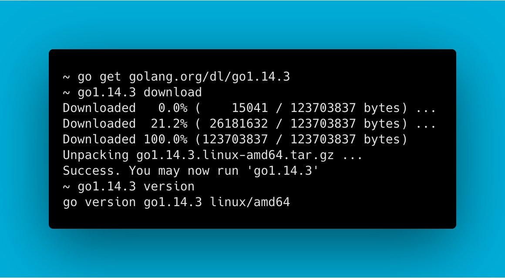

# Go语言爱好者周刊：第 43 期

这里记录每周值得分享的 Go 语言相关内容，周日发布。

本周刊开源（GitHub：[polaris1119/golangweekly](https://github.com/polaris1119/golangweekly)），欢迎投稿，推荐或自荐文章/软件/资源等，请[提交 issue](https://github.com/polaris1119/golangweekly/issues) 。

鉴于大部分人可能没法坚持把英文文章看完，因此，周刊中会尽可能推荐优质的中文文章。优秀的英文文章，我们的 GCTT 组织会进行翻译。

题图：Go1.14.3 发布

## 刊首语

Go 1.15 目前完成度 62%，还有 156 个 issue。通过[这里](https://github.com/golang/go/milestone/114)可以随时查看进度。

## 资讯

1、[Go 1.14.3 和 Go 1.13.11 发布](https://studygolang.com/topics/11479)

这是小版本，修复一些 Bug。

2、[BookStack v2.8 发布，简洁美观的在线文档管理系统](https://studygolang.com/topics/11462)

BookStack，基于 Mindoc、使用Go语言的Beego框架开发的功能类似GitBook和看云的在线文档管理系统，拥有简洁美观的页面布局，实现了文档采集、导入、电子书生成以及版本控制等强大的文档功能，并推出了配套的开源微信小程序 BookChat 和使用uni-app开发的开源手机APP BookChatApp。

3、[Excelize 发布 2.2.0 版本，Go 语言 Excel 文档基础库](https://studygolang.com/topics/11446)

2020年5月11日，社区正式发布了 2.2.0 版本，该版本包含了多项新增功能、错误修复和兼容性提升优化。下面是有关该版本更新内容的摘要，完整的更改列表可查看 [changelog](https://github.com/xuri/excelize/compare/v2.1.0...v2.2.0)。

4、[go-elasticsearch v7.x 发布](https://github.com/elastic/go-elasticsearch)

这是 Elasticsearch 官方的 Go 客户端。

5、[jsonparser 1.0 发布](https://github.com/buger/jsonparser)

JSON 解析器的替代品。无需 schema，因此它将解析扔给它的任何内容。号称比 encoding/json 快 10 倍。

6、[Squirrel 1.4.0 发布](https://github.com/Masterminds/squirrel)

Go 语言 SQL 语句生成。

7、[sqlc 1.3.0 发布](https://github.com/kyleconroy/sqlc)

从 SQL 生成符合 Go 风格的类型安全代码。

## 文章

1、[基于 GoLand 使用 Docker 容器进行 Go 开发](https://mp.weixin.qq.com/s/2tajxPBhGwgwlT4TzAgmVw)

今天，我们开始撰写一系列有关 GoLand 内部对 Docker，Docker Compose 和 Kubernetes 的支持以及它如何帮助我们在 Go 中编写（微）服务的文章。

2、[基于 GoLand 在 Docker 容器中调试 Go 应用程序](https://mp.weixin.qq.com/s/4-fkIWcr_3LdLFALVk4ZTA)

系列第二篇，看看如何调试在容器内运行的 Go 应用程序。

3、[硬核文章：图解 Go 编译器的高级操作](https://mp.weixin.qq.com/s/HiVDE2FxnX4CpqVceBJByw)

Go 编译器是 Go 生态系统中的一个重要工具，因为它是将程序构建为可执行二进制文件的基本步骤之一。编译器的历程是漫长的，它先用 C 语言编写，迁移到 Go，许多优化和清理将在未来继续发生，让我们来看看它的高级操作。

4、[Go netpoll I/O 多路复用构建原生网络模型之源码深度解析](https://taohuawu.club/go-netpoll-io-multiplexing-reactor)

本文将基于 Linux 平台来解析 Go netpoll 之 I/O 多路复用的底层是如何基于 epoll 封装实现的，从源码层层推进，全面而深度地解析 Go netpoll 的设计理念和实现原理，以及 Go 是如何利用 `netpoll` 来构建它的原生网络模型的。

5、[字节跳动在 Go 网络库上的实践](https://mp.weixin.qq.com/s/wSaJYg-HqnYY4SdLA2Zzaw)

本文选自“字节跳动基础架构实践”系列文章。

6、[Go 中你需要知道的关于赋值语句的一个细节](https://mp.weixin.qq.com/s/I_8ylCLkB_oz9WxL-Lt2DA)

Go101，关注很多技术细节。

7、[缓存系统设计精要](https://mp.weixin.qq.com/s/Qxv5Rl13Q3Lb6IGVZMo-QQ)

分成 3 篇：多级缓存、[缓存淘汰策略](https://mp.weixin.qq.com/s/rAzA4v0wLUHSode9QbkPTQ)和[缓存安全](https://mp.weixin.qq.com/s/OKkCONHBJ_jHW0xbCTEkrw)。

8、[腾讯 Go 性能优化实战](https://mp.weixin.qq.com/s/Z9DoVGwdAtpbjealQLEMkw)

网关服务作为统一接入服务，是大部分服务的统一入口。为了避免成功瓶颈，需要对其进行尽可能地优化。因此，特别总结一下 golang 后台服务性能优化的方式，并对网关服务进行优化。

9、[Go语言计时器的使用详解](https://mp.weixin.qq.com/s/QahprdKrlcaatG8poWsNrA)

标准库中 time 包里 Timer 和 Ticker 的使用介绍。

10、[Go 项目的布局：你是怎么组织你的Go代码的？](https://mp.weixin.qq.com/s/3f6dZcshXXL4EDqdtmJ3gw)

本文还是基于 GOPATH，这块忽略，其他部分可以借鉴。

11、[如何使用 frp 实现内网穿透](https://studygolang.com/articles/28687)

作为一名程序员，家里多多少少会有一些落了灰的电脑，如果把闲置的电脑变成服务器，不仅有良好的配置，还能用来做各种测试，那就再好不过了。但是局域网的设备怎么被外网访问呢？这就靠内网穿透来实现了。

## 开源项目

1、[clipboard](https://github.com/d-tsuji/clipboard)

Go 语言跨平台粘贴板的实现。刚开源，还不够完善。

2、[termdash: 基于 Go Terminal 的仪表板系统](https://github.com/mum4k/termdash)

支持窗口大小调整，可自定义布局，运行时动态布局更改等。

3、[goaction](https://github.com/posener/goaction)

在 Go 中编写 GitHub Action。想法是：编写一个标准的 Go 脚本，该脚本可用于 go run，并将其用作 GitHub Action。

4、[shotizam: 分析 Go 二进制文件的大小](https://github.com/bradfitz/shotizam)

Shotizam 为您提供了一个 SQLite 提示符以及结果，因此您可以使用 SQL 查询它们。挺有意思的项目！

5、[go-toml](https://github.com/pelletier/go-toml)

TOML 是一种配置文件格式，由 GitHub 的一位创始人发明。

6、[lazyhub](https://github.com/ryo-ma/lazyhub)

使用 gocui 实现的 GitHub 终端 UI 客户端。

7、[orchestra](https://github.com/stephenafamo/orchestra)

一个用于管理长时间运行进程的库。

8、[jvm-mon](https://github.com/ajermakovics/jvm-mon)

使用 Go 重写的 jvm 监控工具。

9、[go-fault](https://github.com/github/go-fault)

GitHub 官方出品。基于标准库 http 中间件的故障注入库。

10、[sqlike](https://github.com/si3nloong/sqlike)

支持 Enum，JSON，Spatial 等的 Golang Sequel ORM。

## 资源&&工具

1、[知道 Prometheus 吗？这个开源项目专为初学者准备的](https://mp.weixin.qq.com/s/7jkdrvZlfX6h8jUnfPq3iQ)

Prometheus 是一个系统监视和警报系统。

2、[talent-plan](https://github.com/pingcap/talent-plan)

Pingcap 关于分布式系统的开源培训课程，语言主要是 Rust 和 Go。

3、[【视频】Go语言学到什么程度才可以找工作](https://mp.weixin.qq.com/s/fy034sbAP1508rsZY3ULlw)

第一次在公众号发布视频，如果觉得不错，后续可以发布更多！

4、[推荐一款超 Geek 的代码搜索工具](https://mp.weixin.qq.com/s/tJm0d1ZW3_9PViK3S8xgrw)

不是 Go 语言实现的，但支持 Go 语言代码搜索。

5、[learngo](https://github.com/inancgumus/learngo)

1000+ Go 示例、练习和测试。

## 订阅

这个周刊每周日发布，同步更新在[Go语言中文网](https://studygolang.com/go/weekly)和[微信公众号](https://weixin.sogou.com/weixin?query=Go%E8%AF%AD%E8%A8%80%E4%B8%AD%E6%96%87%E7%BD%91)。

微信搜索"Go语言中文网"或者扫描二维码，即可订阅。

