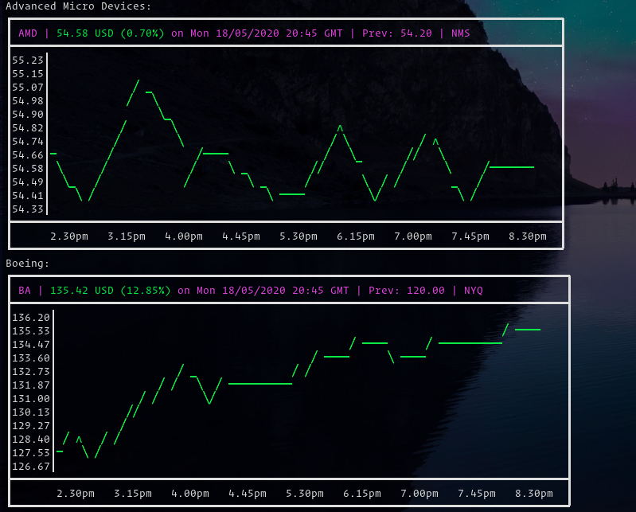

# Go语言爱好者周刊：第 44 期

这里记录每周值得分享的 Go 语言相关内容，周日发布。

本周刊开源（GitHub：[polaris1119/golangweekly](https://github.com/polaris1119/golangweekly)），欢迎投稿，推荐或自荐文章/软件/资源等，请[提交 issue](https://github.com/polaris1119/golangweekly/issues) 。

鉴于大部分人可能没法坚持把英文文章看完，因此，周刊中会尽可能推荐优质的中文文章。优秀的英文文章，我们的 GCTT 组织会进行翻译。

题图：Go 语言实现的游戏

## 刊首语

[Awesome Go](https://awesome-go.com/)：超过 2000 个 Go 链接，库和工具。该项目还时不时地会添加 Go 链接，库，项目和其他 Go 资源，并且每周都会不断得更新。你有自己的库或工具？发 PR 添加进 Awesome Go 吧。

## 资讯

1、[Resty 2.3 发布：Go 简单的 HTTP 和 REST 客户端库](https://github.com/go-resty/resty)

就其 API 而言，它很简单，但在功能方面，它包装得很丰富。

2、[skopeo 1.0 发布](https://www.redhat.com/en/blog/skopeo-10-released)

在容器镜像仓库间复制镜像的利器。

3、[gogo protobuf 项目寻找新 owner](https://github.com/gogo/protobuf/issues/691)

作者要转让这个项目的节奏。

## 文章

1、[字节跳动自研的 Go RPC 框架 KiteX 核心技术讲解](https://mp.weixin.qq.com/s/aw-F7rAh9SkcouvL7cfvRg)

本文将仅简单介绍 netpoll 的设计；随后，我们会尝试梳理一下我们基于 netpoll 所做的一些实践；最后，我们将分享一个我们遇到的问题，以及我们解决的思路。

2、[在 GoLang 中使用 Docker Compose 运行 Go 应用程序](https://mp.weixin.qq.com/s/6s3uZwdEDU3z8jq3vjLvnA)

在本文中，我们将使用 Docker Compose 运行和调试我们的应用程序。这是系列文章的第三篇。

3、[只用 3 步构建 Go Docker 最小镜像](https://mp.weixin.qq.com/s/TuuHkoFmiBlUuQJMr0auSA)

分阶段构建。

4、[基于标准库 net/http 如何记录 HTTP 请求？](https://mp.weixin.qq.com/s/88R1BWkagmf9e7xVJnSwUg)

这篇文章介绍了在 Go Web 服务器中，记录 HTTP 请求日志相关的全部内容。

5、[当 GoLand 遇到 Kubernetes：如何调试和运行 Go 程序](https://mp.weixin.qq.com/s/fKfpRH2zkLLjwMArc3U1DQ)

这是我们使用 Docker，Docker Compose 或 Kubernetes 运行 Go 服务的系列文章的最后一部分。在这一部分中，我们将专注于使用 Kubernetes 集群时的运行和调试。

6、[我可能并不会使用golang map](https://juejin.im/post/5ec3473be51d454d952bd7f0)

对实现的一些剖析。

7、[Go 语言 HTTP 标准库的实现原理](https://draveness.me/golang-net-http)

Go 语言的 HTTP 标准库提供了非常丰富的功能，很多语言的标准库只提供了最基本的功能，实现 HTTP 客户端和服务器往往都需要借助其他开源的框架，但是 Go 语言的很多项目都会直接使用标准库实现 HTTP 服务器，这也从侧面说明了 Go 语言标准库的价值。

8、[Go 标准库 encoding/json 真的慢吗？](https://mp.weixin.qq.com/s/lMXsJOKjSN4l7HhFsRKgNA)

关于标准库 encoding/json 性能差的问题在很多地方被讨论过，也有很多第三方库在尝试解决这个问题，比如 easyjson，jsoniter 和 ffjson。但是标准库 encoding/json 真的慢吗？它一直都这么慢吗？

## 开源项目

1、[Stonks](https://github.com/ericm/stonks)

基于终端的股票价格可视化工具和跟踪器。

2、[addchain: 加密加法链生成](https://github.com/mmcloughlin/addchain)

密码学研究或数学领域的研究人员可能需要。

3、[Machinery](https://github.com/RichardKnop/machinery)

基于分布式消息传递的异步任务队列/作业队列。它可以使用 Redis，Memcached，RabbitMQ 或 MongoDB 作为其后端存储。

4、[gorched](https://github.com/zladovan/gorched)

一款 Go 语言编写的基于终端的游戏。这游戏要是有人玩也是醉了。只能用于学习吧？！

5、[webrtc](https://github.com/pion/webrtc)

Go 实现 WebRTC。WebRTC，网页即时通信（英语：Web Real-Time Communication）的缩写，是一个支持网页浏览器进行实时语音对话或视频对话的 API。它于2011年6月1日开源并在 Google、Mozilla、Opera 支持下被纳入万维网联盟的 W3C 推荐标准。

6、[gosql](https://github.com/rushteam/gosql)

支持读写分离和嵌套复杂 SQL 的 Golang ORM 库。嗯，又一个轮子。

7、[free5gc](https://github.com/free5gc/free5gc)

基于 3gpp R15 规范的开源 5G 核心网实现 (Go实现) by 中国台湾交通大学。

8、[golang-repo-template](https://github.com/moul/golang-repo-template)

Go 项目仓库结构布局模板。

9、[olivia](https://github.com/olivia-ai/olivia)

基于人工神经网络的聊天机器人。

10、[gosdlisp](https://github.com/d-tsuji/gosdlisp)

Go lisp 解析器。

## 资源&&工具

1、[性能工程团队的 60 个绝佳资源](https://techbeacon.com/app-dev-testing/60-great-resources-performance-engineering-teams)

Gopher 更应该关注性能。

2、[go-mono](https://github.com/uw-labs/go-mono)

生产中使用过的 Go 项目仓库模板，支持 CI 与容器镜像自动构建。

3、[webrtc 调试利器](https://github.com/proemergotech/chrome-webrtc-packet-log-parser)

使 chrome 生成的 webrtc 诊断包和事件记录易于阅读。

4、[golintui](https://github.com/nakabonne/golintui)

Go linters 的简单终端 UI。

5、[使用 Go 构建 Web 应用的系列](https://www.gophersumit.com/series/web/)

一共 10 部分。

## 订阅

这个周刊每周日发布，同步更新在[Go语言中文网](https://studygolang.com/go/weekly)和[微信公众号](https://weixin.sogou.com/weixin?query=Go%E8%AF%AD%E8%A8%80%E4%B8%AD%E6%96%87%E7%BD%91)。

微信搜索"Go语言中文网"或者扫描二维码，即可订阅。

