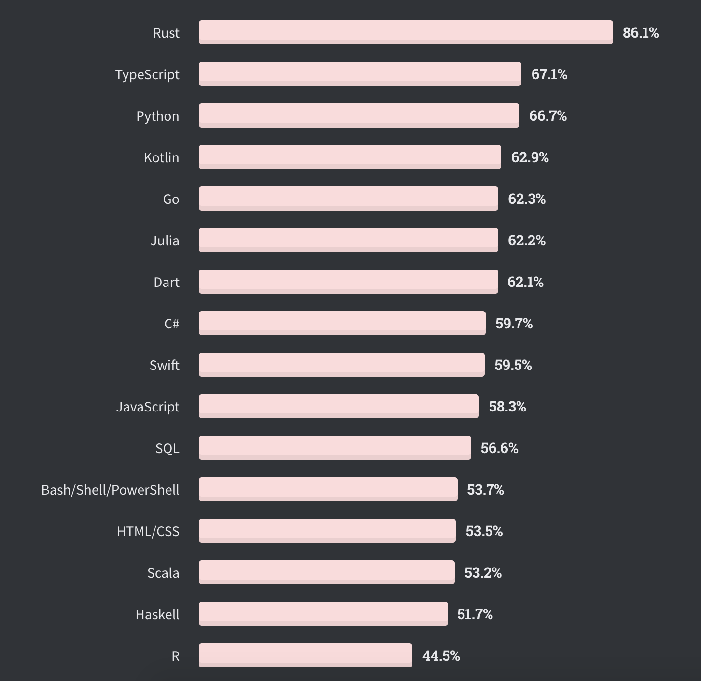
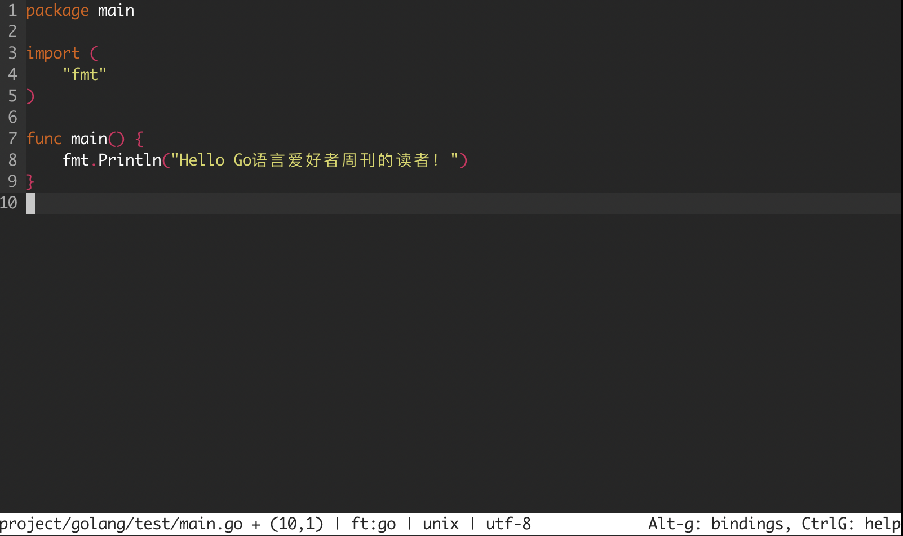

# Go语言爱好者周刊：第 45 期

这里记录每周值得分享的 Go 语言相关内容，周日发布。

本周刊开源（GitHub：[polaris1119/golangweekly](https://github.com/polaris1119/golangweekly)），欢迎投稿，推荐或自荐文章/软件/资源等，请[提交 issue](https://github.com/polaris1119/golangweekly/issues) 。

鉴于大部分人可能没法坚持把英文文章看完，因此，周刊中会尽可能推荐优质的中文文章。优秀的英文文章，我们的 GCTT 组织会进行翻译。

题图：北京时间 5 月 31 日凌晨 3 点 22 分，在佛罗里达卡纳维拉尔角，全球最大的载人航天飞船「龙」载着宇航员成功上天了。

在全球瞩目之下，载人龙飞船在升空约 2 分钟后完成一级火箭分离，9 分半钟后一级火箭成功降落海上平台着陆回收。在第 12 分钟成功按计划与火箭二级分离，标志着商业载人飞船第一次测试的一切顺利。B 站观看发射视频 <https://www.bilibili.com/video/BV1oT4y1u7Dc>。

## 刊首语

对 Go 新特性密切关注的，可以多逛逛 Go 的 [Proposal](https://github.com/golang/go/milestone/30)。

StackOverflow 2020 年开发者调查报告出炉，其中有一项是最喜爱的编程语言，结果如下：

Go 语言位居第 5 位，Rust 第一位！调查报告见 <https://insights.stackoverflow.com/survey/2020>。

## 资讯

1、[RobotGo 0.90 发布](https://github.com/go-vgo/robotgo)

Golang 跨平台自动化系统，控制键盘鼠标位图和读取屏幕，窗口句柄以及全局事件监听。支持 Mac, Windows, and Linux(X11)。

2、[micro 2.0.4 发布: 基于终端的文本编辑器](https://github.com/zyedidia/micro)

Micro 的目标是成为 “nano 编辑器的某种后续产品”，它已经成为在 Go 中构建文本编辑器的相当成熟且很好的例子。

3、[qlang](https://github.com/qiniu/qlang)

来自七牛的 qlang alpha 版发布。

4、[来自 GitHub Action](https://github.com/marketplace/actions/go-proxy-warming)

如何使用 git action自 动更新 pkg.go.dev 上的文档？

5、[vscode-go 项目迁移到 golang 组织下](https://github.com/microsoft/vscode-go#we-are-moving---)

即 [github.com/golang/vscode-go](https://github.com/golang/vscode-go)。

6、[immudb 0.6 发布](https://github.com/codenotary/immudb)

用于系统和应用程序的轻量级高速不可变数据库。

## 文章

1、[Go语言之父：拿过奥运银牌，发明过航天望远镜，想用Go语言解放程序员！](https://mp.weixin.qq.com/s/56FZQ7kjf6pjL72OqpgXvw)

Rob Pike, Unix的先驱，UTF-8的设计人。《Unix 编程环境》和《程序设计实践》的作者之一，除此之外，他还是Go语言的开创者，被誉为“Go语言之父”。

2、[Go Web 开发如何优雅的包含静态资源文件？](https://mp.weixin.qq.com/s/kcel_egOD0u_89TxU2iEdw)

官方有过提案，处理类似问题，目前还未发布。

3、[Go 和 CPU 高速缓存原理和应用](https://mp.weixin.qq.com/s/vJmMdTumB99RMf2Qguj2gg)

本次翻译的英文原文中的 伪共享 (False Sharing) 章节对于这个概念的理解和分析不准确，所以我删去了原文关于那部分的内容并且用我自己写的分析内容替换了，因此那部分的内容版权归属于译者。

4、[Go：从 context 源码领悟接口的设计](https://mp.weixin.qq.com/s/JZ7E_Xk-7Qms1hfxZuFipw)

Context 的源码非常推荐阅读，从中可以领悟出 Go 语言接口设计的精髓。

5、[Go反模式之越俎代庖](https://colobu.com/2020/05/26/golang-anti-pattern-yuezudaipao/)

反模式（anti-pattern 或 antipattern）又叫做反面模式，指的是在实践中经常出现但又低效或是有待优化的设计模式,是用来解决问题的带有共同性的不良方法。Andrew Koenig 在 1995 年造了 anti-pattern 这个词，灵感来自于 GoF 的《设计模式》一书。

6、[Go 编译器内核：给 Go 新增一个语句 —— 第一部分](https://mp.weixin.qq.com/s/D9C9niRMJleIyh-hUSAPiQ)

这是两部分系列文章中的第一部分，该文章采用教程的方式来探讨 Go 编译器。Go 编译器复杂而庞大，需要一本书才可能描述清楚，所以这个系列文章旨在提供一个快速而深度优先的方式进入学习。我计划在以后会写更多关于编译器领域的描述文章。

7、[基于 DDD 的 Go 实现](https://mp.weixin.qq.com/s/dVK64_v60qEUAX7kQnfSxw)

DDD 即领域驱动设计，该模式也算是比较热门的话题了。希望通过本篇文章，大家能够掌握 DDD 模式，能对大家有所帮助。

8、[实战！我用“大白鲨”让你看见 TCP](https://mp.weixin.qq.com/s/UQNVjQ80AVy5GKPZbkI6qw)

学习理解 TCP 超级好的一篇文章。

9、[防雪崩利器 hystrix-go 源码分析](https://mp.weixin.qq.com/s/p_fSD_-zA-rGFSMry-lMSQ)

今天分析的源码库是 hystrix-go，他是 hystrix 的的 go 语言版，应该是说简化版本，用很少的代码量实现了主要功能。

10、[Golang 源码学习：调度逻辑](https://studygolang.com/articles/28959)

一共 4 篇：[初始化](https://studygolang.com/articles/28957)、[main goroutine的创建](https://studygolang.com/articles/28958)、[工作线程的执行流程与调度循环](https://studygolang.com/articles/28959)和[系统调用](https://studygolang.com/articles/28960)。

## 开源项目

1、[athenadriver](https://github.com/uber/athenadriver)

功能齐全的 AWS Athena 数据库驱动程序（加上实用程序工具）。

2、[sdns](https://github.com/semihalev/sdns)

具有 dnssec 支持的快速、递归的 dns 解析器服务器。

3、[go-git](https://github.com/go-git/go-git)

纯 Go 的可扩展 Git 实现。

4、[gRPC-cache](https://github.com/knrt10/gRPC-cache)

一个基于 gRPC 的内存级 KV 缓存类库。

5、[go-quartz](https://github.com/reugn/go-quartz)

简单，零依赖的 Go 调度库。Java 程序员对此应该很熟悉，没错，这是 Java 中著名的 quartz 的 Go 实现。

6、[gse](https://github.com/go-ego/gse)

Go 语言高性能分词库，支持中英文。

7、[reqip](https://github.com/mo7zayed/reqip)

一个简单的工具，用于在服务器上获取请求的 IP 地址。

8、[stack](https://github.com/bmw417/stack)

轻量，简单，快速，线程安全的 Golang 堆栈实现。

9、[cds](https://github.com/ovh/cds)

企业级连续交付和 DevOps 自动化开源平台。号称比 Jenkins 等更强大。

10、[checkup](https://github.com/sourcegraph/checkup)

分布式，无锁，自托管的运行状况检查和状态页。

## 资源&&工具

1、[go-mod-outdated](https://github.com/psampaz/go-mod-outdated)

查找 Go 项目的过时依赖项。

2、[龙国际空间站对接自动驾驶仪](https://github.com/mbertschler/dragon-iss-docking-autopilot)

官方 SpaceX Dragon 太空舱停靠模拟器的自动驾驶仪，Go 语言实现。看起来很酷。

3、[gopherdance](https://github.com/80at8/gopherdance/)

在你终端跳舞的 gopher。

4、[Go 播客第 130 期](https://changelog.com/gotime/130)

分布式消息传递系统的挑战。

5、[Go 播客第 132 期](https://changelog.com/gotime/132)

数据库的麻烦：如何在 Go 中有效使用数据库？

6、[tinybg](https://github.com/yangyongzhen/tinybg)

五百行后台代码，实现一功能齐备的个人博客网站。预览地址：<http://121.36.253.86/>。

## 订阅

这个周刊每周日发布，同步更新在[Go语言中文网](https://studygolang.com/go/weekly)和[微信公众号](https://weixin.sogou.com/weixin?query=Go%E8%AF%AD%E8%A8%80%E4%B8%AD%E6%96%87%E7%BD%91)。

微信搜索"Go语言中文网"或者扫描二维码，即可订阅。

