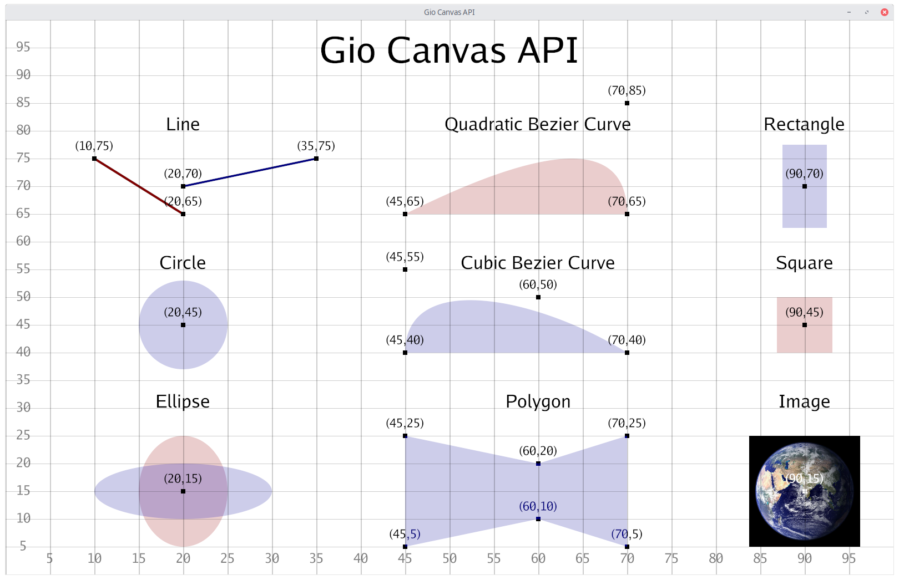
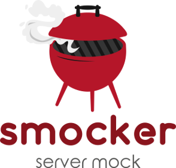
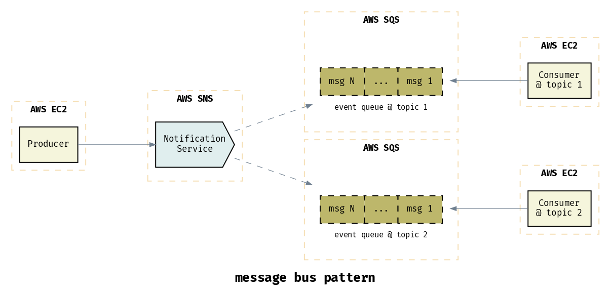

# Go语言爱好者周刊：第 46 期

这里记录每周值得分享的 Go 语言相关内容，周日发布。

本周刊开源（GitHub：[polaris1119/golangweekly](https://github.com/polaris1119/golangweekly)），欢迎投稿，推荐或自荐文章/软件/资源等，请[提交 issue](https://github.com/polaris1119/golangweekly/issues) 。

鉴于大部分人可能没法坚持把英文文章看完，因此，周刊中会尽可能推荐优质的中文文章。优秀的英文文章，我们的 GCTT 组织会进行翻译。

题图 基于 Gio 的 canvas API

## 资讯

1、[Go1.14.4 和 Go1.13.12 小版本发布](https://studygolang.com/topics/11618)

北京时间凌晨，Go 官方发布了 Go1.14.4 和 Go1.13.12，这是两个小版本发布。主要修改一些bug，涉及 go doc 命令, runtime， encoding/json, go/types, math/big 和 os 等包。

2、[GoLand 2020.2 抢先体验计划已开放](https://blog.jetbrains.com/go/2020/05/29/goland-2020-2-eap-is-open/)

GoLand 是 Go IDE，其 EAP 版本免费使用 30 天。该 EAP 具有一些新功能，重构和插件。

3、[Oragono 2.1 发布：Go 语言编写的现代 IRC 服务器](https://github.com/oragono/oragono)

支持 UTF-8 和 IRCv3 功能。2.1 增加了对 WebSockets 的原生支持。

4、[轻量级 Go](https://arxiv.org/abs/2005.11710)

以 Robert Griesemer 为第一作者发表的 Go 泛型设计论文 - https://arxiv.org/abs/2005.11710

## 文章

1、[Go 和 CPU 高速缓存：原理和应用](https://mp.weixin.qq.com/s/viQp36FeMZSqUoFy3VrBNw)

本次翻译的英文原文中的 伪共享 (False Sharing) 章节对于这个概念的理解和分析不准确，所以我删去了原文关于那部分的内容并且用我自己写的分析内容替换了，因此那部分的内容版权归属于译者。

2、[Go 中基于 IP 地址的 HTTP 限流](https://mp.weixin.qq.com/s/qXy4cRAc1lc6BURngt-Amw)

在这篇教程中，我们将基于用户的 IP 地址构造一个简单的限流中间件。

3、[探索 Go 中接口的性能](https://mp.weixin.qq.com/s/1nqpVzitGdVVvHIuk8iAeQ)

在 Go 中使用接口（interface{}）好像有性能问题，但是真的如此吗，或者我们有哪些可以提升的空间？

4、[为什么 Kubernetes 如此受欢迎？](https://mp.weixin.qq.com/s/igMH6fHtwfDe8FI3AadhZw)

在撰写本文时，Kubernetes 已有 6 年历史了，在过去的两年中，它的流行度不断提高，一直是最受欢迎的平台之一。

5、[再谈 Go Http 服务的优雅重启](https://mp.weixin.qq.com/s/fMk0fEdRpLLU-z-Q-Rhl4g)

对于 Golang HTTP 的服务，我们可能需要重启来升级或者更改某些配置。如果你（像我曾经一样）因为网络服务器对优雅重启很重视就理所当然地认为它（优雅重启）早已实现了，那么这份教程将会对你很有用处。因为在 Golang 中，你需要自己动手来实现。

6、[解密为何 Go 能从众多语言中脱颖而出](https://mp.weixin.qq.com/s/OhQ85CU6Eq6WGmt5O21oxg)

技术的突飞猛进，推动着世界上许多突破性的发现。Golang ，作为如此革命性的发明，早已征服了整个世界。

7、[为什么提升 Go 项目的测试覆盖率有点难](https://mp.weixin.qq.com/s/5KMqKgHC7demT1WeqrAt6A)

这里讨论的内容可能有争议。如果不同意，欢迎讨论。

8、[关于 xml 包在 Unmarshal 时将 \r\n 重写为 \n 的问题](https://tonybai.com/2020/06/04/the-issue-of-go-xml-package-rewrite-carriage-return/)

XML 作为上一代被设计用来传输和存储数据的标记语言格式，在 Go 中的支持并不完善，关于标准库 xml 包的 issue 还有好多处于 open 状态。在标准库 xml 包更新较慢的情况下，clone 一份 xml 包并进行定制不失为一种好的折中方法。

9、[一行代码引起的 Go 协程泄露](https://mp.weixin.qq.com/s/YlgIKopxFqqRoKnduoc9oA)

本文只为记录寻找该 bug 时使用的方法而生。

10、[Go 内存分配器的设计与实现](https://mp.weixin.qq.com/s/qS3aE9N-txVsYqRjYVLo8w)

本文会介绍 Go 语言内存分配器，详细分析内存分配的过程以及其背后的设计与实现原理。

## 开源项目

1、[go-yaml: YAML 的 Go 编码，解码和查询](https://github.com/goccy/go-yaml)

从本周的 1.7 版本开始，它现在支持 YAMLPath（这个很赞），这是一种通过简单查询语言提取值或 AST 的方法。在已经有了 <https://github.com/go-yaml/yaml> 的情况下，作者解释了开发一个新库的原因。

2、[Heimdall: Go 的增强型 HTTP 客户端](https://github.com/gojek/heimdall)

内置的断路器可控制失败的请求，多种和自定义的重试策略以及顺畅的 API。

3、[Smocker: 简单高效的 HTTP Mock 服务器](https://github.com/Thiht/smocker)

Smocker 使用 YAML 定义模拟和响应，但是也有一个方便的用户界面。在开发和测试环境中使用它可以减少外部服务。

4、[DBCore: 由数据库驱动的代码生成](https://github.com/eatonphil/dbcore)

支持 MySQL 和 PostgreSQL，能自动生成 REST API。

5、[giocanvas](https://github.com/ajstarks/giocanvas)

基于 [gio](https://gioui.org/) 的高级 canvas API。

6、[gomap](https://github.com/in4it/gomap)

mapreduce 的 Go 实现。

7、[juno](https://github.com/douyu/juno)

斗鱼微服务平台。

8、[jupiter](https://github.com/douyu/jupiter)

斗鱼开源的面向服务治理的 Go 微服务框架。

9、[concourse](https://github.com/concourse/concourse)

基于 Go 和 Elm 的持续集成自动化系统。

10、[ServerScan](https://github.com/Adminisme/ServerScan)

ServerScan 一款使用 Go 开发的高并发网络扫描、服务探测工具。

11、[cat](https://github.com/lu4p/cat)

从普通文本文件、.docx, .odt, .pdf 和 .rtf 文件中提取文本。

12、[webgo](https://github.com/bnkamalesh/webgo)

用于构建 Web 应用程序的迷你工具包/微框架；Handler Chaining，中间件和上下文注入，以及符合标准库的 HTTP 处理程序器（即 http.HandlerFunc）。

## 资源&&工具

1、[gold](https://github.com/go101/gold)

一个实验性的 Go 本地文档服务器和 Go 文档生成工具。

2、[draft](https://github.com/lucasepe/draft)

使用简单的 YAML 语法生成高级微服务架构图。

3、[《Go语法树入门》](https://github.com/chai2010/go-ast-book)

开源免费图书/Go语言进阶/掌握抽象语法树/Go语言AST/LLVM/LLIR。

## 订阅

这个周刊每周日发布，同步更新在[Go语言中文网](https://studygolang.com/go/weekly)和[微信公众号](https://weixin.sogou.com/weixin?query=Go%E8%AF%AD%E8%A8%80%E4%B8%AD%E6%96%87%E7%BD%91)。

微信搜索"Go语言中文网"或者扫描二维码，即可订阅。

