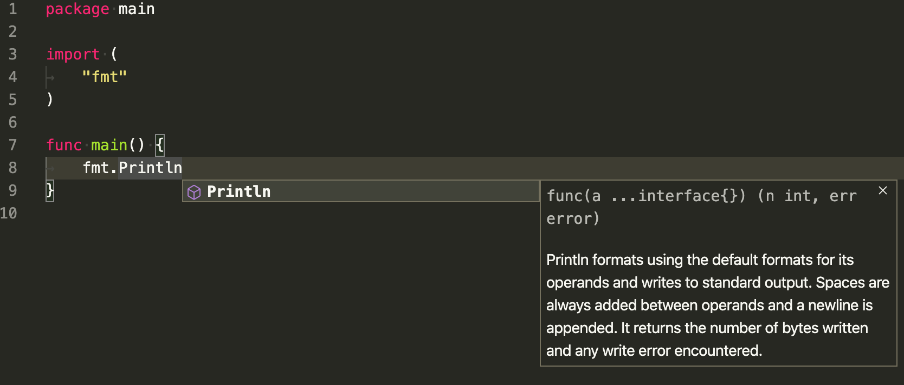
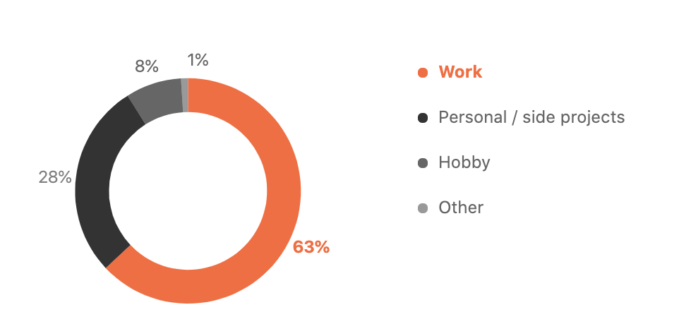
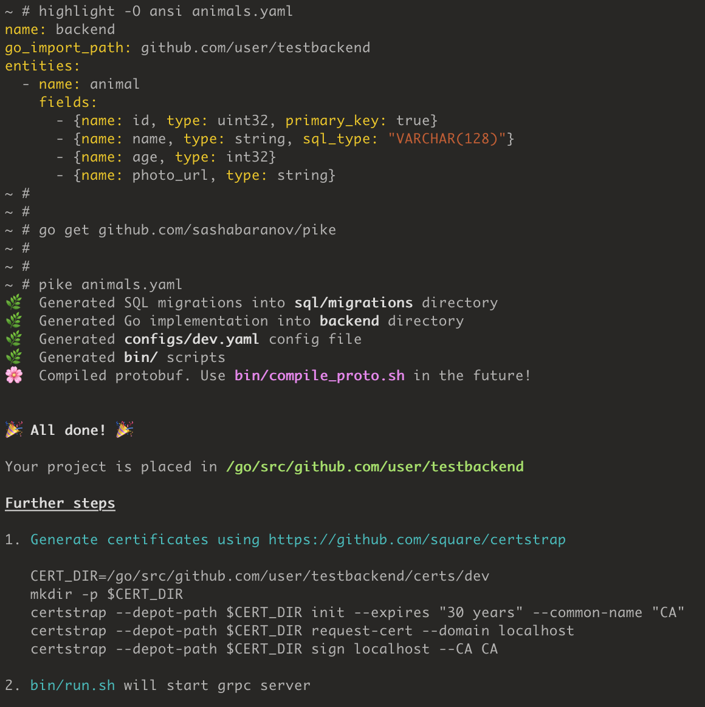
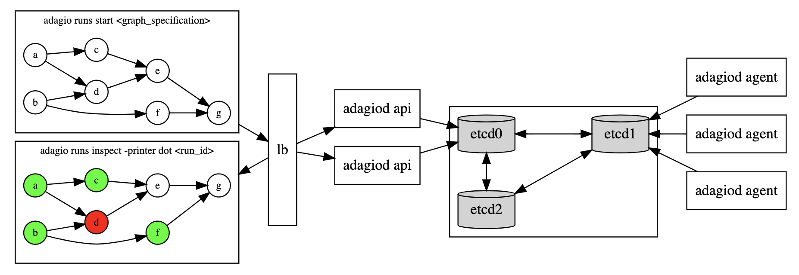

# Go语言爱好者周刊：第 47 期

这里记录每周值得分享的 Go 语言相关内容，周日发布。

本周刊开源（GitHub：[polaris1119/golangweekly](https://github.com/polaris1119/golangweekly)），欢迎投稿，推荐或自荐文章/软件/资源等，请[提交 issue](https://github.com/polaris1119/golangweekly/issues) 。

鉴于大部分人可能没法坚持把英文文章看完，因此，周刊中会尽可能推荐优质的中文文章。优秀的英文文章，我们的 GCTT 组织会进行翻译。

题图：VSCode+Go 插件

## 刊首语

以为快要去掉口罩了，结果。。。大家多多注意，保重！

## 资讯

1、[VS Code Go 扩展加入了 Go 项目](https://blog.golang.org/vscode-go)

前段时间微软就宣布了这一消息，这次 Go 官宣了，目前的项目地址：<https://github.com/golang/vscode-go>。

2、[Go 1.15 Beta1 发布](https://mp.weixin.qq.com/s/QZi66PuL9Za9sfPk7PhopA)

Release Notes：<https://tip.golang.org/doc/go1.15>。

3、[Go 源码中 whitelist/blacklist 和 master/slave 不再使用](https://github.com/golang/go/commit/608cdcaede1e7133dc994b5e8894272c2dce744b)

取而代之，使用 allowlist、blocklist 等。据说 GitHub 分支将不再使用 master。

4、[Colly 2.1 发布](https://github.com/gocolly/colly)

现在支持 Go 模块，改进了用户代理，一种检查 URL 是否已被访问的方法等。

5、[JetBrains 发布 2020 年 Go 语言调查报告](https://www.jetbrains.com/lp/devecosystem-2020/go/)

这些问题仅显示给选择 Go 作为其三种主要编程语言之一的开发人员。

## 文章

1、[鹅厂 Go 内存池/对象池技术实战爬坑指南](https://mp.weixin.qq.com/s/Cr09j6HQ9NGLN1b2K8jvkQ)

Go 中怎么实现内存池，直接用 map 可以吗？常用库里 GroupCache、BigCache 的内存池又是怎么实现的？有没有坑？对象池又是什么？

2、[构建一个快速的现代化网络爬虫](https://mp.weixin.qq.com/s/tH22NP79vDaF23bEMDFXHw)

很久以来，我一直对网络爬虫充满热情，特别是它背后的理论。我曾经使用过许多语言来构建它，例如：C++、JavaScript（Node.JS）、Python 等。

3、[面试官：换人！他连 TCP 这几个参数都不懂](https://mp.weixin.qq.com/s/Jgo_P1oKRHffurkoek0oVw)

TCP 性能的提升不仅考察 TCP 的理论知识，还考察了对于操心系统提供的内核参数的理解与应用。

4、[【每日一库】之 gocache：一个功能齐全且易于扩展的 Go 缓存库](https://mp.weixin.qq.com/s/eIVSSBmKXouVvhsTAvheCA)

这个库的设计目的是为了解决在使用缓存或者使用多种（多级）缓存时所遇到的问题，它为缓存方案制定了一个标准。

5、[你知道几种 Go 并发控制方式？](https://mp.weixin.qq.com/s/tloEYzrnKNrrAo1YKdeyrw)

在goroutine并发行为控制中，有三种常见的方式，分别是WaitGroup、channel和Context。

6、[是时候考虑搭建自己的站点了：Hugo 和 GitHub Pages 为你助力](https://mp.weixin.qq.com/s/rjy22WFcycTKDKNtrUbzqg)

在本指导中，我会带领你快速且免费的建立并且上线你的工作集网站。

7、[Go 高并发系统之限流技术](https://mp.weixin.qq.com/s/x4ob5RTl10eb-RMyivVWhg)

实现限流有三种主流方式：计数器，漏桶算法（leaky-bucket）和令牌桶算法（token-bucket）。

8、[将 Go 项目从 Travis 迁移至 GitHub Actions](https://mp.weixin.qq.com/s/K7xW8ySbYiq9jII1KQ9PdA)

我在 GitHub 工作，但不在 Actions 团队。我想在我的开源项目中配置 Actions，并且不从 Actions 团队或 GitHub 的任何人那里获得任何帮助。我没有被 Github 的同事要求写这篇文章，我的目的很简单，以一个用户的经验来使用这个平台。仅代表个人观点和想法。

9、[为什么 Gin 这么流行？一探 gin 框架路由和中间件的秘密](https://mp.weixin.qq.com/s/gt0YW9e-LvFgDCSg-u0U6w)

通过阅读 Gin 框架的源码来探究 Gin 框架路由与中间件的秘密。

10、[Go：原子操作和互斥锁的区别](https://mp.weixin.qq.com/s/tVT15D5IaoC9mriHfU374Q)

天的文章里我们会简单了解一下 Go 语言里对原子操作的支持，然后探讨一下原子操作和互斥锁的区别。

11、[Go：协程，操作系统线程和 CPU 管理](https://mp.weixin.qq.com/s/vorPXhKLhMTXNIOJ8jTBuQ)

对于一个程序来说，从内存和性能角度讲创建一个 OS 线程或切换线程花费巨大。Go 志在极尽所能地充分利用内核资源。从第一天开始，它就是为并发而生的。

12、[图解 Go 微服务中的熔断器和重试](https://mp.weixin.qq.com/s/M-H16iIt-djZilJuS3RydA)

今天我们来讨论微服务架构中的自我恢复能力。通常情况下，服务间会通过同步或异步的方式进行通信。我们假定把一个庞大的系统分解成一个个的小块能将各个服务解耦。管理服务内部的通信可能有点困难了。你可能听说过这两个著名的概念：熔断和重试。

13、[程序员精进之路：性能调优利器--火焰图](https://mp.weixin.qq.com/s/GFPMIJGT4x6Q_86ZZfOOpg)

本文主要分享火焰图使用技巧，介绍 systemtap 的原理机制，如何使用火焰图快速定位性能问题原因，同时加深对 systemtap 的理解。

## 开源项目

1、[goth](https://github.com/markbates/goth)

提供了一种简单，干净且惯用的方式来编写 Go Web 应用程序的身份验证包。对外国人来说，真的超全。

2、[bimg](https://github.com/h2non/bimg)

由 libvips 支持的快速高级图像处理。如果有想要转换，裁切，调整大小，加水印或更多的图形场景，bimg 可能适合你。

3、[chess](https://github.com/notnil/chess)

一个 Go 库，其中提供了常见的棋类实用程序，例如移动生成，转弯管理，将军检测，PGN 编码等。经过了良好的测试并针对性能进行了优化。 

4、[Fehrist](https://github.com/kadnan/Fehrist)

Go 中的文档索引和搜索库。目前支持 CSV 和 JSON，不过可以方便扩展。这里有一篇介绍文章：<http://blog.adnansiddiqi.me/fehrist-document-indexing-library-in-go/>。

5、[pike](https://github.com/sashabaranov/pike/)

通过 YAML 文件自动生成 gRPC CRUD 服务。

6、[ffuf](https://github.com/ffuf/ffuf)

用 Go 编写的快速 Web 模糊器，用于模糊测试。支持对 HTTP 头域，POST 数据和 URL 的不同部分进行模糊测试。介绍文章：<https://hakin9.org/ffuf-a-fast-web-fuzzer-written-in-go/>。

7、[zepto](https://github.com/go-zepto/zepto)

用于在 Go 中开发微服务和 Web 服务的轻量级框架。这名字和一个 JS 库同名。

8、[SpaGO](https://github.com/nlpodyssey/spago)

一个用 Go 语言编写的机器学习库，旨在在自然语言处理任务中支持相关的神经网络体系结构。

## 资源&&工具

1、[adagio](https://github.com/GeorgeMac/adagio)

一种工作流执行工具，旨在在本地运行并促进跨工作节点集群的执行。工作流是有向无环图（DAG），其中顶点描述了要执行的工作。输入和输出沿图的边缘进行，将结果从一个顶点传递到下一个顶点。每个顶点都等待其所有入站边的执行完成。如果所有输入均成功完成，则将分配并执行顶点。

2、[tilt](https://github.com/tilt-dev/tilt)

Kubernetes 上的团队多服务开发环境。

3、[Monibuca](https://github.com/Monibuca/docs)

开源的流媒体服务器开发框架，适用于快速定制化开发流媒体服务器，可以对接CDN厂商，作为回源服务器，也可以自己搭建集群部署环境。国人开发。

4、[油管视频："Featherweight Go" by 函数式编程大神 Phil Wadler]( https://www.youtube.com/watch?v=Dq0WFigax_c)

据社交媒体说 rob pike 邀请他参与 Go 泛型设计。slide 的地址：<http://homepages.inf.ed.ac.uk/wadler/papers/go/chalmers.pdf>。

5、[正则表达式完全指南](http://www.princeton.edu/~mlovett/reference/Regular-Expressions)

英文的，PDF 直接下载使用。

6、[用 Go 从零开始构建区块链](https://web3.coach/#book)

电子书，免费下载。不过是英文的。

## 订阅

这个周刊每周日发布，同步更新在[Go语言中文网](https://studygolang.com/go/weekly)和[微信公众号](https://weixin.sogou.com/weixin?query=Go%E8%AF%AD%E8%A8%80%E4%B8%AD%E6%96%87%E7%BD%91)。

微信搜索"Go语言中文网"或者扫描二维码，即可订阅。

