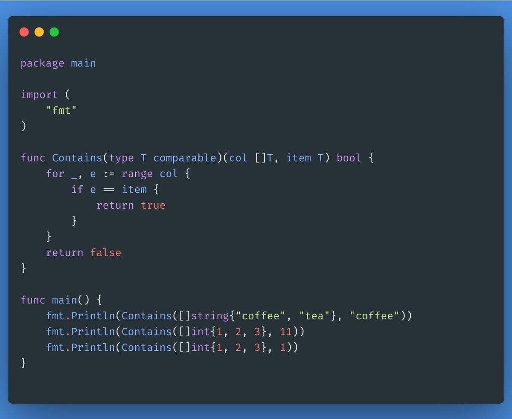
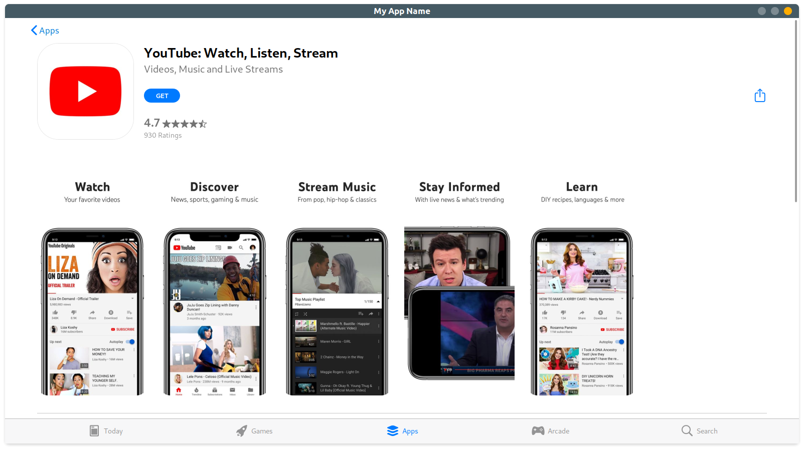
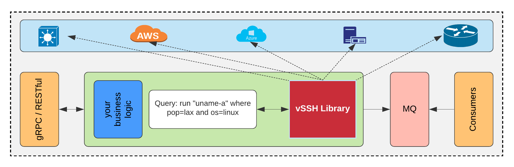
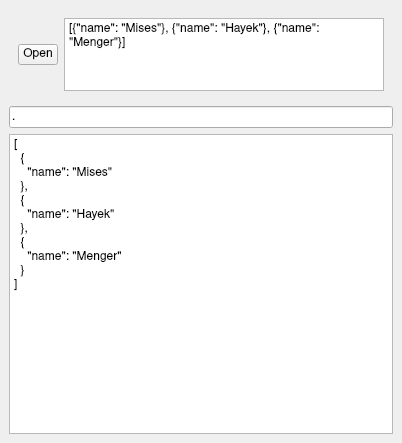
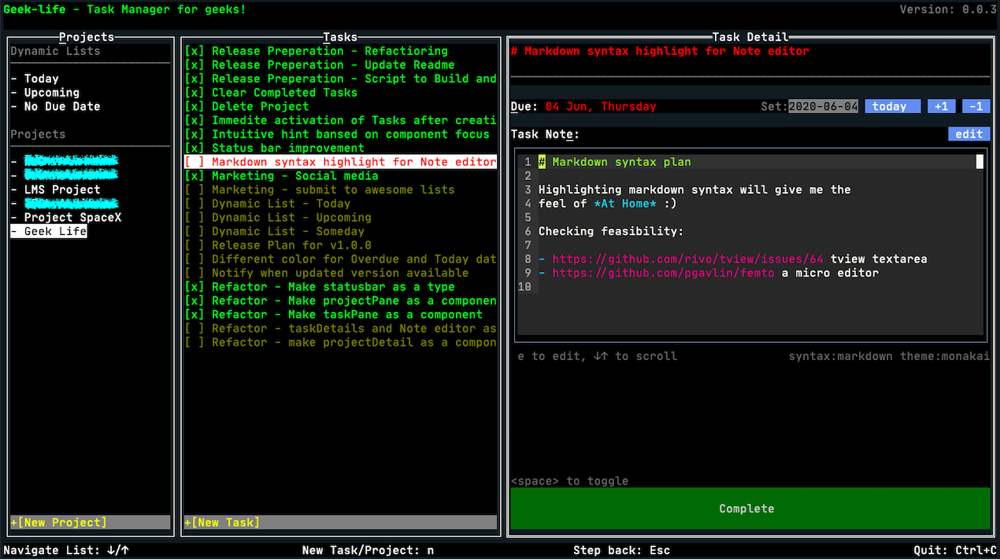
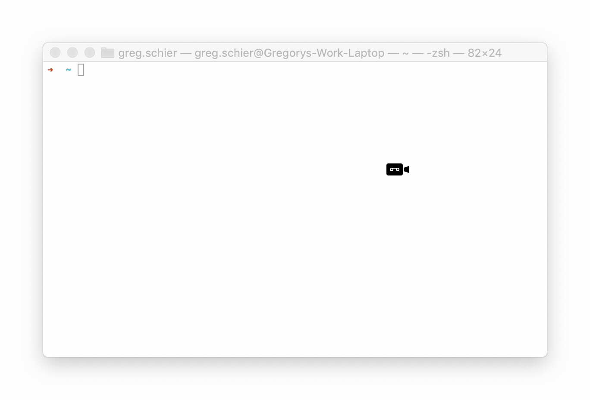
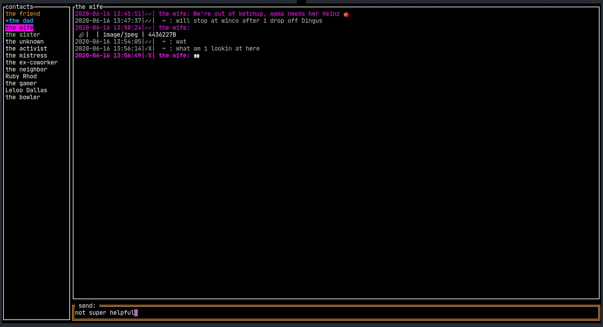

# Go语言爱好者周刊：第 48 期

这里记录每周值得分享的 Go 语言相关内容，周日发布。

本周刊开源（GitHub：[polaris1119/golangweekly](https://github.com/polaris1119/golangweekly)），欢迎投稿，推荐或自荐文章/软件/资源等，请[提交 issue](https://github.com/polaris1119/golangweekly/issues) 。

鉴于大部分人可能没法坚持把英文文章看完，因此，周刊中会尽可能推荐优质的中文文章。优秀的英文文章，我们的 GCTT 组织会进行翻译。

题图：Go 泛型语法

## 刊首语

今日父亲节，祝天下父亲节日快乐！

本周对 Go 而言，最重大的消息莫过于泛型。相较之前的设计，这次改进还是不错的，复杂性降低了。然而，由于使用的是小括号，可读性真的不怎么样，吐槽声也很多。虽然官方说不用小括号会影响编译速度，但可读性是不是更重要些呢？要不然不符合 Go 设计初衷：大道至简。希望最后能将小括号改掉吧。

## 资讯

1、[重磅！Go 泛型草案更新，最早在明年 8 月的 Go1.17 发布](https://mp.weixin.qq.com/s/7_En78KtmjF2n92KadUr3w)

Go 官方发博文，宣布 Go 泛型草案更新，最早将在 Go1.17 中加入泛型，也就是明年的 8 月份。一起来看下具体内容。

2、[终于来了：pkg.go.dev 开源了](https://mp.weixin.qq.com/s/cxza5vJdqiqiobeNqUV-qg)

Go 官方发布博文宣布 pkg.go.dev 的代码库开放源代码。代码仓库地址：https://go.googlesource.com/pkgsite ，并在 https://github.com/golang/pkgsite 提供镜像。关于该项目的 issue 跟踪会继续使用 Go 仓库进行，反馈地址：https://github.com/golang/go/labels/go.dev。

3、[GORM 是流行的 Go ORM 库，而 v2.0 指日可待](https://github.com/go-gorm/gorm/wiki/GORM-V2-Release-Note-Draft)

根据我们在过去几年中收到的反馈，从头开始重写 GORM 2.0，它引入了一些不兼容的 API 更改。

## 文章

1、[Dgraph 公司的 Go 语言持续模糊测试实践](https://mp.weixin.qq.com/s/NEhutHXQPAgAC-4Rl5vgug)

Dgraph 的旗舰产品是纯 Go 语言编写的本地图形数据库。对于任何数据库产品，查询语言都是提供访问存储数据的核心。如果没有健壮且无 bug 的查询语言，则数据库几乎没有价值。对 Dgraph 而言，启用 Fuzzing 作为 Dgraph 的价值巨大，因为它是人们喜欢并依赖的数据库公司。廉价而持续地这样做是最重要的事情！

2、[真实经历：两个月刷题，终于拿下字节跳动，总结了Go刷题模板](https://mp.weixin.qq.com/s/L_dU_CGkWCMMStGpg3Nudg)

算法模板，最科学的刷题方式，最快速的刷题路径，一个月从入门到 offer，你值得拥有~

算法模板顾名思义就是刷题的套路模板，掌握了刷题模板之后，刷题也变得好玩起来了~

3、[Golang XORM 搭配 OpenTracing+Jaeger 链路监控让 SQL 执行一览无遗（附源码）](https://studygolang.com/topics/11701)

xorm 是一个简单而强大的 Go 语言 ORM 库，通过它可以使数据库操作非常简便。OpenTracing API 分布式追踪，也称为分布式请求追踪，是一种用于分析和监视应用程序的方法，特别是那些使用微服务体系结构构建的应用程序，IT 和 DevOps 团队可以使用分布式追踪来监视应用程序。

4、[类似 Go 中的表格驱动测试的步骤驱动评估](https://mp.weixin.qq.com/s/WZhioRdcAbSTWzpM61wYWw)

如果你听说过表驱动测试，那你就能更容易理解本文所描述的概念，因为它们使用的是相同的技术，只不过本文使用在非测试场景中。

5、[Go之如何操作结构体的非导出字段](https://mp.weixin.qq.com/s/bQXhYGJ576hSfifcYrM8iA)

看下`reflect`包如何在包外操作非导出字段。

6、[部署一个 Go 应用的正确姿势](https://mp.weixin.qq.com/s/tbEiLDL11YPUKVaAfUbOmQ)

有些新手写完了他们的 Go 应用之后，这总会成为一个大问题——“我刚写的这个 Go 应用，当它崩溃的时候我要怎么重启？”，因为你没法用 `go run main.go` 或者 `./main` 这样的命令让它持续运行，并且当程序崩溃的时候能够重启。

7、[微服务架构下 Go 包的代码组织实践](https://mp.weixin.qq.com/s/fNh9A2gyR1gb7mMTH-BdlQ)

构建项目跟写代码一样具有挑战性。而且有很多种方法。使用错误的方法可能会让人很痛苦，但若要重构则又会非常耗时。另外，要想在一开始就设计出完美的程序几乎是不可能的。更重要的是，有些解决方法只适用于某特定大小的程序，但是程序的大小又是随着时间变化和增长的。所以我们的软件应该跟着出现过解决过的问题一起成长。

8、[漫画：一个程序员写多门语言不会记串么？](https://mp.weixin.qq.com/s/3lBcne1BM3I1JyZBGV0MLA)

一个程序员往往需要会写不止一种语言，他们在切换不同语言的时候，会搞混淆么？ 

9、[提前感受下：Go 新泛型设计方案详解](https://mp.weixin.qq.com/s/y5Hsx-GZk5hjtuP6G2twnw)

本文内容均来自这些资料。另外最终加入Go的泛型很可能与目前设计文档中提到的有所差异，请各位小伙伴们了解。

10、[七张图了解Kubernetes内部的架构](https://mp.weixin.qq.com/s/3sGQvicSOegHibW0I5ctBA)

Kubernetes 是用于管理容器化应用程序集群的工具。在计算机领域中，此过程通常称为编排。

11、[本地运行Go泛型代码](https://colobu.com/2020/06/18/run-local-go-generic-files/)

官方提供了一个在线编译的工具[go2go](https://go2goplay.golang.org/)，可以对Go泛型编程进行尝鲜。如果在本地编译呢？

## 开源项目

1、[gorched](https://github.com/zladovan/gorched)

Go 编写的基于终端的小游戏。

2、[guark](https://github.com/guark/guark)

使用 Go、Vuejs 等构建跨平台桌面 GUI 应用。

3、[lisp](https://github.com/robpike/lisp)

RobPike 开源的一个 Toy lisp 解释器。

4、[olric](https://github.com/buraksezer/olric)

分布式缓存和内存键/值数据存储。它既可以用作嵌入式 Go 库，又可以用作独立于语言的服务。

5、[testcontainers-go](https://github.com/testcontainers/testcontainers-go)

Testcontainers 是一个 Golang 库，它提供了一个友好的 API 以运行 Docker 容器。它旨在自动测试期间为你创建运行时环境。

6、[vssh](https://github.com/yahoo/vssh)

Go 的一个库，处理数万个 SSH 连接，并使用高级 API 执行命令以构建网络设备/服务器自动化。

7、[dalfox](https://github.com/hahwul/dalfox)

DalFox（XSS 的查找器）：基于 Go 的参数分析和 XSS 扫描工具。

8、[Gocker](https://github.com/shuveb/containers-the-hard-way)

用 Go 编写的迷你 Docker。

9、[minitrace-go](https://github.com/pingcap-incubator/minitrace-go)

TiDB 使用的 Go 高性能时间线跟踪库。

10、[s4](https://github.com/simonfrey/s4)

Shamir 私密共享算法的接口。提供了在线的工具：<https://simon-frey.com/s4/>。

11、[VictoriaMetrics](https://github.com/VictoriaMetrics/VictoriaMetrics)

快速，经济高效且可扩展的时间序列数据库。旨在用作 Prometheus 的长期存储并支持 Prometheus 查询 API。时间序列数据库真多！

12、[jqview](https://github.com/fiatjaf/jqview)

使用 jq 检查 JSON 对象的最简单的 GUI。使用 Qt 和 [gojq](https://github.com/itchyny/gojq) 开发。

## 资源&&工具

1、[gotime 第 133 期](https://changelog.com/gotime/133)

反射与元编程。

2、[geek-life](https://github.com/ajaxray/geek-life)

Go 实现的为 geek 准备的 todo list/task manager 工具。

3、[Beetle](https://github.com/Clivern/Beetle)

Kubernetes 多集群部署服务。

4、[电子书: Go 标准库之旅](https://blasrodri.github.io/spaceship-go-gh-pages/)

目前包括的库还不多。

5、[volcano](https://github.com/volcano-sh/volcano)

Kubernetes 原生批处理系统。

6、[flagger](https://github.com/weaveworks/flagger)

Kubernetes 上的渐进式交付工具，支持 Canary，A/B 测试和 Blue/Green 部署。

7、[Worldwide](https://github.com/Akatsuki-py/Worldwide)

用 Go 编写的 GameBoy Color 模拟器。

8、[micro-bastion](https://github.com/fractorysolutions/micro-bastion)

最小的 http 网关（类似代理）服务器，旨在从其集群外部访问微服务。

9、[grpc-game-example](https://github.com/mortenson/grpc-game-example)

用 Go，gRPC 和 tview 编写的多人终端射击游戏。

10、[insta-downloader](https://github.com/gschier/insta-downloader)

从 Instagram 下载所有照片的命令行实用程序。

11、[siggo](https://github.com/derricw/siggo)

Go 语言编写的 TUI 信号使者。

## 订阅

这个周刊每周日发布，同步更新在[Go语言中文网](https://studygolang.com/go/weekly)和[微信公众号](https://weixin.sogou.com/weixin?query=Go%E8%AF%AD%E8%A8%80%E4%B8%AD%E6%96%87%E7%BD%91)。

微信搜索"Go语言中文网"或者扫描二维码，即可订阅。

