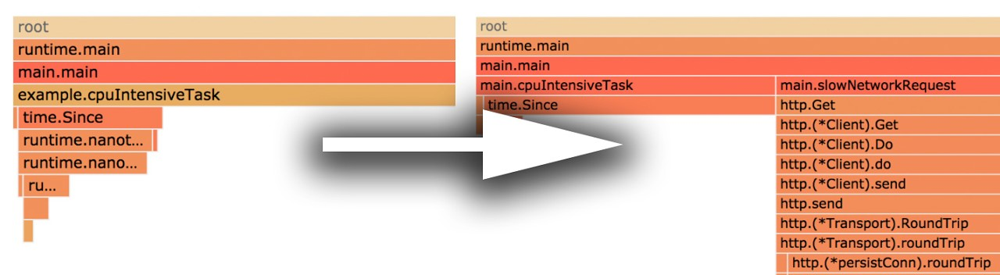
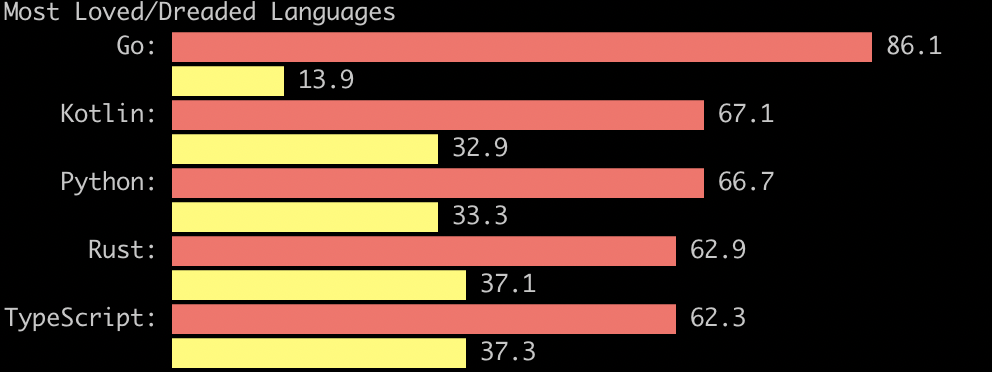
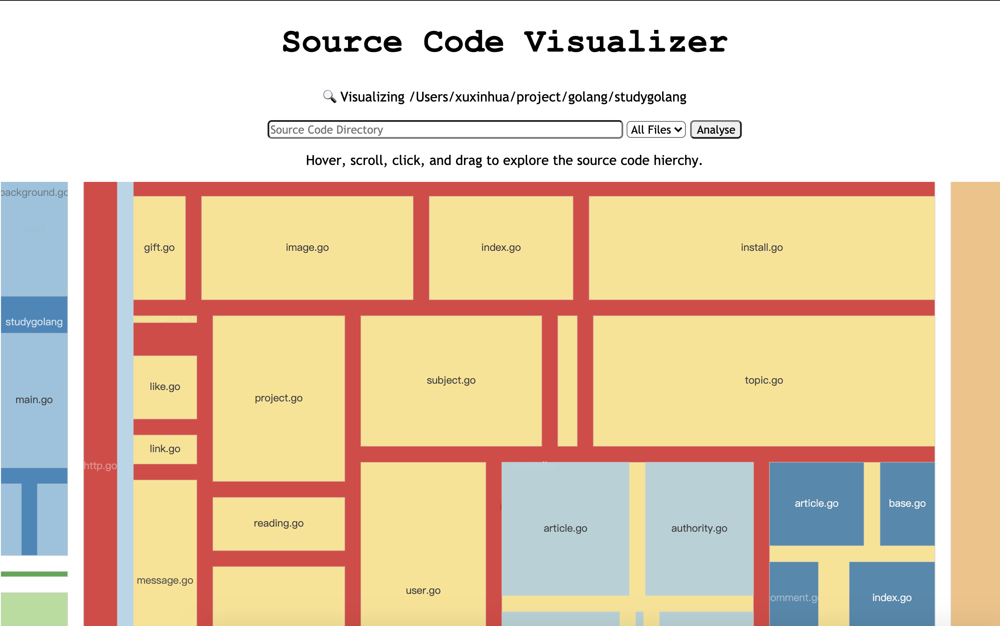
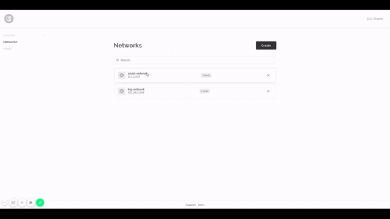
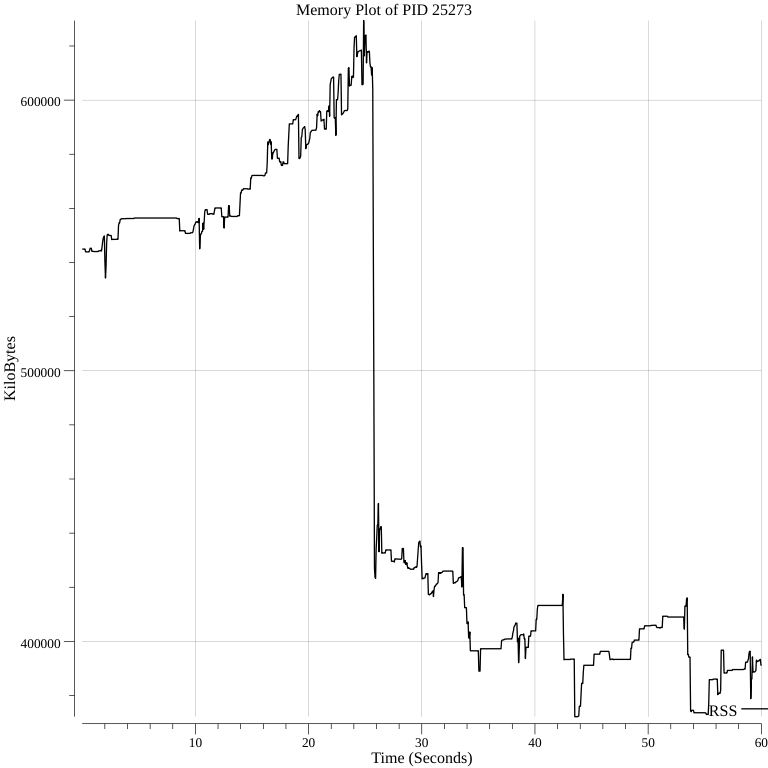

# Go语言爱好者周刊：第 49 期

这里记录每周值得分享的 Go 语言相关内容，周日发布。

本周刊开源（GitHub：[polaris1119/golangweekly](https://github.com/polaris1119/golangweekly)），欢迎投稿，推荐或自荐文章/软件/资源等，请[提交 issue](https://github.com/polaris1119/golangweekly/issues) 。

鉴于大部分人可能没法坚持把英文文章看完，因此，周刊中会尽可能推荐优质的中文文章。优秀的英文文章，我们的 GCTT 组织会进行翻译。

题图：今天家里领导生日，借周刊祝她生日快乐！

## 刊首语

自从官方发布泛型修订草案后，各种关于泛型的信息很多：比如基于泛型的 Hashmap 实现，基于泛型的测试驱动开发，基于泛型的错误处理等等。今天还发现另外一个项目，基于 Go 泛型草案的专门研究项目：<https://github.com/reconquest/goava>。

所以，无论你喜不喜欢泛型，泛型到来是迟早的事情。

## 资讯

1、[grpc-go 1.30 发布](https://github.com/grpc/grpc-go)

gRPC 的 Go 语言实现。基于 HTTP/2 的RPC。

2、[go-imap 1.0.5 发布](https://github.com/emersion/go-imap)

imap 的客户端和服务端库。

3、[Gitea 1.12.0 和 1.12.1 发布](https://blog.gitea.io/2020/06/gitea-1.12.0-and-1.12.1-are-released/)

我们很自豪地介绍 Gitea 1.12.0 版本，以及随后的 1.12.1 版本并提供一些修补程序。

4、[2020年开发者生态报告：很多人计划迁移到 Go](https://mp.weixin.qq.com/s/_H83Dc4d9QsgS9JIeEqyTw)

JetBrains 发布了 2020 开发者生态报告，该报告基于 34,000 多个开发人员的反馈。其中， 参与调查的开发人员中，20% 的人来自中国、美国和印度则分别占比19% 和 17%。报告内容除了此前曾包含的 15 种语言和数十种技术之外，今年还添加了一些新的部分：R 语言、微服务、测试、大数据，甚至是开发者的生活方式。

5、[Beego V2 Roadmap](https://github.com/astaxie/beego/issues/4035)

2.0.x 版本 （暂定截止2020年底）。

## 文章

1、[万字长文解读 pkg.go.dev 的设计和实现](https://mp.weixin.qq.com/s/btX53JVCgfOfxDy2ynQa_A)

文章较长，建议收藏，抽完整时间阅读。

2、[如何科学选择一门编程语言？理性选择，我依然选 Go](https://mp.weixin.qq.com/s/v9kHuRC6GcmCJgd6A68Wlw)

如果你看到这篇文章，很有可能，在你的职业生涯中，你至少有一次在思考应该选择哪种语言。或者你甚至在编程生涯开始之前就已经考虑了。很高兴你能看到这篇文章。

3、[Go 语言源码阅读有感 nocopy 机制](https://mp.weixin.qq.com/s/io12hy7xjaAMS5tZ_-aCOA)

读Go源码时，发现一个高频注释语句 “XXX must not be copied after first use”。例如 sync 包下的Pool、Cond、WaitGroup、Mutex、Map 和 atomoic.Vaule、strings.Builder 等，都有该句注释。

4、[为什么容器内存占用居高不下，频频 OOM（续）](https://eddycjy.com/posts/why-container-memory-exceed2/)

在上周的文章《为什么容器内存占用居高不下，频频 OOM》 中，我根据现状进行了分析和说明，收到了很多读者的建议和疑惑，因此有了这一篇文章，包含更进一步的说明和排查。

5、[苹果宣布 Mac 放弃 x86 转向 ARM：看看你要补充学习知识吗？](https://mp.weixin.qq.com/s/V6MJRPfKK3m1rNMn9hUvjw)

作为一名程序员，我们不应该只是“哇哦”感叹一声就完事了。关于这一点：苹果公司宣布 Mac 电脑将转向公司自主定制的处理器，也就是放弃 x86 架构，转向 ARM 架构，你应该特别关注下。

6、[Go 字符串中的潜在问题](https://mp.weixin.qq.com/s/AKPi9lEv78MYCIYMbrojvA)

在 Go 中，几乎所有的字符串操作都是不复制的，仅仅是从原字符串取一个子集（例如去除字符串首尾的空白字符），因此你可以更自由地操作字符串。这个机制可以非常直接地解决你的问题，并且非常高效。

7、[Go 每日一库之 cli](https://mp.weixin.qq.com/s/GQOFK125D4WB6DqIlv19_w)

cli 是一个用于构建命令行程序的库。我们之前也介绍过一个用于构建命令行程序的库 cobra。在功能上来说两者差不多， cobra 的优势是提供了一个脚手架，方便开发。cli 非常简洁，所有的初始化操作就是创建一个 cli.App 结构的对象。通过为对象的字段赋值来添加相应的功能。

8、[为什么你写的代码总是有 Bug？用它来保证 Go 代码质量](https://mp.weixin.qq.com/s/zY-P8tquCuVQxhLX3iu6_Q)

这篇文章是集成测试系列两个部分中的第二部分。本文中的示例可以从 代码仓库 获取。

9、[面试题：如何更新 Go Module 项目的依赖 — 解决问题的方法很重要](https://mp.weixin.qq.com/s/F8_qzvLxi2uVEbVWTZpd9w)

这篇文章来自知识星球球友的问题。

10、[GORM源码解读](https://segmentfault.com/a/1190000022987438)

GORM 源码解读, 基于 [v1.9.11](https://github.com/jinzhu/gorm/tree/v1.9.11) 版本。

11、[受 express.js 启发，用 20 行代码写出更清晰易用的 Go 中间件 API](https://mp.weixin.qq.com/s/YYbnN0cOtv4YoxBW6Ol_8g)

在使用 Go 编写复杂的服务时，您将遇到一个典型的主题是中间件。这个话题在网上被讨论了一次又一次。

## 开源项目

1、[goplus](https://github.com/qiniu/goplus)

七牛开源的与 Go 语言完全兼容的面向数据科学的语言（前身：qlang）。近期推广力度很大。在 GitHub 趋势榜上升也很快。

2、[goc: 系统测试覆盖率收集利器](https://github.com/qiniu/goc)（[CarlJi](https://github.com/CarlJi) 投稿）

在 goc 以前，业界在做覆盖率收集时，都是采用一种很 tricky 的方式来做，有种种不优雅的地方。而 goc 能够让被测程序在运行时就可以收集系统测试覆盖率，当属比较优雅。且此种方式，也为 go 语言的精准测试方向，展现了无限可能。

3、[go-wechaty](https://github.com/wechaty/go-wechaty)

Go 实现的微信聊天机器人。

4、[fgprof](https://github.com/felixge/fgprof)

兼容 Go 原生 profiler 的 profiler，支持非 cpu 时间（比如 IO 时间）采样。

5、[binclude](https://github.com/lu4p/binclude)

将静态文件包含到 Go 二进制文件中的另一种方法。

6、[survey](https://github.com/AlecAivazis/survey)

用于构建交互式提示的库。

7、[tcardgen](https://github.com/Ladicle/tcardgen)

Twitter 卡片图像生成器。

8、[go-envconfig](https://github.com/sethvargo/go-envconfig)

一个通过结构体类型标记绑定方式读取环境变量的配置库。

9、[cato](https://github.com/cs3org/cato)

Go 项目的自动配置文档库。

10、[gaia](https://github.com/gaia-pipeline/gaia)

Gaia 是一个开源自动化平台，可以轻松有趣地以任何编程语言构建强大的管道。

11、[tgraph](https://github.com/daoleno/tgraph)

Tgraph 是一个 Go 包，用于在终端中绘制基本图形。它受到 <https://github.com/mkaz/termgraph> 的启发，这是一个 Python 库。

## 资源&&工具

1、[油管视频: 测试驱动 Go2 新泛型](https://www.youtube.com/watch?v=O4V-s9YntNk)

泛型都测试驱动了。

2、[免费电子书: How To Code in Go eBook](https://www.digitalocean.com/community/books/how-to-code-in-go-ebook)（英文）

这本知识共享许可的 600 页书籍非常适合初学者。

3、[gosec](https://github.com/securego/gosec)

Go 代码安全扫描工具。

4、[sharingan](https://github.com/didi/sharingan)

didi 出品的流量录制回放工具。

5、[format](https://github.com/Ragnaroek/format)

用于格式化 common lisp 代码的 Go 库。

6、[gopkgs](https://github.com/razonyang/gopkgs)

一个自定义 Go 包的 import path 的命令行工具。

7、[SourceCodeVisualizer](https://github.com/guywhataguy/SourceCodeVisualizer)

Go 源码可视化。除了 Go 语言，还支持 C/C++、Python 和 Perl。对于看的代码的层次结构有一定帮助。

8、[drago](https://github.com/seashell/drago)

wireguard 网络配置工具。

9、[goarrange](https://github.com/jdeflander/goarrange)

按照 godoc 的方式自动重排声明。

10、[memplot](https://github.com/0x0f0f0f/memplot)

在单个二进制文件内非常快速地生成进程的内存使用情况的映像图。

## 订阅

这个周刊每周日发布，同步更新在[Go语言中文网](https://studygolang.com/go/weekly)和[微信公众号](https://weixin.sogou.com/weixin?query=Go%E8%AF%AD%E8%A8%80%E4%B8%AD%E6%96%87%E7%BD%91)。

微信搜索"Go语言中文网"或者扫描二维码，即可订阅。

