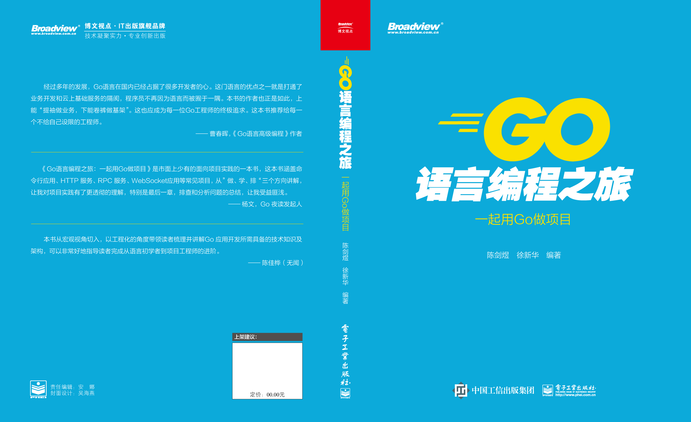
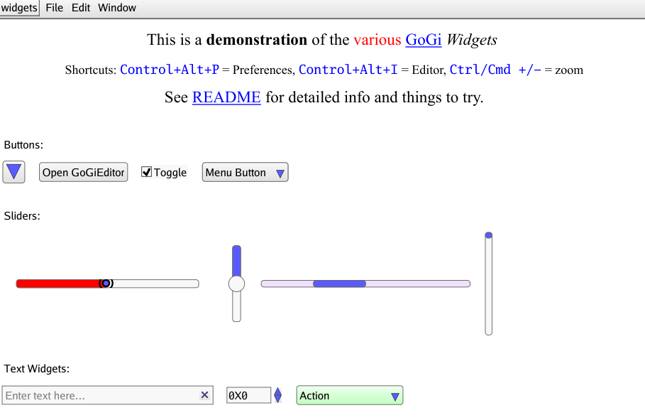
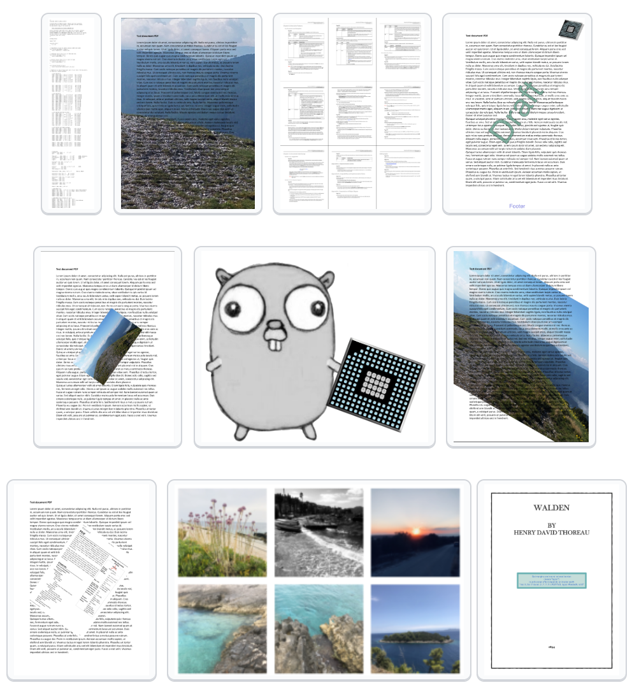
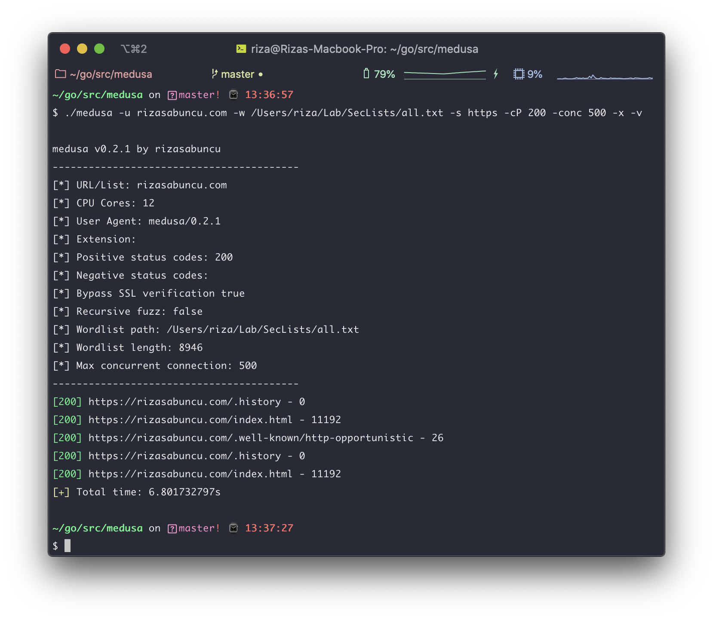

# Go语言爱好者周刊：第 50 期

这里记录每周值得分享的 Go 语言相关内容，周日发布。

本周刊开源（GitHub：[polaris1119/golangweekly](https://github.com/polaris1119/golangweekly)），欢迎投稿，推荐或自荐文章/软件/资源等，请[提交 issue](https://github.com/polaris1119/golangweekly/issues) 。

鉴于大部分人可能没法坚持把英文文章看完，因此，周刊中会尽可能推荐优质的中文文章。优秀的英文文章，我们的 GCTT 组织会进行翻译。



题图：《Go语言编程之旅》封面图

## 刊首语

在站长个人公众号：polarisxu 中陆续连载一套系列教程：[《Go 语言 Web 框架 Echo 系列教程》](https://mp.weixin.qq.com/s/7Lrqve5fi2fDmjCcdb5kFQ)，对 Echo 框架感兴趣的可以持续关注。目前更新到第 3 篇，争取每周更新，欢迎关注。


## 资讯

1、[gopls 0.4.2 发布](https://github.com/golang/tools/releases/tag/gopls%2Fv0.4.2) 

gopls 是 Go 的官方语言服务器，可为代码编辑器（例如 VS Code，vim，Emacs 等）提供更多功能（例如自动完成）。该版本最重要的一个改进是改善了内存占用。

2、[Casbin 2.8 发布: 支持多种访问控制模型的授权库](https://github.com/casbin/casbin)

虽然该库挺受欢迎，但对于某些人来说，可能是第一次听说。Casbin 支持多种语言。

3、[Go build 设计草案](https://github.com/golang/proposal/blob/master/design/draft-gobuild.md)

之前这样的语法 

```go
// +build linux
// +build 386
```

替换为：

```go
//go:build linux && 386
```

4、[国人出的一门编程语言最近火了：想要在数据科学领域分一杯羹](https://mp.weixin.qq.com/s/V-vkchEwtu2SGshwUUZaxg)

Go+ 最近在圈内热度有点高。

5、[重磅！史上第一本带你做项目的 Go 图书开卖](https://mp.weixin.qq.com/s/PRn0dgTn2MRxrpJ35yBjWA)

2020 年过去了一半，这半年对所有人来说都不寻常。但也是这场疫情，让我完成了一件大事：出了一本 Go 语言图书，书名是：《Go 语言编程之旅：一起用 Go 做项目》。

## 文章

1、[在 GoLand 中使用自定义动态模板高效编程](https://mp.weixin.qq.com/s/MO4AVhHhTSyMC9MnRareZw)

动态模板即代码段，可以在日常工作中发挥巨大作用。谁不想只敲几下键即可编写整个代码块？消除一些常规工作，您将拥有更多时间专注于真正重要的事情。想象一下，您正在开发 Web 应用程序。

2、[在 Golang 中使用 -w 和 -s 标志](https://mp.weixin.qq.com/s/D2wch7mRZj9qnhKyWWD-ZQ)

本文致力于说明在 Go 中实现 `-w` 和 `-s` 标志的效果，并提供可以更有效地使用它们的方法。

3、[专为 Gopher 准备的 Markdown 教程](https://mp.weixin.qq.com/s/8wz4U2DakVsU4tMoO-ultA)

本文不是一篇 Markdown 语法教程，而是希望通过一个 Go 语言 Markdown 解析库的学习来更深入地了解、掌握 Markdown。

4、[理解 Docker 很好的教程：用 Go 从头实现一个迷你 Docker — Gocker](https://mp.weixin.qq.com/s/P9bVFtXeduZ8Lv-0vFaXAg)

Gocker 是一个使用 Go 编程语言从头开始实现 Docker 核心功能的项目。它主要目的是提供对容器在 Linux 系统调用级别上如何工作的理解。Gocker 允许你创建容器，管理容器镜像（Image），在容器中执行进程等。

5、[Go 开发中，如何有效控制 Goroutine 的并发数量](https://studygolang.com/articles/29680)

携程技术出品。携程也是用 Go 了。

6、[细谈八种架构设计模式及其优缺点概述](https://mp.weixin.qq.com/s/fFC2JBl9mPj4T9Yf_LJv-A)

没有银弹、灵活运用，共勉！

7、[使用 Go GUI 库 fyne 编写一个计算器程序](https://mp.weixin.qq.com/s/VrTFMhpYvzr78ULqsQ15Sw)

fyne 的实战。

8、[Go 实现一个简单的 DSL 解释器](http://mrw.so/5trVX4)

DSL：为了解决某一类任务而专门设计的计算机语言。

9、[用 10 分钟了解 Go 语言 context 包使用场景](https://mp.weixin.qq.com/s/5RoynzbwsQwv0cqPwJdIXQ)

本篇就是带大家了解什么是 context，以及使用的场景及方式，内容不会提及 context 的原码，而是用几个实际例子来了解。

## 开源项目

1、[calendarheatmap](https://github.com/nikolaydubina/calendarheatmap)

Go 实现的类似 GitHub 活动样式日历热图。


2、[json](https://github.com/pkg/json)

高效的 JSON 解码器，Dave Cheney 写文介绍：[Building a high performance JSON parser](https://dave.cheney.net/high-performance-json.html)。

3、[YoyoGo: 基于 ASP.NET Core 设计的 Golang 实现](https://github.com/yoyofx/yoyogo)

国人实现，这里有介绍文章：<https://www.cnblogs.com/maxzhang1985/p/12981989.html>。

4、[gi](https://github.com/goki/gi)

原生 Go 图形界面系统（2D 和 3D），基于 GoKi 树框架。



5、[safehtml](https://github.com/google/safehtml)

Go 安全 html 模板引擎。在 Google 组织下，但并非 Google 官方支持的项目。

6、[biogo](https://github.com/biogo/biogo)

Go 语言的生物信息学库。

7、[pdfcpu](https://github.com/pdfcpu/pdfcpu)

Go 语言 PDF 处理器。



8、[git-get](https://github.com/grdl/git-get)

更好的方式 clone、管理多个 Git 项目。从名字看出来是和 go get 类似的使用方式。


9、[surge](https://github.com/renproject/surge)

简单，专业，高效的二进制编解码。

10、[medusa](https://github.com/riza/medusa)

最快的递归 HTTP 模糊器，例如 Ferrari。



## 资源&&工具

1、[Trubka](https://github.com/xitonix/trubka)

用于 Kafka 的 CLI 工具。

2、[vermin](https://github.com/mhewedy/vermin)

智能虚拟机管理。


3、[Go Time 第 136 期](https://changelog.com/gotime/136)

Go 在 Pace.dev 的生产实践。

4、[oto](https://github.com/pacedotdev/oto)

rpc 代码生成工具。

5、[Go Time 第 134 期](https://changelog.com/gotime/134)

Google 实习生的 Go 学习使用历程。

6、[Youtube 视频](https://www.youtube.com/watch?v=kvwsPeWDLM8)

为什么 Go [Fiber](https://github.com/gofiber/fiber) 是值得学习的新（Web）框架。

7、[Poodle](https://github.com/Clivern/Poodle)

快速，美观的命令行工具，用于构建 API 请求。

8、[tinysql](https://github.com/pingcap-incubator/)

构建分布式数据库的 SQL 层的课程。

9、[gasm](https://github.com/mathetake/gasm)

用于 Gophers 的实验 WASM 虚拟机。

10、[gitqlite](https://github.com/augmentable-dev/gitqlite)

使用 SQL 查询 git 存储库。比如：`gitqlite "SELECT * FROM commits`。

## 订阅

这个周刊每周日发布，同步更新在[Go语言中文网](https://studygolang.com/go/weekly)和[微信公众号](https://weixin.sogou.com/weixin?query=Go%E8%AF%AD%E8%A8%80%E4%B8%AD%E6%96%87%E7%BD%91)。

微信搜索"Go语言中文网"或者扫描二维码，即可订阅。


