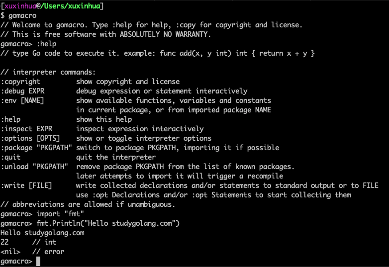
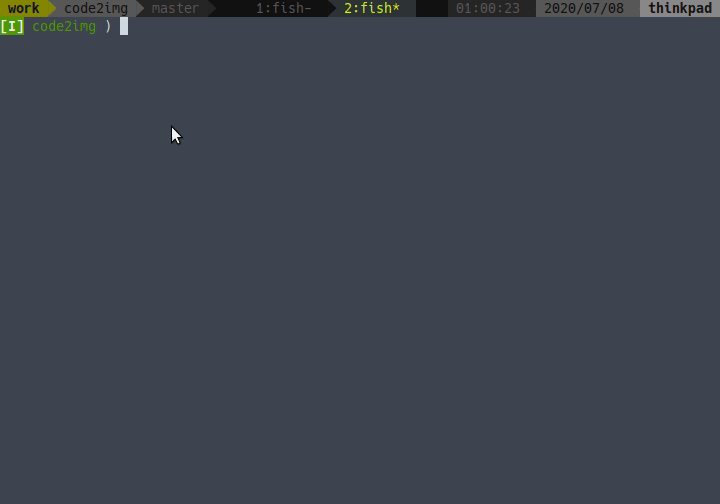

# Go语言爱好者周刊：第 51 期

这里记录每周值得分享的 Go 语言相关内容，周日发布。

本周刊开源（GitHub：[polaris1119/golangweekly](https://github.com/polaris1119/golangweekly)），欢迎投稿，推荐或自荐文章/软件/资源等，请[提交 issue](https://github.com/polaris1119/golangweekly/issues) 。

鉴于大部分人可能没法坚持把英文文章看完，因此，周刊中会尽可能推荐优质的中文文章。优秀的英文文章，我们的 GCTT 组织会进行翻译。

题图：今早河北唐山发生 5.1 级地震，北京天津有震感。预警系统提前监控。

## 刊首语

站长公众号 [polarisxu 送三本](https://mp.weixin.qq.com/s/-n2NoZqTFLzQ8XpFiTvbBQ) 《Go 语言编程之旅》，两个本抽奖，一本留言点赞最多获得。截止 2020 年 7 月 13 日 18 点。还没参与的可以参与下。扫码关注：

## 资讯

1、[Goka 1.0 发布](https://github.com/lovoo/goka)

适用于 Apache Kafka 的分布式流处理库。

2、[SFTPGo 1.0 发布](https://github.com/drakkan/sftpgo)

Go 实现的功能齐全的 SFTP 服务器。

3、[Go-streams v0.5.0 发布](https://github.com/reugn/go-streams)

流处理库。提供简单明了的 DSL 以建立数据管道。

4、[GORM v2 版本指南](http://v2.gorm.io/docs/)

国人开发的 Go 语言 ORM 升级到 v2 版本。

## 文章

1、[图解 Go GC 是怎样监听你的应用的？](https://mp.weixin.qq.com/s/Yc3-RXfDo1aFqA1vHdqfxg)

Go 语言的垃圾收集器 （下文简称 GC ）能够帮助到开发者，通过自动地释放掉一些程序中不再需要使用的内存。但是，跟踪并清理掉这些内存也可能影响我们程序的性能。

2、[从这些角度看 Go 是一门很棒的语言](https://mp.weixin.qq.com/s/vMPfws9uR6EtsXNRevuV8A)

你认同吗？

3、[从这些角度看 Go 是一门糟糕的语言](https://mp.weixin.qq.com/s/lA2d-TqvHrsbUbsiJ84U5g)

这写又认同吗？

4、[Go 项目推荐之 Go Search Extension 在浏览器搜索 Go 文档](https://mp.weixin.qq.com/s/ql0_h4my83IYarXxEAv0KA)

Go Search Extension 是一款可以在浏览器地址栏快速、方便、高效地搜索 Go 文档、第三方库的浏览器插件，支持 Chrome/Firefox/Edge。

5、[Go 语言一次真实的错误吞并的教训](https://mp.weixin.qq.com/s/YIlySRSpzWZqide0T_UesQ)

常见的错误。

6、[Go GC 怎么标记内存？颜色是什么含义？图解三色标记法](https://mp.weixin.qq.com/s/TqNLZoQQhJeech7RWnvtfA)

本文基于 Go 1.13。关于内存管理的概念的讨论在我的文章 Go 中的内存管理和分配中有详细的解释。

7、[Gin 框架中使用 validator 若干实用技巧](https://mp.weixin.qq.com/s/s_bOPz3U2VdYNJm5zfxCFA)

Web 开发中不可避免的要对请求参数进行校验，通常我们会在代码中定义与请求参数相对应的模型（结构体），借助模型绑定快捷地解析请求中的参数，例如 Gin 框架中的 Bind 和 ShouldBind 系列方法。

8、[Go 项目推荐之自动化全站后台管理系统脚手架 Gin-Vue-Admin](https://mp.weixin.qq.com/s/d3uU0IQQZyvixqk4XRShKA)

一个基于 vue 和 gin 开发的全栈前后端分离的后台管理系统，拥有 jwt 鉴权，动态路由，动态菜单，casbin 鉴权，表单生成器，代码生成器等功能，新版本增加了从数据库表一键创建前后端 curd 代码功能，方便大家从老系统迁移，大大减少了开发工作量，真正做到 5 分钟一套基础业务，让大家把更多时间专注在复杂业务开发上。

## 开源项目

1、[goa](https://github.com/goadesign/goa)

一个使用独特的设计优先的方法在 Go 中构建微服务和 API 的框架。

2、[Bleve](https://github.com/blevesearch/bleve)

Go 实现的全文本搜索和索引库。

3、[GhostDB](https://github.com/jakekgrog/GhostDB)

分布式，基于内存的通用键值数据存储。这是一个大学项目，它与 Redis 有一些相似之处，但是它是用 Go 语言编写的。

4、[go-safeweb](https://github.com/google/go-safeweb)

用于在 Go 中编写默认安全 HTTP 服务器的库的集合。

5、[serviceq](https://github.com/gptankit/serviceq)

用 Go 编写的 HTTP 群集的容错网关。

6、[ably-go](https://github.com/ably/ably-go)

用于 Ably 实时消息传递服务的 Go 客户端库 SDK。

7、[sdns](https://github.com/semihalev/sdns)

具有 dnssec 支持的隐私重要的，快速递归的 dns 解析器服务器。

8、[twinui](https://github.com/fgm/twinui)

有关如何在应用程序中组合 Web 和全屏文本 UI 的演示。

9、[grpcui](https://github.com/fullstorydev/grpcui)

类似于 postman 的 gRPC 交互式 Web UI。

## 资源&&工具

1、[Gopherize.me](https://gopherize.me/)

创建自己的独特 Gopher。源码公开，在这里：<https://github.com/matryer/gopherize.me>。我随便创建了一个：

2、[gomacro](https://github.com/cosmos72/gomacro)

带有 REPL，Eval，泛型和类似 Lisp 的宏的交互式 Go 解释器和调试器。

3、[polaris](https://github.com/FairwindsOps/polaris)

你看错了，这不是站长 polaris，而是 Kubernetes 集群配置最佳实践验证工具。

4、[Brainfuck](https://mihajlonesic.gitlab.io/archive/brainfuck-in-go/)

Go 实现 brainfuck 语言解析器。

5、[generics](https://github.com/jadilet/generics)

数据结构 Go 语言实现。

6、[quickjs](https://github.com/lithdew/quickjs)

快速，小型，可嵌入的 ES2020 JavaScript 解释器，Go 语言实现。

7、[can-haz-password](https://github.com/kloeckner-i/can-haz-password)

Go 库，用于生成基于规则的随机密码。随机的，非常安全。

8、[code2img](https://github.com/skanehira/code2img)

将源码转为图片。

9、[utilities](https://github.com/nickwells/utilities)

Go 语言实现的一些有用的命令行工具。

10、[GopherCon Europe 2020](https://www.youtube.com/playlist?list=PLtoVuM73AmsKnUvoFizEmvWo0BbegkSIG)

在线会议全套视频开放。

## 订阅

这个周刊每周日发布，同步更新在[Go语言中文网](https://studygolang.com/go/weekly)和[微信公众号](https://weixin.sogou.com/weixin?query=Go%E8%AF%AD%E8%A8%80%E4%B8%AD%E6%96%87%E7%BD%91)。

微信搜索"Go语言中文网"或者扫描二维码，即可订阅。

