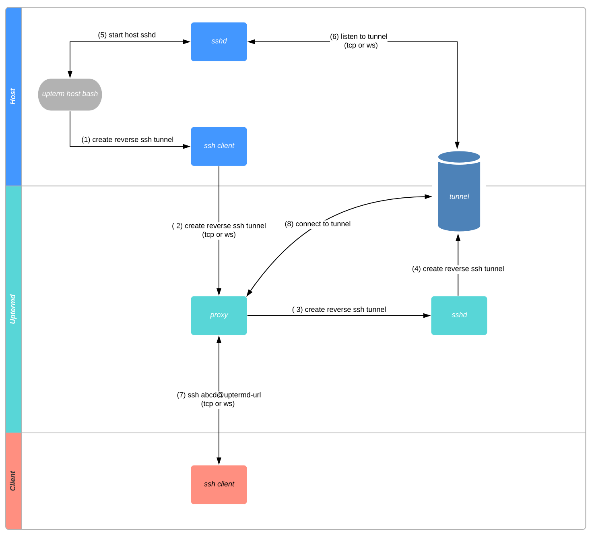

# Go语言爱好者周刊：第 52 期

这里记录每周值得分享的 Go 语言相关内容，周日发布。

本周刊开源（GitHub：[polaris1119/golangweekly](https://github.com/polaris1119/golangweekly)），欢迎投稿，推荐或自荐文章/软件/资源等，请[提交 issue](https://github.com/polaris1119/golangweekly/issues) 。

鉴于大部分人可能没法坚持把英文文章看完，因此，周刊中会尽可能推荐优质的中文文章。优秀的英文文章，我们的 GCTT 组织会进行翻译。

题图：Go 泛型在纠结用 () 还是 []？

## 刊首语

如何快速找到 Go 优质资源？网站有 hao123 等各种导航，很多垂直领域也有类似的导航，那 Go 是不是也应该有一个类似的导航呢？答案是肯定的。而 Go 语言中文网理所当然担负起来，实现了一个 Go 的垂直导航，我叫它 haogo。目前放入的资源还不是太多，但会不断完善，也欢迎大家提交你认为应该收录的 Go 好资源。网址：<https://hao.studygolang.com>。

## 资讯

1、[Go 1.14.6 和 Go 1.13.14 发布](https://studygolang.com/topics/11919)

几天前也发布了 1.14.5 和 1.13.13，其中涵盖了两个安全修复：net/http 中的数据争用和 Windows 上的 X.509 验证问题。而这两个小版本更侧重普通问题的修复。

2、[GoLand 2020.2 测试版可用](https://blog.jetbrains.com/2020/07/16/goland-2020-2-reaches-beta/)

更好的支持 mod，同时对泛型的实验性支持。

3、[Hugo 0.74.0](https://gohugo.io/news/0.74.0-relnotes/)

Hugo 是流行的基于 Go 的静态网站构建器，这是一个重要发行版，极大的 JavaScript 改进。

4、[蚂蚁王益：Go+ 可有效补全 Python 的不足](https://mp.weixin.qq.com/s/Yz1JIXccFEX3OAkmRGzd_Q)

Python 的语法很灵活，融合了很多其他语言中令人觉得方便的特点。然而 Python 的优势同时也隐含了其劣势。蚂蚁研究员王益在工业系统中对 Python 的亲身体会，更加深刻地了解到了 Python 的局限，而 Go+ 是弥补方案里最靠谱的。那么 Python 有哪些不足？Go+ 又是如何能弥补的？本文分享王益对 Go+ 补全 Python 的局限上的相关看法和尝试。

## 文章

1、[由群里讨论的关于 println 和 fmt.Println “诡异”问题的思考总结](https://mp.weixin.qq.com/s/ukBUGNYaULfF14x0_DfUyQ)

不应该依赖具体实现。发现诡异问题，试试命令行是怎么样的。

2、[我用 Go 生成的随机数为什么不随机？随机数是怎样产生的](https://mp.weixin.qq.com/s/-VUfTmSVmtXwQWpJOykf5g)

Go 中两个随机数的库，你了解多少？

3、[Go 1.15 添加 Module cache 环境变量：有什么用？](https://mp.weixin.qq.com/s/WBhPDBb67nz0Rt6te5dHVw)

讲解在 Go 1.15 中添加的 Module Cache 环境变量。

4、[为什么 Go 关心 unsafe.Pointer 和 uintptr 之间的差别](https://mp.weixin.qq.com/s/ImlseLD8Ocw54iwaMruXpQ)

Go 有两样东西或多或少是无类型指针的表示：uintptr 和 unsafe.Pointer （和外表相反，它们是内置类型）。从表面上看这有点奇怪，因为 unsafe.Pointer 和 uintptr 可以彼此来回转换。为什么不只有一种指针表现形式？两者之间有什么区别？

5、[为什么 Go 的错误处理很棒？还是有人很喜欢的嘛](https://mp.weixin.qq.com/s/wYkta4h6OYUxKnlIZD7T_g)

Go 臭名昭著的错误处理引起了外部人士对该编程语言的广泛关注，它经常被说成是该语言最有争议的设计决策之一。

6、[Golang 热更新原理](https://xie.infoq.cn/article/c233ef969f1f86d3f77d92e19)

从 Linux 进程通讯讲起。

7、[一些连接池相关的总结](https://xargin.com/some-connection-pool/)

曹大出品，涵盖各种池。

8、[用 Go 撸一个二叉搜索树](https://colobu.com/2020/07/15/implement-bst-in-Go/)

前几天 Redis 的作者 antirez 说他朋友面试的时候考到排序问题，然后他说要是他也会考实现一个二叉搜索树，我说在中国某公司，据说面试直接就撸一个红黑树。不是说你技术渣，试问在座的各位有几个现在直接裸写出红黑树？

9、[如何在 Go 中写出高效的单元测试](https://mp.weixin.qq.com/s/a6qQ8U5PYYul59oFOVXugw)

来自团队的技术分享。

10、[分布式系统基石之一：一致性 hash 算法 Go 语言实现](https://mp.weixin.qq.com/s/Kz03Z_s26WyuOh7-7mYTTw)

原理就很重要，看看 Go 如何实现的。

11、[贝壳找房小程序从 PHP 到 Golang 的跃迁之路](https://mp.weixin.qq.com/s/phaTJPs80Xvva0rAThvW9A)

看评价说是参与这个的新手居多？

12、[Go 泛型的括号选择：中括号还是小括号](https://mp.weixin.qq.com/s/caqf0pIM4nTByh_c5HqWPw)

泛型备受关注，上次官方放出泛型预计 2021 年 8 月发布。然而，使用小括号很多人表示不可接受。这不 golang-nuts 上进行了广泛讨论。关于为什么不用尖括号<>，官方解释是 “解析器在某些情况下要求 <> 需要 unbounded lookahead”。哪位研究比较多的可以解释下 unbounded lookahead 在 什么场景下会被解析器使用？

13、[Go 指南：顶级 Go 框架、IDE 和工具列表](https://mp.weixin.qq.com/s/5q7G6BpeRohX4v2GvvZUAQ)

从留言看，大家对 iris 和 goframe 框架呼声很高。

14、[Go 程序启动过程](https://overstack.me/202007/go-program-startup-process.html)

不是很详细，但能知晓总体流程。

15、[踩坑记：Go 服务灵异 panic](https://segmentfault.com/a/1190000023283854)

从分析看，上线前应该跑 data race。

16、[牛逼！GitHub 全球开放源码在北极存 1000 年。有你的贡献吗？](https://mp.weixin.qq.com/s/PQn7Xwmdwk6EcFw68hlffQ)

将 “Bug” 留给子孙后代~

## 开源项目

1、[afero: Go 语言实现的抽象文件系统](https://github.com/spf13/afero)

用于访问各种文件系统一致的 API。还可以让您创建完全不依赖磁盘的模拟和测试文件系统。viper 和 cobra 作者的又一开源作品。

2、[go-ordered-map](https://github.com/wk8/go-ordered-map)

总有人想要对 map 进行排序，这个库实现了一个可排序的 map。

3、[testify](https://github.com/stretchr/testify)

具有常见断言和模拟的工具箱，可与标准库很好地配合使用。

4、[go-tagexpr](https://github.com/bytedance/go-tagexpr)

有趣的 go struct 标记表达式语法，用于字段验证等。

5、[envconfig](https://github.com/kelseyhightower/envconfig)

用于管理环境变量中的配置数据的库。

6、[can-go](https://github.com/einride/can-go)

使用 Go 实现的 CAN 总线库，视频：<https://www.youtube.com/watch?v=IbggJHJUv0U>。

7、[doraemon](https://github.com/Qihoo360/doraemon)

360 开源的基于 Prometheus 的监控系统。

8、[casbin-forum](https://github.com/casbin/casbin-forum)

 Go 实现的论坛系统。

9、[go-dork](https://github.com/dwisiswant0/go-dork)

用 Go 语言编写的最快的 Dork 扫描仪。

10、[AdGuardHome](https://github.com/AdguardTeam/AdGuardHome)

支持全网络广告和跟踪器屏蔽的 DNS 服务器。

## 资源&&工具

1、[GopherCon Europe 2020 的 21 场演讲](https://www.youtube.com/playlist?list=PLtoVuM73AmsKnUvoFizEmvWo0BbegkSIG)

油管视频。疫情也无法阻止 Gopher 们的分享热情。

2、[errcheck](https://github.com/kisielk/errcheck)

检查错误是 Go 的基本组成部分，此工具将帮助你检查是否已检查错误！

3、[upterm](https://github.com/jingweno/upterm)

Go 实现的安全终端分享。工作原理图：

4、[油管视频：Go 泛型](https://www.youtube.com/watch?v=GFihRsKZ_pw)

William Kennedy 分享。

5、[Go Time 第 137 期](https://changelog.com/gotime/137)

聚焦 Go 与 PostgreSQL。

6、[todocheck](https://github.com/preslavmihaylov/todocheck)

Go 注释中 TODO 标记的分析器。

## 订阅

这个周刊每周日发布，同步更新在[Go语言中文网](https://studygolang.com/go/weekly)和[微信公众号](https://weixin.sogou.com/weixin?query=Go%E8%AF%AD%E8%A8%80%E4%B8%AD%E6%96%87%E7%BD%91)。

微信搜索"Go语言中文网"或者扫描二维码，即可订阅。

