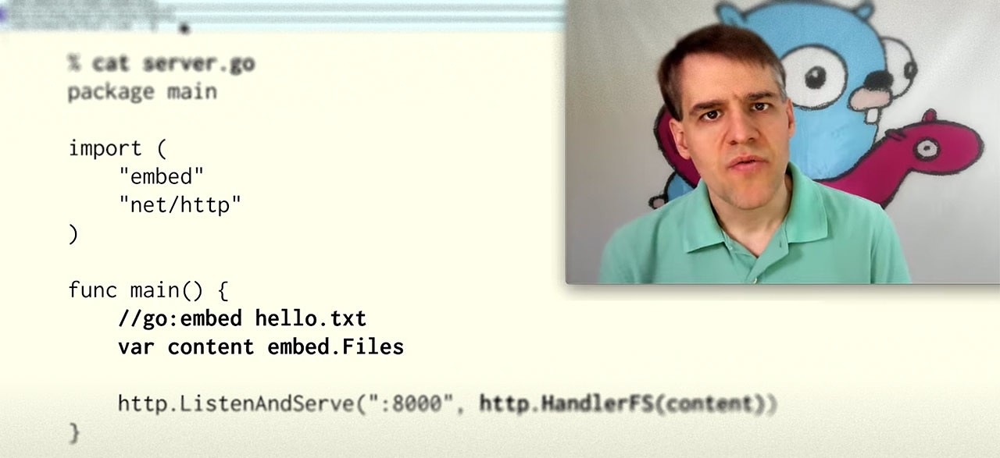
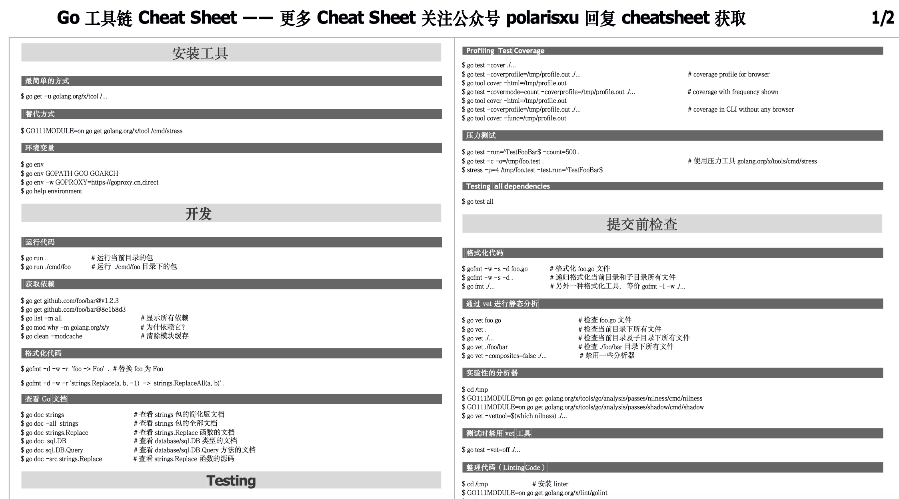
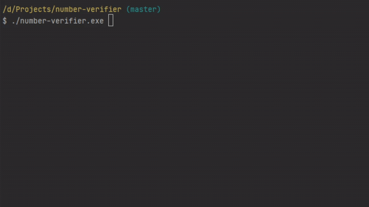

# Go语言爱好者周刊：第 53 期

这里记录每周值得分享的 Go 语言相关内容，周日发布。

本周刊开源（GitHub：[polaris1119/golangweekly](https://github.com/polaris1119/golangweekly)），欢迎投稿，推荐或自荐文章/软件/资源等，请[提交 issue](https://github.com/polaris1119/golangweekly/issues) 。

鉴于大部分人可能没法坚持把英文文章看完，因此，周刊中会尽可能推荐优质的中文文章。优秀的英文文章，我们的 GCTT 组织会进行翻译。

题图：静态资源内嵌入 Go 二进制文件中

## 刊首语

本周我制作了一些 Cheat Sheet 发布在朋友圈，不少人挺喜欢这种。于是我准备整理、制作更多的 Cheat Sheet，方便大家快速查看、学习。目前已经有一些了，大家觉得不错，请给项目来个 Star 吧：<https://github.com/polaris1119/awesome-cheatsheets-cn>，你的支持是我持续整理的动力。

## 资讯

1、[嵌入静态资源的 Go Command 支持的设计草案](https://github.com/golang/proposal/blob/master/design/draft-embed.md)

去年 12 月，我们提到了一个[提案](https://github.com/golang/go/issues/35950)，该提案将 Go 二进制文件中的 assets/files 的嵌入引入到主 Go 工具集中（与使用 [Packr](https://golangweekly.com/link/92420/web) 等现有工具相比）– Brad Fitzpatrick 现在返回了设计草案供我们仔细研究（其中包括链接到 15 个替代实现）。Russ Cox 还录制了[视频演示](https://golangweekly.com/link/92421/web)，介绍了设计草案在实践中的工作方式。

2、[Go 的新文件系统接口的设计草案](https://github.com/golang/proposal/blob/master/design/draft-iofs.md)

同样有[视频演示](https://www.youtube.com/watch?v=yx7lmuwUNv8)，介绍了 io/fs，这是一个新包，它定义了只读文件树的接口。上周刚介绍了一个类似的库 [afero](https://github.com/spf13/afero)。

3、[go2go Playground 现在支持新版泛型](https://go2goplay.golang.org/p/7zFKUcpzhvZ)

上周提到在讨论用 () 还是 []。这个支持的是 [] 版本。

4、[模糊测试设计草案](https://github.com/golang/proposal/blob/master/design/draft-fuzzing.md)

之前周刊介绍过类似的第三方方案，现在官方计划支持，可见模糊测试（Fuzzing）的重要性。

5、[goldmark 1.2.0 发布](https://github.com/yuin/goldmark)

拥有易于扩展且与 CommonMark 兼容的优势。写过一篇文章专门介绍这个库。[专为 Gopher 准备的 Markdown 教程](https://mp.weixin.qq.com/s/8wz4U2DakVsU4tMoO-ultA)。

6、[GoLand 2020.2 Beta 版发布：go.mod 升级以及对泛型的实验性支持](https://mp.weixin.qq.com/s/CQ1lVU4y03iNQL5lFcuxUQ)

GoLand 2020.2 达到 Beta。这意味着我们将结束一连串的新功能开发，将重点转移到完善我们已经完成的工作上，并开始计算发布日之前的日子！

7、[Go 1.15 RC1 发布](https://tip.golang.org/doc/go1.15)

8 月临近，1.15 也临近了。

## 文章

1、[由一个问题引发的 goroutine 相关源码的探究](https://mp.weixin.qq.com/s/T2nqjNlfGmBTOIeF6jidYA)

本文基于 Go 语言 1.13.x 版本进行分析。

2、[Go 中你使用全局变量吗？如何更好的进行隔离？](https://mp.weixin.qq.com/s/XzSD37erjZMuW2Z_Qr7F3A)

假设，但不是凭空想象，在你的程序中，你注册了一堆 expvar 包的统计变量，用来在暴露出去的 JSON 结果中能有一个容易辨识的名字。

3、[go runtime debug 小技巧](https://www.jianshu.com/p/f32b51f54173)

本意是打算研究一下 Go 程序的启动流程，然后就去网上搜索了一下入门教程。结果令我有点沮丧，搜到的几乎所有文章开篇都是通过 GDB 调试, 然后就是不同平台下的汇编代码。。。

4、[Go 编程: 如何实现协程调度的精准控制](https://www.gitdig.com/post/go-schedule-control/)

说起 Go 协程的调度，如果你了解 Go 调度器以及其实现的 G/P/M 模型，当然有助于应用的开发。但是在应用层面上，这些底层的调度原理并不会帮你太多，实现 Go 协程的精准调度得完全靠自己。

5、[字节跳动踩坑记：Go 服务内存暴涨](https://mp.weixin.qq.com/s/eCR7cIqvr9_7mrvhwuETCQ)

学习问题分析的过程。

6、[雨痕公开课4.3.1返回值内存分配](https://www.yuque.com/docs/share/5a0474df-5bed-4aca-a1a2-82b58a16fc77)

局部变量内存由所在函数分配，但返回值内存却是由调用方（calller）提供。这种差别会导致某些行为上的差异，比如 defer 操作结果。

7、[哪个更快？对 gRPC 的 Rust 和 Go 版本进行基准测试](https://mp.weixin.qq.com/s/WIbcA2vg4Lrv-C8F4yuL1Q)

结果可能出乎意料。

8、[为 Gopher 打造 DDD 系列](https://mp.weixin.qq.com/s/Mb_6a77T0K0HkvekoghxYg)

DDD 是什么？是否适合你现在的公司？

9、[Docker registry GC 原理分析](https://mp.weixin.qq.com/s/D8BFeEcbwDiB5PhM824CvQ)

GC（Garbage Collection）即垃圾回收，本文从文件系统层面分析了 registry GC 原理，相比源码分析更加直观，并提示了一些可能遇到的错误，帮助大家避免踩坑。

9、[Go 语言 Web 框架 Echo 系列：定制篇3 — 自定义 Logger，用你喜欢的日志库](https://mp.weixin.qq.com/s/hZzcce4S4D0B6tXeorb8-A)

在知识星球简书项目中，我们分析对比了目前的一些日志库。虽然 Go 标准库有一个 log，但功能有限，所以才出现了很多第三方的日志库。

10、[这个代码竟然报错了？Go 的不可寻址值了解下](https://mp.weixin.qq.com/s/fgy3FnfvFgRMjQ8in_otjA)

Dave Cheney 在 Twitter 上发布过一个 Go 的小测验，和往常一样，我从中学到了一些有趣的东西。

## 开源项目

1、[Evergreen: 来自 MongoDB 的分布式持续集成系统](https://github.com/evergreen-ci/evergreen)

由 MongoDB 构建以测试 MongoDB，但它是用 Go 语言编写的，可动态分配主机以跨多台机器并行运行任务。

2、[pebble](https://github.com/cockroachdb/pebble)

受 LevelDB/RocksDB 启发的 KV 存储。

3、[xmlquery](https://github.com/antchfx/xmlquery)

用于 XML 查询的 Golang XPath 软件包。

4、[query2metric](https://github.com/yolossn/query2metric)

把 DB 查询转换为 prometheus 指标。

5、[number-verifier](https://github.com/upmasked/number-verifier)

Golang 实现的 SMS 验证工具，轻松获取一次性 SMS 号码。

6、[go-flow-levee](https://github.com/google/go-flow-levee)

该静态分析工具可确保您程序的数据流不会溢出到其库之外，从而保证避免暴露敏感数据。

7、[stash](https://github.com/stashed/stash)

备份 k8s 中有状态应用的工具。

8、[go-fileserver](https://github.com/prdpx7/go-fileserver)

通过二维码在同一网络下分享文件。

## 资源&&工具

1、[油管视频](https://www.youtube.com/watch?v=O9upVbGSBFo)

Unix、C、Go 和人工智能。

2、[油管视频](https://www.youtube.com/watch?v=vdhSk8vCx-k)

使用 Go 构建支持并发的下载管理器。

3、[Gopher 读物清单](https://github.com/ardanlabs/gotraining/blob/master/reading/README.md)（英文）

在整个材料中，有大量链接指向外部的阅读和视频。有时，我们遇到一些我们认为很重要的材料，没有确切的放置位置。

4、[第 97 期视频回放：我们可以从 mosn 和相关的项目中学习到什么](https://talkgo.org/t/topic/568)

mosn 是什么？

5、[播客第 138 期](https://changelog.com/gotime/138)

与 Go 语言相伴的第一周。

6、[Go 风格指南汇总](https://github.com/dgryski/awesome-go-style)

汇总了各种公司的风格指南。

7、[播客第 139 期](https://changelog.com/gotime/139)

Testify 的未来。

## 订阅

这个周刊每周日发布，同步更新在[Go语言中文网](https://studygolang.com/go/weekly)和[微信公众号](https://weixin.sogou.com/weixin?query=Go%E8%AF%AD%E8%A8%80%E4%B8%AD%E6%96%87%E7%BD%91)。

微信搜索"Go语言中文网"或者扫描二维码，即可订阅。

