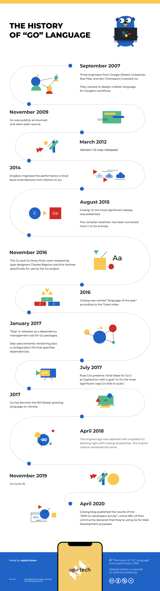
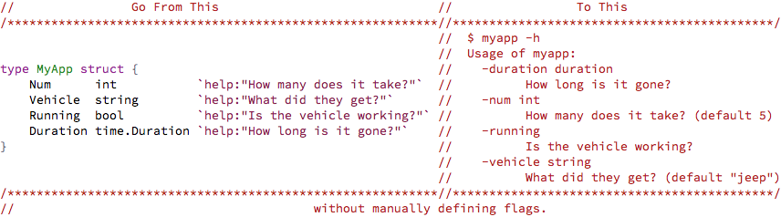
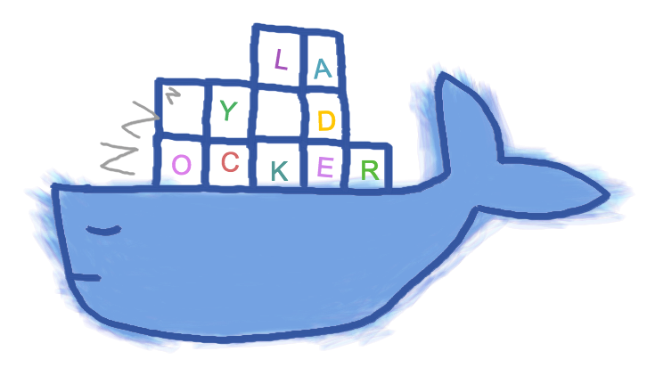
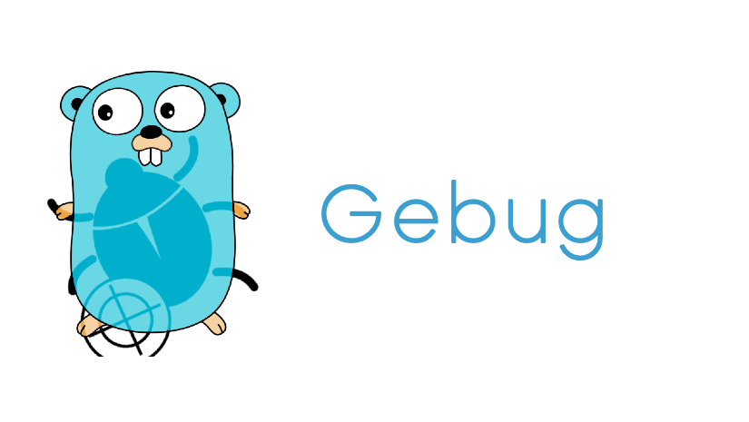

# Go语言爱好者周刊：第 54 期

这里记录每周值得分享的 Go 语言相关内容，周日发布。

本周刊开源（GitHub：[polaris1119/golangweekly](https://github.com/polaris1119/golangweekly)），欢迎投稿，推荐或自荐文章/软件/资源等，请[提交 issue](https://github.com/polaris1119/golangweekly/issues) 。

鉴于大部分人可能没法坚持把英文文章看完，因此，周刊中会尽可能推荐优质的中文文章。优秀的英文文章，我们的 GCTT 组织会进行翻译。

题图：一图了解 Go 语言历史

## 资讯

1、[流行的 Go IDE GoLand 2020.2 有哪些新增功能？](https://www.jetbrains.com/go/promo/whatsnew/)（英文）

GoLand 2020.2 稳定版发布。

虽然是商业产品，但 GoLand 仍然是流行的 Go IDE，其最新版本具有改进的模块支持，可让您与 Go Playground 共享和执行代码，具有实验性的泛型支持，并允许您直接从 IDE 中处理 GitHub PR。

2、[Delve 1.5 发布](https://github.com/go-delve/delve/blob/master/CHANGELOG.md#150-2020-07-29)

这是一个整整 14 分钟的[视频](https://www.youtube.com/watch?v=r033vEzL6a4)。支持 Go1.15。

3、[MongoDB Go Driver 1.4 发布](https://github.com/mongodb/mongo-go-driver/releases/tag/v1.4.0)

这是和 MongoDB 4.4 发布一起的。

4、[爬虫管理平台 Crawlab v0.5.1 正式发布](https://github.com/crawlab-team/crawlab)

Crawlab 是一个使用 Golang 开发的分布式爬虫管理平台，支持 Python、NodeJS、Go、Java、PHP 等多种编程语言以及多种爬虫框架。

5、[Istio 1.6.6 发布](https://www.oschina.net/news/117584/istio-1-6-6-released)

Istio 是一个由谷歌、IBM 与 Lyft 共同开发的开源项目，旨在提供一种统一化的微服务连接、安全保障、管理与监控方式。

## 文章

1、[全面讲解 goroutine 间的同步&协作](https://mp.weixin.qq.com/s/nTSpQkE6As5YrfO2NevKcw)

总结都有哪些方式。

2、[goroutine的退出与泄露：如何检测和预防](https://mp.weixin.qq.com/s/Tq1Pi9NeOhKvr62S-X2Jdw)

全面介绍各种情况。

3、[Go 语言 Web 框架 Echo 系列：定制篇4—自定义 Renderer，增强或替换模板引擎](https://mp.weixin.qq.com/s/RDqegHWYW36y3VZuuM37yQ)

Render，顾名思义，要进行页面渲染。Go 语言不但自带有强大的 http 库，还自带了 HTML 模板引擎。Echo 框架对模板引擎进行了一些额外处理，并提供了给用户自定义页面渲染的接口。本文就相关问题进行探讨。

4、[实战项目：用 Go 实现进度条功能](https://mp.weixin.qq.com/s/ub9AQWvpfkyZJIeaJk1z5w)

说一下我在实现该进度条功能时的一些思路。

5、[字节跳动踩坑记#3：Go服务灵异panic](https://mp.weixin.qq.com/s/WJGqMJ9Hvtl4nMjdbvo3KA)

race data 还是很重要的，上线前应该检查。

6、[ascii 图解 Go Context：这功力实在是深](https://mp.weixin.qq.com/s/e9xMLhDVOAOV3EbE6uGVig)

画图功力真的很深。

7、[最佳实践：这才是构建 Go 语言 Docker 镜像该有的姿势](https://mp.weixin.qq.com/s/orAo0rv1cJBkxVagry7Ngg)

本文通过 Go 语言的 Hello World 來介绍基于 Docker 的 Single build 及 Multiple build。

8、[Go 调试分析的高阶技巧](https://mp.weixin.qq.com/s/GJxHVbaVXnHussFXf1tDMQ)

本文专注 Go Debug 的一些技巧应用，以及相关工具的实用用法，再也不用怕 Go 怎么调试。

9、[容器化Go应用--基础镜像的未知时区问题](https://mp.weixin.qq.com/s/-XcjvNeFpIU5Nrqa44PfWA)

时区问题可能你没注意吧？

## 开源项目

1、[reform](https://github.com/go-reform/reform)

基于非空接口和代码生成的一种更好的 Go ORM。支持 Postgres，MySQL，SQLite3 和 SQL Server，并使用非空接口，代码生成和初始化时反射。

2、[commandeer](https://github.com/jaffee/commandeer)

根据结构字段和标签自动设置命令行标志。

3、[lazydocker](https://github.com/jesseduffield/lazydocker)

用于 Docker 的基于终端的 UI。这不仅是与 Docker 一起使用的有用应用程序，而且还是具有完整 UI（由 gocui 驱动）的基于终端的应用程序的一个很好的例子。之前我发布过一篇介绍的文章：[Go 语言实现的帅帅的 Docker 终端 UI：lazydocker](https://mp.weixin.qq.com/s/w-2kpu_z63P-eC0CAiyYkg)。

4、[errgroup](https://github.com/neilotoole/errgroup)

具有 Goroutine 数量限制的 errgroup，作为 golang.org/x/sync/errgroup 的替代品。

5、[monstache](https://github.com/rwynn/monstache)

一个 Go 守护进程，它将 MongoDB 实时同步到 Elasticsearch。

6、[gebug](https://github.com/moshebe/gebug)

Go 容器应用 Debug 工具。

7、[gearbox](https://github.com/gogearbox/gearbox)

gearbox 是一个用于构建微服务的 Web 框架，专注于高性能。它基于 fasthttp 构建，其速度比 net/http 快 10 倍。

8、[goflow](https://github.com/faasflow/goflow)

高性能、可扩展、分布式工作流框架。

9、[crocodile](https://github.com/labulaka521/crocodile)

分布式定时任务调度平台。

10、[goFileView](https://github.com/leeli73/goFileView)

基于 Go 的在线预览 Word、Excel、PPT、PDF 和图片。

12、[balloons-websocket](https://github.com/fanpei0121/balloons-websocket)

用于构建实时应用程序的基础架构和 API，balloons 提供了最好的基础架构和 API，以大规模地提供实时体验。向最终用户提供快速稳定的实时消息。让我们处理实时消息传递的复杂性，以便您可以专注于代码。

## 资源&&工具

1、[油管视频](https://www.youtube.com/watch?v=ggxGznvdKMo)

最新 Viper 视频教程。

2、[Go-Micro 快速开发包](https://github.com/micro-in-cn/starter-kit)

本仓库旨在提供面向 Go-Micro 生产环境的快速开发包。

3、[播客第 140 期](https://changelog.com/gotime/140)

和 Robert Griesemer 和 Ian Lance Taylor 聊 Go 泛型最新进展。

## 订阅

这个周刊每周日发布，同步更新在[Go语言中文网](https://studygolang.com/go/weekly)和[微信公众号](https://weixin.sogou.com/weixin?query=Go%E8%AF%AD%E8%A8%80%E4%B8%AD%E6%96%87%E7%BD%91)。

微信搜索"Go语言中文网"或者扫描二维码，即可订阅。

