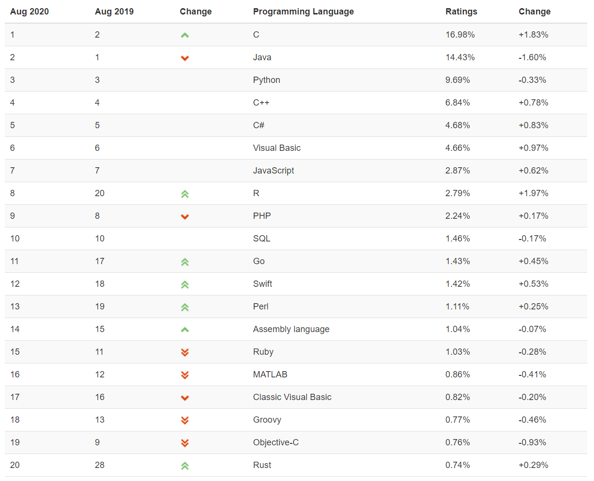
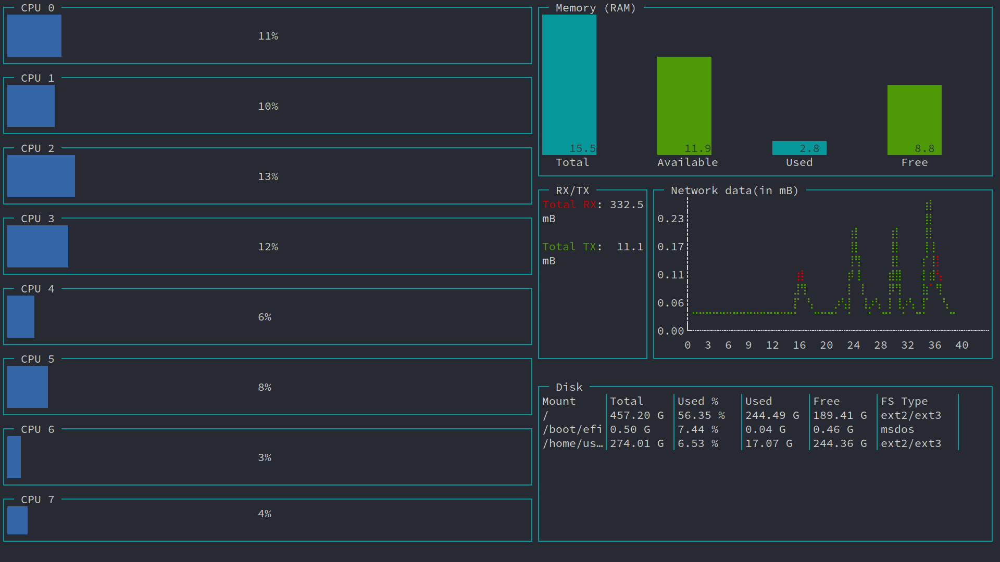
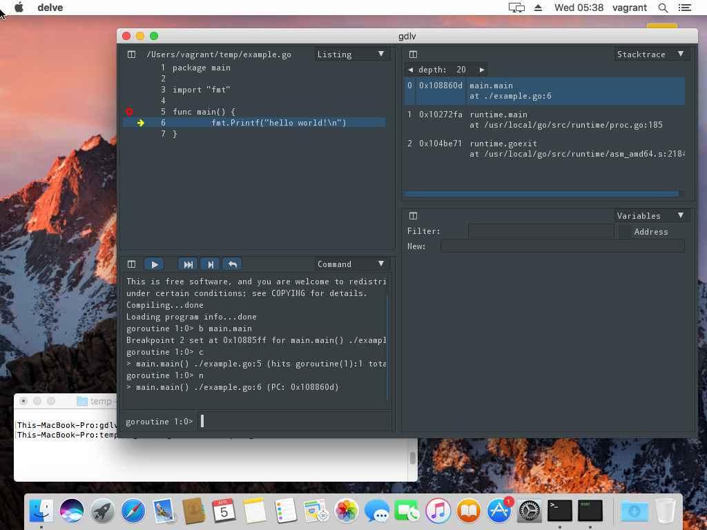

# Go语言爱好者周刊：第 55 期

这里记录每周值得分享的 Go 语言相关内容，周日发布。

本周刊开源（GitHub：[polaris1119/golangweekly](https://github.com/polaris1119/golangweekly)），欢迎投稿，推荐或自荐文章/软件/资源等，请[提交 issue](https://github.com/polaris1119/golangweekly/issues) 。

鉴于大部分人可能没法坚持把英文文章看完，因此，周刊中会尽可能推荐优质的中文文章。优秀的英文文章，我们的 GCTT 组织会进行翻译。



题图：TIOBE 8 月 TOP 20 编程语言

## 刊首语

TIOBE 8 月榜单发布，SQL、Go 和 Swift 之间的前十之争。Swift 从 10 降到了 12，Go 排在 11 名。更多信息见：[TIOBE 2020 年 8 月编程语言排行榜：值得关注的依然是 Go、R、Swift 等](https://mp.weixin.qq.com/s/kwDcKLvVSTzyyS3BhloqnQ)。

## 资讯

1、[Go 1.14.7 和 Go 1.13.15 发布；Go1.15 RC2 发布](https://mp.weixin.qq.com/s/LIGcE5PpT8fgq8lizgii_g)

安全问题更新，涉及到 encoding/binary 包。如果你项目中有使用，强烈建议更新，否则可能被攻击。这个安全漏洞存在9年之久了，这里是利用这个漏洞进行的攻击：<https://github.com/ethereum/public-attacknets/issues/12>。

2、[与 Google 的 Ian Lance Taylor 讨论 Go](https://cppcast.com/ian-taylor-go/)

在 C++ podcast 讨论 Go！

3、[sqlc v1.5.0 发布](https://sqlc.dev/posts/2020/08/05/sqlc-one-point-five-released.html)

用于从 SQL 创建完全类型的安全 Go 代码的工具。编写 SQL 查询，运行 sqlc，然后编写调用 sqlc 生成的方法的应用程序代码。

4、[gopls 发布 v0.4.4](https://github.com/golang/tools/releases/tag/gopls/v0.4.4)

支持单文件编辑。

5、[IBM 打算在 z/OS 上支持 Go](https://developer.ibm.com/mainframe/2020/04/24/ibm-intends-to-enable-go-on-z-os/)

受众会有多少呢？

6、[gout v0.1.2 发布](https://www.oschina.net/news/117750/gout-0-1-2-released)

Golang 实现的 http 客户端。

## 文章

1、[关于 errors 包的一些细节和思考](https://mp.weixin.qq.com/s/Vd6jxd4aFtwgGw8ws7jiSA)

看过 errors 包的实现吗？为什么这么实现？

2、[深度剖析 Golang 的 GC 扫描对象的实现](https://mp.weixin.qq.com/s/2Ss-5e1vA2n9K2lfIKqe6g)

这篇文章把 GC 扫描的过程深入剖析下。

3、[Go语言规范你掌握多少？这道题检验一下](https://mp.weixin.qq.com/s/gSQBxGSTNwDfuliQuHppQg)

接口值和普通类型值能进行相等性比较吗？结果如何？

4、[通过两道面试题讲解 Go for range 循环原理](https://mp.weixin.qq.com/s/LqeZ7YLsZQWjDZaFi35TAQ)

```go
func main() {
    v := []int{1, 2, 3}
    for i := range v {
        v = append(v, i)
    }
}
```

会死循环吗？

5、[接口 Interface—塑造健壮与可扩展的 Go 应用程序](https://mp.weixin.qq.com/s/Vcz0PSbjsDUyfUFzmy-_Mw)

本文拟以一个接近实际的项目需求例子，来帮助读者体会接口使用的重要性，理解 Go 接口 Interface 是如何提高项目的鲁棒性和扩展性。

6、[值得每个 Gopher 认真研读：工作两年收获 PingCAP、头条和蚂蚁的 Offer](https://mp.weixin.qq.com/s/acePzNpkHISLDkaNc-8vCA)

值得大家认真阅读和学习，反思自己。

7、[Go 编译器代码优化导致 for-range 越界的 bug 定位和修复解析](https://mp.weixin.qq.com/s/RuCwJQHk4jm21HFLH4f3-w)

分析排查问题的方法很重要。

8、[Go 语言 Web 框架 Echo 系列：定制篇5—自定义 HTTP Error Handler，让 HTTP 错误处理更友好](https://mp.weixin.qq.com/s/N-bYb-bducwrZE9cE9GPEg)

Echo 系列框架关于 HTTP 错误处理部分。

9、[从并发模式看 Go channel 使用技巧](https://mp.weixin.qq.com/s/IMnqPFk-3yNEnsX4EpYlpQ)

介绍下channel在并发下的两个使用技巧。

10、[Go 项目推荐之即时通讯服务器 IM](https://mp.weixin.qq.com/s/Zoq9WEKDUilkq_gNoxXkgw)

代码全部使用 Go 完成。

11、[Go 语言生成二维码是如此简单](https://mp.weixin.qq.com/s/JJLUPd3HO-yn6y-lUd-9mw)

使用了第三方库。

12、[Docker 入门终极指南：边学边用](https://mp.weixin.qq.com/s/nYjHhntppiMb4gIHeDvM1g)

本文围绕下面几点展开：1.讲个故事 2.虚拟机与容器 3.认识 `Docker`4.核心概念 5.安装 `Docker`6.快速开始 7.常规操作 8.最佳实践。

13、[如何使用Istio 1.6管理多集群中的微服务？](https://mp.weixin.qq.com/s/EjLTepUIJC2asg9_-54tNw)

讨论一下使用 Istio 管理托管在多个 Kubernetes 集群中的微服务。

14、[技术分享之 golang 构建分布式任务系统](http://xiaorui.cc/archives/6955)

如何使用golang构建一个分布式的任务系统 ? 该任务系统搞了几个月，有一些经验心得分享给大家。

## 开源项目

1、[defaults](https://github.com/creasty/defaults)

用默认值初始化结构体。示例：

```go
type Gender string

type Sample struct {
	Name   string `default:"John Smith"`
	Age    int    `default:"27"`
	Gender Gender `default:"m"`

	Slice       []string       `default:"[]"`
	SliceByJSON []int          `default:"[1, 2, 3]"` // Supports JSON
	Map         map[string]int `default:"{}"`
	MapByJSON   map[string]int `default:"{\"foo\": 123}"`

	Struct    OtherStruct  `default:"{}"`
	StructPtr *OtherStruct `default:"{\"Foo\": 123}"`

	NoTag  OtherStruct               // Recurses into a nested struct by default
	OptOut OtherStruct `default:"-"` // Opt-out
}

type OtherStruct struct {
	Hello  string `default:"world"` // Tags in a nested struct also work
	Foo    int    `default:"-"`
	Random int    `default:"-"`
}

// SetDefaults implements defaults.Setter interface
func (s *OtherStruct) SetDefaults() {
	if defaults.CanUpdate(s.Random) { // Check if it's a zero value (recommended)
		s.Random = rand.Int() // Set a dynamic value
	}
}
```

2、[html-to-markdown](https://github.com/JohannesKaufmann/html-to-markdown)

使用 Go 将 HTML 转换为 Markdown。它使用 [HTML 解析器](https://github.com/PuerkitoBio/goquery)来尽可能避免使用 regexp。这样可以避免某些奇怪的情况，并允许将其用于完全未知输入的情况。


3、[go-mysql-server: Go 实现的可扩展 MySQL 服务器](https://github.com/liquidata-inc/go-mysql-server/)

这是一个 SQL 引擎和服务器，实现了 MySQL 的一些功能，支持 MySQL SQL语法和 wire 协议。它本身并不是一个完整的数据库系统。数据库爱好者可以学习下。

4、[servirtium-go](https://github.com/servirtium/servirtium-go)

服务虚拟化 HTTP：帮助服务测试自动化，保持快速和一致。适用于 Go 项目。

5、[webp](https://github.com/chai2010/webp)

零依赖的 webp 编解码器。

6、[go-mail](https://github.com/mrz1836/go-mail)

Go 实现的轻量级的电子邮件包。

7、[osm](https://github.com/openservicemesh/osm)

微软开源的轻量级服务网格实现。

8、[got](https://github.com/melbahja/got)

一款下载速度是 curl 和 wget 4 倍的文件下载工具。

9、[di](https://github.com/goioc/di)

又一款 Go 依赖注入工具。

10、[qmgo](https://github.com/qiniu/qmgo)

Go 的 MongoDB 驱动程序。它基于 MongoDB 官方驱动程序，但像 Mgo 一样易于使用。七牛出品。

## 资源&&工具

1、[draft](https://github.com/lucasepe/draft)

基于 YAML 文件中定义的声明性语法生成微服务或无服务架构图的命令行工具。

2、[grofer](https://github.com/pesos/grofer)

Go 实现的系统 profiler。



3、[gdlv](https://github.com/aarzilli/gdlv)

Go 调试工具 Delve 的一个 GUI 前端。安装时，如果 go get 报错，可以下载源码，然后 go install 的方式安装。这个图形化界面使用的是 [gio](https://gioui.org/)。



## 订阅

这个周刊每周日发布，同步更新在[Go语言中文网](https://studygolang.com/go/weekly)和[微信公众号](https://weixin.sogou.com/weixin?query=Go%E8%AF%AD%E8%A8%80%E4%B8%AD%E6%96%87%E7%BD%91)。

微信搜索"Go语言中文网"或者扫描二维码，即可订阅。


